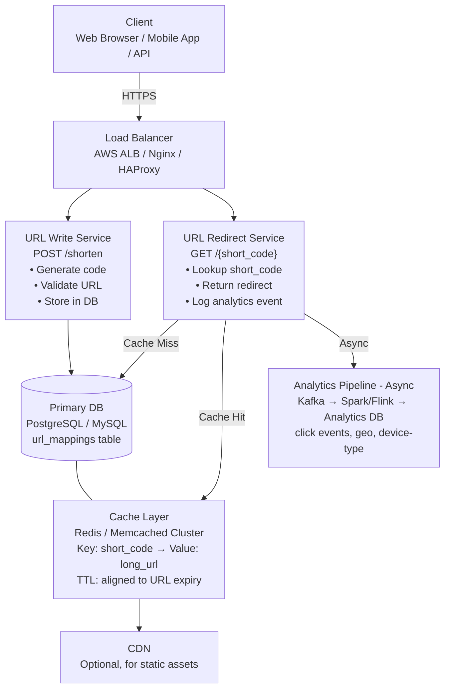
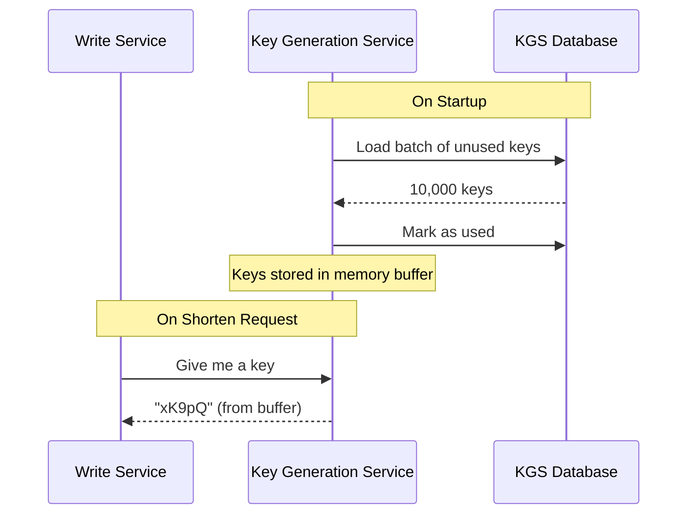
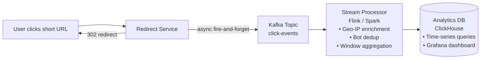

# 🔗 HLD: URL Shortener (like bit.ly / TinyURL)

> **Difficulty**: Medium-High | **Frequency**: Very High in Interviews  
> **Similar Systems**: Pastebin, QR Code Generator, Link Tracker

---

## 📌 Table of Contents

1. [Problem Statement](#problem-statement)
2. [Functional Requirements](#functional-requirements)
3. [Non-Functional Requirements](#non-functional-requirements)
4. [Capacity Estimation (Back-of-Envelope)](#capacity-estimation)
5. [API Design](#api-design)
6. [High-Level Architecture](#high-level-architecture)
7. [Database Design](#database-design)
8. [URL Shortening Algorithm](#url-shortening-algorithm)
9. [Component Deep Dives](#component-deep-dives)
10. [Caching Strategy](#caching-strategy)
11. [Scalability & Bottlenecks](#scalability--bottlenecks)
12. [Analytics](#analytics)
13. [Edge Cases & Tradeoffs](#edge-cases--tradeoffs)
14. [Interview Tips](#interview-tips)

---

## 📌 Problem Statement

Design a URL shortening service like **bit.ly** or **TinyURL** where:
- Users submit a long URL → get back a short URL (e.g., `https://short.ly/xK9pQ`)
- When someone visits the short URL → they are **redirected** to the original long URL
- Optionally: track analytics (clicks, geo, device)

---

## ✅ Functional Requirements

| Feature | Description |
|---|---|
| **Shorten URL** | Given a long URL, generate a unique short URL |
| **Redirect** | Visiting a short URL redirects to the original URL |
| **Custom Alias** | Users can optionally choose their own short code |
| **Expiry** | URLs can have an optional expiration date |
| **Delete** | Users can delete their shortened URLs |
| **Analytics** | Track number of clicks, location, device (optional) |

---

## 🚫 Non-Functional Requirements

| Property | Requirement |
|---|---|
| **High Availability** | System must be available 99.99% uptime |
| **Low Latency Reads** | Redirection must happen in < 10ms ideally |
| **Durability** | Shortened URLs must not be lost |
| **Scalability** | Should support 100M+ URLs and billions of reads |
| **No Collisions** | Two different long URLs must never map to same short code |
| **Unpredictability** | Short codes should not be guessable/sequential |

> ⚡ **Key Insight for Interview**: This is a **read-heavy** system (~100:1 read-to-write ratio). Reads (redirects) must be super fast!

---

## 📊 Capacity Estimation (Back-of-Envelope)

This is a CRITICAL interview skill. Always walk through this.

### Write Throughput
```
Assume: 100M new URLs shortened per day
→ 100M / 86,400 seconds ≈ 1,200 writes/sec (peak ~2x = 2,400 writes/sec)
```

### Read Throughput
```
Assume 100:1 read-to-write ratio
→ 100 * 100M = 10 Billion reads/day
→ 10B / 86,400 ≈ 115,000 reads/sec (peak ~230,000 reads/sec)
```

### Storage
```
Assume URLs kept for 5 years:
→ 100M/day * 365 * 5 = 182.5 Billion URLs

Per URL record ≈ 500 bytes (long URL ~450B, metadata ~50B)
→ 182.5B * 500 bytes ≈ 91.25 TB over 5 years
→ ~18 TB/year of storage needed
```

### Bandwidth
```
Reads: 115,000/sec * 500 bytes = ~57 MB/s of data out
Writes: 1,200/sec * 500 bytes = ~0.6 MB/s data in
```

### Cache
```
80-20 rule: 20% of URLs get 80% of traffic
→ Cache top 20% of daily URLs: 20M * 500B = ~10 GB/day → easily fits in memory
```

---

## 🌐 API Design

### 1. Shorten URL
```
POST /api/v1/shorten
Content-Type: application/json

Request Body:
{
  "long_url": "https://www.example.com/very/long/path?query=value",
  "custom_alias": "my-link",       // optional
  "expiry_date": "2025-12-31",     // optional
  "user_id": "user_abc"            // optional, if logged in
}

Response 201 Created:
{
  "short_url": "https://short.ly/xK9pQ",
  "short_code": "xK9pQ",
  "long_url": "https://www.example.com/...",
  "expiry_date": "2025-12-31",
  "created_at": "2024-01-01T10:00:00Z"
}
```

### 2. Redirect (Core Operation)
```
GET /{short_code}
e.g., GET /xK9pQ

Response 301 Moved Permanently  (or 302 Found)
  → Location: https://www.example.com/very/long/path?query=value

> 💡 301 vs 302:
> - 301 (Permanent): Browser caches redirect → reduces server load but no analytics tracking
> - 302 (Temporary): Browser always hits server → enables analytics but more load
> Use 302 if analytics matter. Use 301 to reduce server load.
```

### 3. Get URL Info
```
GET /api/v1/urls/{short_code}

Response 200:
{
  "short_code": "xK9pQ",
  "long_url": "...",
  "clicks": 42,
  "created_at": "...",
  "expiry_date": "..."
}
```

### 4. Delete URL
```
DELETE /api/v1/urls/{short_code}
Authorization: Bearer <token>

Response 204 No Content
```

---

## 🏗️ High-Level Architecture



---

## 🗄️ Database Design

### Primary Table: `url_mappings`

```sql
CREATE TABLE url_mappings (
    id            BIGINT       PRIMARY KEY AUTO_INCREMENT,
    short_code    VARCHAR(10)  NOT NULL UNIQUE,
    long_url      TEXT         NOT NULL,
    user_id       VARCHAR(64),                   -- NULL if anonymous
    custom_alias  BOOLEAN      DEFAULT FALSE,
    created_at    TIMESTAMP    DEFAULT NOW(),
    expires_at    TIMESTAMP    NULL,              -- NULL = never expires
    is_deleted    BOOLEAN      DEFAULT FALSE,
    click_count   BIGINT       DEFAULT 0,        -- approximate, updated async
    
    INDEX idx_short_code (short_code),           -- Primary lookup
    INDEX idx_user_id (user_id),                 -- For user dashboard
    INDEX idx_expires_at (expires_at)            -- For cleanup job
);
```

### Analytics Table: `click_events`

```sql
CREATE TABLE click_events (
    id           BIGINT    PRIMARY KEY AUTO_INCREMENT,
    short_code   VARCHAR(10),
    clicked_at   TIMESTAMP DEFAULT NOW(),
    ip_address   VARCHAR(45),
    country      VARCHAR(2),
    device_type  ENUM('mobile', 'desktop', 'tablet', 'bot'),
    referrer     TEXT,
    user_agent   TEXT,
    
    INDEX idx_short_code_time (short_code, clicked_at)
);
```

### DB Choice Rationale

| Scenario | Choice | Why |
|---|---|---|
| Core URL mapping | **PostgreSQL / MySQL** | ACID, reliable, simple schema |
| High-scale reads | **Cassandra / DynamoDB** | Horizontal scaling, key-value like access |
| Analytics | **ClickHouse / BigQuery** | Columnar, fast aggregations |
| Cache | **Redis** | Sub-millisecond lookups, TTL support |

> 💡 **Interview Note**: For most interviews, say "start with PostgreSQL" and then discuss how to scale. Mentioning DynamoDB/Cassandra shows scale awareness.

---

## 🔑 URL Shortening Algorithm

This is the **core algorithm question**. There are multiple approaches:

---

### Approach 1: Base62 Encoding (⭐ Recommended)

**Idea**: Encode a unique incrementing ID to Base62 (`[0-9a-zA-Z]` = 62 characters)

```
Characters: 0-9 (10) + a-z (26) + A-Z (26) = 62 characters

6-char code:    62^6 = 56 Billion possible URLs ✅
7-char code:    62^7 = 3.5 Trillion possible URLs ✅✅
```

**Algorithm**:
```
1. Auto-increment ID from DB (e.g., ID = 12345678)
2. Convert to Base62:
   12345678 → "W7ys" (4 chars) → pad to 6 → "00W7ys"

Example conversion:
  12345678 ÷ 62 = 199,123 remainder 32  → '6'  (0-9 = digits, 10-35 = a-z, 36-61 = A-Z)
  199,123  ÷ 62 = 3,211   remainder 21  → 'p'
  3,211    ÷ 62 = 51      remainder 49  → 'N'
  51       ÷ 62 = 0       remainder 51  → 'P'
  → Reversed = "PN p6" (reading remainders in reverse)
```

**Pros**: Simple, no collision possible, predictable length  
**Cons**: Sequential IDs → guessable; DB bottleneck for auto-increment

---

### Approach 2: MD5 / SHA-256 Hash (❌ Not Recommended)

```
1. MD5(long_url) → 128-bit hash
2. Take first 6 chars of hex string → short_code
```

**Problem**: Hash collisions! Two different URLs can produce the same first 6 chars.  
**Mitigation**: Retry with `MD5(long_url + salt)` but this is fragile.

---

### Approach 3: Pre-Generated Keys (✅ Scalable Solution)

**Idea**: **Key Generation Service (KGS)** pre-generates millions of random codes and stores them in a DB.

```
KGS Database:
  available_keys table: | key (VARCHAR 6) | used (BOOLEAN) |
    - Pre-filled with 56 Billion Base62 keys
    
When shortening request comes in:
  1. KGS picks an unused key → marks it as used → returns to Write Service
  2. Write Service stores (key → long_url) in main DB
```

**Pros**: No collision, fast (no computation), multiple app servers can use same KGS  
**Cons**: KGS is a single point of failure → use replica; keys in memory can be lost on crash



---

### Approach 4: Counter + Distributed ID (Production Scale)

Use a distributed ID generator like **Twitter Snowflake** or **Zookeeper counter** to generate unique IDs across multiple servers, then Base62 encode them.

```
Snowflake ID (64-bit):
[ 1 bit: sign | 41 bits: timestamp | 10 bits: machine ID | 12 bits: sequence ]

→ Guarantees globally unique, time-sortable IDs
→ Base62 encode → short code
```

---

## 🧩 Component Deep Dives

### 1. Write Service (URL Shortener)

```
POST /shorten Flow:
  1. Validate long_url (check format, malicious URLs via Safe Browsing API)
  2. Check if long_url already shortened (dedup) → return existing short code
  3. Check if custom_alias requested:
     - YES → validate uniqueness, store
     - NO  → get next unique ID from KGS or auto-increment
  4. Encode ID → Base62 → short_code
  5. Write to DB: (short_code, long_url, user_id, expiry, created_at)
  6. Invalidate/update cache if needed
  7. Return short_url to user
```

### 2. Redirect Service (Critical Path)

This is the **hottest path** — must be lightning fast.

```
GET /{short_code} Flow:
  1. Check Redis cache:
     - HIT  → return 302 redirect instantly
     - MISS → go to DB
  2. DB lookup: SELECT long_url WHERE short_code = ? AND NOT is_deleted AND (expires_at IS NULL OR expires_at > NOW())
  3. If found → cache in Redis (with TTL) → return redirect
  4. If not found or expired → return 404
  5. (Async) Publish click event to Kafka for analytics
```

### 3. Cleanup Service

A background job that:
- Periodically deletes expired URL records
- Can use `expires_at` index to find stale records efficiently
- Runs off-peak (e.g., 2 AM)

---

## ⚡ Caching Strategy

```
Cache Key:   short_code  (e.g., "xK9pQ")
Cache Value: long_url    (e.g., "https://example.com/...")
Cache TTL:   min(URL expiry, 24 hours)

Cache Policy: LRU (Least Recently Used) eviction
Cache Size:   ~10 GB can serve 80% of daily traffic (20M top URLs)
```

### Cache Write Strategy

| Strategy | How | When to Use |
|---|---|---|
| **Write-Through** | Write to cache + DB simultaneously | Consistent, slight write latency |
| **Write-Around** | Skip cache on write, populate on first read | Good for rarely-read URLs |
| **Write-Back** | Write to cache, async to DB | Risk of data loss, not recommended |

✅ **Recommended**: **Write-Through** for URL mappings (data must be consistent)

### Cache Invalidation

- On URL deletion → `DEL short_code` from Redis
- On URL expiry → TTL handles this automatically

---

## 📈 Scalability & Bottlenecks

### Bottleneck 1: Database Write Bottleneck

**Problem**: Single DB write endpoint can't handle 2,400 writes/sec at scale  
**Solution**:  
- **Master-Slave replication**: All writes to master, reads from slaves
- **Database sharding**: Shard by `short_code` hash  
  - Shard 0: codes starting with a-f  
  - Shard 1: codes starting with g-m  
  - etc.

### Bottleneck 2: Cache Thundering Herd

**Problem**: A viral URL expires, millions of requests hit DB simultaneously  
**Solutions**:  
- **Cache warming**: Proactively populate cache before expiry  
- **Mutex locking**: Only one request goes to DB, others wait  
- **Early expiry jitter**: Randomize TTL slightly to avoid simultaneous expiry

### Bottleneck 3: Hot URLs (Celebrity Problem)

**Problem**: A celebrity tweets a shortened URL → millions of redirects in seconds  
**Solution**:  
- **Local in-memory cache** on each app server for top-K URLs
- **CDN edge caching** for redirect responses (for 301 redirects)
- **Rate limiting** per short_code to detect and buffer abuse

### Architecture Evolution

```
Phase 1 (MVP):        Single server + PostgreSQL
Phase 2 (10x):        Load balancer + 3 app servers + read replicas + Redis
Phase 3 (100x):       Microservices: Write/Read separated, KGS, DB sharding
Phase 4 (1000x):      Global CDN, multi-region DB, Kafka analytics pipeline
```

---

## 📊 Analytics

### What to Track
- Total clicks per short URL
- Geographic distribution (country, city)
- Device type (mobile, desktop, tablet)
- Referrer (direct, social, email)
- Time-series click data (hourly, daily)

### Architecture for Analytics



> 💡 **Why Async?**: Analytics must NOT slow down the redirect. Fire Kafka event after sending HTTP redirect, don't wait.

---

## ⚠️ Edge Cases & Tradeoffs

| Edge Case | Handling |
|---|---|
| Same long URL shortened twice | Dedup check: return existing short code for same user |
| Malicious/phishing URLs | Google Safe Browsing API check on write |
| Custom alias conflicts | Validate uniqueness before storing |
| Expired URL visited | Return 410 Gone (not 404) |
| Deleted URL visited | Return 410 Gone |
| Very long URLs (>2000 chars) | Validate max length, reject or truncate |
| Redirect loops | Detect if shortened URL points to another short URL |
| Rate limiting abuse | Limit writes per IP/user per minute |
| Bot traffic in analytics | Filter by User-Agent patterns |

---

## 💡 Interview Tips

### Clarifying Questions to Ask First
1. "How many URLs will be shortened per day?"
2. "What's the expected read-to-write ratio?"
3. "Do we need analytics/tracking?"
4. "Do users need accounts, or is it anonymous?"
5. "What's the required URL lifetime?"
6. "Do we need custom aliases?"

### What Impresses Interviewers
- ✅ Starting with capacity estimation (shows systems thinking)
- ✅ Discussing 301 vs 302 redirect tradeoff
- ✅ Proposing the KGS (Key Generation Service) for collision-free codes
- ✅ Separating Read and Write services
- ✅ Cache eviction policy reasoning (LRU + TTL)
- ✅ Async analytics via Kafka (don't block the redirect)
- ✅ Discussing DB sharding strategy

### Common Mistakes to Avoid
- ❌ Using MD5 as the shortening algorithm (collision prone)
- ❌ Ignoring caching entirely
- ❌ Making analytics synchronous (blocks redirect)
- ❌ Forgetting URL expiry and cleanup
- ❌ Not considering the thundering herd problem
- ❌ Using 301 when analytics are required

---

## 🎯 Quick Summary Card

```
┌──────────────────────────────────────────────────────────────────┐
│                    URL SHORTENER - CHEAT SHEET                   │
├──────────────────────────────────────────────────────────────────┤
│ Scale:         100M writes/day, 10B reads/day                    │
│ Algorithm:     Base62 encoding of unique ID from KGS             │
│ Short Code:    6-7 chars → 56B-3.5T unique URLs                  │
│ Redirect:      302 (for analytics) or 301 (for caching)          │
│ Cache:         Redis, LRU, 10GB covers 80% traffic               │
│ DB:            PostgreSQL (ACID) → DynamoDB at scale             │
│ Analytics:     Async via Kafka → stream processor → ClickHouse   │
│ Availability:  Master-slave replication + multi-region           │
│ Sharding:      By short_code hash                                │
└──────────────────────────────────────────────────────────────────┘
```

---

*Next: [02_Pastebin.md] | [03_Instagram_Feed.md] | [04_WhatsApp.md]*
