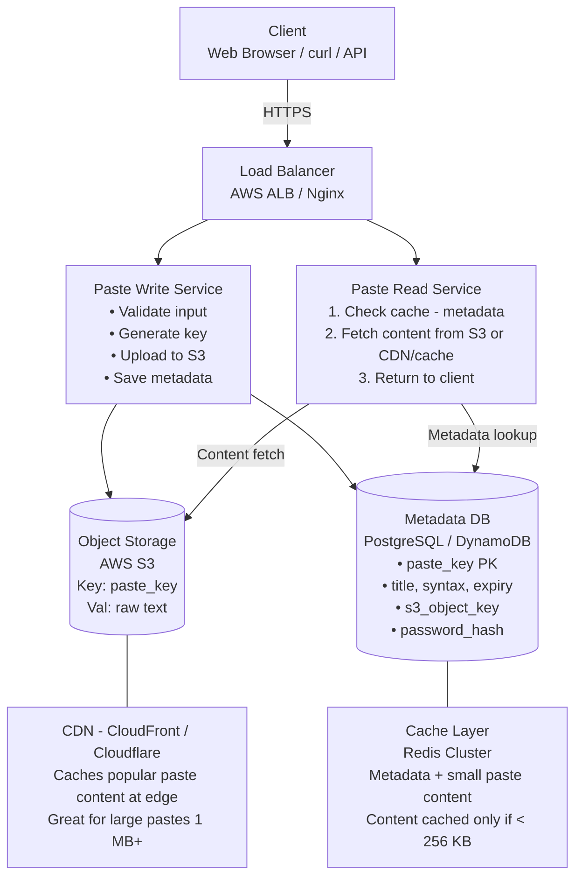
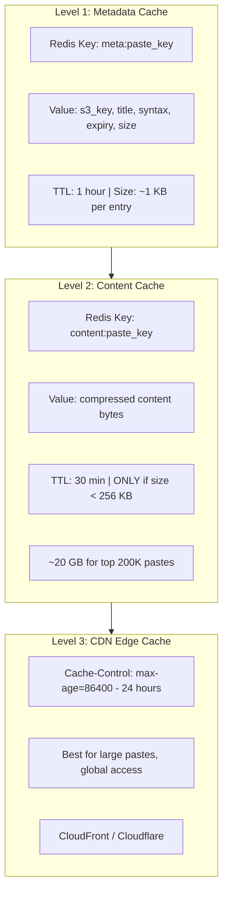

# 📋 HLD: Pastebin (like pastebin.com / GitHub Gist)

> **Difficulty**: Medium | **Frequency**: High in Interviews  
> **Similar Systems**: GitHub Gist, HasteBin, CodePen, PrivateBin  
> **Related**: URL Shortener (similar key generation, but content storage is the challenge here)

---

## 📌 Table of Contents

1. [Problem Statement](#problem-statement)
2. [Functional Requirements](#functional-requirements)
3. [Non-Functional Requirements](#non-functional-requirements)
4. [URL Shortener vs Pastebin — Key Differences](#url-shortener-vs-pastebin)
5. [Capacity Estimation (Back-of-Envelope)](#capacity-estimation)
6. [API Design](#api-design)
7. [High-Level Architecture](#high-level-architecture)
8. [Database Design](#database-design)
9. [Object Storage (The Core Challenge)](#object-storage)
10. [Paste Key Generation](#paste-key-generation)
11. [Component Deep Dives](#component-deep-dives)
12. [Caching Strategy](#caching-strategy)
13. [Scalability & Bottlenecks](#scalability--bottlenecks)
14. [Security Considerations](#security-considerations)
15. [Edge Cases & Tradeoffs](#edge-cases--tradeoffs)
16. [Interview Tips](#interview-tips)

---

## 📌 Problem Statement

Design a system like **Pastebin** where:
- Users paste text/code → get a unique shareable URL (e.g., `https://paste.ly/aB3xY9`)
- Anyone with the URL can view the paste content
- Optionally: syntax highlighting, password protection, expiry, edit history

---

## ✅ Functional Requirements

| Feature | Description |
|---|---|
| **Create Paste** | User submits text/code → gets a unique URL |
| **Read Paste** | Anyone with the URL can view the paste |
| **Custom URL** | Optional custom alias for the paste |
| **Expiry** | Pastes can have configurable expiration (1 hour, 1 day, 1 week, never) |
| **Delete Paste** | Creator can delete their paste |
| **Syntax Highlighting** | Support language-specific highlighting (optional) |
| **Privacy** | Public, unlisted, or password-protected pastes |
| **Edit** | Creator can update paste content (creates new version) |

---

## 🚫 Non-Functional Requirements

| Property | Requirement |
|---|---|
| **High Availability** | 99.99% uptime — reads must always work |
| **Low Latency Reads** | Paste content served in < 200ms |
| **Durability** | Paste data must NOT be lost (stored on object storage) |
| **Scalability** | Handle millions of pastes and billions of reads |
| **Content Size** | Max paste size: 10 MB |
| **Consistency** | Paste must be readable immediately after creation |

> ⚡ **Key Insight**: Unlike URL Shortener (which stores a tiny URL mapping), Pastebin stores **large content blobs** (up to 10 MB). This fundamentally changes the storage architecture!

---

## 🆚 URL Shortener vs Pastebin — Key Differences

| Aspect | URL Shortener | Pastebin |
|---|---|---|
| **What's stored** | Small mapping: key → URL (~500 bytes) | Large blob: key → text content (up to 10 MB) |
| **Storage solution** | Relational DB (PostgreSQL) | **Object Storage** (S3) + metadata in DB |
| **Read size** | Tiny (just a URL redirect) | Large (full content served) |
| **Bandwidth** | Low | **High** — serving 10 MB pastes at scale |
| **Caching** | Easy (URL fits in Redis) | Harder (large content, careful with Redis memory) |
| **CDN usefulness** | Low (redirects) | **High** — CDN can serve static paste content |

> 💡 **Interview Insight**: This is the #1 thing interviewers want to hear. If you just say "same as URL Shortener", you'll fail. The content storage on **Object Storage (S3)** is the core differentiator.

---

## 📊 Capacity Estimation (Back-of-Envelope)

### Write Throughput
```
Assume: 1M new pastes per day (much less than URL Shortener — users write more data)
→ 1M / 86,400 ≈ 12 writes/sec (peak ~25 writes/sec)
```

### Read Throughput
```
Read-to-write ratio: ~5:1 (lower than URL Shortener since pastes are viewed less often)
→ 5M reads/day
→ 5M / 86,400 ≈ 58 reads/sec (peak ~120 reads/sec)
```

### Storage
```
Average paste size: 10 KB (most pastes are small code snippets)
10% of pastes are large: ~1 MB avg

Weighted average: ~100 KB per paste

Per year: 1M/day * 365 = 365M pastes/year
Content storage: 365M * 100 KB = 36.5 TB/year  (stored on S3)
Metadata storage: 365M * 1 KB = 365 GB/year     (stored in DB)

Keep for 10 years → ~365 TB content on S3, ~3.65 TB metadata in DB
```

### Bandwidth
```
Reads: 58 reads/sec * 100 KB avg = ~5.8 MB/s average
Peak: 120 reads/sec * 100 KB = ~12 MB/s peak
Writes: 12/sec * 100 KB = ~1.2 MB/s
```

### Cache
```
80-20 rule: 20% of pastes get 80% of traffic
Cache top 20% of daily reads: 200K * 100 KB = ~20 GB → fits in Redis
But beware: caching large pastes (1 MB+) can fill Redis fast!
→ Only cache pastes < 256 KB in Redis. Larger pastes served via CDN/S3.
```

---

## 🌐 API Design

### 1. Create Paste
```
POST /api/v1/pastes
Content-Type: application/json

Request Body:
{
  "content": "def hello():\n    print('Hello World')",
  "title": "My Python Script",              // optional
  "syntax": "python",                        // optional, for highlighting
  "expiry": "24h",                           // "1h" | "24h" | "7d" | "30d" | "never"
  "visibility": "unlisted",                  // "public" | "unlisted" | "private"
  "password": "secret123",                   // optional, for private pastes
  "custom_url": "my-code",                   // optional
  "user_id": "user_abc"                      // optional, if logged in
}

Response 201 Created:
{
  "paste_key": "aB3xY9",
  "paste_url": "https://paste.ly/aB3xY9",
  "title": "My Python Script",
  "syntax": "python",
  "expires_at": "2024-06-02T10:00:00Z",
  "created_at": "2024-06-01T10:00:00Z",
  "size_bytes": 42
}
```

### 2. Read Paste
```
GET /api/v1/pastes/{paste_key}

Headers (for private pastes):
  X-Paste-Password: secret123

Response 200 OK:
{
  "paste_key": "aB3xY9",
  "title": "My Python Script",
  "content": "def hello():\n    print('Hello World')",
  "syntax": "python",
  "created_at": "2024-06-01T10:00:00Z",
  "expires_at": "2024-06-02T10:00:00Z",
  "view_count": 42,
  "size_bytes": 42
}
```

### 3. Delete Paste
```
DELETE /api/v1/pastes/{paste_key}
Authorization: Bearer <token>

Response 204 No Content
```

### 4. Get Raw Content (for embedding)
```
GET /raw/{paste_key}
→ Returns plain text content with Content-Type: text/plain
   (Used by curl, scripts, embed in websites)
```

---

## 🏗️ High-Level Architecture



---

## 🗄️ Database Design

### Metadata Table: `paste_metadata` (PostgreSQL / DynamoDB)

```sql
CREATE TABLE paste_metadata (
    paste_key       VARCHAR(8)    PRIMARY KEY,       -- "aB3xY9"
    title           VARCHAR(256),
    s3_object_key   VARCHAR(512)  NOT NULL,          -- "pastes/aB3xY9.txt"
    syntax          VARCHAR(32)   DEFAULT 'plaintext',
    user_id         VARCHAR(64),                     -- NULL if anonymous
    visibility      ENUM('public', 'unlisted', 'private') DEFAULT 'unlisted',
    password_hash   VARCHAR(256),                    -- bcrypt hash, NULL if no password
    size_bytes      INT           NOT NULL,
    view_count      BIGINT        DEFAULT 0,
    created_at      TIMESTAMP     DEFAULT NOW(),
    expires_at      TIMESTAMP     NULL,              -- NULL = never expires
    is_deleted      BOOLEAN       DEFAULT FALSE,

    INDEX idx_user_id (user_id),
    INDEX idx_expires_at (expires_at),
    INDEX idx_visibility_created (visibility, created_at)  -- for "recent public pastes"
);
```

> 💡 **Key Design Decision**: Content is NOT stored in the DB! Only metadata goes in PostgreSQL. The actual paste text lives on **S3**. This is because:
> - DB rows should be small and fixed-size for fast indexing
> - S3 is designed for blobs (any size, cheap, durable, CDN-compatible)
> - Prevents DB bloat with 10 MB text columns

---

## 💾 Object Storage (The Core Challenge)

This is what separates Pastebin from URL Shortener. Let's dive deep.

### Why S3 (Object Storage)?

| Option | Pros | Cons | Verdict |
|---|---|---|---|
| **In DB (TEXT column)** | Simple | DB bloat, slow queries, expensive | ❌ Bad |
| **File system** | Fast reads | No replication, single server limit | ❌ Bad |
| **AWS S3** | Unlimited scale, 11 9s durability, cheap, CDN compatible | Extra service | ✅ Best |
| **Redis** | Sub-ms reads | RAM is expensive, 10 MB pastes kill memory | ❌ Only for cache |

### S3 Object Layout

```
S3 Bucket: "pastebin-content-prod"

Object Key:   pastes/{paste_key}.txt
              pastes/aB3xY9.txt
              pastes/mT3rAz.txt

Metadata on S3 object:
  Content-Type:    text/plain; charset=utf-8
  Content-Encoding: gzip  (compressed to save storage & bandwidth)
  Cache-Control:   max-age=86400  (CDN caches for 24 hours)
  x-amz-meta-syntax: python
```

### Write to S3

```
1. Compress paste content with GZIP (saves ~70% for text)
   "def hello():\n    print('Hello World')" (42 bytes)
   → GZIP compressed (38 bytes in this case, bigger gains on larger content)

2. Upload to S3:
   PUT s3://pastebin-content-prod/pastes/aB3xY9.txt
   Body: <gzipped content>
   Content-Type: text/plain
   Content-Encoding: gzip

3. S3 returns success → then save metadata to DB
```

### Read from S3

```
1. Metadata lookup (from cache or DB) → get s3_object_key
2. GET s3://pastebin-content-prod/pastes/aB3xY9.txt
3. S3 returns GZIP content → decompress → serve to client
   (Or: S3 + CloudFront handles decompression automatically!)
```

### S3 Storage Cost

```
36.5 TB/year of content
With GZIP (~70% compression): ~11 TB/year actual storage

S3 Standard: $0.023/GB/month
11 TB = 11,000 GB * $0.023 = ~$253/month  ← Very cheap!

After 30 days, move to S3 Infrequent Access: $0.0125/GB/month
→ Even cheaper for old pastes
```

---

## 🔑 Paste Key Generation

Same approaches as URL Shortener. We can reuse the **KGS (Key Generation Service)**.

```
Approach: Pre-generated Base62 keys (from KGS)

6-char key: 62^6 = 56 Billion unique pastes
8-char key: 62^8 = 218 Trillion unique pastes

At 1M pastes/day → 6-char keys last for 153,000+ years ✅

Flow:
  1. KGS pre-generates random Base62 keys → stores in KGS DB
  2. Loads batch into memory buffer (BlockingQueue)
  3. Write Service calls kgs.getNextKey() → instant return
```

> Since we already built the `KeyGenerationService` in the URL Shortener exercise, we **reuse it** here. This is exactly how microservices work — shared services across products.

---

## 🧩 Component Deep Dives

### 1. Write Service (Create Paste)

```
POST /api/v1/pastes Flow:

  1. Validate input:
     - Content not empty, size ≤ 10 MB
     - If custom URL → check uniqueness
     - If password → hash it with bcrypt

  2. Get unique paste key from KGS (or use custom URL)

  3. Upload content to S3:
     - Compress with GZIP
     - PUT to s3://bucket/pastes/{paste_key}.txt
     - ⚠️ If S3 upload fails → return error (don't save metadata!)

  4. Save metadata to DB:
     - paste_key, title, s3_object_key, syntax, expiry, etc.
     - Only AFTER S3 upload succeeds (consistency!)

  5. Cache metadata in Redis (write-through)

  6. Return paste URL to user
```

### 2. Read Service

```
GET /api/v1/pastes/{paste_key} Flow:

  1. Check metadata cache (Redis):
     - HIT → get s3_object_key, expiry, visibility, password_hash
     - MISS → query DB → populate cache

  2. Validate:
     - Not deleted? Not expired?
     - If private: check password header matches password_hash
     - If not valid → return 404/410/403

  3. Fetch content:
     a. Check content cache (Redis) for small pastes (< 256 KB)
        → HIT: return content immediately
        → MISS: continue to S3
     b. Fetch from S3 (or CDN if configured)
        → Decompress GZIP → cache if small → return to client

  4. Increment view_count (async, same as URL Shortener analytics)

  5. Return paste content + metadata
```

### 3. Cleanup Service (Background Job)

```
Runs periodically (e.g., every hour via cron):

  1. SELECT paste_key, s3_object_key
     FROM paste_metadata
     WHERE expires_at < NOW() AND is_deleted = FALSE

  2. For each expired paste:
     a. DELETE from S3: s3://bucket/pastes/{paste_key}.txt
     b. UPDATE paste_metadata SET is_deleted = TRUE
     c. INVALIDATE from Redis cache

  3. Log metrics: "Cleaned up 1,234 expired pastes"
```

---

## ⚡ Caching Strategy

### Two-Level Cache



### Why This Layered Approach?

```
Small paste (< 256 KB):
  Redis content cache HIT → ~1ms           ← Fastest path
  Redis MISS → S3 fetch + cache → ~50ms

Large paste (256 KB - 10 MB):
  CDN edge HIT → ~5-20ms                   ← Fast from edge
  CDN MISS → S3 fetch → ~50-200ms

Metadata (always):
  Redis metadata HIT → ~1ms
  Redis MISS → DB query + cache → ~5ms
```

---

## 📈 Scalability & Bottlenecks

### Bottleneck 1: S3 Latency on Read

**Problem**: S3 GET latency is ~50-200ms, too slow for viral pastes  
**Solutions**:
- **CDN**: CloudFront caches S3 content at edge → 5-20ms globally
- **Redis content cache**: Sub-ms for small popular pastes
- **S3 Transfer Acceleration**: Uses AWS edge network for faster S3 access

### Bottleneck 2: Large Paste Uploads

**Problem**: 10 MB upload can take seconds, blocks the server thread  
**Solutions**:
- **Async upload**: Upload to S3 in a background thread, return 202 Accepted
- **Presigned URL**: Give client a signed S3 URL → client uploads directly to S3  
  ```
  Flow with Presigned URL:
  1. Client → POST /api/v1/pastes/initiate → Server returns presigned S3 URL
  2. Client → PUT <presigned-url> → uploads directly to S3 (bypasses server!)
  3. Client → POST /api/v1/pastes/confirm → Server saves metadata
  ```

### Bottleneck 3: Hot Paste (Viral Content)

**Problem**: A popular paste gets millions of views → S3 rate limit + bandwidth spike  
**Solution**: CDN absorbs all the traffic. S3 is only hit once per edge location.

### Architecture Evolution

```
Phase 1 (MVP):        Single server + PostgreSQL + local filesystem
Phase 2 (10x):        S3 for content + Redis cache + read replicas
Phase 3 (100x):       CDN (CloudFront) + multi-region S3 + DB sharding
Phase 4 (1000x):      Presigned uploads + global CDN + S3 lifecycle policies
```

---

## 🔒 Security Considerations

| Concern | Solution |
|---|---|
| **Password-protected pastes** | bcrypt hash stored in DB; verify on read |
| **Malicious content (malware, phishing)** | Content scanning on upload (ClamAV / VirusTotal) |
| **XSS attacks** | Serve paste content as `text/plain`, never `text/html` |
| **Abuse (spam, illegal content)** | Rate limiting per IP + content moderation |
| **Data at rest encryption** | S3 SSE (Server-Side Encryption) with AES-256 |
| **Data in transit** | HTTPS everywhere (TLS 1.3) |
| **Paste enumeration** | Random keys (not sequential) → can't guess paste URLs |

---

## ⚠️ Edge Cases & Tradeoffs

| Edge Case | Handling |
|---|---|
| **Very large paste (10 MB)** | Presigned URL for direct S3 upload |
| **Empty paste** | Reject — minimum 1 character |
| **Binary content** | Reject or store with `application/octet-stream` |
| **Concurrent edits** | Last-write-wins or version history |
| **Paste with password + expiry** | Both enforced: check password AND expiry on read |
| **S3 upload fails** | Don't save metadata → client retries |
| **Metadata saved but S3 fails** | Orphan metadata → cleanup job detects S3 404s |
| **Rate limiting** | Max 10 pastes/min per IP; max 100 reads/min per IP |
| **Content exceeds size limit** | Return 413 Payload Too Large |
| **UTF-8 encoding issues** | Validate encoding on write, store as UTF-8 |

### Key Design Tradeoffs

| Decision | Option A | Option B | Recommendation |
|---|---|---|---|
| **Content storage** | DB TEXT column | S3 object storage | ✅ S3 (scalable, cheap) |
| **Content compression** | None | GZIP | ✅ GZIP (70% savings) |
| **Cache large pastes** | Redis | CDN | ✅ CDN (Redis too expensive for MB-size) |
| **Paste edit** | Overwrite in-place | Version history (new S3 key) | ✅ Version (audit trail) |
| **Expiry enforcement** | Check on every read | Background cleanup job | ✅ Both (belt + suspenders) |

---

## 💡 Interview Tips

### Clarifying Questions to Ask
1. "What's the max paste size?" → Determines storage strategy
2. "Do we need syntax highlighting?" → Affects content processing
3. "Is password protection required?" → Security design
4. "What's the expected read:write ratio?"
5. "Do pastes need to be editable?"
6. "How long should pastes be stored?"

### What Impresses Interviewers
- ✅ Immediately identifying S3/object storage as the content store (not DB!)
- ✅ Explaining WHY content belongs on S3 vs. DB (blob size, cost, CDN, durability)
- ✅ Two-level caching: metadata in Redis + content via CDN
- ✅ GZIP compression for bandwidth/storage savings (~70%)
- ✅ Presigned URLs for large uploads (bypasses server)
- ✅ Comparing with URL Shortener and explaining key differences

### Common Mistakes to Avoid
- ❌ Storing paste content in the database
- ❌ Treating it as "same as URL Shortener" without discussing object storage
- ❌ Caching all content in Redis (10 MB pastes kill memory!)
- ❌ Not considering CDN for content delivery
- ❌ Forgetting content compression
- ❌ Not discussing S3 upload failure handling

---

## 🎯 Quick Summary Card

```
┌──────────────────────────────────────────────────────────────────┐
│                     PASTEBIN — CHEAT SHEET                       │
├──────────────────────────────────────────────────────────────────┤
│ Scale:         1M writes/day, 5M reads/day                       │
│ Key Gen:       Base62 from KGS (reuse from URL Shortener)        │
│ Content Store: AWS S3 (object storage), NOT in DB!               │
│ Metadata:      PostgreSQL (title, expiry, s3_key, password_hash) │
│ Compression:   GZIP (~70% savings on text content)               │
│ Cache L1:      Redis — metadata + small content (< 256 KB)       │
│ Cache L2:      CDN (CloudFront) — large content at edge          │
│ Security:      bcrypt passwords, text/plain serving, encryption  │
│ Large uploads: Presigned S3 URLs (client → S3 directly)          │
│ Cleanup:       Cron job deletes expired pastes from S3 + DB      │
│                                                                  │
│ KEY DIFFERENCE FROM URL SHORTENER:                               │
│   URL Shortener → stores tiny URL mapping in DB                  │
│   Pastebin      → stores large content blobs on S3               │
└──────────────────────────────────────────────────────────────────┘
```

---

*Previous: [01_URL_Shortener.md](./01_URL_Shortener.md) | Next: [03_Instagram_Feed.md]*
