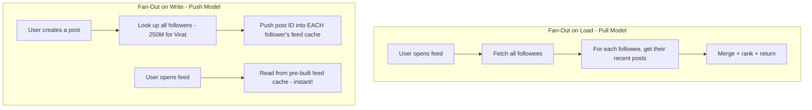
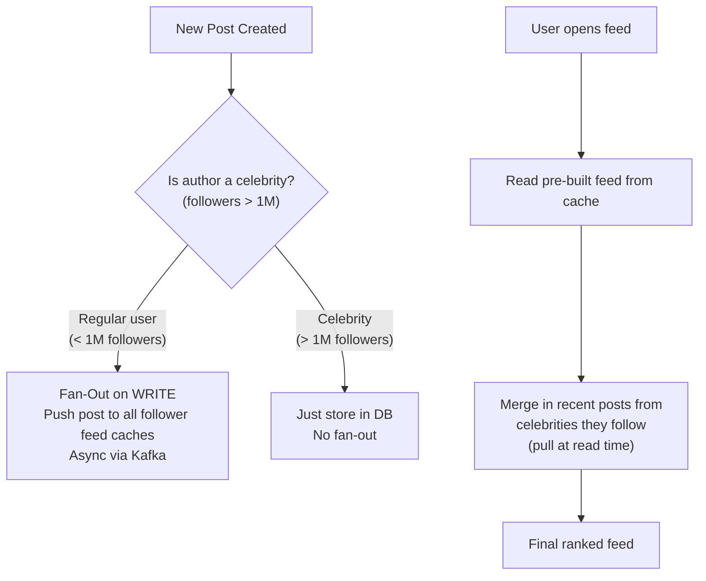
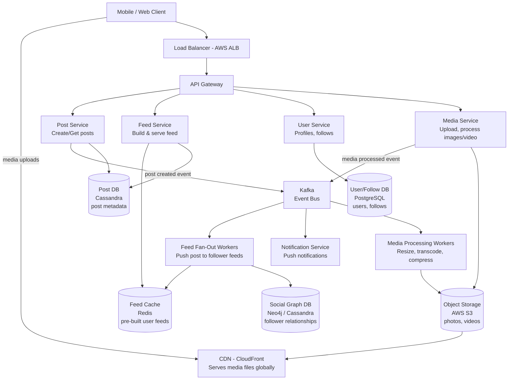
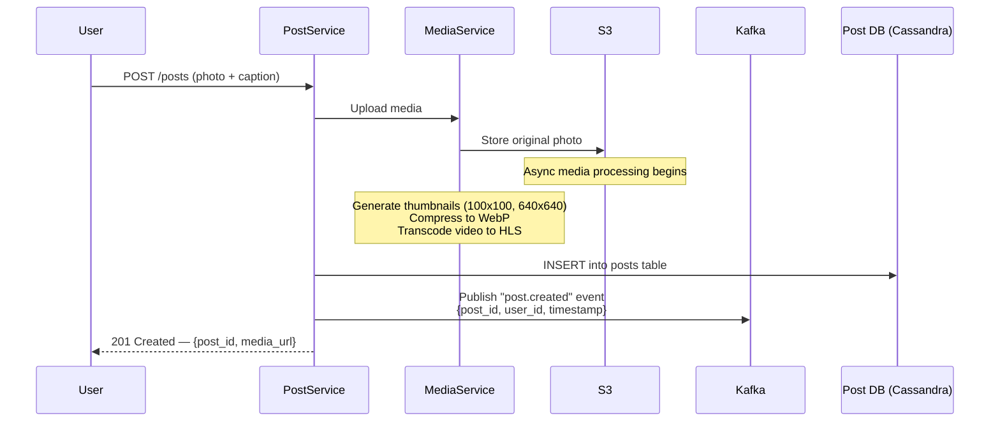
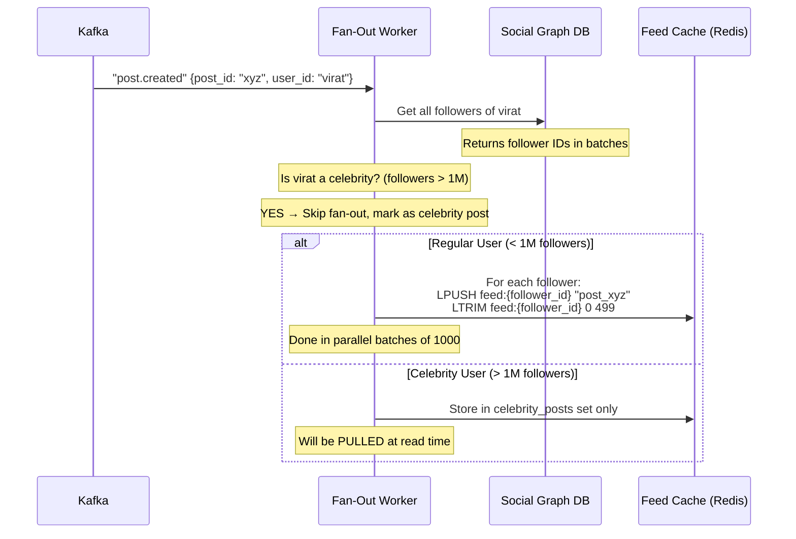
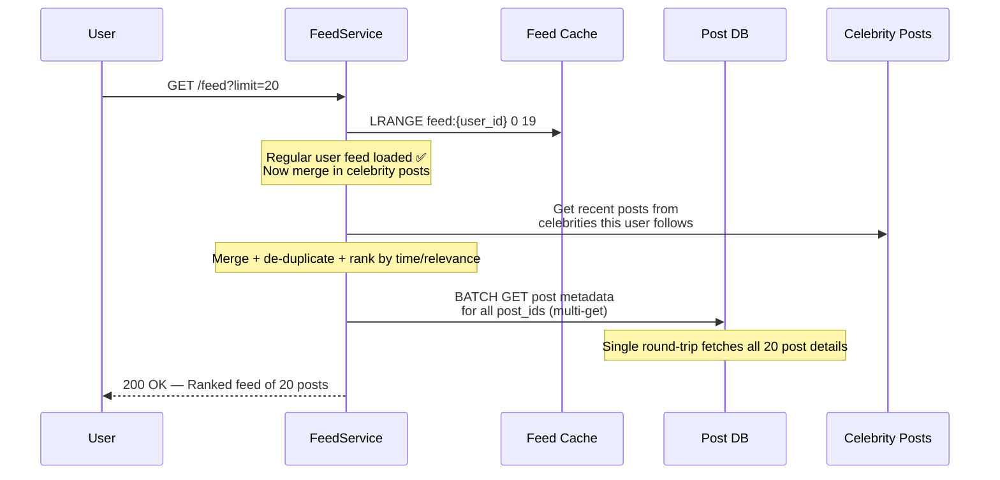
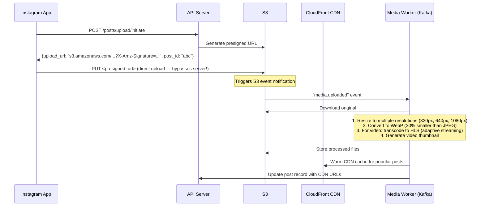
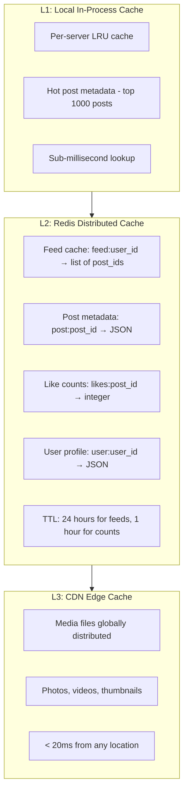
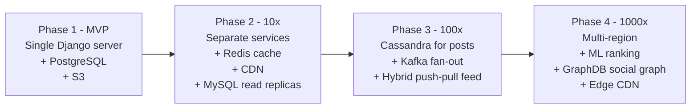

# 📸 HLD: Instagram Feed (News Feed System)

> **Difficulty**: Hard | **Frequency**: Very High in Senior Interviews
> **Similar Systems**: Twitter Timeline, Facebook News Feed, TikTok For You Page, LinkedIn Feed
> **Why It's Hard**: At Instagram's scale (~2B users, 500M daily actives), generating a feed is one of the hardest distributed systems problems.

---

## 📌 Table of Contents

1. [Problem Statement](#problem-statement)
2. [Functional Requirements](#functional-requirements)
3. [Non-Functional Requirements](#non-functional-requirements)
4. [Core Design Challenge — Fan-Out Problem](#core-design-challenge)
5. [Capacity Estimation](#capacity-estimation)
6. [API Design](#api-design)
7. [High-Level Architecture](#high-level-architecture)
8. [Database Design](#database-design)
9. [Feed Generation — The Heart of the System](#feed-generation)
10. [Post Creation Flow](#post-creation-flow)
11. [Media Storage](#media-storage)
12. [Caching Strategy](#caching-strategy)
13. [Scalability & Bottlenecks](#scalability--bottlenecks)
14. [Edge Cases & Tradeoffs](#edge-cases--tradeoffs)
15. [Interview Tips](#interview-tips)

---

## 📌 Problem Statement

Design **Instagram's Feed** where:
- Users can upload photos/videos (posts)
- Users can follow other users
- A user's **feed** shows recent posts from people they follow, ranked by relevance
- Feed must load fast (< 200ms) for 500M+ daily active users

---

## ✅ Functional Requirements

| Feature | Description |
|---|---|
| **Create Post** | User uploads a photo/video with caption and hashtags |
| **Follow/Unfollow** | Users can follow/unfollow other users |
| **View Home Feed** | Paginated feed of posts from followed users, ranked by relevance |
| **Like / Comment** | Engage with posts |
| **Explore Feed** | Discover posts from non-followed users (algorithmic) |
| **Stories** | Ephemeral content (24-hour expiry) |
| **Notifications** | Like, comment, follow notifications |

> **Scope for interview**: Focus on Home Feed generation — this is the core challenge.

---

## 🚫 Non-Functional Requirements

| Property | Requirement |
|---|---|
| **High Availability** | 99.99% — feed must always load |
| **Low Latency** | Feed renders in < 200ms (p99) |
| **Eventual Consistency** | A new post may take a few seconds to appear in all followers' feeds — acceptable |
| **Scale** | 2B users, 500M DAU, 100M posts/day |
| **Media Durability** | Photos/videos must never be lost (11 9s durability on S3) |

> ⚡ **Key Insight**: Feed generation is a **read-heavy** system (100:1 read-to-write ratio). Reads must be blazing fast — pre-computation is the key strategy.

---

## 🧠 Core Design Challenge — The Fan-Out Problem

This is the **most important concept** for this interview. Understand this before anything else.

### The Problem

```
Imagine: Virat Kohli has 250 Million followers on Instagram.
He posts a photo.

Naive approach: When any of his 250M followers open Instagram,
  the server looks up all people they follow → fetches their posts → sorts → returns.

This query runs 250M times per post!  ❌ Way too slow.
```

### Two Opposing Strategies



| Strategy | Write Cost | Read Cost | Problem |
|---|---|---|---|
| **Fan-Out on Load (Pull)** | ✅ Cheap (just store the post) | ❌ Expensive (query at read time) | Slow feed for users who follow many people |
| **Fan-Out on Write (Push)** | ❌ Expensive (write to all followers) | ✅ Instant (pre-built feed) | Celebrity problem: 250M writes per post! |

### ✅ Instagram's Hybrid Approach (The Right Answer!)



> 💡 **This is the #1 insight interviewers want to hear.** Regular users get pre-built feeds (fast reads). Celebrity posts are pulled at read time and merged in — avoiding the 250M write storm.

---

## 📊 Capacity Estimation

### Scale Numbers
```
Users:          2 Billion total, 500M Daily Active (DAU)
Posts per day:  100M new posts/day
Post size:      Avg photo = 200 KB compressed, video = 5 MB
Feed loads:     Each DAU opens feed ~5x/day → 2.5 Billion feed loads/day
```

### Write Throughput
```
100M posts/day ÷ 86,400 sec = ~1,160 posts/sec (peak: ~3,000/sec)
```

### Read Throughput
```
2.5B feed loads/day ÷ 86,400 sec = ~29,000 feed reads/sec (peak: ~100,000/sec)
```

### Fan-Out Write Volume
```
Avg user has 200 followers
100M posts/day × 200 = 20 Billion feed writes/day
20B ÷ 86,400 = ~230,000 feed cache writes/sec

Note: Celebrities are excluded from this (pulled at read time)
```

### Storage
```
Photos:  100M × 200 KB = 20 TB/day → 7.3 PB/year
Videos:  Say 20% of posts are videos: 20M × 5 MB = 100 TB/day additional
Metadata (captions, likes, comments): ~500 bytes/post = 50 GB/day

Use S3 with lifecycle policies:
  Hot: S3 Standard (0-30 days)
  Warm: S3 IA (30-90 days)
  Cold: S3 Glacier (90+ days)
```

---

## 🌐 API Design

### 1. Create Post
```
POST /api/v1/posts
Content-Type: multipart/form-data

{
  "media": <binary>,
  "caption": "Sunset at Goa! 🌅",
  "hashtags": ["goa", "sunset", "travel"],
  "location": {"lat": 15.2, "lng": 73.9},
  "visibility": "public"  // public | followers | close_friends
}

Response 201:
{
  "post_id": "post_abc123",
  "media_url": "https://cdn.instagram.com/photos/abc123.jpg",
  "thumbnail_url": "https://cdn.instagram.com/thumbnails/abc123.jpg",
  "created_at": "2024-05-24T10:30:00Z"
}
```

### 2. Get Home Feed
```
GET /api/v1/feed?cursor=<last_post_id>&limit=20
Authorization: Bearer <jwt_token>

Response 200:
{
  "posts": [
    {
      "post_id": "post_xyz",
      "author": { "user_id": "u1", "username": "virat", "avatar_url": "..." },
      "media_url": "https://cdn.instagram.com/photos/xyz.jpg",
      "caption": "Match day! 🏏",
      "like_count": 4200000,
      "comment_count": 31000,
      "is_liked": false,
      "created_at": "2024-05-24T08:00:00Z"
    }
  ],
  "next_cursor": "post_abc",
  "has_more": true
}
```

> **Cursor-based pagination** (not offset) — Instagram doesn't use `page=2`. Instead, each response gives a cursor pointing to the last seen post. Prevents duplicate posts if new content is added.

### 3. Like a Post
```
POST /api/v1/posts/{post_id}/like
DELETE /api/v1/posts/{post_id}/like
```

### 4. Get Post Comments
```
GET /api/v1/posts/{post_id}/comments?cursor=<cursor>&limit=20
```

---

## 🏗️ High-Level Architecture



---

## 🗄️ Database Design

### Post Metadata — Cassandra

Why Cassandra? Time-series writes, massive scale, no single point of failure.

```sql
-- posts table
CREATE TABLE posts (
  post_id       UUID,
  user_id       UUID,
  caption       TEXT,
  media_urls    LIST<TEXT>,       -- ["photo_url", "video_url"]
  thumbnails    LIST<TEXT>,
  hashtags      SET<TEXT>,
  location_lat  DOUBLE,
  location_lng  DOUBLE,
  visibility    TEXT,             -- public | followers | close_friends
  created_at    TIMESTAMP,
  is_deleted    BOOLEAN,
  like_count    COUNTER,
  comment_count COUNTER,
  PRIMARY KEY (post_id)
);

-- To get posts by user (for profile page)
CREATE TABLE posts_by_user (
  user_id     UUID,
  created_at  TIMESTAMP,
  post_id     UUID,
  thumbnail   TEXT,
  PRIMARY KEY (user_id, created_at, post_id)
) WITH CLUSTERING ORDER BY (created_at DESC);
```

### Social Graph — Cassandra / Neo4j

```sql
-- Who does user X follow?
CREATE TABLE following (
  follower_id UUID,
  followee_id UUID,
  followed_at TIMESTAMP,
  PRIMARY KEY (follower_id, followee_id)
);

-- Who follows user X? (fan-out: needed to push to all followers)
CREATE TABLE followers (
  followee_id  UUID,
  follower_id  UUID,
  followed_at  TIMESTAMP,
  PRIMARY KEY (followee_id, follower_id)
);
```

> **Why two tables?** Cassandra is optimized for specific access patterns. We need fast lookups in both directions: "who do I follow?" and "who follows me?".

### Feed Cache — Redis

```
Redis List (per user):

Key:   "feed:{user_id}"       e.g., "feed:nitin_42"
Value: [post_id_1, post_id_2, post_id_3, ...]  (ordered list)
TTL:   24 hours

Example:
  feed:nitin_42 = ["post_xyz", "post_abc", "post_def", ...]
  (Only stores post IDs! Full post data fetched separately)

Max size per feed: 500 post IDs
  → Why 500? After 500 posts, nobody scrolls that far.
  → LPUSH new posts, LTRIM to keep max 500.
```

### User & Auth — PostgreSQL

```sql
CREATE TABLE users (
  user_id      UUID PRIMARY KEY DEFAULT gen_random_uuid(),
  username     VARCHAR(30) UNIQUE NOT NULL,
  email        VARCHAR(255) UNIQUE NOT NULL,
  password_hash VARCHAR(256) NOT NULL,
  full_name    VARCHAR(100),
  bio          TEXT,
  avatar_url   TEXT,
  follower_count INT DEFAULT 0,
  following_count INT DEFAULT 0,
  post_count   INT DEFAULT 0,
  is_verified  BOOLEAN DEFAULT FALSE,    -- Blue tick
  is_private   BOOLEAN DEFAULT FALSE,
  created_at   TIMESTAMP DEFAULT NOW()
);
```

### Likes — Cassandra

```sql
-- Likes need to be fast reads and writes at massive scale
CREATE TABLE post_likes (
  post_id    UUID,
  user_id    UUID,
  liked_at   TIMESTAMP,
  PRIMARY KEY (post_id, user_id)
);

-- Did THIS user like THIS post? (used for the heart icon state)
-- Fast O(1) check using Redis SET: "likes:{post_id}" → SET of user_ids
```

---

## 🔁 Feed Generation — The Heart of the System

### Step 1: User Creates a Post



### Step 2: Fan-Out Worker Processes the Event



### Step 3: User Reads the Feed



---

## 🖼️ Media Storage

### Upload Flow with Presigned URL



### CDN Strategy

```
Files stored on S3:
  photos/original/{post_id}.jpg
  photos/320/{post_id}.webp     ← Thumbnail in feed
  photos/640/{post_id}.webp     ← Standard view
  photos/1080/{post_id}.webp    ← Full resolution
  videos/{post_id}/master.m3u8  ← HLS manifest
  videos/{post_id}/360p.ts      ← Low quality stream
  videos/{post_id}/720p.ts      ← HD stream
  videos/{post_id}/1080p.ts     ← Full HD stream

Served via CloudFront CDN:
  https://cdn.instagram.com/photos/320/{post_id}.webp
  → Cached at CDN edge nearest to user (< 20ms serve time)
  → CDN origin is S3

Cache-Control headers:
  photos: Cache-Control: max-age=86400 (24 hours)
  videos: Cache-Control: max-age=3600 (1 hour, adaptive)
```

---

## ⚡ Caching Strategy

### Multiple Cache Layers



### Cache Read for Feed

```
For each post in the feed:
  1. Check L1 (in-process LRU) → HIT: ~0.1ms
  2. Check Redis (post:{post_id}) → HIT: ~1ms
  3. Miss → Cassandra batch GET → populate Redis → ~5ms

For 20 posts in a feed:
  Best case (all Redis HIT):  1ms × 20 = 20ms total
  Worst case (all DB miss):   5ms × 20 = 100ms total

Real world: ~80% cache hit rate → avg ~30ms for post metadata
```

### Like Count — Approximate Counter

```
Like counts DON'T need to be exact in real-time.
2,304,121 likes vs 2,304,122 likes — nobody cares!

Approach: Redis Counter + Async DB Write
  - INCR likes:{post_id}   in Redis (atomic, instant)
  - Every 30 seconds, flush Redis counts to Cassandra
  - On feed load, read from Redis (fast) not Cassandra (slow)
```

---

## 📈 Scalability & Bottlenecks

### Bottleneck 1: Celebrity Fan-Out (Already Solved Above)

**Solution**: Hybrid push-pull model. Skip fan-out for celebrities, pull at read time and merge.

### Bottleneck 2: Feed Cache Memory

```
500M users × 500 post IDs × 8 bytes per ID = 2 TB per Redis cluster

Solution:
  - Don't cache feeds for inactive users (< 30 days inactive)
  - Tiered Redis: hot feeds in hot Redis, warm in cheap Redis
  - Cluster Redis: multiple shards (feed:user_id hashes to shard)
```

### Bottleneck 3: Cassandra Hot Spots

```
Problem: All reads for Virat Kohli's post go to the same Cassandra partition
Solution:
  - Cache extremely popular posts in Redis + CDN (avoid Cassandra for reads)
  - Read replicas for Cassandra
  - Local in-process cache for top-K posts
```

### Bottleneck 4: Kafka Consumer Lag

```
Problem: After a viral post, fan-out queue gets backed up →
  followers see the post hours later

Solution:
  - Partition Kafka by user_id for ordering guarantees
  - Scale fan-out workers horizontally (elastic)
  - Prioritize: skip fan-out for users inactive > 48 hours
  - SLA: fan-out completes within 60 seconds for regular users
```

### Architecture Evolution



---

## 🤖 Feed Ranking (ML Layer)

Real Instagram doesn't just sort by time. It uses ML.

```
Ranking Signals:
  ├── Relationship signals
  │     ├── # of times you've liked this person's posts
  │     ├── # of times you've commented on their posts
  │     └── Are they your Close Friends?
  │
  ├── Post signals
  │     ├── How many likes/comments in the first hour?
  │     ├── Video watch completion rate
  │     └── How many saves?
  │
  └── User signals
        ├── What type of content do you usually engage with?
        ├── What time of day is it for you?
        └── How long since you last opened Instagram?

Final feed = Ranked list from ML model + recency weight

In interview: Mention ML exists, but say "for simplicity we'll use
recency-based ranking (newest first) and can layer ML on top"
```

---

## ⚠️ Edge Cases & Tradeoffs

| Edge Case | Handling |
|---|---|
| **User follows 5000 people** | Pull model for heavy followers; feed assembled at read time |
| **User with 500M followers posts** | No fan-out; all followers pull at read time |
| **User unfollows someone** | Remove their posts from feed cache lazily (on next load) |
| **Post deleted after fan-out** | Keep `is_deleted` flag; filter deleted posts at read time |
| **Private account** | Only fan-out to approved followers; check visibility on read |
| **User temporarily deactivates** | Mark feed cache with long TTL; regenerate on reactivation |
| **Feed cache miss (cold start)** | Fall back to: query DB for latest posts from followees |
| **Duplicate posts in feed** | Deduplication step in Feed Service using seen post set |
| **New user (no followers)** | Show explore/trending content until they follow people |
| **Story expiry** | TTL in Redis + cron job to delete from S3 after 24 hours |

### Key Tradeoffs

| Decision | Option A | Option B | Recommendation |
|---|---|---|---|
| **Feed generation** | Pull on read | Push on write | ✅ Hybrid (push for regular, pull for celebrities) |
| **Post storage** | PostgreSQL | Cassandra | ✅ Cassandra (write-heavy, time-series, massive scale) |
| **Like counts** | Exact (DB) | Approximate (Redis counter) | ✅ Approximate (nobody needs exact real-time count) |
| **Feed ordering** | Purely chronological | ML-ranked | ✅ ML-ranked in production; chronological for MVP |
| **Media format** | JPEG | WebP | ✅ WebP (30% smaller, same quality) |
| **Video delivery** | MP4 progressive | HLS adaptive | ✅ HLS (adapts to connection speed) |

---

## 💡 Interview Tips

### Clarifying Questions to Ask
1. "How many users, DAU?"
2. "Read-to-write ratio?"
3. "Do we need ML ranking or simple chronological?"
4. "What counts as a celebrity threshold for fan-out skipping?"
5. "Do we need stories, explore feed, or just home feed?"

### What Impresses Interviewers
- ✅ Immediately identifying the **fan-out problem** and proposing the hybrid model
- ✅ Explaining **why Cassandra** (write-heavy, time-series, horizontal scale)
- ✅ Cursor-based pagination (not offset) and why
- ✅ **Presigned S3 URLs** for direct media upload (bypasses server)
- ✅ **Media processing pipeline**: resize, WebP conversion, HLS for video
- ✅ Approximate counters in Redis for likes (not exact DB queries)
- ✅ Separating the fan-out concern into async workers via Kafka

### Common Mistakes
- ❌ Using `OFFSET` pagination (breaks when new posts are inserted)
- ❌ Storing media in the database (always use S3)
- ❌ Doing fan-out synchronously (blocks the post creation API)
- ❌ Not mentioning the celebrity problem
- ❌ Using a single DB (PostgreSQL can't handle this scale)
- ❌ Making the feed purely pull-based (too slow at scale)

---

## 🎯 Quick Summary Card

```
┌──────────────────────────────────────────────────────────────────────┐
│                   INSTAGRAM FEED — CHEAT SHEET                        │
├──────────────────────────────────────────────────────────────────────┤
│ Scale:        2B users, 500M DAU, 100M posts/day                      │
│ Fan-Out:      HYBRID — push for regular users, pull for celebrities   │
│ Post DB:      Cassandra (time-series, massive write scale)            │
│ Social Graph: Cassandra (followers/following dual tables)             │
│ Feed Cache:   Redis List (500 post IDs per user, 24h TTL)            │
│ Media:        S3 + CloudFront CDN, WebP photos, HLS video            │
│ Like Counts:  Redis INCR (approximate, flush to DB async)            │
│ Pagination:   Cursor-based (not offset!)                              │
│ Fan-Out:      Async via Kafka workers (not in write request)          │
│ Celebrity:    > 1M followers = skip fan-out, pull at read time       │
│ Media Upload: Presigned S3 URL (client uploads directly to S3)       │
│ Ranking:      ML model in prod; chronological for MVP                │
└──────────────────────────────────────────────────────────────────────┘
```

---

*Previous: [03_Authentication_Authorization.md](./03_Authentication_Authorization.md) | Next: [05_WhatsApp.md]*
