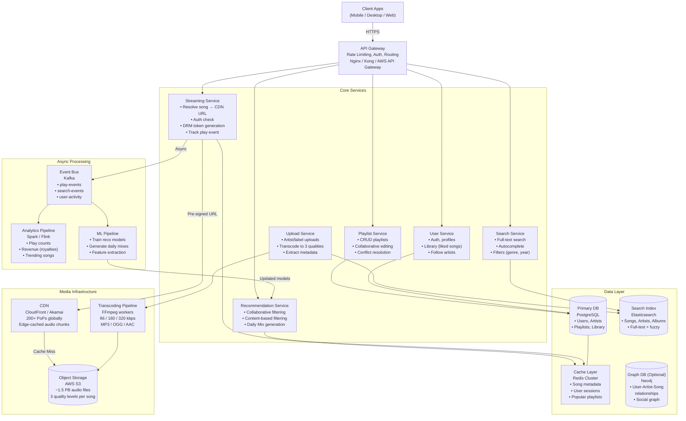
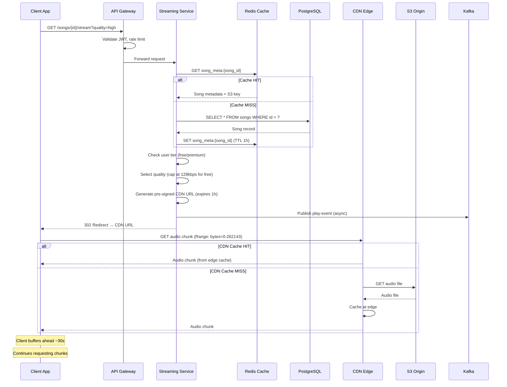
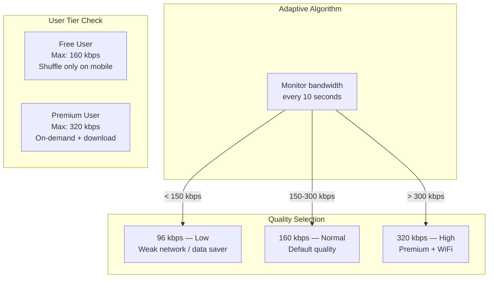
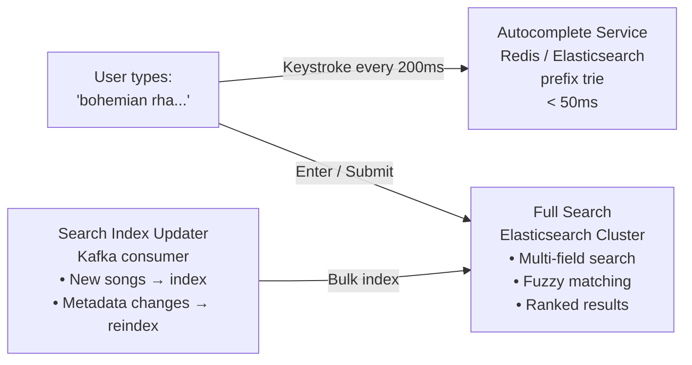
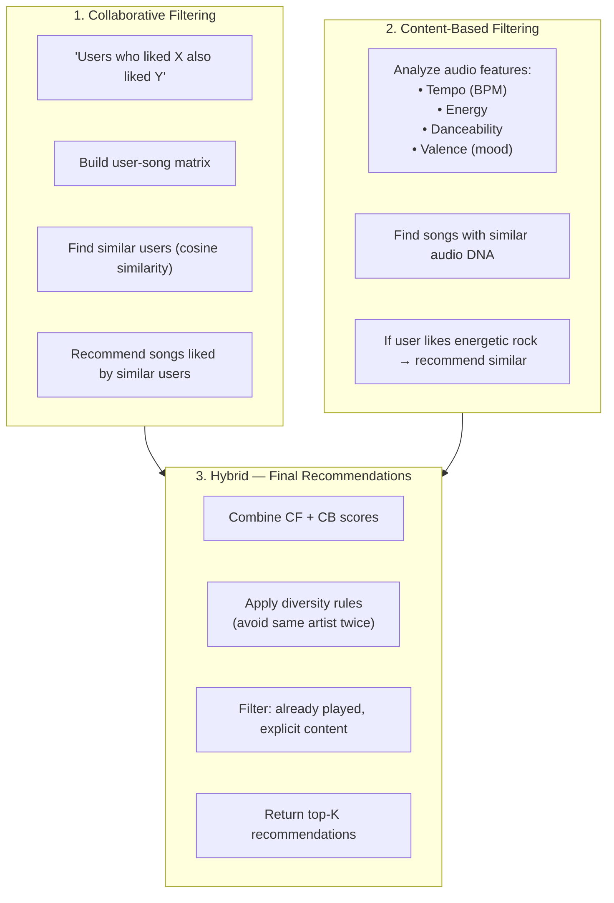
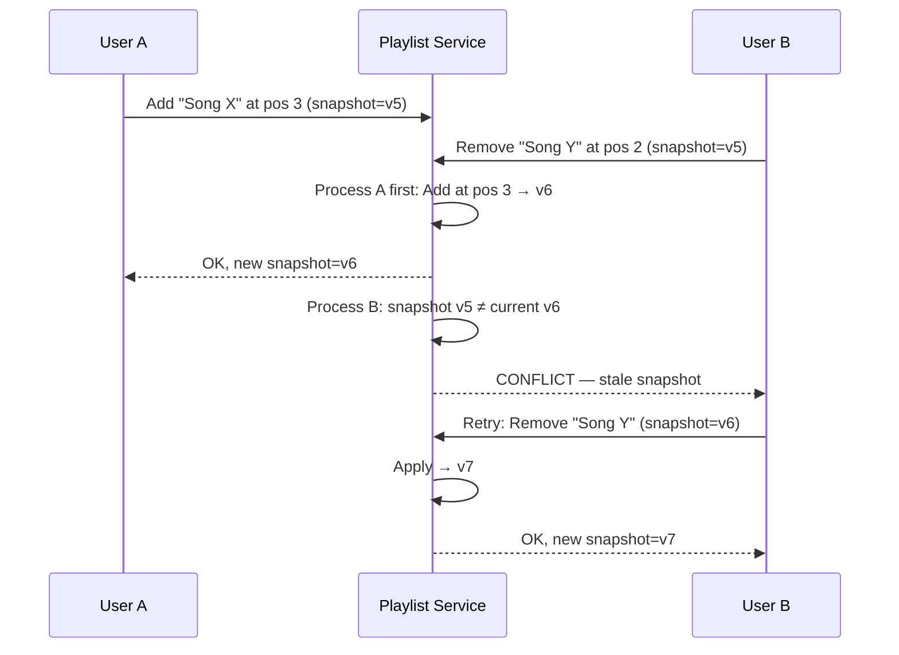
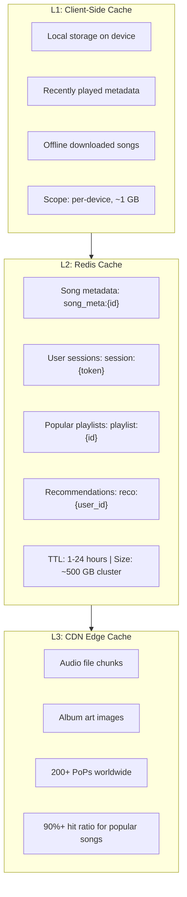

# 🎵 HLD: Spotify (Music Streaming Platform)

> **Difficulty**: Hard | **Frequency**: Very High in Interviews  
> **Similar Systems**: Apple Music, YouTube Music, SoundCloud, Amazon Music  
> **Related**: Netflix (video streaming), YouTube (media CDN), WhatsApp (real-time)

---

## 📌 Table of Contents

1. [Problem Statement](#problem-statement)
2. [Clarifying Questions (Step 1)](#clarifying-questions)
3. [Functional Requirements](#functional-requirements)
4. [Non-Functional Requirements](#non-functional-requirements)
5. [Capacity Estimation (Back-of-Envelope)](#capacity-estimation)
6. [API Design](#api-design)
7. [High-Level Architecture (Step 2)](#high-level-architecture)
8. [Database Design](#database-design)
9. [Design Deep Dives (Step 3)](#design-deep-dives)
   - [Music Streaming Pipeline](#1-music-streaming-pipeline)
   - [Search System](#2-search-system)
   - [Recommendation Engine](#3-recommendation-engine)
   - [Playlist Service](#4-playlist-service)
   - [Offline Downloads](#5-offline-downloads)
10. [Caching Strategy](#caching-strategy)
11. [Scalability & Bottlenecks](#scalability--bottlenecks)
12. [Wrap Up (Step 4)](#wrap-up)
13. [Edge Cases & Tradeoffs](#edge-cases--tradeoffs)
14. [Interview Tips](#interview-tips)

---

## 📌 Problem Statement

Design a **music streaming service like Spotify** where:
- Users can **search** for songs, albums, and artists
- Users can **stream music** in real-time with adaptive bitrate
- Users can **create/manage playlists** and follow artists
- The system **recommends** personalized music based on listening history
- Users can **download songs for offline** playback
- Support **100M+ daily active users** streaming simultaneously

---

## 🤔 Clarifying Questions (Step 1 — ByteByteGo Framework)

> **Key Principle**: Don't jump into design. Ask questions to scope the problem.

| # | Question | Assumed Answer |
|---|---|---|
| 1 | What's the scale? How many DAU? | **100M DAU**, 500M total registered |
| 2 | How many songs in the catalog? | **100M songs**, growing 50K/day |
| 3 | Do we need to support both free (ad-supported) and premium tiers? | Yes — free (ads, shuffle, 128kbps) + premium (no ads, on-demand, 320kbps) |
| 4 | Do we need podcast support? | Out of scope for this design |
| 5 | What about social features (friends, collaborative playlists)? | Collaborative playlists yes; social feed out of scope |
| 6 | Do we need offline downloads? | Yes — premium users can download |
| 7 | What audio formats/quality levels? | Three tiers: Low (96kbps), Normal (160kbps), High (320kbps) |
| 8 | Do we need real-time lyrics? | Nice to have, not core |
| 9 | What regions/geographies? | Global — multi-region deployment |
| 10 | Do we need a recommendation engine? | Yes — personalized daily mixes, discovery playlists |

> 💡 **Interview Tip**: Asking these questions shows maturity. Spotify's design is MASSIVE — you need to scope it down. Focus on: **streaming, search, playlists, recommendations**.

---

## ✅ Functional Requirements

| Feature | Description |
|---|---|
| **Music Streaming** | Stream songs on-demand with adaptive bitrate quality |
| **Search** | Search songs, artists, albums by name, genre, etc. |
| **Playlists** | Create, edit, delete playlists; add/remove songs |
| **Recommendations** | Personalized song recommendations based on history |
| **Library** | Save/like songs, follow artists, save albums |
| **Offline Downloads** | Download songs for offline playback (premium) |
| **Artist Uploads** | Artists/labels upload songs with metadata |
| **Playback Controls** | Play, pause, skip, shuffle, repeat, seek, queue |
| **Ads** | Inject audio ads for free-tier users between songs |

---

## 🚫 Non-Functional Requirements

| Property | Requirement |
|---|---|
| **High Availability** | 99.99% uptime — users expect music to "just work" |
| **Low Latency Streaming** | Song playback must start in < 200ms after pressing play |
| **Scalability** | Support 100M concurrent streams globally |
| **Durability** | Songs and user data must never be lost |
| **Consistency** | Playlists/library updates must be consistent across devices |
| **Bandwidth Efficiency** | Adaptive bitrate to minimize bandwidth on poor connections |
| **Global Reach** | Low latency worldwide via CDN edge servers |
| **Fault Tolerance** | Graceful degradation — if recommendations fail, music still plays |

> ⚡ **Key Insight**: This is a **read-heavy, bandwidth-intensive** system. The core challenge is efficiently streaming audio files to millions of concurrent users globally. This is fundamentally different from URL Shortener or Pastebin — here the payload is continuous audio data, not a one-time redirect or text blob.

---

## 📊 Capacity Estimation (Back-of-Envelope)

### User & Streaming Scale
```
Total Users:        500M registered
DAU:                100M daily active users
Concurrent Streams: ~10M at peak (10% of DAU streaming simultaneously)
Avg Session:        ~30 minutes = ~8 songs per session
```

### Storage
```
Songs in catalog:     100M songs
Avg song duration:    3.5 minutes
Avg file size (320kbps): 3.5 min * 60 sec * 320 kbps / 8 = ~8.4 MB
Avg file size (160kbps): ~4.2 MB
Avg file size (96kbps):  ~2.5 MB

Store ALL 3 quality variants per song:
→ 100M * (8.4 + 4.2 + 2.5) MB = 100M * 15.1 MB = ~1.51 PB (Petabytes) total audio storage

Metadata per song:     ~2 KB (title, artist, album, genre, duration, etc.)
→ 100M * 2 KB = ~200 GB metadata

User data (playlists, history, preferences):
→ 500M users * ~5 KB avg = ~2.5 TB
```

### Bandwidth
```
Concurrent streams at peak: 10M
Average bitrate:            160 kbps = 20 KB/s

Bandwidth = 10M * 20 KB/s = 200 GB/s = ~1.6 Tbps outbound 🔥

→ This is ENORMOUS. CDN is absolutely critical!
→ Without CDN: need ~16,000 servers each serving 100 Mbps
→ With CDN (90% cache hit): origin serves only 10% = ~160 Gbps
```

### Daily Operations
```
Songs played per day:    100M DAU * 8 songs = 800M plays/day
Search queries per day:  100M DAU * 3 searches = 300M searches/day
Playlist updates/day:    ~50M operations (create, add, remove)
New songs uploaded/day:   50K new songs
```

### Cache
```
Top 1% of songs get 80% of plays (power-law distribution)
→ Cache top 1M songs * 15 MB avg = ~15 TB distributed across CDN edge nodes
→ Each CDN PoP (Point of Presence) caches regional top songs
```

---

## 🌐 API Design

### 1. Stream a Song
```
GET /api/v1/songs/{song_id}/stream?quality=high
Authorization: Bearer <token>

Response 200 OK:
Headers:
  Content-Type: audio/mpeg (or audio/ogg, audio/aac)
  Accept-Ranges: bytes
  Content-Length: 8847360
  X-Stream-URL: https://cdn.spotify-edge.com/audio/abc123_320.mp3
  X-Song-Duration: 210

→ Returns a redirect to CDN URL with pre-signed token
→ Client streams from CDN directly (not from origin!)

Response 206 Partial Content (for seeking/range requests):
  Content-Range: bytes 1048576-2097151/8847360
```

### 2. Search
```
GET /api/v1/search?q=bohemian+rhapsody&type=track,artist,album&limit=20&offset=0
Authorization: Bearer <token>

Response 200:
{
  "tracks": [
    {
      "id": "song_001",
      "title": "Bohemian Rhapsody",
      "artist": { "id": "artist_001", "name": "Queen" },
      "album": { "id": "album_001", "name": "A Night at the Opera" },
      "duration_ms": 354000,
      "popularity": 95,
      "preview_url": "https://cdn.../preview/song_001_30s.mp3"
    }
  ],
  "artists": [...],
  "albums": [...],
  "total": 142,
  "next": "/api/v1/search?q=...&offset=20"
}
```

### 3. Get / Create / Update Playlist
```
POST /api/v1/playlists
Authorization: Bearer <token>

Request Body:
{
  "name": "Chill Vibes",
  "description": "Relaxing evening playlist",
  "is_public": true,
  "is_collaborative": false
}

Response 201:
{
  "id": "playlist_001",
  "name": "Chill Vibes",
  "owner": { "id": "user_001", "name": "Nitin" },
  "tracks": [],
  "total_tracks": 0,
  "created_at": "2024-06-01T10:00:00Z"
}
```

### 4. Add Songs to Playlist
```
POST /api/v1/playlists/{playlist_id}/tracks
Authorization: Bearer <token>

Request Body:
{
  "song_ids": ["song_001", "song_002", "song_003"],
  "position": 0   // optional: insert at specific position
}

Response 200:
{
  "snapshot_id": "snap_v3"   // version for conflict detection
}
```

### 5. Get Recommendations
```
GET /api/v1/recommendations?seed_tracks=song_001,song_002&seed_genres=rock,pop&limit=20
Authorization: Bearer <token>

Response 200:
{
  "tracks": [ ... ],
  "seeds": [
    { "type": "track", "id": "song_001" },
    { "type": "genre", "id": "rock" }
  ]
}
```

### 6. Download for Offline (Premium)
```
POST /api/v1/downloads
Authorization: Bearer <token>

Request Body:
{
  "song_ids": ["song_001", "song_002"],
  "quality": "high"
}

Response 200:
{
  "downloads": [
    {
      "song_id": "song_001",
      "download_url": "https://cdn.../download/song_001_320.enc",
      "expires_at": "2024-06-02T10:00:00Z",
      "drm_license_url": "https://drm.spotify.com/license/..."
    }
  ]
}
```

---

## 🏗️ High-Level Architecture (Step 2 — ByteByteGo Framework)



### Request Flow — "User Presses Play"



---

## 🗄️ Database Design

### Songs Table (PostgreSQL)
```sql
CREATE TABLE songs (
    id              VARCHAR(36)   PRIMARY KEY,        -- UUID "song_001"
    title           VARCHAR(512)  NOT NULL,
    artist_id       VARCHAR(36)   NOT NULL REFERENCES artists(id),
    album_id        VARCHAR(36)   REFERENCES albums(id),
    duration_ms     INT           NOT NULL,            -- 354000 = 5:54
    genre           VARCHAR(64),
    release_date    DATE,
    s3_key_96       VARCHAR(512),                      -- "audio/song_001_96.mp3"
    s3_key_160      VARCHAR(512),                      -- "audio/song_001_160.mp3"  
    s3_key_320      VARCHAR(512),                      -- "audio/song_001_320.mp3"
    play_count      BIGINT        DEFAULT 0,
    popularity      SMALLINT      DEFAULT 0,           -- 0-100 score
    is_explicit     BOOLEAN       DEFAULT FALSE,
    created_at      TIMESTAMP     DEFAULT NOW(),
    
    INDEX idx_artist (artist_id),
    INDEX idx_album (album_id),
    INDEX idx_genre (genre),
    INDEX idx_popularity (popularity DESC)
);
```

### Artists Table
```sql
CREATE TABLE artists (
    id              VARCHAR(36)   PRIMARY KEY,
    name            VARCHAR(256)  NOT NULL,
    bio             TEXT,
    image_url       VARCHAR(512),
    follower_count  BIGINT        DEFAULT 0,
    verified        BOOLEAN       DEFAULT FALSE,
    created_at      TIMESTAMP     DEFAULT NOW(),
    
    INDEX idx_name (name)
);
```

### Albums Table
```sql
CREATE TABLE albums (
    id              VARCHAR(36)   PRIMARY KEY,
    title           VARCHAR(512)  NOT NULL,
    artist_id       VARCHAR(36)   NOT NULL REFERENCES artists(id),
    cover_url       VARCHAR(512),
    release_date    DATE,
    total_tracks    INT,
    album_type      ENUM('album', 'single', 'compilation'),
    created_at      TIMESTAMP     DEFAULT NOW(),
    
    INDEX idx_artist (artist_id),
    INDEX idx_release (release_date DESC)
);
```

### Playlists & Playlist Tracks
```sql
CREATE TABLE playlists (
    id              VARCHAR(36)   PRIMARY KEY,
    name            VARCHAR(256)  NOT NULL,
    description     TEXT,
    owner_id        VARCHAR(36)   NOT NULL REFERENCES users(id),
    is_public       BOOLEAN       DEFAULT TRUE,
    is_collaborative BOOLEAN      DEFAULT FALSE,
    cover_url       VARCHAR(512),
    follower_count  BIGINT        DEFAULT 0,
    snapshot_id     VARCHAR(36)   NOT NULL,            -- For conflict detection
    created_at      TIMESTAMP     DEFAULT NOW(),
    updated_at      TIMESTAMP     DEFAULT NOW(),
    
    INDEX idx_owner (owner_id),
    INDEX idx_public_popular (is_public, follower_count DESC)
);

CREATE TABLE playlist_tracks (
    playlist_id     VARCHAR(36)   NOT NULL REFERENCES playlists(id),
    song_id         VARCHAR(36)   NOT NULL REFERENCES songs(id),
    position        INT           NOT NULL,             -- Order within playlist
    added_by        VARCHAR(36)   REFERENCES users(id),
    added_at        TIMESTAMP     DEFAULT NOW(),
    
    PRIMARY KEY (playlist_id, position),
    INDEX idx_song (song_id)
);
```

### Users Table
```sql
CREATE TABLE users (
    id              VARCHAR(36)   PRIMARY KEY,
    username        VARCHAR(64)   UNIQUE NOT NULL,
    email           VARCHAR(256)  UNIQUE NOT NULL,
    password_hash   VARCHAR(256)  NOT NULL,
    display_name    VARCHAR(128),
    tier            ENUM('free', 'premium') DEFAULT 'free',
    country         VARCHAR(2),
    created_at      TIMESTAMP     DEFAULT NOW(),
    
    INDEX idx_email (email),
    INDEX idx_username (username)
);

-- User's liked songs (library)
CREATE TABLE user_liked_songs (
    user_id         VARCHAR(36)   NOT NULL REFERENCES users(id),
    song_id         VARCHAR(36)   NOT NULL REFERENCES songs(id),
    liked_at        TIMESTAMP     DEFAULT NOW(),
    
    PRIMARY KEY (user_id, song_id),
    INDEX idx_user_time (user_id, liked_at DESC)
);

-- User follows artists
CREATE TABLE user_follows (
    user_id         VARCHAR(36)   NOT NULL,
    artist_id       VARCHAR(36)   NOT NULL,
    followed_at     TIMESTAMP     DEFAULT NOW(),
    
    PRIMARY KEY (user_id, artist_id)
);
```

### Listening History (for Recommendations)
```sql
CREATE TABLE listening_history (
    id              BIGINT        PRIMARY KEY AUTO_INCREMENT,
    user_id         VARCHAR(36)   NOT NULL,
    song_id         VARCHAR(36)   NOT NULL,
    played_at       TIMESTAMP     DEFAULT NOW(),
    duration_played_ms INT,                             -- How much of the song was played
    completed       BOOLEAN,                            -- Did they finish the song?
    skip_position_ms INT,                               -- Where they skipped (null if completed)
    context_type    ENUM('playlist', 'album', 'artist', 'search', 'radio', 'recommendation'),
    context_id      VARCHAR(36),                        -- Which playlist/album triggered this
    
    INDEX idx_user_time (user_id, played_at DESC),
    INDEX idx_song (song_id),
    INDEX idx_user_song (user_id, song_id)
);
```

### DB Choice Rationale

| Data | Storage | Why |
|---|---|---|
| **Users, Playlists, Library** | **PostgreSQL** | ACID, relational, joins for user data |
| **Song catalog, Artists** | **PostgreSQL** + **Elasticsearch** | Structured storage + full-text search |
| **Audio files** | **AWS S3** | Blob storage, CDN integration, unlimited scale |
| **Listening history** | **Cassandra / BigQuery** | Time-series data, high write throughput, append-only |
| **Metadata cache** | **Redis** | Sub-ms lookups for hot song metadata |
| **User-Song relationships** | **Neo4j** (optional) | Graph traversals for "users who liked X also liked Y" |
| **Search** | **Elasticsearch** | Fuzzy matching, autocomplete, ranked results |

---

## 🔍 Design Deep Dives (Step 3 — ByteByteGo Framework)

### 1. Music Streaming Pipeline

This is the **most critical component** — the core product experience.

#### How Audio Streaming Works

```
Traditional Download:
  Download entire 8 MB file → then play
  ❌ Slow start, wastes bandwidth if user skips

Streaming (Spotify):
  Audio file split into ~256 KB chunks
  Client requests chunks sequentially
  Playback starts after first 2-3 chunks (~500 KB)
  Client pre-buffers ~30 seconds ahead
  ✅ Instant start, seek support, bandwidth efficient
```

#### Adaptive Bitrate Streaming



#### Audio File Storage on S3

```
S3 Bucket: "spotify-audio-prod"

For each song, 3 files are stored:
  audio/{song_id}_96.ogg     ← Low quality (OGG Vorbis, 96 kbps)
  audio/{song_id}_160.ogg    ← Normal quality
  audio/{song_id}_320.ogg    ← High quality

Total: 100M songs × 3 files = 300M objects on S3
Total size: ~1.5 PB

Cost: S3 Standard ~$0.023/GB = ~$35,000/month
  → Move old/unpopular songs to S3 IA: ~$19,000/month
```

#### CDN Architecture

```
CDN is the BACKBONE of Spotify's streaming architecture:

Without CDN: 200 GB/s from origin = IMPOSSIBLE
With CDN:    90%+ cache hit ratio at edge

CDN PoPs (Points of Presence): 200+ worldwide
Each PoP caches:
  - Top ~10K songs for that region (~150 GB per PoP)
  - Recently played songs (LRU, configurable size)

Cache Strategy:
  - Popular songs: TTL = 7 days, proactively pushed to edges
  - Long-tail songs: Cached on-demand, TTL = 24 hours
  - New releases: Pre-warmed to ALL edges before release time
```

> 💡 **Interview Insight**: The CDN discussion is what separates a good answer from a great one. Spotify literally built their own CDN edge network for this reason. Mention that 90%+ of audio traffic NEVER hits the origin server.

---

### 2. Search System

#### Architecture



#### Elasticsearch Index Design

```json
{
  "song_index": {
    "mappings": {
      "properties": {
        "title":       { "type": "text", "analyzer": "standard", "fields": { "keyword": { "type": "keyword" }}},
        "artist_name": { "type": "text", "analyzer": "standard" },
        "album_name":  { "type": "text" },
        "genre":       { "type": "keyword" },
        "release_year": { "type": "integer" },
        "popularity":  { "type": "integer" },
        "duration_ms": { "type": "integer" },
        "suggest":     { "type": "completion" }
      }
    }
  }
}
```

#### Search Ranking Formula

```
Score = text_relevance * 0.4
      + popularity * 0.3
      + recency * 0.1
      + personalization * 0.2

Personalization boosts:
  - Songs from followed artists → +20%
  - Songs in user's genre preferences → +15%
  - Songs liked by similar users → +10%
```

> 💡 **Why Elasticsearch?** PostgreSQL full-text search is okay for simple queries, but Spotify needs fuzzy matching ("bohemien rhapsody" → "Bohemian Rhapsody"), autocomplete, and ranked results with personalization. ES handles all of this out of the box.

---

### 3. Recommendation Engine

Spotify's recommendation is one of the most complex components. Here's a simplified version:

#### Three Approaches Combined



#### Data Signals for Recommendations

| Signal | Weight | Meaning |
|---|---|---|
| Song completed (listened > 80%) | High | Strong positive signal |
| Song liked (heart) | Very High | Explicit positive |
| Song skipped < 10s | Negative | User didn't like it |
| Song added to playlist | High | Intentional save |
| Song played on repeat | Very High | User loves it |
| Song searched and played | Medium | Active discovery |

#### ML Pipeline

```
Batch Pipeline (runs nightly):
  1. Read listening_history from Cassandra
  2. Build user-song interaction matrix
  3. Train ALS (Alternating Least Squares) model
  4. Generate candidate recommendations per user
  5. Store in Redis: reco:{user_id} → [song_id_1, song_id_2, ...]

Real-time Pipeline:
  1. Kafka stream of play events
  2. Update user's feature vector in real-time
  3. Re-rank pre-computed recommendations
  4. Inject fresh discoveries (new releases from followed artists)
```

---

### 4. Playlist Service

#### Collaborative Playlist — Conflict Resolution

Multiple users editing the same playlist simultaneously:

```
Problem: User A adds song at position 3, User B removes song at position 2
→ Positions shift, operations conflict

Solution: Operational Transform (OT) or CRDT-like approach

Simplified version using snapshot_id:

1. Each playlist has a snapshot_id (version)
2. Client sends: "Add song X, my snapshot = v5"
3. Server checks: current snapshot = v5? → apply
4. If current = v7 → client is stale → reject, send latest
5. After successful change → snapshot_id = v6 (bump version)

This is Optimistic Concurrency Control (OCC).
```



---

### 5. Offline Downloads

```
Download Flow (Premium only):

1. Client requests download: POST /downloads { song_ids, quality }
2. Server validates: user is premium? song IDs valid?
3. Server generates:
   - Download URL (presigned S3 URL, expires 1 hour)
   - DRM license (encrypted key for offline decryption)
4. Client downloads encrypted file + stores locally
5. DRM license valid for 30 days → after expiry, must re-sync online

DRM (Digital Rights Management):
- Songs encrypted with AES-256 before download
- Decryption key stored in DRM license
- License expires → songs become unplayable → forces re-auth
- Prevents piracy while allowing offline play

Storage on device:
- ~8 MB per song * 500 songs = 4 GB typical offline library
```

---

## ⚡ Caching Strategy

### Multi-Level Cache Architecture



### Cache Breakdown

| What | Cache | TTL | Size | Why |
|---|---|---|---|---|
| Song metadata | Redis | 1 hour | ~200 MB | 100K hot songs × 2 KB |
| User session | Redis | 24 hours | ~1 GB | Active user auth tokens |
| Playlist data | Redis | 30 min | ~500 MB | Frequently opened playlists |
| Recommendations | Redis | 6 hours | ~2 GB | Pre-computed per user |
| Audio files | CDN | 7 days | ~15 TB (distributed) | The big one — audio chunks |
| Album art | CDN | 30 days | ~1 TB (distributed) | Images rarely change |

> 💡 **Key Insight**: Unlike URL Shortener (where Redis holds everything), Spotify uses CDN as the primary cache for the heaviest payload (audio). Redis is for metadata and lightweight lookups only.

---

## 📈 Scalability & Bottlenecks

### Bottleneck 1: Audio Bandwidth (THE Big Problem)

**Problem**: 200 GB/s outbound bandwidth at peak  
**Solutions**:
- **CDN with 200+ PoPs**: Each edge caches popular songs → 90%+ hit ratio reduces origin load to ~20 GB/s
- **Adaptive bitrate**: Downgrade quality on congested links → reduce bandwidth by 50-70%
- **P2P assist** (Spotify used this early on): Peers share cached audio chunks → reduces CDN load further

### Bottleneck 2: Hot Song Problem (New Release)

**Problem**: A new Taylor Swift album drops → 50M people try to stream in 5 minutes  
**Solutions**:
- **CDN pre-warming**: Push to ALL edge nodes 24 hours before release
- **Staggered release**: Different timezone rollouts (midnight local time)
- **Origin scaling**: Auto-scale S3 read capacity in advance

### Bottleneck 3: Search at Scale

**Problem**: 300M search queries/day with autocomplete on every keystroke (~3B ES queries/day)  
**Solutions**:
- **Elasticsearch cluster**: 50+ data nodes, sharded by first letter
- **Autocomplete optimization**: Redis sorted sets for top-1000 queries; ES completion suggester for long tail
- **Client-side debounce**: 200ms debounce on keystrokes reduces queries by ~60%

### Bottleneck 4: Recommendation Compute

**Problem**: Computing recommendations for 500M users with 100M songs is O(n*m)  
**Solutions**:
- **Batch pre-computation**: Nightly Spark jobs generate top-100 recommendations per user
- **Approximate Nearest Neighbors (ANN)**: Use FAISS/Annoy for real-time similarity lookups without full matrix scan
- **Two-stage pipeline**: Candidate generation (fast, 1000 candidates) → Re-ranking (precise, top 20)

### Architecture Evolution

```
Phase 1 (MVP):        Monolith + PostgreSQL + local file storage
Phase 2 (10x):        S3 + CDN + Redis + Elasticsearch + microservices
Phase 3 (100x):       Multi-region CDN, Cassandra for history, Kafka event bus 
Phase 4 (1000x):      Custom CDN edge, ML recommendation pipeline, P2P assist
Phase 5 (Spotify):    Own ISP partnerships, edge servers in ISPs, ~5000 edge nodes
```

---

## 🔄 Wrap Up (Step 4 — ByteByteGo Framework)

### System Bottleneck Summary

| Bottleneck | Impact | Mitigation |
|---|---|---|
| Audio bandwidth (200 GB/s) | System doesn't work without CDN | Multi-tier CDN, adaptive bitrate, P2P |
| Search latency (300M/day) | Poor UX if slow | ES cluster, Redis autocomplete, debounce |
| Recommendation compute | Stale recommendations | Batch + real-time hybrid pipeline |
| New release spike | 50M concurrent for one song | CDN pre-warming, staggered release |
| Playlist consistency | Lost edits in collaborative mode | Snapshot-based OCC, conflict detection |

### Error Handling

| Failure | Handling |
|---|---|
| CDN edge down | Auto-failover to next-closest PoP |
| S3 region outage | Cross-region replication (us-east-1 + eu-west-1) |
| Redis cache failure | Graceful degradation: serve from DB (slower) |
| Recommendation service down | Fall back to popularity-based charts |
| Search service down | Show cached recent searches, trending topics |

### Monitoring & Operations

```
Key Metrics to Monitor:
  - Stream start latency (P50, P99) — target < 200ms
  - Buffer ratio (% of time spent buffering) — target < 0.1%
  - CDN cache hit ratio — target > 90%
  - Search P99 latency — target < 100ms
  - Error rate per service — target < 0.01%
  - Playback failures — target < 0.001%
```

### Future Improvements

| Improvement | Benefit |
|---|---|
| **Codec upgrade (Opus/AAC)** | 30% better quality at same bitrate |
| **Edge compute** | Run recommendation logic at CDN edge |
| **Spatial audio (Dolby Atmos)** | Premium feature, higher engagement |
| **AI DJ** | AI-generated playlists with voice intro |
| **Real-time lyrics sync** | Higher engagement, premium differentiator |

---

## ⚠️ Edge Cases & Tradeoffs

| Edge Case | Handling |
|---|---|
| Song removed by label (DMCA) | Immediate removal from S3 + CDN purge + DB soft-delete |
| User in country where song is region-locked | Check `song_availability[country]` before streaming |
| Network switches (WiFi → cellular) mid-song | Client buffer handles gap; re-negotiate quality |
| Same user on 2 devices simultaneously | Only 1 active stream per account (except family plan) |
| Playlist with 10,000+ songs | Paginate playlist tracks; lazy-load in batches of 50 |
| Free user tries offline download | Return 403; show upsell modal on client |
| Audio file corrupted on S3 | Checksum validation; re-transcode from master copy |
| Artist uploads duplicate song | Content fingerprinting (acoustic hash) to detect dupes |

### Key Design Tradeoffs

| Decision | Option A | Option B | Recommendation |
|---|---|---|---|
| **Audio delivery** | HLS/DASH streaming | HTTP range requests | ✅ HTTP range (simpler, Spotify uses this) |
| **Metadata DB** | PostgreSQL | DynamoDB | ✅ PostgreSQL (relational data, joins) |
| **Search** | PostgreSQL FTS | Elasticsearch | ✅ ES (fuzzy, autocomplete, ranking) |
| **Recommendations** | Real-time only | Batch + real-time hybrid | ✅ Hybrid (cost-effective, fresh enough) |
| **Audio format** | MP3 (universal) | OGG Vorbis (better quality/size) | ✅ OGG (better at low bitrates, Spotify uses this) |
| **CDN** | Third-party (CloudFront) | Own edge network | ✅ Start with third-party, build own at Spotify-scale |

---

## 💡 Interview Tips

### Clarifying Questions to Ask First
1. "What's the scale — how many DAU and total songs?"
2. "Do we need both free and premium tiers?"
3. "Is offline download required?"
4. "What about recommendations vs. just search & play?"
5. "Mobile + web + desktop?"
6. "Do we need social features?"

### What Impresses Interviewers
- ✅ Immediately discussing **CDN as the backbone** (bandwidth math proves it's mandatory)
- ✅ **Back-of-envelope bandwidth calculation** (200 GB/s → CDN or bust)
- ✅ Explaining **adaptive bitrate** streaming (not just downloading files)
- ✅ **Three-level caching** (client → Redis → CDN)
- ✅ Separating **hot songs from long-tail** in caching strategy
- ✅ **Pre-warming CDN** for new releases (proactive, not reactive)
- ✅ Recommendation as **batch + real-time hybrid** pipeline
- ✅ **DRM** discussion for offline downloads
- ✅ **Elasticsearch** for search with fuzzy/autocomplete
- ✅ Discussing Kafka for **async play-event processing** (royalty calculation, analytics)

### Common Mistakes to Avoid
- ❌ Ignoring bandwidth calculations (this system is defined by bandwidth)
- ❌ Serving audio directly from application servers (must use CDN!)
- ❌ Using only PostgreSQL for search (need ES for fuzzy + autocomplete)
- ❌ Building real-time-only recommendations (too expensive at 500M users)
- ❌ Ignoring DRM for offline downloads (legal requirement for music)
- ❌ Not discussing adaptive bitrate (what happens on slow networks?)
- ❌ Treating all songs equally in cache (power-law distribution!)
- ❌ Forgetting the free vs. premium tier distinction in design

---

## 🎯 Quick Summary Card

```
┌─────────────────────────────────────────────────────────────────┐
│                   SPOTIFY — CHEAT SHEET                          │
├─────────────────────────────────────────────────────────────────┤
│ Scale:         100M DAU, 10M concurrent streams, 100M songs      │
│ Audio Storage: AWS S3 (~1.5 PB), 3 quality levels per song       │
│ Streaming:     HTTP range requests, adaptive bitrate (96-320kbps)│
│ CDN:           200+ PoPs, 90%+ cache hit ratio, pre-warm releases│
│ Bandwidth:     200 GB/s peak → CDN absorbs 90% → 20 GB/s origin │
│ DB:            PostgreSQL (users, playlists) + ES (search)       │
│ Search:        Elasticsearch (fuzzy, autocomplete, ranked)       │
│ Recommendations: Collaborative filter + Content-based (hybrid)  │
│ Cache:         Redis (metadata 500GB) + CDN (audio 15TB edge)    │
│ Offline:       Encrypted download + DRM license (30-day expiry)  │
│ Events:        Kafka → Spark/Flink → analytics + royalty calc    │
│ Key Insight:   CDN is the system. Without it, nothing works.     │
└─────────────────────────────────────────────────────────────────┘
```

---

*Previous: [03_Authentication_Authorization.md](./03_Authentication_Authorization.md) | Next: [05_WhatsApp.md]*
