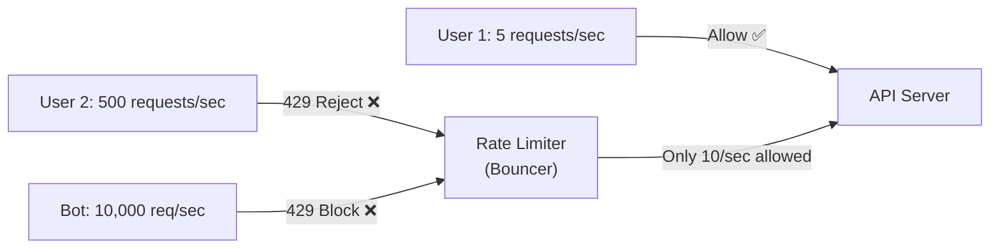
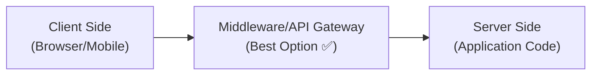
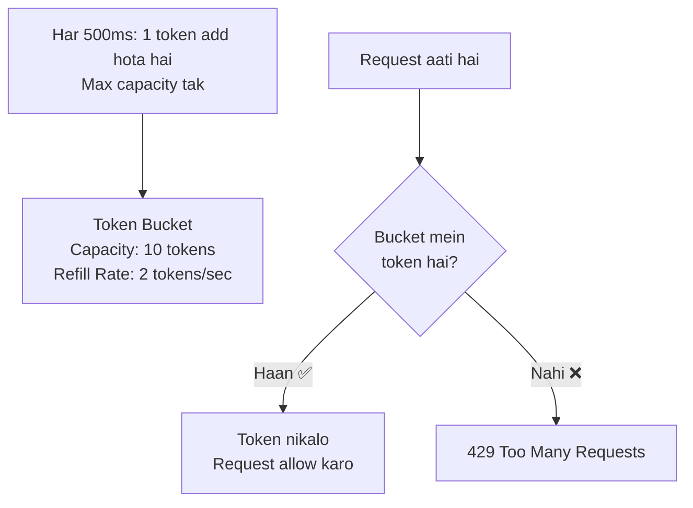
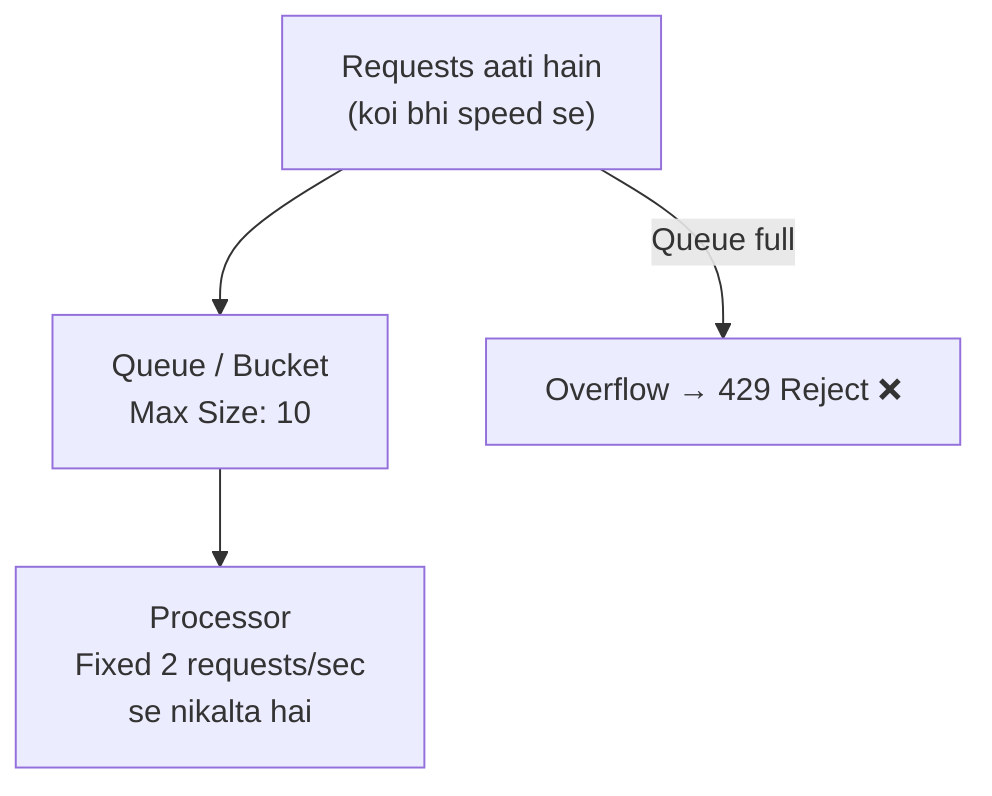
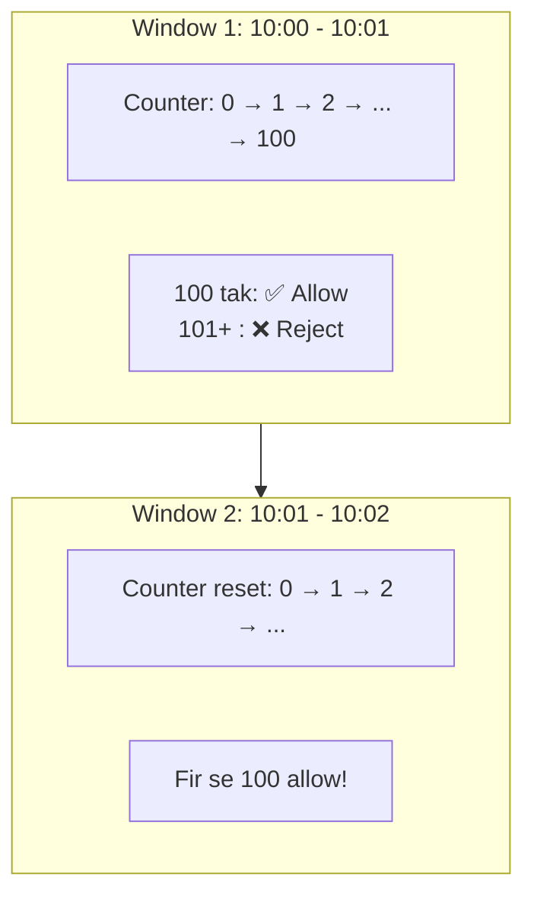
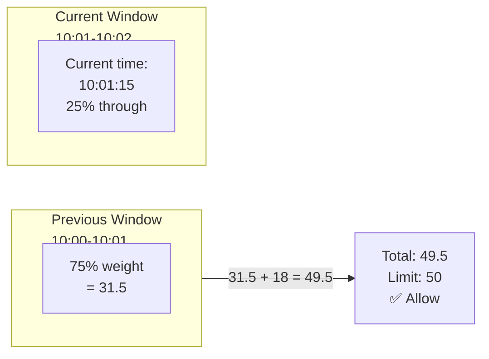
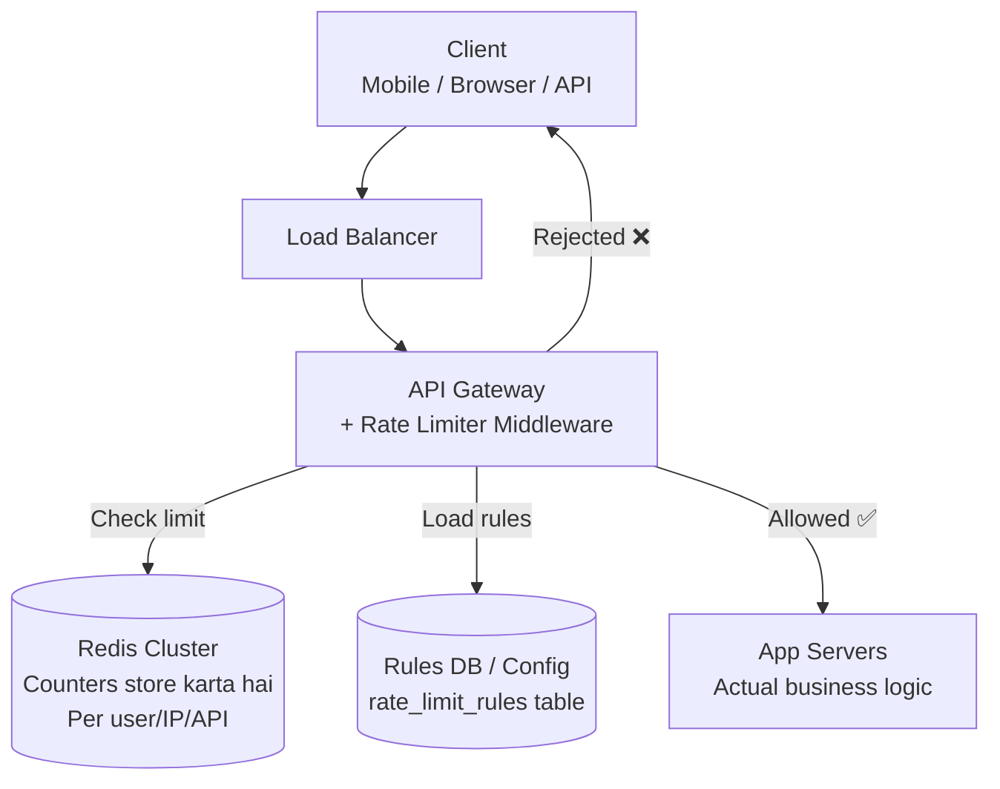
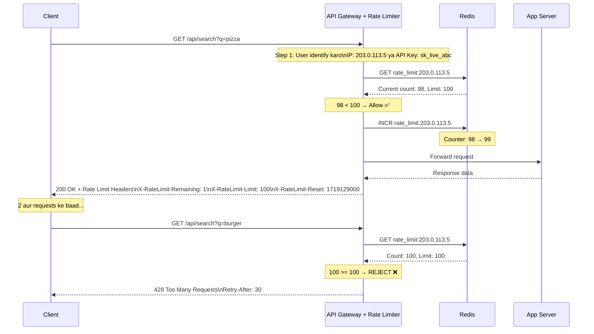
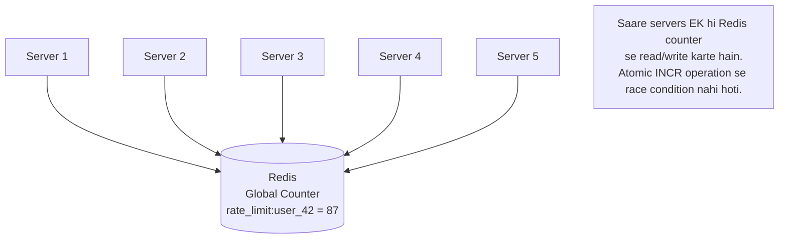
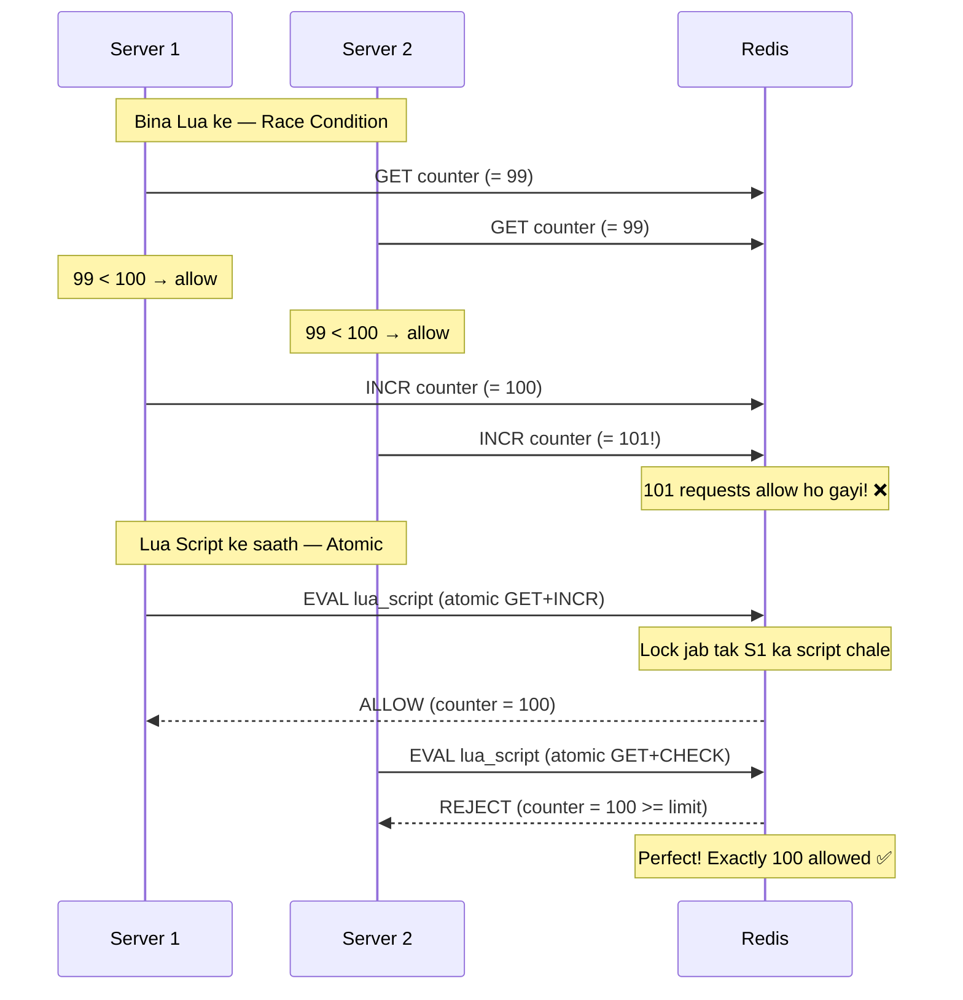

# 🚦 HLD: Rate Limiter — Poori Kahani Hinglish Mein

> **Difficulty**: Medium-Hard | **Frequency**: Bahut zyada pucha jaata hai interviews mein
> **Similar Systems**: API Gateway throttling, DDoS protection, Login attempt limiter
> **Kyun zaroori hai**: Bina rate limiter ke ek hi user ya bot tumhari poori service down kar sakta hai

---

## Table of Contents

1. [Rate Limiter Kya Hai](#rate-limiter-kya-hai)
2. [Kyun Chahiye - Real Problems](#kyun-chahiye)
3. [Kahan Lagayein - Client vs Server vs Middleware](#kahan-lagayein)
4. [Algorithm 1 - Token Bucket](#algorithm-1---token-bucket)
5. [Algorithm 2 - Leaky Bucket](#algorithm-2---leaky-bucket)
6. [Algorithm 3 - Fixed Window Counter](#algorithm-3---fixed-window-counter)
7. [Algorithm 4 - Sliding Window Log](#algorithm-4---sliding-window-log)
8. [Algorithm 5 - Sliding Window Counter](#algorithm-5---sliding-window-counter)
9. [Algorithms Ka Comparison](#algorithms-ka-comparison)
10. [High-Level Architecture](#high-level-architecture)
11. [Distributed Rate Limiting](#distributed-rate-limiting)
12. [Rate Limit Rules Ka Design](#rate-limit-rules)
13. [HTTP Response Design](#http-response-design)
14. [Real-World Examples](#real-world-examples)
15. [Edge Cases aur Tradeoffs](#edge-cases)
16. [Interview Tips](#interview-tips)

---

<a id="rate-limiter-kya-hai"></a>

## Rate Limiter Kya Hai?

**Ek line mein**: Rate limiter decide karta hai ki ek user/IP/API ko ek time period mein kitni requests karne deni hain. Limit cross ho gayi? Request reject karo — **429 Too Many Requests**.

**Analogy**: Socho ek nightclub hai. Bouncer door pe khada hai. Club mein max 100 log aa sakte hain. 101wa banda aata hai → "Sorry bhai, full hai. Baad mein aana." Ye bouncer hi rate limiter hai.



---

<a id="kyun-chahiye"></a>

## Kyun Chahiye — Real Problems Jo Solve Hoti Hain

| Problem | Bina Rate Limiter | Rate Limiter Ke Saath |
|---|---|---|
| **DDoS Attack** | 1 million requests → server crash | Limit 100 req/sec per IP → server safe |
| **Brute Force Login** | Bot tries 10,000 passwords/min | Max 5 login attempts/min → account safe |
| **API Abuse** | Free user hits API 1M times/day | Free: 100/day, Paid: 10,000/day |
| **Cost Protection** | One client triggers $50K AWS bill | Rate limit prevents runaway costs |
| **Thundering Herd** | Flash sale → 10M requests in 1 sec | Queue + throttle → orderly processing |
| **Fairness** | One greedy client hogs all resources | Equal distribution across all clients |

---

<a id="kahan-lagayein"></a>

## Kahan Lagayein — Client vs Server vs Middleware



| Option | Kahan | Accha | Bura |
|---|---|---|---|
| **Client Side** | Browser/App mein | Server load zero | Client bypass kar sakta hai! ❌ |
| **Server Side** | App code mein | Full control | Har service mein duplicate code |
| **API Gateway** ✅ | Middleware mein | Centralized, reusable | Extra hop, slight latency |

> **Interview Answer**: API Gateway mein lagao (e.g., AWS API Gateway, Kong, Nginx). Ye centralized hai, saari services ke liye ek jagah se control hota hai. Server-side bhi backup ke liye rakh sakte ho.

---

<a id="algorithm-1---token-bucket"></a>

## Algorithm 1 — Token Bucket ⭐ (Sabse Popular)

### Analogy

Socho tumhare paas ek **bucket** hai jismein tokens hain. Har request ek token khata hai. Bucket khaali? Request reject. Bucket mein tokens **fixed rate** se refill hote hain.

### Kaise Kaam Karta Hai



### Example — Dry Run

```
Config: Bucket size = 4 tokens, Refill rate = 2 tokens/sec

Time 0.0s: Bucket = [🟡🟡🟡🟡] (4 tokens, full)
  Request 1 → token use → [🟡🟡🟡] → ✅ Allow
  Request 2 → token use → [🟡🟡]   → ✅ Allow
  Request 3 → token use → [🟡]     → ✅ Allow
  Request 4 → token use → []       → ✅ Allow

Time 0.1s: Bucket = [] (khaali!)
  Request 5 → no token → ❌ REJECT (429)
  Request 6 → no token → ❌ REJECT (429)

Time 0.5s: 1 token refill hua → [🟡]
  Request 7 → token use → [] → ✅ Allow

Time 1.0s: 1 aur token refill → [🟡]
  Request 8 → token use → [] → ✅ Allow
```

### Pseudocode

```
class TokenBucket:
    capacity = 10           // Max tokens
    tokens = 10             // Currently available
    refill_rate = 2/sec     // 2 tokens per second
    last_refill_time = now()

    function allowRequest():
        // Pehle refill karo (time ke hisaab se)
        elapsed = now() - last_refill_time
        tokens_to_add = elapsed * refill_rate
        tokens = min(capacity, tokens + tokens_to_add)
        last_refill_time = now()

        // Ab check karo
        if tokens >= 1:
            tokens -= 1
            return ALLOW ✅
        else:
            return REJECT ❌
```

### Pros aur Cons

| ✅ Pros | ❌ Cons |
|---|---|
| Simple aur fast | Burst allow karta hai (poore tokens ek saath use ho sakte hain) |
| Memory efficient (2 variables per user) | Distributed setup mein synchronization chahiye |
| Burst traffic handle kar sakta hai | |

### Kaun Use Karta Hai
- **Amazon AWS** — API Gateway token bucket use karta hai
- **Stripe** — Payment API rate limiting
- **Twitter/X** — API v2 token bucket based hai

---

<a id="algorithm-2---leaky-bucket"></a>

## Algorithm 2 — Leaky Bucket

### Analogy

Socho ek **balti mein neeche chota sa ched** hai. Tum upar se paani (requests) daalte ho. Paani ched se **constant rate** se bahar niklega. Agar zyada paani daalo → balti overflow → request drop.

Fark Token Bucket se:
- **Token Bucket** → burst allow karta hai (saare tokens ek saath)
- **Leaky Bucket** → hamesha constant rate se process karta hai (FIFO queue)

### Kaise Kaam Karta Hai



### Example

```
Config: Queue size = 3, Process rate = 1 request/sec

Time 0.0s: Queue = []
  Request A arrives → Queue = [A]         → Processing A...
  Request B arrives → Queue = [A, B]
  Request C arrives → Queue = [A, B, C]   → Queue full!
  Request D arrives → ❌ REJECT (queue overflow)

Time 1.0s: A processed and removed
  Queue = [B, C]
  Request E arrives → Queue = [B, C, E]   → ✅ Allowed
```

### Kab Use Karein

- Jab tumhe **smooth, constant output** chahiye (no bursts)
- Message queues (Kafka consumer rate limiting)
- Network traffic shaping (routers mein use hota hai)

---

<a id="algorithm-3---fixed-window-counter"></a>

## Algorithm 3 — Fixed Window Counter

### Analogy

Socho har **1 minute** ka ek window hai. Har window mein max 100 requests allow hain. Counter 100 tak pahuncha? Reject. Naya minute shuru? Counter reset ho jaata hai 0 pe.

### Kaise Kaam Karta Hai



### Example — Boundary Problem

```
Config: Max 10 requests per minute

  10:00:00 ─────────────────── 10:01:00 ─────────────────── 10:02:00
  |          Window 1          |          Window 2          |
  |                            |                            |
  |                  10 reqs   | 10 reqs                    |
  |                  10:00:55  | 10:01:05                   |
  |                            |                            |

PROBLEM: Window 1 ke last 5 seconds mein 10 requests
         Window 2 ke first 5 seconds mein 10 requests
         = 10 seconds mein 20 requests! (Double the limit!)

Ye "boundary problem" hai — fixed window ka sabse bada flaw.
```

### Pros aur Cons

| ✅ Pros | ❌ Cons |
|---|---|
| Bahut simple | **Boundary problem** — window edge pe double traffic |
| Memory efficient (sirf counter + timestamp) | Not smooth |
| Fast (O(1) per request) | |

---

<a id="algorithm-4---sliding-window-log"></a>

## Algorithm 4 — Sliding Window Log

### Analogy

Ye ek **diary** jaisa hai. Har request ka timestamp note karo. Jab nai request aaye, last 1 minute ke andar kitne entries hain gino. Limit se zyada? Reject.

### Kaise Kaam Karta Hai

```
Config: Max 3 requests per minute

Request aai at 10:00:15 → Log: [10:00:15]           → Count=1 → ✅
Request aai at 10:00:30 → Log: [10:00:15, 10:00:30] → Count=2 → ✅
Request aai at 10:00:45 → Log: [10:00:15, 10:00:30, 10:00:45] → Count=3 → ✅
Request aai at 10:00:50 → Count=4 > 3 → ❌ REJECT

Time passes...

Request aai at 10:01:20 → Remove entries before 10:00:20
  → Log: [10:00:30, 10:00:45]
  → Count=2 → ek aur aa sakti hai → ✅ ALLOW
```

### Pros aur Cons

| ✅ Pros | ❌ Cons |
|---|---|
| **Exact** — boundary problem nahi | **Memory heavy** — har request ka timestamp store |
| Smooth rate limiting | Millions of users × timestamps = bahut RAM |

---

<a id="algorithm-5---sliding-window-counter"></a>

## Algorithm 5 — Sliding Window Counter ⭐ (Best Overall)

### Analogy

Ye **Fixed Window aur Sliding Log ka combination** hai. Two adjacent windows ka weighted average le lo. Memory efficient bhi aur accurate bhi.

### Kaise Kaam Karta Hai

```
Current time: 10:01:15 (15 seconds into the current window)
Previous window (10:00 - 10:01): 42 requests
Current window (10:01 - 10:02): 18 requests so far

Current position in window: 15/60 = 25% (25% of current window gone)
Previous window remaining weight: 100% - 25% = 75%

Estimated count = (Previous window × remaining weight) + Current window
                = (42 × 0.75) + 18
                = 31.5 + 18
                = 49.5

Limit = 50?  → 49.5 < 50 → ✅ ALLOW
Limit = 45?  → 49.5 > 45 → ❌ REJECT
```



### Kyun Ye Sabse Best Hai

| Feature | Fixed Window | Sliding Log | Sliding Window Counter |
|---|---|---|---|
| Memory | ✅ Low | ❌ High | ✅ Low |
| Accuracy | ❌ Boundary problem | ✅ Exact | ✅ Almost exact |
| Speed | ✅ O(1) | ❌ O(N) | ✅ O(1) |

> **Interview Tip**: Interviewer ko bolo — "Main sliding window counter use karunga kyunki ye memory efficient bhi hai aur boundary problem bhi solve karta hai."

---

<a id="algorithms-ka-comparison"></a>

## Sabhi Algorithms Ka Comparison

| Algorithm | Memory | Accuracy | Burst Allow | Use Case |
|---|---|---|---|---|
| **Token Bucket** ⭐ | ✅ 2 vars | Good | ✅ Haan | API rate limiting (AWS, Stripe) |
| **Leaky Bucket** | ✅ Queue + counter | Good | ❌ Nahi | Network traffic shaping, smooth processing |
| **Fixed Window** | ✅ 1 counter | ❌ Boundary issue | Partial | Simple internal tools |
| **Sliding Window Log** | ❌ Heavy | ✅ Exact | ❌ Nahi | Jab precision critical ho, small scale |
| **Sliding Window Counter** ⭐ | ✅ 2 counters | ✅ Almost exact | Partial | Production systems, best overall |

**Interview mein kya bolein:**
- Default answer: **Token Bucket** (simple, proven, AWS bhi use karta hai)
- Better answer: **Sliding Window Counter** (accurate + memory efficient)
- Specific case: **Leaky Bucket** jab smooth rate chahiye

---

<a id="high-level-architecture"></a>

## High-Level Architecture



### Flow Samjho



---

<a id="distributed-rate-limiting"></a>

## Distributed Rate Limiting — Sabse Hard Part

### Problem

```
Tumhare paas 5 servers hain.
Rate limit = 100 requests/minute per user.
User ne 5 alag servers ko 20-20 requests bheji.

Agar har server apna alag counter rakhega:
  Server 1: count = 20 (< 100 → allow)
  Server 2: count = 20 (< 100 → allow)
  Server 3: count = 20 (< 100 → allow)
  Server 4: count = 20 (< 100 → allow)
  Server 5: count = 20 (< 100 → allow)
  
Total: 100 requests — sab allow ho gayi! ✅
Agar 200 bheji → sab servers pe 40-40 → sab allow → 200 requests! ❌

Global limit toot gaya kyunki counters isolated hain.
```

### Solution: Redis as Central Counter Store



### Redis Commands (Token Bucket Implementation)

```
-- Lua script (atomic - Redis mein ek saath execute hota hai)

local key = "rate_limit:" .. user_id
local limit = 100
local window = 60  -- seconds

local current = redis.call("GET", key)

if current == false then
    -- Pehli request — counter shuru karo
    redis.call("SET", key, 1, "EX", window)
    return 1  -- ALLOW
end

if tonumber(current) < limit then
    -- Under limit — count badhao
    redis.call("INCR", key)
    return 1  -- ALLOW
else
    -- Over limit — reject
    return 0  -- REJECT
end
```

**Kyun Lua script?**
```
Problem: Bina Lua ke tumhe 2 separate Redis calls lagte hain:
  1. GET count
  2. INCR count
  
Dono ke beech mein doosra server bhi INCR kar sakta hai → Race condition!

Lua script Redis mein ATOMICALLY run hota hai.
Jab tak ye script chal rahi hai, koi aur command nahi chalega.
Matlab race condition impossible hai.
```

### Race Condition aur Locks



---

<a id="rate-limit-rules"></a>

## Rate Limit Rules Ka Design

### Rules Config

```yaml
# rate_limit_rules.yml

domain: messaging
descriptors:
  - key: message_type
    value: marketing
    rate_limit:
      requests_per_unit: 5
      unit: day            # 5 marketing messages/day per user

  - key: message_type  
    value: notification
    rate_limit:
      requests_per_unit: 100
      unit: hour           # 100 notifications/hour

---
domain: auth
descriptors:
  - key: action
    value: login
    rate_limit:
      requests_per_unit: 5
      unit: minute         # 5 login attempts/min (brute force protection)

  - key: action
    value: signup  
    rate_limit:
      requests_per_unit: 3
      unit: hour           # 3 signups/hour per IP (spam protection)
```

### Multi-Level Rate Limiting

```
Ek hi user pe multiple limits laga sakte ho:

Level 1: Per second  → Max 10 req/sec    (burst protection)
Level 2: Per minute  → Max 200 req/min   (sustained protection)  
Level 3: Per hour    → Max 5000 req/hr   (daily quota)
Level 4: Per day     → Max 50000 req/day (billing limit)

Request tab hi allow hogi jab SAARI levels pass karegi.
Koi bhi ek level fail → 429 Reject.
```

### Rate Limit Key Kya Hoga — User Identify Kaise?

| Key Type | Example | Kab Use Karen |
|---|---|---|
| **IP Address** | `rate_limit:ip:203.0.113.5` | Anonymous users, DDoS protection |
| **User ID** | `rate_limit:user:42` | Authenticated users |
| **API Key** | `rate_limit:apikey:sk_live_abc` | Developer APIs (Stripe, Google) |
| **IP + Endpoint** | `rate_limit:ip:203.0.113.5:/api/login` | Endpoint-specific limits |
| **User + Endpoint** | `rate_limit:user:42:/api/search` | Feature-specific throttling |

---

<a id="http-response-design"></a>

## HTTP Response Design

### Allowed Request (Under Limit)

```http
HTTP/1.1 200 OK
X-RateLimit-Limit: 100          ← Total allowed requests
X-RateLimit-Remaining: 37       ← Kitni baaki hain
X-RateLimit-Reset: 1719129060   ← Unix timestamp jab limit reset hoga
```

### Rejected Request (Over Limit)

```http
HTTP/1.1 429 Too Many Requests
Content-Type: application/json
Retry-After: 30                  ← 30 seconds baad try karo
X-RateLimit-Limit: 100
X-RateLimit-Remaining: 0
X-RateLimit-Reset: 1719129060

{
  "error": {
    "code": "RATE_LIMIT_EXCEEDED",
    "message": "Rate limit exceeded. Try again in 30 seconds.",
    "retry_after": 30
  }
}
```

> **Zaroori**: `Retry-After` header hamesha bhejo. Client ko pata chale kab retry kare — bina iske clients baar baar try karenge aur load aur badh jaayega.

---

<a id="real-world-examples"></a>

## Real-World Examples

| Company | Kya Limit Hai | Algorithm |
|---|---|---|
| **GitHub API** | Auth: 5000 req/hr, Unauth: 60 req/hr | Token Bucket |
| **Twitter/X API** | 450 read req / 15-min window, 300 write | Sliding Window |
| **Stripe API** | 100 read req/sec, 100 write req/sec | Token Bucket |
| **Google Maps** | Free: 2500 req/day, Paid: usage-based | Fixed Window |
| **Instagram** | Login: 5 attempts/min, API: varies by endpoint | Sliding Window |
| **AWS API Gateway** | 10,000 req/sec per account (adjustable) | Token Bucket |
| **Discord** | Global: 50 req/sec, DMs: 5/sec per channel | Token Bucket |
| **WhatsApp Business** | 80 messages/sec per phone number | Leaky Bucket |

---

<a id="edge-cases"></a>

## Edge Cases aur Tradeoffs

| Edge Case | Solution |
|---|---|
| **Redis down ho jaye** | Fail open (sab allow karo) ya fail closed (sab reject). Usually fail open better hai — downtime se bacha jayo |
| **User VPN se IP badal le** | IP + User ID dono se rate limit lagao |
| **Shared IP (office)** | IP-only rate limiting unfair hoga — authenticated rate limiting better |
| **Clock drift across servers** | Redis ka centralized time use karo, server local time pe depend mat karo |
| **Burst then idle** | Token bucket — burst allow karta hai tab tak tokens hain |
| **Rate limit per endpoint** | Compound key: `user_id + endpoint` |
| **Webhook retries** | Exponential backoff with jitter: 1s, 2s, 4s, 8s + random 0-1s |

### Key Tradeoffs

| Decision | Option A | Option B | Recommendation |
|---|---|---|---|
| **Algorithm** | Token Bucket | Sliding Window Counter | Use case pe depend — Token Bucket zyada popular |
| **Storage** | In-memory (per server) | Redis (centralized) | ✅ Redis (accurate across servers) |
| **Fail mode** | Fail open (allow all) | Fail closed (reject all) | ✅ Fail open (availability > strict limiting) |
| **Granularity** | Per user | Per user per endpoint | ✅ Per user per endpoint (fine control) |
| **Headers** | Custom headers | Standard X-RateLimit | ✅ Standard headers (clients samajh jaate hain) |

---

<a id="interview-tips"></a>

## Interview Tips

### Clarifying Questions Pehle Pucho
1. "Kis level pe rate limit chahiye — user, IP, API key?"
2. "Kya distributed system hai? Kitne servers?"
3. "Exact limit chahiye ya approximate chalega?"
4. "Rate limit exceed hone pe kya karna hai — reject ya queue?"
5. "Kya different endpoints ke different limits hain?"

### Jo Interviewer Ko Impress Karta Hai
- ✅ **Sliding Window Counter** ya **Token Bucket** propose karna with reasoning
- ✅ **Distributed rate limiting** ka problem explain karna (multiple servers, shared counter)
- ✅ **Redis Lua script** se race condition solve karna
- ✅ **HTTP 429 + Retry-After header** mention karna
- ✅ **Fail open vs fail closed** discuss karna
- ✅ **Multi-level rate limiting** (per sec + per min + per day)

### Common Mistakes
- ❌ Fixed Window Counter bolna bina boundary problem discuss kiye
- ❌ Rate limiting sirf client-side pe lagana
- ❌ Distributed environment mein local counters use karna
- ❌ Race condition ka solution na batana
- ❌ `Retry-After` header bhoolna

---

## Quick Summary

```
RATE LIMITER — CHEAT SHEET

Kya hai:        Bouncer jo decide kare kitni requests allow karni hain
Kyun chahiye:   DDoS protection, brute force, API abuse, cost control, fairness

Algorithms:
  Token Bucket      → Sabse popular, burst allow, AWS use karta hai
  Leaky Bucket      → Smooth output, no burst, network shaping
  Fixed Window      → Simple lekin boundary problem hai
  Sliding Log       → Exact lekin memory heavy
  Sliding Counter   → Best overall (accurate + memory efficient) ⭐

Architecture:
  API Gateway pe lagao → Redis mein counters rakho → Lua script se atomic updates
  
Distributed fix:     Redis centralized counter + Lua script (race condition prevent)
Response:            429 Too Many Requests + X-RateLimit headers + Retry-After
Fail mode:           Fail open (Redis down → allow all → availability priority)

KEY RULE: Sliding Window Counter ya Token Bucket — dono se kaam chal jaata hai.
          Redis mandatory hai distributed system mein.
```

---

*Previous: [03_Authentication_Authorization.md](./03_Authentication_Authorization.md) | Next: [06_WhatsApp.md]*
