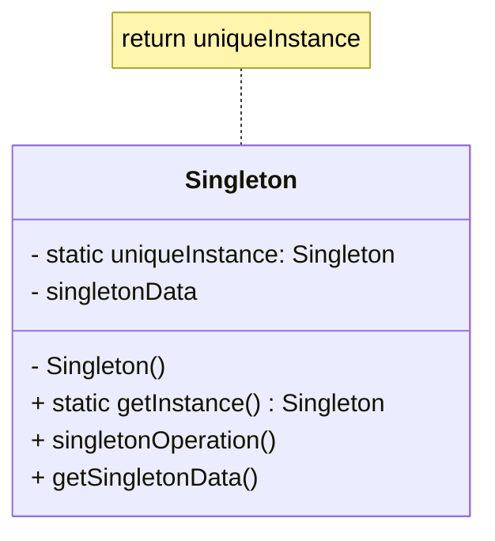

# Singleton Pattern

## Intent
Ensure a class has only one instance, and provide a global point of access to it.

## Problem
Sometimes it's important for some classes to have exactly one instance. There are many instances where there should only be a single instance, for example:
* A window manager
* A file system
* A database connection pool
* A thread pool

How do we ensure that a class has only one instance and that the instance is easily accessible? A global variable makes an object accessible, but it doesn't keep you from instantiating multiple objects.

## Solution
Make the class itself responsible for keeping track of its sole instance. The class can ensure that no other instance can be created (by intercepting requests to create new objects), and it can provide a way to access the instance.

Typically, this is achieved by:
1.  Hiding the constructor of the class (making it `private`).
2.  Providing a public static method (often named `getInstance()`) that returns a reference to the single instance of the class.

## Structure

## Real-world Use Cases
1.  **Logging Service:** An application typically has only one logging component, which writes log messages to a file. A singleton ensures that all components use the same logger, preventing issues with file locks or concurrent writes to the same log file.
2.  **Configuration Manager:** An application might read settings from a configuration file at startup. Utilizing a singleton allows the configuration to be parsed once and memory-cached, giving all modules of the application centralized access to configuration properties.
3.  **Database Connection Pool:** Creating a database connection is expensive. A connection pool manages a set of active connections. The pool itself should be a singleton so that connections are distributed centrally and limits (like a max number of connections) are strictly enforced globally.
4.  **Hardware Interface Access:** If you need to interface with hardware that has restricted concurrent access (like a single printer port on a legacy system), a singleton can act as the gatekeeper, ensuring requests to the hardware interface are serialized and managed safely.

## Implementation Details in Java
Implementing Singleton in Java involves several nuances, particularly around thread safety. Common approaches include:
*   **Eager Initialization:** Create the instance at class-loading time. Simplest but creates the instance even if not needed.
*   **Lazy Initialization:** Create the instance when `getInstance()` is first called. Needs synchronization to be thread-safe.
*   **Double-Checked Locking:** Reduces the overhead of synchronization by only checking once the instance is initialized. (Requires `volatile` keyword in Java).
*   **Bill Pugh Singleton (Static Inner Class):** The most recommended approach. Relies on the Java Virtual Machine's class loader loading behavior to ensure thread safety during initialization without requiring explicit synchronization.
*   **Enum Singleton:** Joshua Bloch's recommended way. Overcomes reflection and serialization issues inherently.

The accompanying Java code demonstrates a Thread-Safe lazy initialization with Double-Checked Locking.
