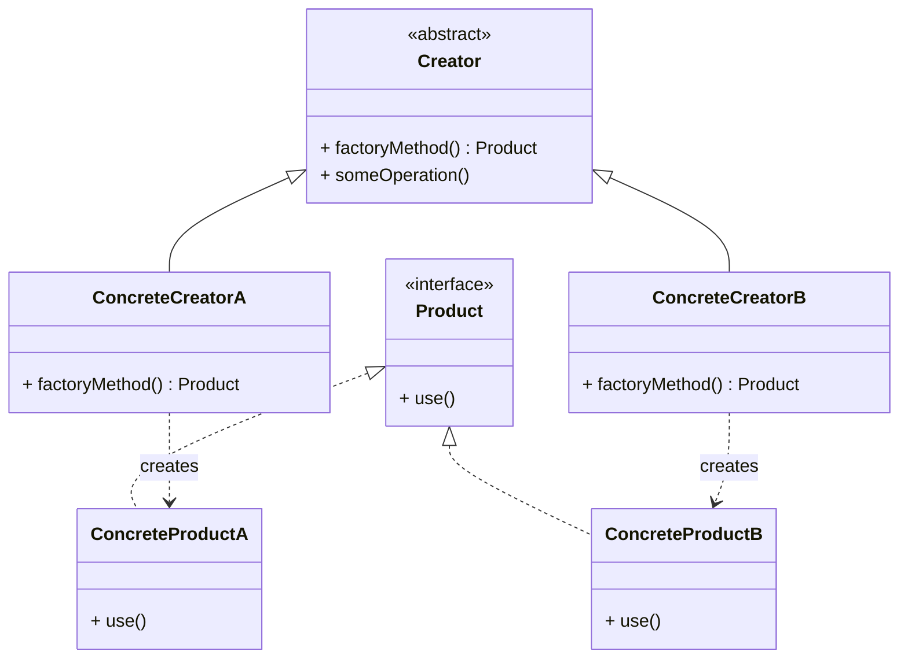

# Factory Method Pattern

## Intent
Define an interface for creating an object, but let subclasses decide which class to instantiate. Factory Method lets a class defer instantiation to subclasses.

## Problem
Imagine you're building a logistics application. Initially, your app only handles **truck** transportation, so all the business logic lives inside a `Truck` class.

Later, your app becomes popular, and now you need to incorporate **sea** logistics with `Ship`. But most of the code is tightly coupled to `Truck`. Adding `Ship` would require changes throughout the entire codebase.

## Solution
The Factory Method pattern suggests that you replace direct object construction calls (using `new`) with calls to a special *factory method*. Objects returned by a factory method are often referred to as **products**.

Subclasses can override the factory method to change the class of products being created.

## Structure

## Real-world Use Cases
1.  **Notification System:** A notification service might need to send SMS, Email, or Push notifications. Each channel has its own setup logic. A factory method lets each `NotificationCreator` subclass instantiate the right notification type without the sender needing to know the details.
2.  **Document Editors:** An application like Microsoft Office creates different document types (Word, Excel, PowerPoint). Each application overrides the factory method to create its own document type, while sharing the common "open/edit/save" workflow defined in the base class.
3.  **Payment Processing:** An e-commerce platform might support Credit Card, PayPal, and UPI gateways. A `PaymentProcessorFactory` subclass for each gateway creates the appropriate processor, while the checkout flow remains agnostic to the chosen method.
4.  **UI Frameworks:** Frameworks like Swing or JavaFX use factory methods to let developers create platform-specific UI elements (buttons, dialogs) while keeping the framework code platform-independent.

## Key Differences from Simple Factory
| Feature            | Simple Factory          | Factory Method               |
|--------------------|-------------------------|------------------------------|
| Pattern Type       | Not a GoF pattern       | GoF Creational Pattern       |
| Extensibility      | Requires modifying factory code | Add new subclass — no modification |
| Principle          | Violates Open/Closed    | Follows Open/Closed Principle |
| Responsibility     | A single class decides  | Subclasses decide            |
