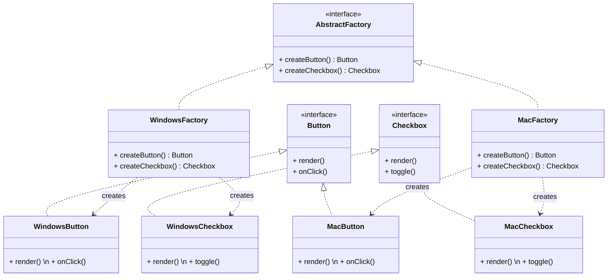

# Abstract Factory Pattern

## Intent
Provide an interface for creating **families of related or dependent objects** without specifying their concrete classes.

## Problem
Imagine you're building a cross-platform UI toolkit. You have UI elements like `Button`, `Checkbox`, and `TextField`. Each element must look and behave differently on Windows vs macOS.

If you use `new WindowsButton()` directly in your client code, you'll end up with:
*   Platform-specific coupling scattered everywhere.
*   Nightmarish conditions to handle each OS.
*   Adding a new platform (Linux) would mean touching every place that creates a UI element.

## Solution
The Abstract Factory pattern provides a way to encapsulate a group of individual factories that have a common theme. The client code works with factories and products only through their abstract interfaces — it never creates platform-specific objects directly.

**Key difference from Factory Method:**
*   **Factory Method** → one product, one factory method per subclass.
*   **Abstract Factory** → **multiple related products**, one factory per product family.

## Structure

## Real-world Use Cases
1.  **Cross-Platform UI Toolkits:** Java Swing / AWT use abstract factories under the hood so the same code renders native-looking components on different OS platforms (Windows, macOS, Linux).
2.  **Database Access Layers:** An ORM might use an abstract factory to create connection, command, and reader objects for different databases (MySQL, PostgreSQL, SQLite). Switching databases only requires changing the factory — all other code remains the same.
3.  **Theme Engines:** An application might offer "Light" and "Dark" themes. An Abstract Factory can create themed buttons, panels, and fonts. Switching themes = swapping the factory.
4.  **Game Development:** Strategy or simulation games that have multiple factions (e.g., Humans, Orcs). Each faction has its own set of units, buildings, and abilities. An abstract factory per faction produces the correct family of game objects.

## When to Use
*   Your system should be independent of how its products are created.
*   A system should be configured with one of multiple families of products.
*   A family of related product objects is designed to be used together, and you need to enforce this constraint.
