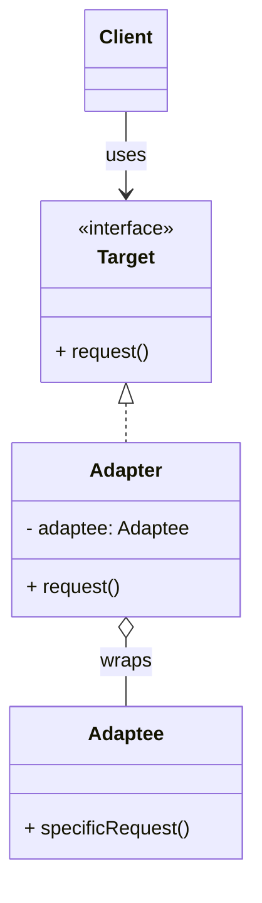

# Adapter Pattern

## Intent
Convert the interface of a class into another interface that the client expects. Adapter lets classes work together that couldn't otherwise because of incompatible interfaces.

## Problem
Imagine you're building a stock market monitoring app. The app downloads stock data from multiple sources in XML format. You decide to integrate a powerful 3rd-party analytics library — but it only accepts data in **JSON** format.

You can't modify the library (it's third-party), and changing all your data sources to produce JSON is impractical.

## Solution
You create an **adapter** — a special wrapper object that converts the interface of one object so that another object can understand it. The adapter wraps one of the objects to hide the complexity of conversion happening behind the scenes.

**Two flavors:**
*   **Object Adapter** — uses composition (wraps the adaptee). Preferred in Java because Java doesn't support multiple inheritance.
*   **Class Adapter** — uses inheritance (extends the adaptee). Possible in languages with multiple inheritance.

## Structure

## Real-world Use Cases
1.  **Legacy System Integration:** Wrapping a legacy SOAP-based web service behind a modern REST-like interface so new microservices can interact with it without understanding SOAP.
2.  **Third-party Library Integration:** Using an adapter to make a third-party payment gateway (e.g., Stripe) conform to your application's internal `PaymentProcessor` interface, so you can switch gateways by swapping adapters.
3.  **Data Format Conversion:** Converting between different data formats (XML ↔ JSON, CSV ↔ Parquet) through adapters that present a uniform data-reading interface.
4.  **java.io.InputStreamReader:** A classic JDK example — it adapts an `InputStream` (byte-based) to a `Reader` (character-based), allowing byte streams to be used where character streams are expected.

## When to Use
*   You want to use an existing class, and its interface does not match the one you need.
*   You want to create a reusable class that cooperates with unrelated or unforeseen classes.
*   You need to integrate with a third-party library without modifying its source.
