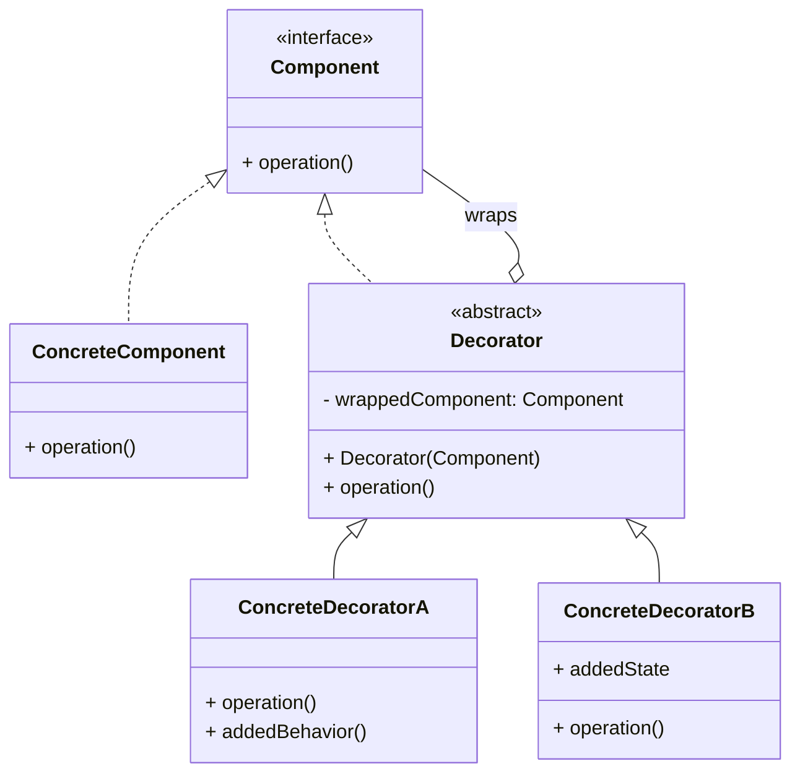

# Decorator Pattern

## Intent
Attach additional responsibilities to an object dynamically. Decorators provide a flexible alternative to subclassing for extending functionality.

## Problem
Imagine you run a coffee shop. You have a base `Coffee` class, and customers can customize their coffee by adding extras: milk, sugar, whipped cream, caramel, etc.

Using inheritance, you'd need classes like:
*   `CoffeeWithMilk`
*   `CoffeeWithSugar`
*   `CoffeeWithMilkAndSugar`
*   `CoffeeWithMilkAndSugarAndWhippedCream`
*   ...

This leads to a **class explosion** — the number of subclasses grows exponentially with each new combination.

## Solution
The Decorator pattern lets you wrap objects in other objects that add new behavior. Each wrapper (decorator) has the same interface as the wrapped object, so the client code can't tell the difference. Decorators can be stacked: wrap a coffee in a milk decorator, then wrap that in a sugar decorator.

This gives you the power of **composition over inheritance**: you combine behaviors at runtime instead of compile time.

## Structure

## Real-world Use Cases
1.  **Java I/O Streams:** The JDK's `java.io` package is the canonical example. `BufferedInputStream` decorates `FileInputStream` which decorates `InputStream`: `new BufferedInputStream(new FileInputStream("file.txt"))`. Each layer adds functionality (buffering, file access) without modifying the base.
2.  **Web Middleware / Servlet Filters:** In frameworks like Spring or Express.js, middleware/filters decorate HTTP request handlers to add logging, authentication, compression, CORS headers, etc. Each filter wraps the next one.
3.  **UI Component Enhancement:** Swing's `JScrollPane` wraps any `JComponent` to add scrollbars. `Border` decorators add visual borders. These can be stacked arbitrarily.
4.  **Logging/Monitoring Wrappers:** A `LoggingRepository` decorator wraps a `DatabaseRepository`, logging every call before delegating. A `CachingRepository` decorator wraps result caching around it — and you can stack both.

## Key Advantages
| Feature              | Inheritance               | Decorator                     |
|----------------------|---------------------------|-------------------------------|
| Flexibility          | Static (compile-time)     | Dynamic (runtime)             |
| Combinations         | Exponential class explosion | Mix-and-match at runtime    |
| Single Responsibility | One big class             | Each decorator = one concern |
| Open/Closed          | Must modify class or create subclass | Add new decorator class |
