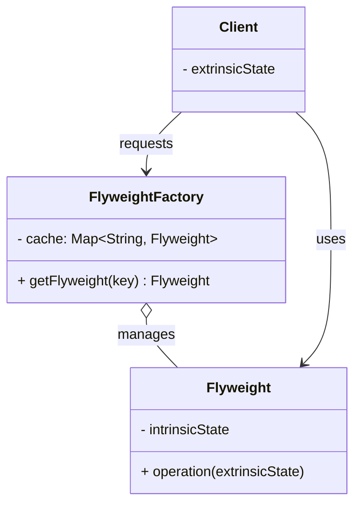

# Flyweight Pattern

## Intent
Use sharing to support large numbers of fine-grained objects efficiently. Minimize memory usage by sharing as much data as possible with similar objects.

## Problem
Imagine you're building a text editor. Each character on screen could be represented as an object with properties like: character value, font, size, color, position.

A document with 1 million characters would create 1 million objects. Each object stores the font, size, and color — which are often the **same repeated values**. This is a massive waste of memory.

## Solution
The Flyweight pattern separates object data into two kinds:

*   **Intrinsic State** — shared, immutable data that is the same across many objects. This is stored inside the flyweight. Example: the character glyph, the font family.
*   **Extrinsic State** — unique, context-dependent data that varies per usage. This is stored or computed outside the flyweight and passed in when needed. Example: the position (x, y) on the screen.

A **Flyweight Factory** ensures that flyweights are shared. When a client requests a flyweight, the factory either returns an existing one or creates a new one.

## Structure

## Real-world Use Cases
1.  **Text Editors / Word Processors:** Character glyphs are shared flyweights. The character 'a' in Times New Roman has one glyph object shared across every occurrence. Only the position on the page is extrinsic.
2.  **Game Development (Trees/Particles):** In games with vast forests, each tree type (oak, pine, birch) has a shared mesh/texture (intrinsic). The position, rotation, and scale of each tree instance are extrinsic. Same approach for particle systems.
3.  **Java's Integer/String Caching:** `Integer.valueOf()` caches instances for values -128 to 127. `String.intern()` returns a canonical representation from a pool. Both are Flyweight implementations in the JDK.
4.  **Browser Rendering (CSS):** Browsers share computed style objects across DOM elements that have identical styles. Each element's position is extrinsic; the style data is the shared flyweight.

## Key Concepts
| Term              | Description                                        | Example (Game Trees)      |
|-------------------|----------------------------------------------------|---------------------------|
| Intrinsic State   | Shared, immutable data inside the flyweight        | Tree type, mesh, texture  |
| Extrinsic State   | Unique, context-specific data passed from outside  | Position (x, y), scale   |
| Flyweight Factory | Creates/caches flyweights to ensure sharing        | TreeFactory               |

## When to Use
*   Your application uses a large number of objects.
*   Storage costs are high because of the sheer quantity of objects.
*   Most object state can be made extrinsic (moved outside the object).
*   Many groups of objects may be replaced by relatively few shared objects once extrinsic state is removed.
