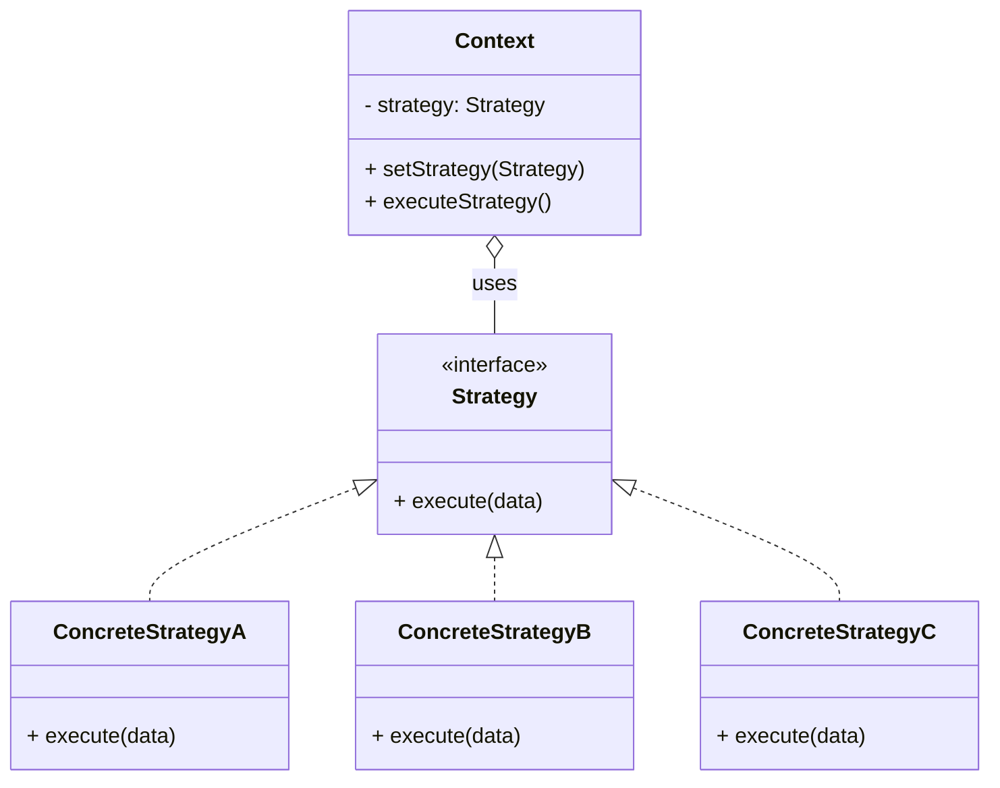

# Strategy Pattern

## Intent
Define a family of algorithms, encapsulate each one, and make them interchangeable. Strategy lets the algorithm vary independently from the clients that use it.

## Problem
Imagine you're building a navigation app. Initially, it only calculates routes for **cars**. Over time, you add walking routes, cycling routes, and public transit routes.

If all the routing logic lives in one giant class with `if-else` or `switch` statements, every new route type means modifying that class — making it bloated, fragile, and a nightmare to test.

## Solution
The Strategy pattern extracts each algorithm (routing strategy) into its own class. The original class (the **context**) stores a reference to one of the strategy objects and delegates the work to it.

The context doesn't know which concrete strategy it's working with. It interacts with all strategies through a common interface. This makes it easy to switch algorithms at runtime.

## Structure

## Real-world Use Cases
1.  **Payment Processing:** An e-commerce checkout that supports Credit Card, PayPal, and Cryptocurrency. Each payment method is a strategy. The checkout context delegates to whichever strategy the user selects at runtime.
2.  **Sorting Algorithms:** A data processing framework might use different sorting strategies (QuickSort, MergeSort, TimSort) depending on the data size and type. `java.util.Arrays.sort()` actually uses different strategies internally based on the array size.
3.  **Compression:** A file transfer application can offer different compression strategies (ZIP, GZIP, LZ4). The user or the system chooses the best one depending on the use case (speed vs. compression ratio).
4.  **Authentication:** A web application supporting multiple authentication strategies (OAuth, JWT, Basic Auth, LDAP). Each is swappable without changing the core authentication flow.
5.  **java.util.Comparator:** The classic JDK example. You pass different `Comparator` strategies to `Collections.sort()` to change the sorting behavior without modifying the sorting algorithm.

## Strategy vs State Pattern
| Feature        | Strategy                              | State                                   |
|----------------|---------------------------------------|-----------------------------------------|
| Purpose        | Swap algorithms                       | Change behavior based on internal state |
| Who decides?   | Client picks the strategy             | State transitions happen internally     |
| Awareness      | Strategies are unaware of each other  | States know about other states          |

## When to Use
*   You need different variants of an algorithm.
*   You want to avoid exposing complex, algorithm-specific data structures.
*   You need to switch algorithms at runtime.
*   You have a class with massive conditional statements that switch between algorithm variants.
