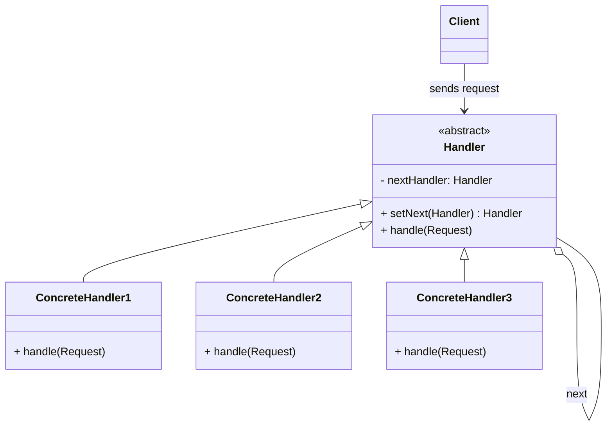

# Chain of Responsibility Pattern

## Intent
Avoid coupling the sender of a request to its receiver by giving more than one object a chance to handle the request. Chain the receiving objects and pass the request along the chain until an object handles it.

## Problem
Imagine you're building an online ordering system. You need to apply sequential checks before letting an order through:
1.  **Authentication** — Is the user logged in?
2.  **Authorization** — Does the user have permission?
3.  **Validation** — Is the order data valid?
4.  **Rate Limiting** — Has the user exceeded their quota?

If you put all these checks into a single class, it becomes a monolithic mess. Adding, removing, or reordering checks requires modifying that class every time.

## Solution
The Chain of Responsibility pattern lets you pass a request along a chain of handlers. Upon receiving a request, each handler decides either to process the request or to pass it on to the next handler in the chain.

Each handler is an independent class with a single responsibility. You build the chain by linking handlers together — and can easily reconfigure the chain at runtime.

## Structure

## Real-world Use Cases
1.  **Servlet Filters / Spring Interceptors:** In Java web applications, HTTP requests pass through a chain of filters. Each filter can preprocess the request (add CORS headers, check authentication, log, compress) or short-circuit it. The chain is configured in `web.xml` or `@Order` annotations.
2.  **Logging Frameworks (Log4j / SLF4J):** Logger hierarchies form a chain. A log message at `DEBUG` level is passed to the parent logger, which may pass it to its parent, until a logger with an appropriate level handles it.
3.  **Exception Handling:** In many languages, exceptions propagate up the call stack until caught by a `catch` block. Each method in the stack is a "handler" that either catches and handles the exception or lets it pass up.
4.  **Support Ticket Escalation:** A help desk system routes tickets: Level 1 → Level 2 → Level 3 → Manager. Each level tries to handle the request; if it can't, it escalates.
5.  **ATM / Vending Machine Dispensers:** An ATM dispenses cash through a chain of denomination handlers ($100 → $50 → $20 → $10 → $5). Each handler dispenses as many notes as possible and passes the remaining amount to the next.

## Chain of Responsibility vs Decorator
| Feature          | Chain of Responsibility                   | Decorator                               |
|------------------|-------------------------------------------|-----------------------------------------|
| Flow             | Can short-circuit (stop the chain)        | Always forwards to the wrappee          |
| Purpose          | EACH handler independently decides        | ADDS behavior, then delegates           |
| Relationship     | Handlers are independent peers            | Decorators wrap each other              |

## When to Use
*   More than one object may handle a request, and the handler isn't known a-priori.
*   You want to issue a request to one of several objects without specifying the receiver explicitly.
*   The set of handlers should be dynamically configurable.
