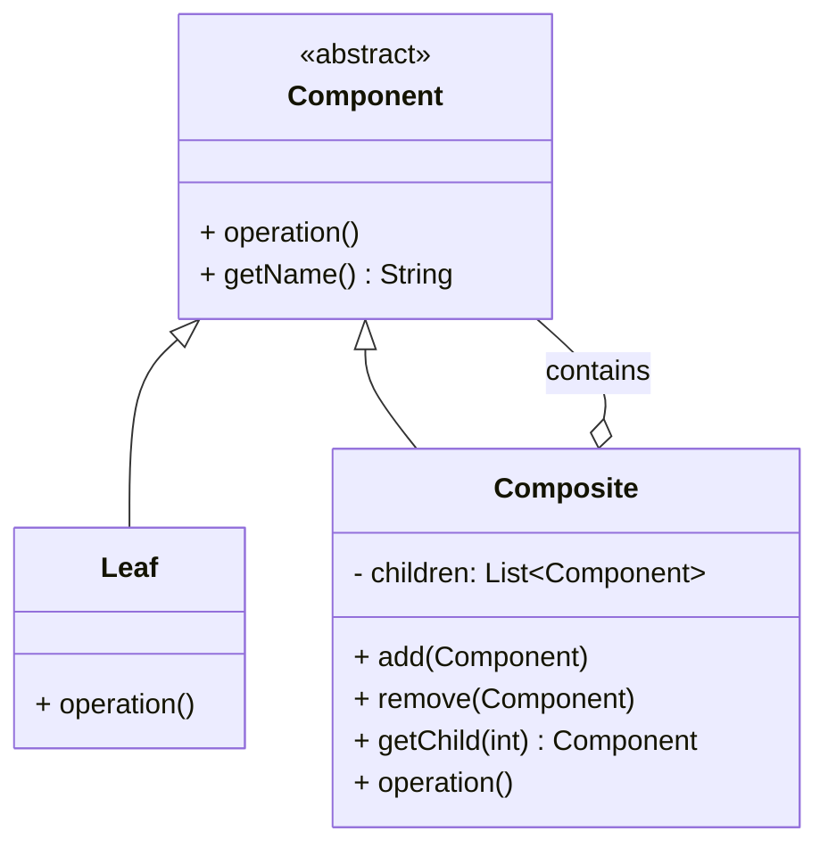

# Composite Pattern

## Intent
Compose objects into tree structures to represent part-whole hierarchies. Composite lets clients treat individual objects and compositions of objects uniformly.

## Problem
When building applications that deal with tree-structured data (file systems, UI components, organization hierarchies), you often need to work with both individual objects (leaves) and groups of objects (containers). Without a unified approach, client code is littered with type-checking:
```java
if (element instanceof File) { ... }
else if (element instanceof Directory) { ... }
```
This violates the Open/Closed Principle — every new type requires updating all client code.

## Solution
Define an abstract **Component** class that declares operations common to both simple (leaf) and complex (composite) elements. Leaf nodes implement the operations directly. Composite nodes store child components and delegate operations to them, often aggregating results.

The key insight: a **Composite** contains Components — which can be either Leaves or other Composites. This recursive structure naturally models trees.

## Structure


**Key relationships:**
- `Component` = abstract base (the common interface)
- `Leaf` = end object (no children)
- `Composite` = container (holds children, which are Components — recursive!)

## Real-world Use Cases
1. **File System:** Directories (composites) contain files (leaves) and other directories. Operations like `getSize()` work recursively — a directory's size is the sum of all its contents. This is the most classic example.
2. **UI Component Trees:** In frameworks like Swing, React, or Android, a `ViewGroup`/`Container` (composite) holds `View` components (leaves) and other containers. Layout operations (`render()`, `measure()`) propagate down the tree.
3. **Organization Chart:** A company hierarchy where a `Department` (composite) contains `Employee` objects (leaves) and sub-departments. Calculating total salary, headcount, or budget rolls up recursively.
4. **Menu Systems:** A `Menu` (composite) contains `MenuItem` objects (leaves) and sub-menus. Rendering the menu walks the tree recursively.
5. **Arithmetic Expressions:** An expression tree where `Number` is a leaf and `Operator` (like `Add`, `Multiply`) is a composite holding two sub-expressions. Calling `evaluate()` recursively computes the result.
6. **Graphics/Drawing:** Shape groups in design tools — a `Group` contains shapes and other groups. Moving/scaling a group applies the transform to all children.

## When to Use
- You need to represent **part-whole hierarchies** (trees).
- You want clients to **ignore the difference** between individual objects and compositions.
- You want operations to **propagate recursively** through the tree.

## Composite vs Other Patterns
| Pattern | Relationship |
|---------|-------------|
| **Decorator** | Both use recursive composition, but Decorator adds responsibilities to a single object; Composite aggregates multiple children. |
| **Iterator** | Can be used to traverse a Composite tree. |
| **Visitor** | Can apply operations across elements of a Composite without modifying their classes. |
| **Chain of Responsibility** | Chain links objects in a line; Composite organizes them in a tree. |

## Implementation Details in Java
The accompanying Java code demonstrates Composite using an **Organization Hierarchy** example:
- `Employee` is the abstract Component.
- `IndividualContributor` is a Leaf (developer, designer — no direct reports).
- `Manager` is a Composite (has direct reports, which are Employees — either ICs or other Managers).
- Operations like `getSalary()` and `getHeadcount()` aggregate recursively up the tree.
