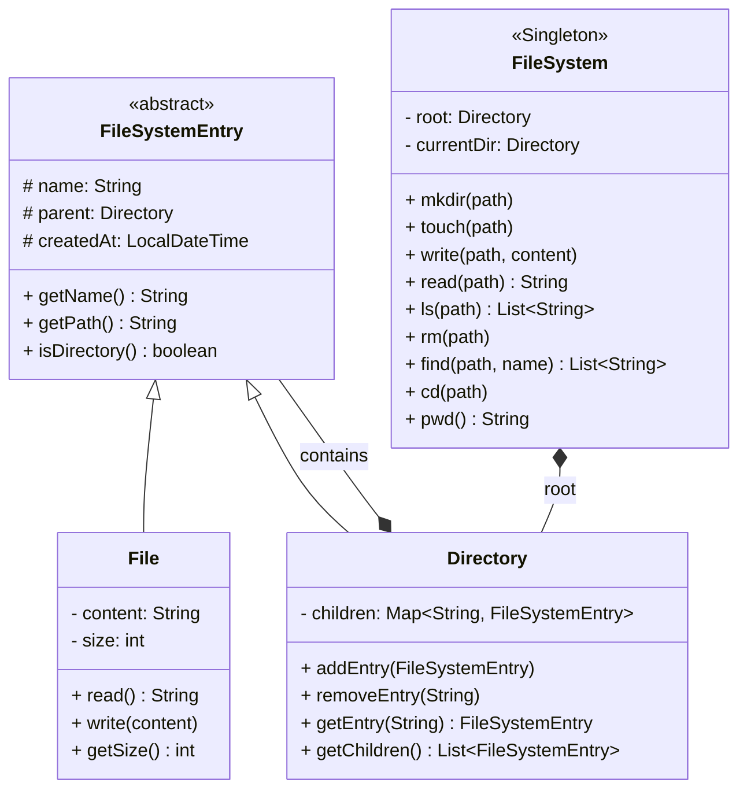

# Design In-Memory File System — Low Level Design

## Problem Statement
Design an **in-memory file system** that supports creating files and directories, reading/writing file content, listing directory contents, searching, and navigating the directory tree.

This is a classic LLD interview question. It tests your understanding of **tree data structures**, the **Composite design pattern**, and clean OOP modeling.

---

## Requirements

### Functional Requirements
1.  **`mkdir(path)`** — Create a directory (and intermediate directories if needed).
2.  **`touch(path)`** — Create an empty file.
3.  **`write(path, content)`** — Write content to a file (overwrite).
4.  **`read(path)`** — Read the content of a file.
5.  **`ls(path)`** — List contents of a directory (sorted), or return the file name if path is a file.
6.  **`rm(path)`** — Delete a file or directory (recursive).
7.  **`find(path, name)`** — Search for a file/directory by name within a subtree.
8.  **`cd(path)`** — Change current working directory.
9.  **`pwd()`** — Print current working directory.

### Non-Functional Requirements
-   Paths are Unix-style: `/home/user/docs/file.txt`
-   The root directory `/` always exists.
-   Operations should validate paths and return meaningful errors.

---

## Design Patterns Used

| Pattern | Where Applied | Why |
|---------|---------------|-----|
| **Composite** | `FileSystemEntry` → `File`, `Directory` | Treats files and directories uniformly through a common interface. A directory "contains" entries, which can be files OR other directories — the classic tree structure. |
| **Singleton** | `FileSystem` | Only one file system instance exists, providing a single root and global access point. |

---

## Core Data Structure: Tree

A file system is naturally a **tree**:
```
/  (root — Directory)
├── home/  (Directory)
│   ├── user/  (Directory)
│   │   ├── docs/  (Directory)
│   │   │   └── resume.txt  (File)
│   │   └── .bashrc  (File)
│   └── admin/  (Directory)
├── etc/  (Directory)
│   └── config.yaml  (File)
└── tmp/  (Directory)
```

-   **Directory** = internal node (has children)
-   **File** = leaf node (has content, no children)
-   Every node has a **parent** pointer (for `cd ..` and `pwd`)

---

## Class Diagram



---

## Key Interview Discussion Points

### 1. Why Composite Pattern?
The Composite pattern lets you treat `File` and `Directory` uniformly through the `FileSystemEntry` interface. Operations like `getName()`, `getPath()`, and `delete()` work the same way on both. A `Directory` contains a collection of `FileSystemEntry` objects — which can be files OR other directories. This recursive structure models the tree naturally.

**Interview follow-up:** "What if you need to add file permissions?"
→ Add a `Permissions` field to `FileSystemEntry`. Since both files and directories inherit from it, permissions apply uniformly.

### 2. Path Resolution
Resolving `/home/user/../admin/./config` requires handling:
-   `/` → root
-   `..` → parent directory
-   `.` → current directory
-   Relative vs absolute paths

This is a common follow-up question. The solution uses a **stack-based approach**: split by `/`, push non-special components, pop on `..`, skip `.`.

### 3. Thread Safety (Follow-up)
-   File read/write → `ReentrantReadWriteLock` per file
-   Directory add/remove → `ConcurrentHashMap` or synchronized methods
-   Path resolution → must be atomic (lock the traversal path)

### 4. Scalability Extensions
-   **File permissions** (rwx for owner/group/others)
-   **Soft links / hard links** (add `SymLink extends FileSystemEntry`)
-   **File size limits / quotas**
-   **Observer pattern** for file watchers (notify on change)
-   **Undo/Redo** (Command pattern for file operations)

---

## Real-world Use Cases
1.  **LeetCode #588** — Design In-Memory File System (this exact problem).
2.  **Cloud Storage (Dropbox/Google Drive)** — virtual file system stored in databases, presented as a tree to users.
3.  **IDE Project Explorer** — VS Code, IntelliJ display a virtual file tree, which is an in-memory representation of the actual file system.
4.  **Container Layers (Docker)** — overlay file systems are modeled as layered trees (UnionFS).
5.  **Version Control (Git)** — Git trees represent the file system state at each commit.
