# Apache Kafka — Complete Interview Guide for Senior Software Engineers

---

## 1. What is Apache Kafka?

**Apache Kafka** is an open-source, distributed **event streaming platform** designed for high-throughput, fault-tolerant, and low-latency real-time data pipelines and stream processing applications.

| Property | Detail |
|----------|--------|
| **Type** | Distributed commit log / event streaming platform |
| **Written in** | Scala + Java |
| **Storage** | Disk-based (sequential I/O → fast as RAM) |
| **Throughput** | Millions of messages/sec on commodity hardware |
| **Latency** | ~2–5ms end-to-end (p99) |
| **Retention** | Configurable (days, weeks, or forever) |
| **Originally by** | LinkedIn (2011), donated to Apache |

### Why Kafka Exists — The Problem It Solves

Before Kafka, companies had "data pipeline spaghetti": every service had point-to-point integrations with every other service. N services × M data consumers = N×M connections.

```
WITHOUT KAFKA (spaghetti):              WITH KAFKA (hub-and-spoke):
                                         
 S1 ─────► C1                           S1 ┐
 S1 ─────► C2                           S2 ├──► [KAFKA] ──► C1
 S1 ─────► C3                           S3 ┘               ► C2
 S2 ─────► C1                                              ► C3
 S2 ─────► C2                                              
 S3 ─────► C1    (N×M = chaos)           (N+M = clean decoupling)
```

**Key Properties (HALFT):**
1. **H**igh Throughput — millions of events/sec
2. **A**t-least-once / Exactly-once delivery
3. **L**ow Latency — millisecond end-to-end
4. **F**ault Tolerant — replication across brokers
5. **T**emporally Ordered — ordered within a partition, time-based replay

---

## 2. Core Architecture

### 2.1 Key Components

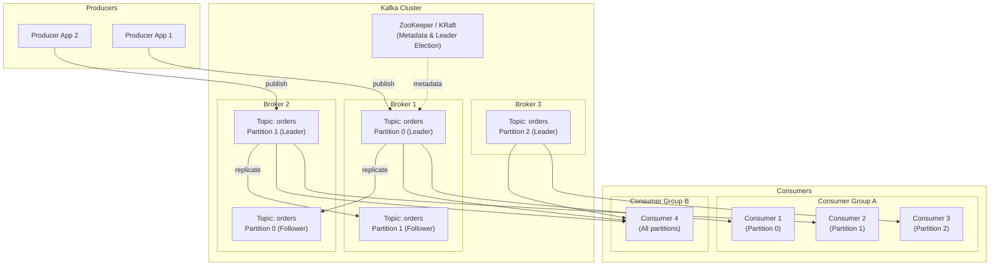

### 2.2 Component Glossary

| Component | Description |
|-----------|-------------|
| **Producer** | Application that publishes messages (records) to Kafka topics |
| **Consumer** | Application that reads and processes messages from topics |
| **Topic** | Named stream of records — like a database table but for events |
| **Partition** | Ordered, immutable log — unit of parallelism and scalability |
| **Offset** | Unique sequential ID of a record within a partition |
| **Broker** | A single Kafka server that stores partitions and serves clients |
| **Cluster** | Multiple brokers working together |
| **Consumer Group** | Set of consumers sharing the work of consuming a topic |
| **ZooKeeper / KRaft** | Distributed coordination for metadata & leader election |
| **ISR** | In-Sync Replicas — replicas that are fully caught up with the leader |

---

## 3. Topics, Partitions, and Offsets

### 3.1 Topic Anatomy

A **Topic** is a category/feed name to which records are published. Topics are **append-only** logs.

```
Topic: "orders"  (3 partitions, replication factor 2)

Partition 0:  [0][1][2][3][4][5][6]  ← HEAD (new writes here)
                         ↑
                    Consumer offset

Partition 1:  [0][1][2][3][4]
Partition 2:  [0][1][2][3][4][5]
```

### 3.2 Partition — Unit of Parallelism

- Each partition is an **ordered, immutable sequence** of records.
- Each record gets an **offset** (monotonically increasing integer per partition).
- Partitions allow **parallel reads and writes** — more partitions = more throughput.
- A partition lives on exactly **one broker** at a time (its leader).

### 3.3 Offset — Consumer's Bookmark

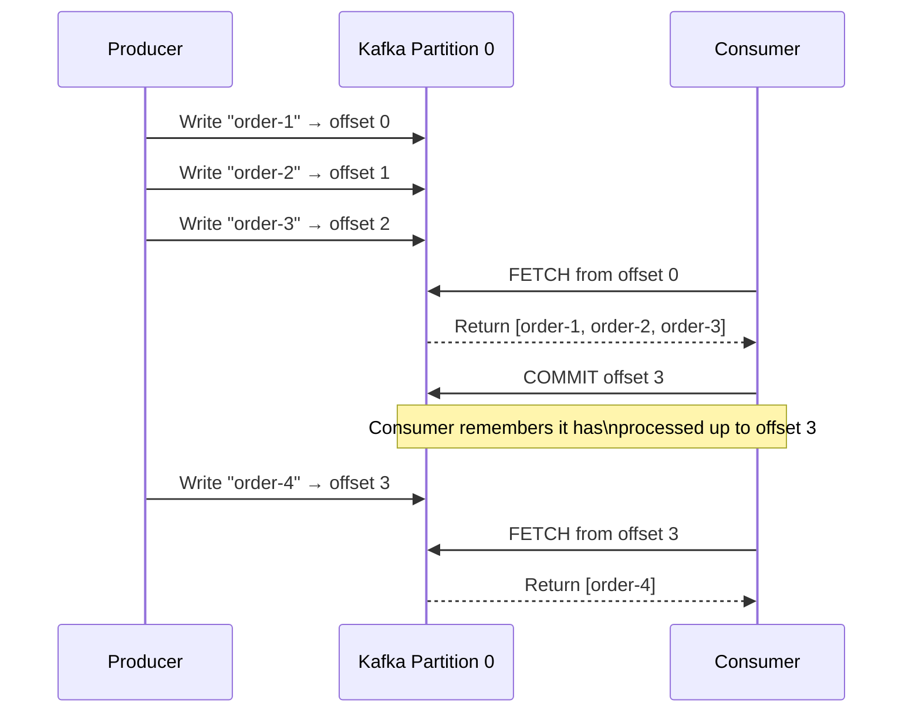

### 3.4 How Many Partitions?

| Factor | Guidance |
|--------|----------|
| **Throughput** | `partitions = target_throughput / single_partition_throughput` |
| **Consumers** | Max parallelism = number of partitions (can't have more consumers than partitions in a group) |
| **Rebalancing** | More partitions = longer rebalance time |
| **Rule of thumb** | Start with 3–10 per topic; increase based on monitoring |

> ⚠️ **You cannot decrease partitions** once a topic is created (only increase).

---

## 4. Producers Deep Dive

### 4.1 Producer Architecture

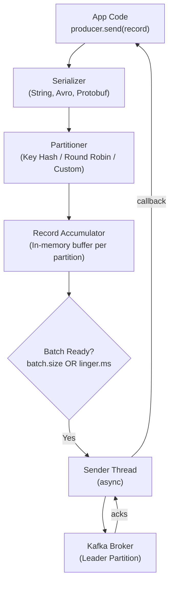

### 4.2 Key Producer Configs

| Config | Default | Description |
|--------|---------|-------------|
| `acks` | `1` | `0` = fire-and-forget, `1` = leader-only, `all`/`-1` = all ISR replicas |
| `retries` | `MAX_INT` | How many times to retry on failure |
| `retry.backoff.ms` | `100ms` | Wait between retries |
| `batch.size` | `16KB` | Max bytes per batch per partition |
| `linger.ms` | `0ms` | Wait this long to fill a batch before sending |
| `compression.type` | `none` | `gzip`, `snappy`, `lz4`, `zstd` |
| `max.block.ms` | `60sec` | How long to wait if buffer is full |
| `buffer.memory` | `32MB` | Total buffer size for all batches |
| `enable.idempotence` | `false` | Exactly-once semantics for producer |

### 4.3 Delivery Semantics (Producer)

| `acks` | Risk | Use Case |
|--------|------|----------|
| `0` | **At-most-once** — message may be lost | Metrics, logs where loss is OK |
| `1` | Leader ack only — message lost if leader crashes before replication | General use |
| `all` | **At-least-once** — no data loss | Financial transactions, inventory |

### 4.4 Partitioning Strategy

```
ProducerRecord with KEY:
  partition = hash(key) % numPartitions
  → Same key always goes to same partition
  → Ordering guaranteed for a key

ProducerRecord without KEY:
  Round-robin (or sticky partitioner since Kafka 2.4)
  → No ordering guarantee
```

---

## 5. Consumers Deep Dive

### 5.1 Consumer Groups — The Key Concept

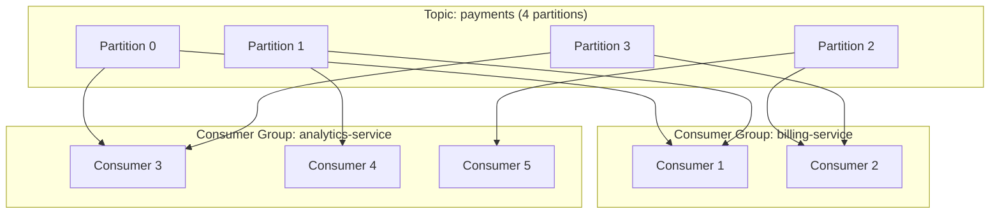

**Rules:**
- **One partition is consumed by exactly one consumer within a group** (no duplication within group).
- **Multiple groups** can consume the same topic independently (broadcast).
- If consumers > partitions → some consumers are **idle**.
- If consumers < partitions → one consumer handles **multiple partitions**.

### 5.2 Consumer Group Rebalancing

When a consumer joins or leaves, Kafka rebalances partition assignments:

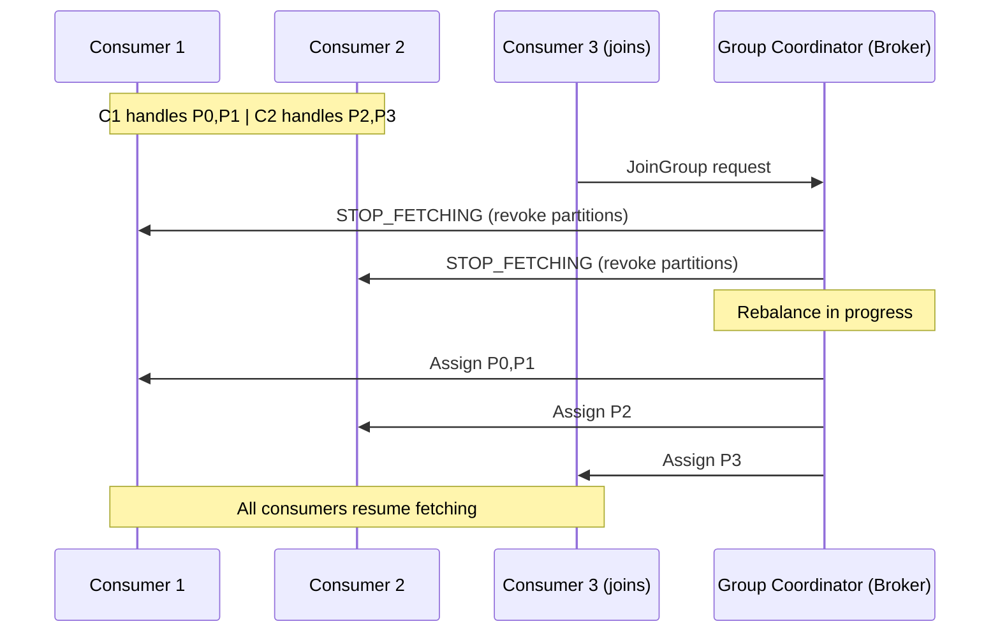

**Impact:** Rebalancing causes a **consumer stop-the-world** pause. Minimize by:
- Using `session.timeout.ms` and `heartbeat.interval.ms` tuning.
- Using **Static Group Membership** (`group.instance.id`) — restoring consumers to previous partitions without full rebalance.
- Using **Cooperative Rebalancing** (incremental) — only reassigns affected partitions.

### 5.3 Key Consumer Configs

| Config | Default | Description |
|--------|---------|-------------|
| `group.id` | (required) | Consumer group identifier |
| `auto.offset.reset` | `latest` | `earliest` (replay all), `latest` (only new msgs), `none` (error) |
| `enable.auto.commit` | `true` | Auto-commit offsets periodically |
| `auto.commit.interval.ms` | `5000ms` | How often to auto-commit |
| `max.poll.records` | `500` | Max records returned per poll() call |
| `max.poll.interval.ms` | `300sec` | Max time between poll() calls before consumer is kicked |
| `fetch.min.bytes` | `1` | Min data to return in a fetch (reduces requests) |
| `fetch.max.wait.ms` | `500ms` | Max wait if not enough data (see fetch.min.bytes) |
| `session.timeout.ms` | `10sec` | Consumer considered dead after this (triggers rebalance) |

### 5.4 Offset Management

```
At-Most-Once:  Commit BEFORE processing → if crash after commit, message is skipped.
At-Least-Once: Commit AFTER processing  → if crash after process but before commit, message is reprocessed.
Exactly-Once:  Use Kafka Transactions or idempotent consumers.
```

---

## 6. Brokers, Replication, and ISR

### 6.1 Broker Responsibilities

Each broker:
- Stores partitions assigned to it (as log files on disk).
- Serves producer write requests for **leader** partitions.
- Serves consumer read requests for **leader** partitions.
- Replicates data to/from other brokers for **follower** partitions.
- Communicates with ZooKeeper/KRaft for metadata.

### 6.2 Leader and Followers

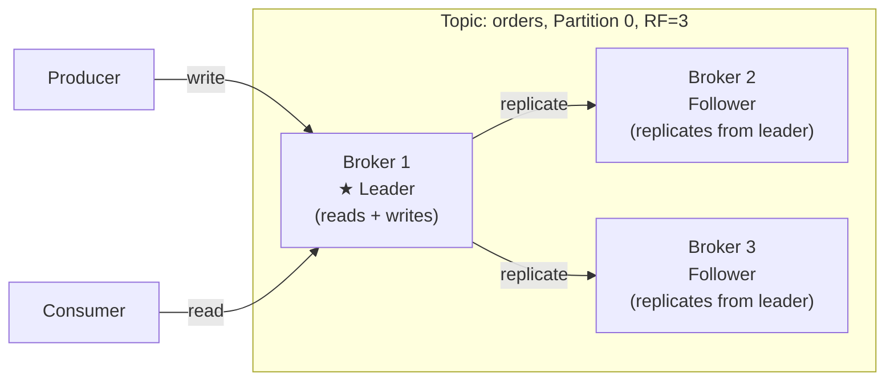

### 6.3 In-Sync Replicas (ISR)

**ISR** = replicas that are "caught up" with the leader (within `replica.lag.time.max.ms`).

```
replica.lag.time.max.ms = 30000ms (default)
ISR = {Broker1 (leader), Broker2, Broker3}

If Broker3 falls behind by > 30s:
ISR = {Broker1, Broker2}   ← Broker3 removed from ISR

min.insync.replicas = 2  → Producer with acks=all must get ack from 2 ISR replicas.
```

### 6.4 Leader Election Flow

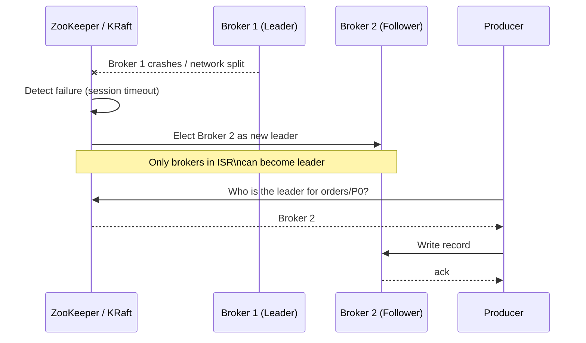

### 6.5 Replication Factor Guidelines

| RF | Guarantees | Typical Use |
|----|-----------|-------------|
| 1 | No fault tolerance | Dev/test only |
| 2 | Tolerates 1 broker failure | Low-priority topics |
| 3 | Standard production choice | Most topics |
| 5 | High durability | Financial / audit logs |

---

## 7. ZooKeeper vs KRaft

### ZooKeeper Mode (Legacy, Kafka < 3.0 default)

ZooKeeper stores:
- Broker registration (who's alive)
- Topic configurations (partition count, RF)
- Partition leader assignments
- ACLs and quotas
- Controller election

**Pain points:** External dependency, scaling limits at ~200K partitions, slower restarts.

### KRaft Mode (Kafka 3.3+ default, Kafka 4.0 required)

Kafka now uses its own **Raft-based consensus** protocol:

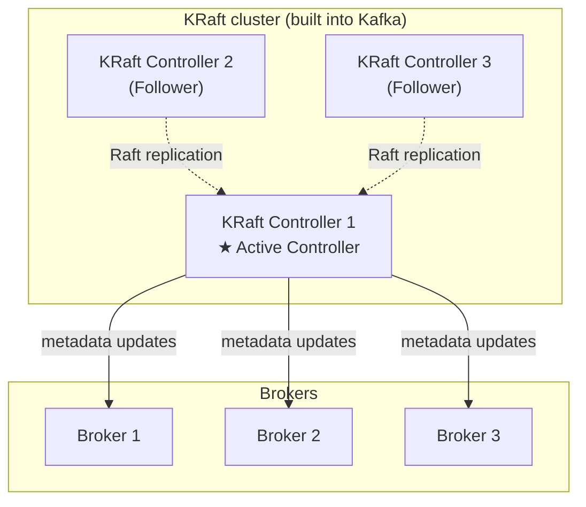

**KRaft advantages:**
- No external ZooKeeper dependency
- Supports millions of partitions (vs ~200K)
- Faster broker startup and failover

---

## 8. Storage Layer — Why Kafka Is Fast on Disk

### 8.1 Log Storage Structure

```
/kafka-logs/
  orders-0/          ← Topic: orders, Partition 0
    00000000000000000000.log      ← Segment log (messages)
    00000000000000000000.index    ← Sparse offset index
    00000000000000000000.timeindex← Time-based index
    00000000000000001000.log      ← Next segment (rolled after 1GB default)
    ...
  orders-1/          ← Topic: orders, Partition 1
  payments-0/
```

### 8.2 Why Sequential I/O Is Fast

| Operation | HDD Speed | SSD Speed |
|-----------|-----------|-----------|
| Random read/write | ~150 IOPS | ~75,000 IOPS |
| **Sequential read/write** | **~10,000 IOPS** | **~500,000 IOPS** |

Kafka **ONLY does sequential writes** (append-only log). This is why it achieves throughput comparable to RAM.

### 8.3 Zero-Copy Transfer (`sendfile`)

When a consumer reads data, traditional flow:
```
Disk → Kernel Buffer → User Space → Kernel Socket Buffer → Network
         (2 copies in RAM + 2 context switches)
```

Kafka uses the OS `sendfile()` syscall:
```
Disk → Kernel Buffer ─────────────────────► Network
         (0 copies in user space — "zero-copy")
```

> This is why Kafka can serve 1M+ messages/sec from a single broker.

### 8.4 Log Compaction

Two retention strategies:

| Strategy | Behavior | Config | Use Case |
|----------|----------|--------|----------|
| **Delete** | Remove segments older than retention period | `cleanup.policy=delete` | Event logs (time window) |
| **Compact** | Keep only the latest record per key | `cleanup.policy=compact` | Database change log (CDC), config topics |

```
Log Compaction — before:
[k=userA, v=alice] [k=userB, v=bob] [k=userA, v=alice2] [k=userC, v=carol]

Log Compaction — after:
[k=userA, v=alice2] [k=userB, v=bob] [k=userC, v=carol]
         ↑ old value removed, latest kept
```

---

## 9. Kafka Delivery Guarantees

### 9.1 Three Levels of Delivery

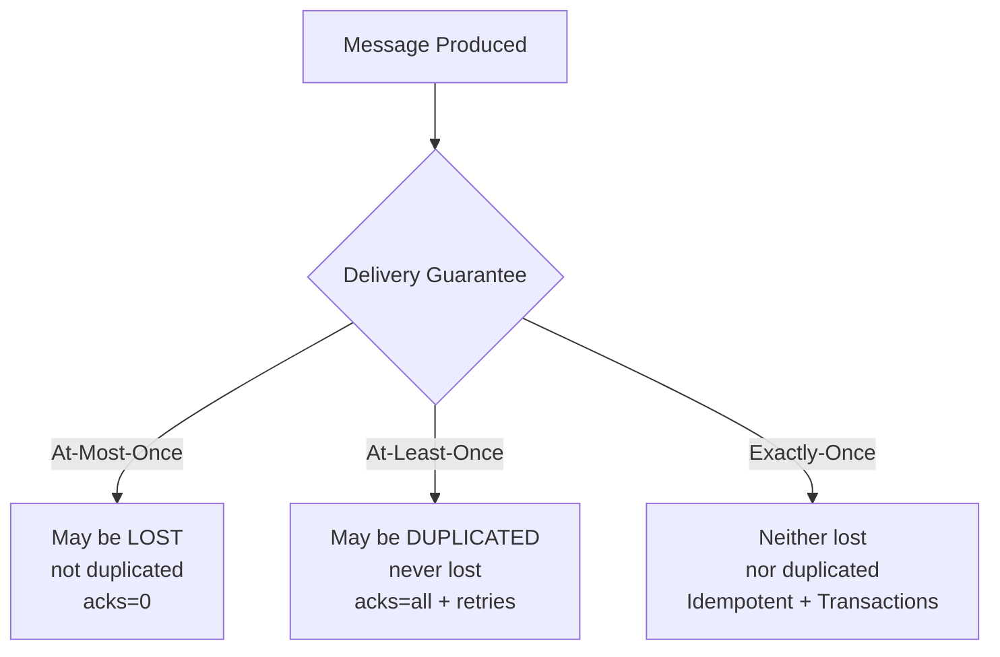

### 9.2 Exactly-Once Semantics (EOS)

Requires two components:

**1. Idempotent Producer** (`enable.idempotence=true`):
- Kafka assigns a `Producer ID (PID)` and `sequence number` to each record.
- If a duplicate (retry) arrives, the broker deduplicates based on PID + sequence.

**2. Kafka Transactions** (for read-process-write):
```java
producer.initTransactions();
try {
    producer.beginTransaction();
    // Read from Kafka, process, write to Kafka
    producer.send(new ProducerRecord<>("output-topic", key, result));
    producer.sendOffsetsToTransaction(offsets, consumerGroupMetadata);
    producer.commitTransaction();
} catch (Exception e) {
    producer.abortTransaction();
}
```

---

## 10. Kafka Streams and KSQL

### 10.1 Kafka Streams

A **lightweight Java library** for building real-time stream processing applications:

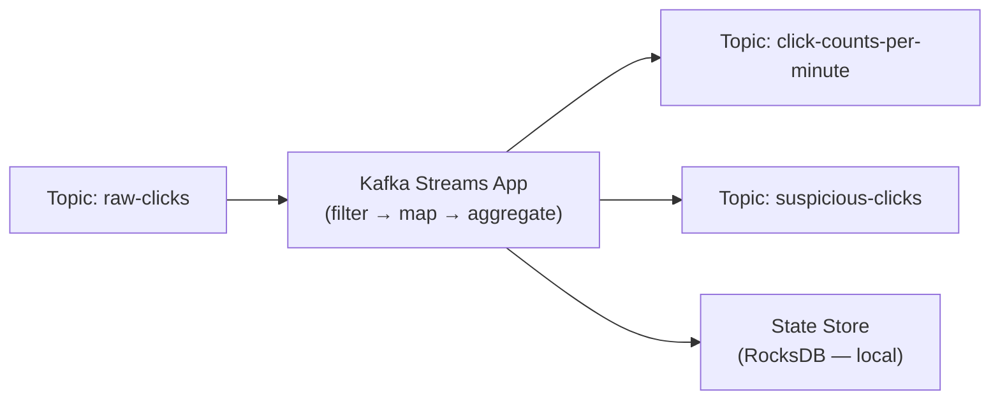

**Key Abstractions:**
- `KStream` — unbounded stream of records
- `KTable` — changelog stream, represents the latest value per key
- `GlobalKTable` — like KTable but replicated to all instances
- `StreamsBuilder` — DSL for building topologies

### 10.2 KSQL / ksqlDB

SQL interface on top of Kafka Streams:
```sql
-- Create a stream
CREATE STREAM orders (
  order_id VARCHAR, user_id VARCHAR, amount DOUBLE
) WITH (KAFKA_TOPIC='orders', VALUE_FORMAT='JSON');

-- Query: orders over $100
SELECT user_id, SUM(amount) FROM orders
WHERE amount > 100
WINDOW TUMBLING (SIZE 1 HOUR)
GROUP BY user_id EMIT CHANGES;
```

---

## 11. Kafka Connect

Framework for **integrating Kafka with external systems** (databases, S3, Elasticsearch, etc.) without writing custom code.

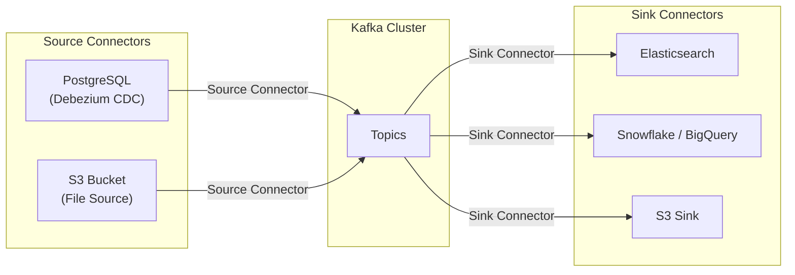

---

## 12. Schema Registry (Confluent)

Without a schema contract, a producer can change message format and break consumers.

```
Producer sends:  {"userId": 42, "name": "Alice"}
Consumer reads:  {"userId": 42, "name": "Alice"}  ✅

Producer changes format: {"user_id": 42, "fullName": "Alice"}  (renamed fields!)
Consumer reads: {"user_id": ??, "fullName": ??}  ❌ BROKEN
```

**Schema Registry** enforces schema evolution rules:

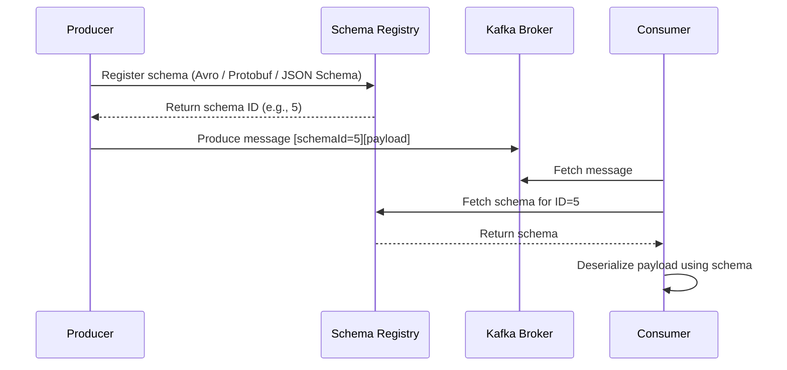

**Backward Compatibility:** New schema can read old messages.
**Forward Compatibility:** Old schema can read new messages.

---

## 13. Key Kafka Patterns & Use Cases

### 13.1 Event Sourcing

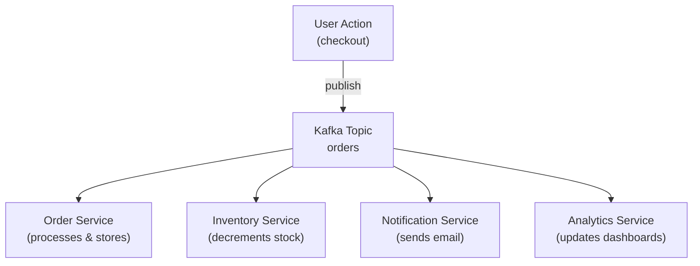

All services react to the same event independently. No coupling. Add a new service = subscribe to the topic.

### 13.2 CQRS + Event Sourcing

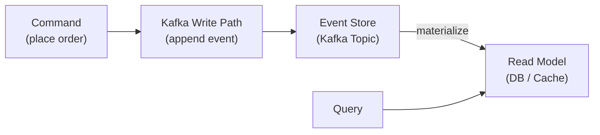

### 13.3 Change Data Capture (CDC)

Stream database changes to Kafka using Debezium:

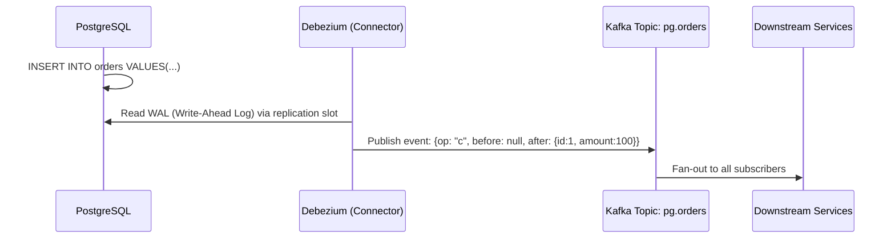

### 13.4 Saga Pattern (Distributed Transactions)

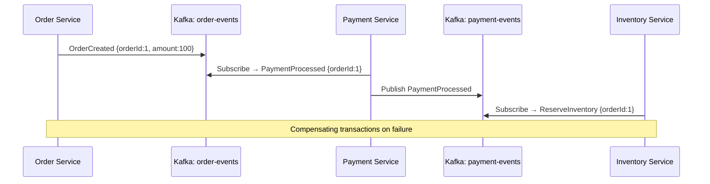

---

## 14. Monitoring & Operations

### 14.1 Key Metrics to Monitor

| Category | Metric | Alert Threshold |
|----------|--------|-----------------|
| **Producer** | `record-error-rate` | > 0 |
| **Producer** | `request-latency-avg` | > 100ms |
| **Consumer** | `records-lag-max` | > 1000 (per topic) |
| **Consumer** | `rebalance-rate-per-hour` | > 1 |
| **Broker** | `UnderReplicatedPartitions` | > 0 |
| **Broker** | `OfflinePartitionsCount` | > 0 |
| **Broker** | `ActiveControllerCount` | != 1 |
| **Broker** | `BytesInPerSec /BytesOutPerSec` | Tune per capacity |
| **JVM** | GC pause time | > 1sec |

### 14.2 Consumer Lag

**Consumer lag** = latest offset − committed offset per partition

```
Producer offset: 10000
Consumer offset:  9500
Lag:              500 records behind
```

High lag = consumer is too slow → scale up consumers (add partitions too).

### 14.3 Common Operations

```bash
# List topics
kafka-topics.sh --bootstrap-server localhost:9092 --list

# Create topic
kafka-topics.sh --bootstrap-server localhost:9092 \
  --create --topic orders --partitions 6 --replication-factor 3

# Describe topic (see ISR, leaders)
kafka-topics.sh --bootstrap-server localhost:9092 --describe --topic orders

# Consume from beginning
kafka-console-consumer.sh --bootstrap-server localhost:9092 \
  --topic orders --from-beginning --group test-group

# Check consumer group lag
kafka-consumer-groups.sh --bootstrap-server localhost:9092 \
  --describe --group billing-service

# Reset offsets (replay)
kafka-consumer-groups.sh --bootstrap-server localhost:9092 \
  --group billing-service --topic orders --reset-offsets \
  --to-earliest --execute
```

---

## 15. Kafka vs Alternatives

| Feature | Kafka | RabbitMQ | SQS | Redis Streams | Pulsar |
|---------|-------|----------|-----|---------------|--------|
| **Model** | Pull (consumer polls) | Push (broker pushes) | Pull | Pull | Pull |
| **Throughput** | Millions/sec | Thousands/sec | Thousands/sec | Hundreds K/sec | Millions/sec |
| **Retention** | Days/weeks/forever | Until consumed | 14 days max | Configurable | Tier storage |
| **Ordering** | Per partition | Per queue | No (standard SQS) | Per stream | Per partition |
| **Consumer groups** | Yes | Competing consumers | No native | Yes | Yes |
| **Replay** | Yes | No | No | Yes | Yes |
| **Schema** | Schema Registry | No | No | No | Yes (Pulsar Schema) |
| **Ops complexity** | High | Medium | Low (managed) | Low | High |
| **Best for** | Event streaming, CDC, analytics | Job queues, RPC | Serverless AWS jobs | Lightweight streaming | Multi-tenant cloud |

---

## 16. Interview Questions & Detailed Answers

### Q1: "How does Kafka guarantee message ordering?"

> **Answer:**
> Kafka guarantees **strict ordering within a partition**, but **NOT across partitions**.
>
> - All messages with the **same key** go to the same partition (via `hash(key) % partitions`).
> - Within a partition, records are appended sequentially and read in order.
> - If you need global ordering (e.g., all events for a user), use a **single partition** or partition by user ID.
>
> **Trade-off:** 1 partition = no parallelism. Solution: shard by business key (user_id, order_id) to parallelize while maintaining per-entity ordering.

---

### Q2: "Explain the difference between at-least-once and exactly-once in Kafka."

> | | At-Least-Once | Exactly-Once |
> |-|--------------|--------------|
> | **Config** | `acks=all` + retries | `enable.idempotence=true` + Transactions |
> | **Duplicate risk** | Yes (on retry) | No |
> | **Data loss risk** | No | No |
> | **Performance** | Good | 5–10% overhead |
> | **Use case** | Metrics, logs | Payments, inventory |
>
> For **exactly-once** in a Streams app: set `processing.guarantee=exactly_once_v2` (Kafka 2.5+).

---

### Q3: "What happens when a broker goes down?"

> 1. Brokers in the cluster detect failure via ZooKeeper/KRaft session timeout.
> 2. The **Controller** (special broker) detects which partitions lost their leader.
> 3. For each orphaned partition, the controller picks a new leader from the **ISR** list.
> 4. All producers/consumers get `LeaderNotAvailableException` → they retry and discover the new leader via metadata refresh.
> 5. If `min.insync.replicas` is satisfied in the ISR, writes continue. Otherwise, producers with `acks=all` get errors.
>
> **Recovery time:** ~10–30 seconds with default configs. Tune `replica.lag.time.max.ms` and `num.replica.fetchers`.

---

### Q4: "How would you design a Kafka-based order processing system?"

> ```mermaid
> graph TD
>     OA["Order API"] -->|"OrderPlaced"| OT["Topic: orders\n(partitioned by order_id)"]
>     OT --> PS["Payment Service\n(Consumer Group: payment-cg)"]
>     PS -->|"PaymentProcessed / Failed"| PT["Topic: payments"]
>     PT --> IS["Inventory Service\n(Consumer Group: inventory-cg)"]
>     IS -->|"InventoryReserved / OutOfStock"| IT["Topic: inventory"]
>     IT --> NS["Notification Service\n(Consumer Group: notification-cg)"]
>     IT --> AS["Analytics Service\n(Consumer Group: analytics-cg)"]
> ```
>
> **Key decisions:**
> - Partition by `order_id` → ensures all events for an order are processed in order.
> - `acks=all`, `min.insync.replicas=2` → no data loss.
> - Dead Letter Queue (DLQ) topic for poison pill messages.
> - Idempotent consumers (check if event already processed before acting).
> - Schema Registry with Avro for evolution-safe messaging.

---

### Q5: "What is consumer lag and how do you fix it?"

> **Consumer lag** = how far behind a consumer is from the latest message.
>
> **Diagnosis:**
> ```bash
> kafka-consumer-groups.sh --describe --group billing-service
> # Shows LAG per partition
> ```
>
> **Root causes and fixes:**
> | Cause | Fix |
> |-------|-----|
> | Consumer processing too slow | Optimize processing logic; add parallelism |
> | Too few consumers | Add more consumers (up to partition count) |
> | Too few partitions | Increase partitions + consumers |
> | Consumer crashes + rebalancing too frequent | Tune session.timeout.ms, max.poll.interval.ms |
> | Large message size | Increase fetch.max.bytes, enable compression |

---

### Q6: "How do you handle poison pill messages (messages that always fail processing)?"

> A "poison pill" is a message that crashes your consumer, causing infinite retry loops.
>
> **Solutions:**
> 1. **Dead Letter Queue (DLQ):** Catch exceptions → publish failed message to `topic-name.DLQ` → continue processing.
> 2. **Retry topic with backoff:** `topic → topic.retry.1 → topic.retry.2 → topic.DLQ`
> 3. **Skip on max retries:** Commit offset after N failures.
>
> ```java
> try {
>     process(record);
> } catch (Exception e) {
>     if (retryCount >= MAX_RETRIES) {
>         producer.send(new ProducerRecord<>(record.topic() + ".DLQ", record.key(), record.value()));
>     } else {
>         // retry via retry topic
>         retryProducer.send(new ProducerRecord<>(record.topic() + ".retry", record.key(), record.value()));
>     }
> }
> ```

---

### Q7: "Explain Kafka's log compaction. When would you use it?"

> **Log compaction** retains the **last known value for each key**, effectively making the log a compacted snapshot.
>
> ```
> Before compaction (key=A has 3 versions):
> [A:v1] [B:v1] [A:v2] [C:v1] [A:v3] [B:v2]
>
> After compaction:
>                              [A:v3]         [B:v2] [C:v1]
> ```
>
> **Use cases:**
> - **Database CDC topics** — replicate DB state; consumers can rebuild state by replaying.
> - **Config topics** — store latest config per service.
> - **User profile topics** — latest user state.
>
> **NOT for:** Time-series event logs where every event matters (use `cleanup.policy=delete`).

---

### Q8: "How would you implement a distributed transaction across services using Kafka?"

> Use the **Saga Pattern** with **Kafka Transactions**:
>
> **Choreography Saga:**
> - Each service publishes events and reacts to others' events.
> - No central coordinator.
> - Compensating transactions on failure.
>
> **Orchestration Saga:**
> - Central orchestrator publishes commands to services.
> - Services publish results back.
> - Orchestrator tracks saga state.
>
> ```mermaid
> sequenceDiagram
>     participant O as Orchestrator (Kafka Streams)
>     participant KO as Kafka: commands
>     participant P as Payment Service
>     participant I as Inventory Service
>
>     O->>KO: RESERVE_INVENTORY {orderId}
>     I-->>O: INVENTORY_RESERVED
>     O->>KO: PROCESS_PAYMENT {orderId}
>     P-->>O: PAYMENT_FAILED
>     O->>KO: RELEASE_INVENTORY {orderId}  ← compensating
> ```

---

### Q9: "What is `min.insync.replicas` and how does it interact with `acks`?"

> `min.insync.replicas (minISR)` is the **minimum number of replicas that must acknowledge a write** for it to be considered successful (only applies when `acks=all`).
>
> | `acks` | `minISR` | Result |
> |--------|---------|--------|
> | `all` | 3 (RF=3) | All 3 replicas must ack. Highest durability, lowest throughput. |
> | `all` | 2 (RF=3) | 2 out of 3 replicas must ack. **Standard production setting.** |
> | `all` | 1 (RF=3) | Same as acks=1. Only leader needs to ack. |
> | `1` | (any) | Only leader acks. minISR has no effect. |
>
> **⚠️ Common trap:** If `RF=3, minISR=3` and one broker goes down, the cluster **stops accepting writes** because it can't reach minISR. Use `minISR=2` with RF=3 for production.

---

### Q10: "How does Kafka handle exactly-once in Kafka Streams?"

> Kafka Streams achieves exactly-once via `processing.guarantee=exactly_once_v2`:
>
> 1. **Input:** Consumer reads records with transactional isolation (reads only committed records).
> 2. **Processing:** Application processes records.
> 3. **Output:** Results + offset commit are wrapped in a **single atomic transaction**.
> 4. If the transaction is committed → both output and offset commit are visible.
> 5. If it's aborted (crash) → both are rolled back → records are reprocessed from last committed offset.
>
> ```java
> Properties props = new Properties();
> props.put(StreamsConfig.PROCESSING_GUARANTEE_CONFIG, StreamsConfig.EXACTLY_ONCE_V2);
> props.put(StreamsConfig.REPLICATION_FACTOR_CONFIG, 3);
> props.put(StreamsConfig.NUM_STANDBY_REPLICAS_CONFIG, 1);
> ```

---

### Q11: "Design a real-time fraud detection system using Kafka."

> ```mermaid
> graph TD
>     T["Transaction Service"] -->|"transaction-events"| K["Kafka"]
>     K --> FD["Fraud Detection Service\n(Kafka Streams)\n• Window aggregations\n• Velocity checks\n• ML model"]
>     FD -->|"fraud-alerts"| K
>     FD -->|"Update State Store\n(RocksDB)"| SS["Local State\n(transaction history)"]
>     K --> NS["Notification Service\n(block card, alert user)"]
>     K --> AS["Analytics/Audit\n(forever retention)"]
> ```
>
> **Detection logic using Kafka Streams:**
> - Tumbling window: > 10 transactions in 1 minute per user → flag.
> - Session window: > $5000 in a single session → flag.
> - Hopping window: track geo-velocity (impossible travel).
> - Join stream with a KTable of known fraudulent patterns.
>
> **Key configs:**
> - `acks=all`, `min.insync.replicas=2` → no transaction lost.
> - Separate topics per alert severity (HIGH/MEDIUM/LOW).
> - Dead Letter Queue for unprocessable records.

---

### Q12: "What are Kafka partitions and how many should you use?"

> | Consideration | Guidance |
> |---------------|---------|
> | **Max parallelism** | `consumers_needed = partitions` per group |
> | **Throughput** | `partitions = total_throughput / single_partition_throughput` |
> | **Ordering** | More partitions = per-key ordering only, not global |
> | **Availability** | More partitions = more things to fail-over during broker crash |
> | **Rebalancing** | More partitions = longer rebalance (seconds × partition count) |
> | **File handles** | Each partition opens log files — watch OS limits |
>
> **Rule of thumb:**
> - Start with: `max(target_throughput / 10MB/s, target_consumers)` but floor at 3.
> - Never start with 1 (can't scale down, and no parallelism).
> - You CAN increase partitions later but existing messages stay in old partitions (ordering breaks for key-based consumers).

---

## 17. Integration Flow Diagrams

### 17.1 End-to-End Message Flow

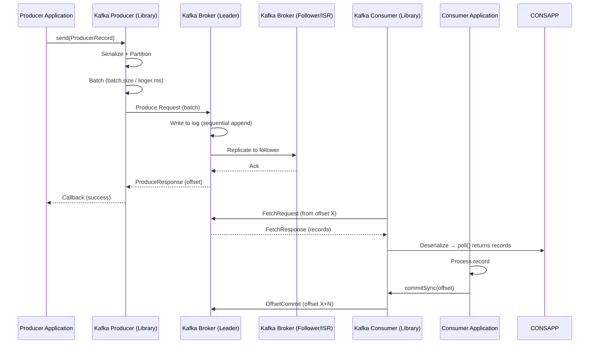

### 17.2 Kafka Connect Flow (CDC Example)

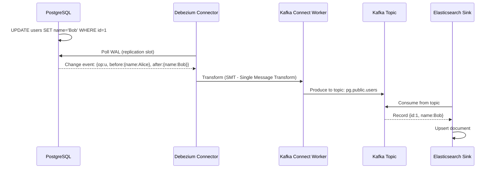

---

## 18. Real-World Kafka Use Cases

### 18.1 LinkedIn (Kafka's Origin)
LinkedIn processes **7 trillion messages/day** across 100+ Kafka clusters.
- Activity tracking (page views, clicks, searches).
- Operational metrics pipeline.
- Stream processing for News Feed ranking.

### 18.2 Uber
- Real-time dispatch system: driver location updates → trip matching.
- `uLogFS`: Kafka as a write-ahead log for consistent storage.
- **1 trillion messages/day** at peak.

### 18.3 Netflix
- **Keystone** pipeline: operational metrics, playback events, A/B testing.
- Processes 500 billion events/day.
- Uses Kafka for chaos engineering signals (Chaos Monkey feeds).

### 18.4 Twitter/X
- Real-time tweet delivery via Kafka → Manhattan (distributed KV store).
- Tweet engagements (likes, retweets) fan-out.

### 18.5 Airbnb
- **Minerva** metrics platform built on Kafka.
- Real-time pricing updates via Kafka Streams.
- Fraud detection on booking events.

---

## 19. Production Best Practices

### 19.1 Topic Design
1. **Name topics semantically:** `<domain>.<entity>.<event>` → `payments.orders.placed`.
2. **Use replication factor 3** for all production topics.
3. **Set `min.insync.replicas=2`** to balance durability and availability.
4. **Set retention** based on business need (`retention.ms`).
5. **Enable log compaction** only for CDC / state topics.

### 19.2 Producer Best Practices
1. Always use `acks=all` for critical data.
2. Enable `enable.idempotence=true` (free durability upgrade).
3. Use `compression.type=snappy` or `lz4` — reduces network + disk usage.
4. Use `linger.ms=5–20ms` to batch more records without hurting latency much.
5. Set `max.in.flight.requests.per.connection=5` (safe with idempotence enabled).

### 19.3 Consumer Best Practices
1. **Commit offsets after processing**, not before.
2. Use **manual commit** (`enable.auto.commit=false`) for at-least-once guarantees.
3. Make consumers **idempotent** (handle reprocessing gracefully).
4. Implement a **Dead Letter Queue** for poison pill messages.
5. Monitor `records-lag-max` metric — set alert on lag > threshold.
6. Use `max.poll.records` to control batch size (smaller = more frequent commits).

### 19.4 Broker Best Practices
1. Spread partitions across brokers evenly (`kafka-reassign-partitions.sh`).
2. Use **separate disks** for Kafka logs (not OS disk).
3. Set `num.io.threads` based on disk count.
4. Monitor `UnderReplicatedPartitions` — should always be 0.
5. Use **KRaft** instead of ZooKeeper for new clusters (Kafka 3.3+).

### 19.5 Security
1. Enable **TLS/SSL** for encryption in transit.
2. Use **SASL/SCRAM** or **SASL/GSSAPI (Kerberos)** for authentication.
3. Configure **ACLs** per topic/consumer group.
4. Use **Schema Registry** to enforce data contracts.

---

## 20. Quick Reference Cheat Sheet

```
TOPIC CREATION (3 partitions, RF=3):
kafka-topics.sh --create --topic orders --partitions 3 --replication-factor 3

PRODUCER CONFIGS for production:
acks=all
enable.idempotence=true
compression.type=snappy
linger.ms=10
batch.size=65536
retries=2147483647

CONSUMER CONFIGS for production:
enable.auto.commit=false
auto.offset.reset=earliest
max.poll.records=100
group.id=<service-name>-cg

DURABILITY:
RF=3, min.insync.replicas=2, acks=all

EXACTLY-ONCE (Streams):
processing.guarantee=exactly_once_v2

MONITORING:
records-lag-max < 1000
UnderReplicatedPartitions == 0
ActiveControllerCount == 1
OfflinePartitionsCount == 0
```

---

## 21. Kafka Streams — Windowing Deep Dive

Windowing is key for real-time analytics. Kafka Streams provides **4 window types**.

### 21.1 Tumbling Window (Fixed, Non-Overlapping)

```
Time:      0   10   20   30   40   50   60s
                 ↓
Window 1: [0 ──────────────── 30]
Window 2:                     [30 ────────── 60]

Each event belongs to EXACTLY ONE window.
Perfect for: "Total sales per hour", "Errors per minute"
```

```java
// Count transactions per user per 1-minute window
KTable<Windowed<String>, Long> countPerMinute = stream
    .groupByKey()
    .windowedBy(TimeWindows.ofSizeWithNoGrace(Duration.ofMinutes(1)))
    .count(Materialized.as("txn-count-store"));
```

### 21.2 Hopping Window (Fixed, Overlapping)

```
Time:      0   10   20   30   40   50   60s
                 ↓
Window 1: [0 ──────────── 30]
Window 2:      [10 ──────────── 40]
Window 3:           [20 ──────────── 50]
Window 4:                [30 ──────────── 60]

Each event can belong to MULTIPLE windows.
Perfect for: "Clicks in any 30-minute window, updated every 10 minutes"
```

```java
// 30-min window, updated every 10 min
KTable<Windowed<String>, Long> hoppingCount = stream
    .groupByKey()
    .windowedBy(TimeWindows.ofSizeAndGrace(Duration.ofMinutes(30), Duration.ofMinutes(5))
        .advanceBy(Duration.ofMinutes(10)))
    .count();
```

### 21.3 Session Window (Activity-Based, Variable Size)

```
Events:    [click] [click] [click]      5-min gap       [click] [click]
           ──────────────────────── inactive ────────────────────────────
Session 1: [─────────────── ]           (3 events grouped)
Session 2:                                              [──────── ]

Window closes after INACTIVITY gap (not fixed time).
Perfect for: "User sessions", "Shopping cart abandonment detection"
```

```java
// Session window with 5-minute inactivity gap
KTable<Windowed<String>, Long> sessionCounts = stream
    .groupByKey()
    .windowedBy(SessionWindows.ofInactivityGapAndGrace(
        Duration.ofMinutes(5),    // session ends after 5 min of inactivity
        Duration.ofMinutes(1)     // grace period for late events
    ))
    .count();
```

### 21.4 Sliding Window (Event-Time, Continuous)

```
Events:    E1  E2     E3     E4    E5
                ↓
At E3: window = [E3-30min → E3]  → includes E1, E2, E3
At E4: window = [E4-30min → E4]  → includes E2, E3, E4

Created per event — every new event triggers a window result.
Perfect for: "Avg response time in last 30 minutes", rolling metrics
```

```java
// Sliding window: 30-min duration
KTable<Windowed<String>, Long> slidingCounts = stream
    .groupByKey()
    .windowedBy(SlidingWindows.ofTimeDifferenceAndGrace(
        Duration.ofMinutes(30),
        Duration.ofSeconds(30)
    ))
    .count();
```

### 21.5 Windowing Comparison Table

| Window Type | Size | Overlap | Late Events | Best For |
|-------------|------|---------|-------------|----------|
| **Tumbling** | Fixed | No | `grace()` | Hourly/minutely aggregates |
| **Hopping** | Fixed | Yes | `grace()` | Rolling metrics, dashboards |
| **Session** | Variable | No | `grace()` | User sessions, activity detection |
| **Sliding** | Fixed | Yes (per event) | `grace()` | Real-time rolling averages |

### 21.6 Late Events and Grace Period

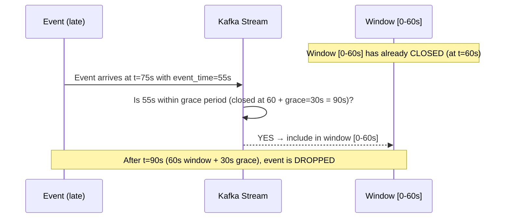

> **Interview Tip:** "We set a 30-second grace period to absorb network delays. Events arriving after the grace period are dropped (or sent to a late-events DLQ topic)."

---

## 22. Kafka Internals — How Records Are Stored

### 22.1 Message Format (Record Batch)

```
RecordBatch:
  ┌─────────────────────────────────────────┐
  │ Base Offset (8 bytes)                   │  ← first offset in batch
  │ Batch Length (4 bytes)                  │
  │ Partition Leader Epoch (4 bytes)        │  ← for fencing stale leaders
  │ Magic Byte (1 byte)                     │  ← version (2 = current)
  │ Attributes (2 bytes)                    │  ← compression, timestamp type
  │ Last Offset Delta (4 bytes)             │
  │ First Timestamp (8 bytes)               │
  │ Max Timestamp (8 bytes)                 │
  │ Producer ID (8 bytes)                   │  ← for idempotence / EOS
  │ Producer Epoch (2 bytes)                │
  │ Base Sequence (4 bytes)                 │
  │ Records Count (4 bytes)                 │
  ├─────────────────────────────────────────┤
  │ Record 1: [attributes][ts_delta]        │
  │           [offset_delta][key][value]    │
  │           [headers...]                  │
  │ Record 2: ...                           │
  └─────────────────────────────────────────┘
```

### 22.2 Index Files — O(log n) Offset Lookup

Kafka doesn't scan the entire log to find an offset. It uses **sparse offset index**:

```
.index file (sparse — every ~4KB of log data):
  Offset 0    → Physical position 0
  Offset 128  → Physical position 4096
  Offset 256  → Physical position 8192
  ...

To find offset 200:
  1. Binary search index → find entry (offset 128, position 4096)
  2. Scan log from position 4096 until offset 200 found
  → O(log n) binary search + tiny sequential scan
```

### 22.3 Consumer Offset Storage — `__consumer_offsets` Topic

Consumer offsets are NOT stored in ZooKeeper. They're stored in a **special Kafka topic**:

```
Topic: __consumer_offsets
  - 50 partitions (default)
  - Compacted (keeps latest offset per group+topic+partition)
  - Key:   [group_id][topic][partition]
  - Value: [offset][metadata][timestamp]
```

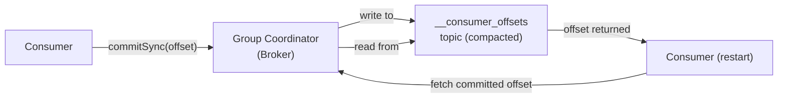

---

## 23. Performance Tuning Guide

### 23.1 Producer Throughput Tuning

```
Goal: Maximize records/sec with acceptable latency

Levers:
├── batch.size        ↑ larger batch = fewer requests = higher throughput
├── linger.ms         ↑ wait longer to fill batches (adds latency, boosts throughput)
├── compression.type  → snappy/lz4 reduces bytes sent (network wins)
├── buffer.memory     ↑ more RAM for buffering = handles bursty producers
└── num.partitions   ↑ more partitions = more parallel producers

Baseline config for max throughput:
  batch.size     = 65536   (64KB)
  linger.ms      = 50      (50ms)
  compression.type = lz4
  buffer.memory  = 67108864 (64MB)
```

### 23.2 Consumer Throughput Tuning

```
Goal: Minimize lag, maximize records/sec

Levers:
├── max.poll.records    ↑ larger batches = fewer poll() calls
├── fetch.min.bytes     ↑ waits for more data before returning (reduces requests)
├── fetch.max.bytes     ↑ larger fetches (more data per round trip)
├── num.consumer.threads↑ scaling out (but can't exceed partition count per group)
└── processing logic    → make it async, batch DB writes, use connection pools

Baseline config for max throughput:
  fetch.min.bytes   = 102400   (100KB)
  fetch.max.bytes   = 52428800 (50MB)
  max.poll.records  = 1000
```

### 23.3 Broker Tuning

```
OS-level:
  vm.swappiness=1           → Prefer RAM over swap
  vm.dirty_ratio=80         → Let OS buffer more writes in RAM
  net.core.rmem_max=134217728  → Large socket receive buffers

Kafka-level:
  num.io.threads = 8 × (number of disks)
  num.network.threads = 3 (for 1Gbps NIC), more for 10Gbps
  log.segment.bytes = 1073741824   (1GB — larger = fewer index files)
  log.flush.interval.messages = Long.MAX_VALUE  (let OS decide when to flush)
  socket.send.buffer.bytes = 131072   (128KB)
  socket.receive.buffer.bytes = 131072
```

### 23.4 Latency vs Throughput Matrix

```
                │ Low Latency          │ High Throughput
────────────────┼──────────────────────┼───────────────────────────
linger.ms       │ 0ms                  │ 20–100ms
batch.size      │ 4096 (4KB)           │ 65536 (64KB)
compression     │ none (saves CPU)     │ snappy/lz4
acks            │ 1 (faster)           │ all (safer, slightly slower)
max.poll.records│ 50 (fast processing) │ 1000 (batch processing)
fetch.min.bytes │ 1 (immediate)        │ 102400 (wait for data)
```

---

## 24. Advanced Interview Questions & Answers (Part 2)

### Q13: "Explain the Kafka Controller and what it does."

> **Answer:**
> The **Controller** is one special broker elected from all brokers (via ZooKeeper/KRaft). There is exactly ONE controller at all times.
>
> **Controller responsibilities:**
> - Watches ZooKeeper/KRaft for broker join/leave events.
> - Assigns partition leaders when a new topic is created.
> - Elects new partition leaders when a broker dies (picks from ISR).
> - Updates the **cluster metadata** and propagates it to all other brokers.
> - Manages topic creation, deletion, and partition reassignment.
>
> ```mermaid
> graph TD
>     ZK["ZooKeeper / KRaft"] -->|"broker dies notification"| CT["Kafka Controller\n(special broker)"]
>     CT -->|"1. Pick new leader from ISR"| PL["Partition Leader Election"]
>     CT -->|"2. Update metadata"| ALL["Propagate to all Brokers"]
>     ALL --> B1["Broker 1"]
>     ALL --> B2["Broker 2"]
>     ALL --> B3["Broker 3"]
> ```
>
> **Interview trap:** If asked "what if the controller dies?" — Another broker is automatically elected as controller (ZooKeeper/KRaft handles this). The new controller reads all state from ZooKeeper/KRaft metadata log and resumes control.

---

### Q14: "How does Kafka handle back-pressure?"

> **Answer:**
> Kafka has multiple back-pressure mechanisms:
>
> **Producer side:**
> - If `buffer.memory` is exhausted, `producer.send()` BLOCKS for `max.block.ms`, then throws `BufferExhaustedException`.
> - This is Kafka's back-pressure on producers: slow down if the broker can't keep up.
>
> **Consumer side:**
> - Consumer controls its own rate via `max.poll.records` and `fetch.min.bytes`.
> - Consumer LAG grows if consumer is slower than producer — the data stays in Kafka (retention).
> - No built-in back-pressure signal TO the producer from the consumer.
>
> **For true back-pressure between services:**
> - Use `consumer lag` as a signal to scale up consumers (Kubernetes KEDA).
> - Use `max.in.flight.requests` to limit concurrent producer requests.
>
> ```mermaid
> graph LR
>     P["Producer\n(10K msg/s)"] -->|"fill buffer"| BUF["Producer Buffer\nbuffer.memory=32MB"]
>     BUF -->|"batch"| K["Kafka Broker"]
>     K -->|"replicate"| ISR["ISR Replicas"]
>     C["Consumer\n(8K msg/s)"] -->|"poll"| K
>     LAG["Consumer LAG\n grows 2K/s"] -.->|"KEDA: scale up consumers"| C
> ```

---

### Q15: "What is the 'unclean leader election' and why is it dangerous?"

> **Answer:**
> Normally, Kafka only promotes a **leader from within the ISR** (in-sync replicas).
>
> `unclean.leader.election.enable = true` allows a **lagging replica** (NOT in ISR) to become leader if all ISR members are unavailable.
>
> | Setting | Behavior |
> |---------|----------|
> | `false` (default, recommended) | Topic partition goes OFFLINE if all ISR replicas are down. Preserves all committed data. |
> | `true` | Allows out-of-sync replica to become leader. **May lose data** that was committed but not yet replicated to this broker. |
>
> ```
> Example of data loss with unclean election:
>
> Producer writes offset 100 → 101 → 102 (all on Leader + ISR replica B1)
> ISR: [Leader, B1]
> B2 (follower, NOT in ISR) is at offset 99
>
> Leader + B1 die simultaneously
> unclean.leader.election=true → B2 becomes leader at offset 99
> LOST: offsets 100, 101, 102
> ```
>
> **Interview Tip:** "For financial data, we set `unclean.leader.election.enable=false`. We prefer the partition to go offline for a few minutes over losing committed data. For metrics/logs where data loss is acceptable, `true` improves availability."

---

### Q16: "How does Kafka Connect work under the hood?"

> **Answer:**
> Kafka Connect is a framework (not a standalone app) for scalable, reliable data integration.
>
> ```mermaid
> graph TD
>     subgraph "Kafka Connect Cluster"
>         W1["Worker 1\n(JVM process)"]
>         W2["Worker 2\n(JVM process)"]
>         W3["Worker 3\n(JVM process)"]
>         subgraph "Worker 1 tasks"
>             T1["Source Task 1\n(reads shard 1)"]
>             T2["Source Task 2\n(reads shard 2)"]
>         end
>         subgraph "Worker 2 tasks"
>             T3["Sink Task 1"]
>             T4["Sink Task 2"]
>         end
>     end
>
>     KT["Kafka Topics"] -->|"Offsets / Status"| CO["connect-offsets\nconnect-configs\nconnect-status\n(internal topics)"]
>     T1 --> KT
>     T2 --> KT
>     KT --> T3
>     KT --> T4
> ```
>
> - **Workers** are JVM processes that run connectors and tasks.
> - **Connectors** are plugins (JARs) — Debezium, S3, Elasticsearch, etc.
> - **Tasks** are the actual units of work (parallelized across workers).
> - **Internal topics** store connector state, offsets, and config — enabling restarts without data loss.
> - **Single Message Transforms (SMTs)** transform records in-flight (rename fields, add timestamp, filter nulls).

---

### Q17: "What is a 'split-brain' scenario in Kafka and how is it prevented?"

> **Answer:**
> Split-brain: two brokers both think they are the partition leader (e.g., after a network partition where the old leader couldn't communicate but wasn't actually dead).
>
> **How Kafka prevents it:**
>
> 1. **Leader Epoch:** Every time a new leader is elected, the epoch (monotonically increasing counter) increments. The leader includes its epoch in all messages.
> 2. **Follower rejects old leaders:** A follower receiving messages with an OLDER epoch than what it knows → rejects and asks for metadata refresh.
> 3. **Producer fencing:** If an old leader (zombie) tries to write, the new leader rejects it (`NOT_LEADER_OR_FOLLOWER` error).
>
> ```
> Timeline:
> t=0: Broker1 is leader (epoch=5)
> t=1: Network partition — Broker2 can't reach Broker1
> t=2: ZooKeeper/KRaft detects failure → elects Broker2 as leader (epoch=6)
> t=3: Network heals — Broker1 thinks it's still leader (epoch=5)
> t=4: Broker1 tries to write → Broker2 rejects (epoch 5 < 6)
> t=5: Broker1 discovers it's no longer leader → steps down
> ```

---

### Q18: "How would you design a real-time analytics pipeline with Kafka?"

> **System Design:**
>
> ```mermaid
> graph TD
>     subgraph "Data Sources"
>         APP["Web/Mobile App"]
>         DB["PostgreSQL\n(CDC via Debezium)"]
>         IOT["IoT Devices"]
>     end
>
>     subgraph "Kafka Cluster (Event Bus)"
>         RT["raw-events topic\n(6 partitions, RF=3)"]
>         AT["aggregated-metrics topic\n(6 partitions)"]
>         AL["alerts topic\n(3 partitions)"]
>     end
>
>     subgraph "Stream Processing"
>         KS["Kafka Streams\n(filter, enrich, aggregate)"]
>         FL["Flink (complex CEP)\n(optional for ML features)"]
>     end
>
>     subgraph "Sinks"
>         CH["ClickHouse\n(OLAP queries)"]
>         ES["Elasticsearch\n(full-text search)"]
>         S3["S3 / Data Lake\n(cold storage, batch ML)"]
>         DASH["Grafana Dashboard"]
>     end
>
>     APP -->|"SDK"| RT
>     DB -->|"Debezium"| RT
>     IOT -->|"MQTT bridge"| RT
>     RT --> KS
>     KS --> AT
>     KS --> AL
>     AT --> CH
>     AT --> ES
>     AT --> DASH
>     RT --> S3
>     AL -->|"slack/pagerduty"| NS["Notification Service"]
> ```
>
> **Design decisions explained:**
> - **Separate raw + aggregated topics:** Raw events preserved forever (S3 sink). Aggregated metrics for real-time dashboards.
> - **Kafka Streams for stateful aggregation:** Tumbling windows for minutely metrics, session windows for user behaviour.
> - **ClickHouse as OLAP sink:** Accepts Kafka writes natively, sub-second queries on billions of rows.
> - **Retention strategy:** Raw events: 7 days in Kafka, forever in S3. Aggregated: 30 days.
> - **Exactly-once:** `processing.guarantee=exactly_once_v2` in Kafka Streams ensures metrics aren't double-counted.

---

### Q19: "How do you handle schema evolution in Kafka without breaking consumers?"

> **Answer:**
> Schema evolution is one of the hardest problems in streaming systems.
>
> **The 3 rules of safe schema evolution (Avro/Protobuf):**
>
> | Rule | Backward Compatible? | Forward Compatible? |
> |------|---------------------|---------------------|
> | Add OPTIONAL field (with default) | ✅ | ✅ |
> | Remove OPTIONAL field | ✅ | ✅ |
> | Add REQUIRED field (no default) | ❌ | ✅ |
> | Remove REQUIRED field | ✅ | ❌ |
> | Rename a field | ❌ | ❌ |
> | Change field type | ❌ | ❌ |
>
> **Deployment strategy for breaking changes:**
> ```
> Step 1: Deploy new schema to Schema Registry (FULL compatibility check fails? Don't proceed)
> Step 2: Deploy consumers that can read BOTH old and new schema (union type or version check)
> Step 3: Deploy producers writing the new schema
> Step 4: Wait for all old messages to age out (retention period)
> Step 5: Remove backward-compat code from consumers
> ```
>
> **For truly breaking changes:**
> - Create a NEW topic with the new schema.
> - Run dual-write (producer writes to both old and new topics temporarily).
> - Migrate consumers one by one to the new topic.
> - Decommission old topic after all consumers migrated.

---

### Q20: "Explain Kafka's compaction guarantees — what is NOT guaranteed?"

> **Answer:**
> Log compaction guarantees:
> - ✅ The **latest value per key** is ALWAYS retained.
> - ✅ Record ORDER is preserved (relative order within a key).
> - ✅ **Tombstones** (key with null value) are retained for `delete.retention.ms` before being deleted.
>
> Log compaction does NOT guarantee:
> - ❌ **When** compaction runs (it runs in background, triggered by `min.cleanable.dirty.ratio`).
> - ❌ **How stale** the log is at any point (there may be old values temporarily).
> - ❌ Any particular compaction latency SLA.
>
> ```
> Before compaction:
> [A:1][B:1][A:2][C:1][B:2][A:null]  ← A:null is a tombstone (delete marker)
>
> After compaction:
>               [C:1][B:2]            ← A is gone (tombstone + old values removed after delete.retention.ms)
>
> But for a period, tombstones are visible (for consumers to catch deletions):
> [A:null][C:1][B:2]   ← tombstone retained for delete.retention.ms=86400000 (1 day)
> ```

---

### Q21: "What is 'sticky partitioning' and why was it introduced?"

> **Answer:**
> Before Kafka 2.4, producers without a key used **pure round-robin** partitioning: each record went to a different partition.
>
> **Problem with round-robin:**
> - Batches stay small because records for each partition are interleaved with other partitions.
> - With `linger.ms=20ms`, a partition might only accumulate 2-3 records before the linger timeout fires.
> - Result: many small batches → high overhead → lower throughput.
>
> **Sticky Partitioner (Kafka 2.4+):**
> - Send records to ONE partition until the batch is full OR `linger.ms` expires.
> - Then switch to the next partition.
>
> ```
> Round-robin (3 records):
> P0: [rec1]     P1: [rec2]     P2: [rec3]
> → 3 tiny batches sent separately
>
> Sticky (3 records, linger.ms=20):
> P0: [rec1, rec2, rec3]  (all in one batch until linger expires)
> → 1 larger batch → 3x better throughput
> ```
>
> **Interview Tip:** "Sticky partitioner gives us better batching efficiency — we've seen 2–3x throughput improvement on keyless workloads after enabling it."

---

### Q22: "How does Kafka handle consumer group coordinator failover?"

> **Answer:**
> Each consumer group has a **Group Coordinator** — a specific broker responsible for managing the group's membership, heartbeats, and offset commits. The coordinator is determined by:
> ```
> coordinatorBroker = hash(group_id) % 50  (50 = partitions in __consumer_offsets)
> → That partition's leader broker is the coordinator
> ```
>
> **Failover sequence:**
> ```mermaid
> sequenceDiagram
>     participant C1 as Consumer 1
>     participant GC as Group Coordinator (Broker A)
>     participant ZK as ZooKeeper / KRaft
>     participant GB as New Coordinator (Broker B)
>
>     C1->>GC: Heartbeat
>     GC--xC1: No response (Broker A crashed)
>     C1->>C1: Wait (session.timeout.ms expires)
>     C1->>ZK: Find new coordinator
>     ZK-->>C1: Broker B is new coordinator
>     C1->>GB: JoinGroup (triggers rebalance)
>     GB-->>C1: New partition assignment
> ```
>
> **Recovery time:** `session.timeout.ms` (default 10s) → rebalance → assign partitions. Total: 15–30 seconds typically.

---

### Q23: "What is the difference between `EARLIEST`, `LATEST`, and `NONE` for `auto.offset.reset`?"

> **Answer:**
> This config determines where a **new consumer group** starts reading when there is NO committed offset yet (first run, or after the consumer group is deleted).
>
> | Value | Behavior | Use Case |
> |-------|----------|----------|
> | `earliest` | Start from the BEGINNING of the topic (offset 0 or earliest available) | Initial data load, migrations, audit |
> | `latest` | Start from NOW — only new messages published after subscribe() | Real-time applications that don't need history |
> | `none` | Throw `NoOffsetForPartitionException` if no committed offset exists | Strict mode — never silently miss or replay data |
>
> **Common trap in interviews:**
> ```
> Q: "Your consumer worked fine but after a Kafka topic was recreated (new offsets from 0),
>     the consumer with auto.offset.reset=latest sees nothing. Why?"
>
> A: The consumer has a COMMITTED offset from the old topic (e.g., offset 5000).
>    Since a committed offset EXISTS, auto.offset.reset is NOT consulted.
>    The consumer tries to fetch from offset 5000 from the NEW topic which only has offsets 0-100.
>    → OffsetOutOfRangeException!
>
> Fix: Reset offsets for the group:
>   kafka-consumer-groups.sh --reset-offsets --to-earliest --execute --group mygroup --topic mytopic
> ```

---

### Q24: "Walk me through a Kafka producer sending a message — every step."

> **Answer (step-by-step):**
>
> ```mermaid
> sequenceDiagram
>     participant APP as Application
>     participant PROD as KafkaProducer (library)
>     participant SER as Serializer
>     participant PART as Partitioner
>     participant ACC as RecordAccumulator
>     participant SEND as Sender Thread (background)
>     participant BROKER as Kafka Broker (Leader)
>     participant REPLICA as ISR Replica
>
>     APP->>PROD: producer.send(ProducerRecord{topic, key, value})
>     PROD->>SER: Serialize key → byte[]
>     PROD->>SER: Serialize value → byte[]
>     PROD->>PART: Which partition? (hash(key) % N OR round-robin)
>     PART-->>PROD: partition = 2
>     PROD->>ACC: Append to batch for (topic, partition=2)
>     Note over ACC: Wait for batch.size OR linger.ms
>     ACC->>SEND: Batch ready → hand off
>     SEND->>BROKER: ProduceRequest (RecordBatch, acks=all)
>     BROKER->>BROKER: Write to partition leader log (sequential append)
>     BROKER->>REPLICA: Replicate batch
>     REPLICA-->>BROKER: Ack
>     BROKER-->>SEND: ProduceResponse (base_offset=100)
>     SEND-->>APP: Callback(RecordMetadata{partition=2, offset=100})
> ```
>
> **Key points to articulate:**
> - Serialization happens on the calling thread.
> - Partitioning happens on the calling thread.
> - Batching happens in the RecordAccumulator (shared across all threads).
> - Actual network I/O happens on the Sender background thread.
> - Producer is thread-safe — multiple app threads share ONE producer.

---

### Q25: "What are the internals of how a consumer reads from Kafka?"

> **Answer:**
>
> ```mermaid
> sequenceDiagram
>     participant APP as Application (poll loop)
>     participant CONS as KafkaConsumer (library)
>     participant GC as Group Coordinator (broker)
>     participant BROKER as Partition Leader Broker
>
>     APP->>CONS: consumer.poll(Duration.ofMillis(1000))
>     CONS->>GC: Heartbeat (if interval due)
>     Note over CONS,GC: If no heartbeat in session.timeout.ms → rebalance
>     CONS->>CONS: Check if rebalance needed
>     CONS->>BROKER: FetchRequest{topic, partition=2, offset=100, maxBytes=50MB}
>     BROKER->>BROKER: Read from log (zero-copy sendfile)
>     BROKER-->>CONS: FetchResponse{records=[offset100..150]}
>     CONS->>CONS: Deserialize records
>     CONS-->>APP: ConsumerRecords (up to max.poll.records)
>     APP->>APP: Process records
>     APP->>CONS: consumer.commitSync({tp: offset 151})
>     CONS->>GC: OffsetCommitRequest{group, tp, offset=151}
>     GC->>GC: Write to __consumer_offsets topic
>     GC-->>CONS: OffsetCommitResponse (success)
> ```
>
> **What happens in poll():**
> 1. Sends heartbeat if `heartbeat.interval.ms` has elapsed.
> 2. Checks if coordinator requested a rebalance (JoinGroup needed?).
> 3. Sends FetchRequest(s) to the partition leader(s).
> 4. Waits up to `fetch.max.wait.ms` if data is less than `fetch.min.bytes`.
> 5. Deserializes and returns records.

---

### Q26: "Describe a scenario where a Kafka consumer silently loses data."

> **Answer:**
> Silent data loss happens with `enable.auto.commit=true` (the default!).
>
> ```
> Timeline of SILENT DATA LOSS:
>
> t=0: poll() returns records [offset 100, 101, 102]
> t=1: auto-commit fires → commits offset 103 (processed up to 102)
> t=2: Application CRASHES while processing record 101
>
> On restart:
>   Consumer reads from offset 103 (last committed)
>   Records 101 and 102 are PERMANENTLY SKIPPED (at-most-once delivery)
>   NO EXCEPTION, NO LOG — silently lost!
>
> Fix: enable.auto.commit=false
>   Commit ONLY after successful processing.
> ```
>
> **Another scenario:** Processing is fast but DB write is async:
> ```java
> // WRONG: commitSync before async DB write completes
> for (ConsumerRecord r : records) {
>     asyncDB.write(r.value());  // fire-and-forget
> }
> consumer.commitSync();  // committed but DB might not have received data!
> ```
>
> **Fix:** `commitSync()` ONLY after confirming downstream writes are complete.

---

### Q27: "How do you ensure message ordering across multiple Kafka topics?"

> **Answer:**
> Kafka guarantees ordering ONLY within a single partition. Across topics, there is NO ordering guarantee.
>
> **Strategies for cross-topic ordering:**
>
> **1. Use a single topic with sub-types:**
> ```
> Instead of: topic:payments, topic:refunds, topic:chargebacks
> Use:        topic:financial-events (type field in message)
> Partition by userId → all events for a user are in order
> ```
>
> **2. Event sourcing with a single ordered stream:**
> ```
> topic:account-events partitioned by account_id
> All events (deposits, withdrawals, transfers) for account_id=42
> go to the SAME partition → strict ordering maintained
> ```
>
> **3. Watermarks for stream-stream joins (Kafka Streams):**
> - Use event timestamps + windowing to correlate events across topics.
> - Kafka Streams `KStream.join()` uses time windows to align events from two topics.
>
> **4. Saga with correlation IDs:**
> - Each event carries a `saga_id` and `sequence_num`.
> - Consumer rebuilds ordering by sorting on `sequence_num` within a `saga_id`.

---

### Q28: "What is the difference between Kafka and a traditional message queue (RabbitMQ/SQS)?"

> **Answer:**
>
> ```
> Traditional MQ (RabbitMQ/SQS):         Kafka:
>
> - Message is DELETED after consumption  - Message is RETAINED (configurable)
> - Push model (broker → consumer)        - Pull model (consumer → broker)
> - No replay of old messages             - Full replay (reset offset to 0)
> - Message ACK removes from queue        - Offset commit → broker ignores it
> - Multiple consumers = competing        - Multiple consumer GROUPS = independent
> - Great for task queues / RPC           - Great for event streaming / analytics
> - At-most-once or at-least-once         - At-least-once + Exactly-once (transactions)
> ```
>
> **Use Kafka when:**
> - Multiple independent consumers need the same data (analytics + billing + notifications).
> - You need message replay (reprocess events with a bug fix).
> - Throughput > 10K messages/sec.
> - Event sourcing / CQRS / CDC.
>
> **Use RabbitMQ/SQS when:**
> - Simple task queue (background jobs, email delivery).
> - Low throughput, low complexity.
> - You don't want to operate a Kafka cluster.
> - Point-to-point (one consumer per message).

---

### Q29: "How would you implement exactly-once delivery in Kafka end-to-end?"

> **Answer:**
> End-to-end exactly-once requires guarantees at every layer:
>
> ```mermaid
> graph TD
>     subgraph "Layer 1: Producer → Kafka"
>         P["Idempotent Producer\nenable.idempotence=true\n→ Deduplicates retries on broker"]
>     end
>
>     subgraph "Layer 2: Kafka Streams (read-process-write)"
>         KS["Kafka Transactions\nprocessing.guarantee=exactly_once_v2\n→ Atomic: output write + offset commit"]
>     end
>
>     subgraph "Layer 3: Kafka → External System"
>         SINK["Idempotent Sink\n→ Use upsert semantics\n→ Check if already written (dedup key)"]
>     end
>
>     P --> KS --> SINK
> ```
>
> **The catch:** Exactly-once within Kafka is well-supported. EOS to EXTERNAL systems (DB, S3, Elasticsearch) requires the external system to support idempotent writes:
>
> - **PostgreSQL:** `INSERT ... ON CONFLICT DO NOTHING` (upsert with unique key = Kafka offset).
> - **S3:** Write with a content-hash-based filename → same content = same filename = safe overwrite.
> - **Elasticsearch:** Use Kafka offset as document `_id` → reindex is idempotent.
>
> **Configuration checklist:**
> ```
> Producer:
>   enable.idempotence=true              → PID + sequence dedup
>   acks=all                             → Auto-set by idempotence
>
> Consumer:
>   isolation.level=read_committed       → Don't read aborted records
>   enable.auto.commit=false             → Manual offset commit within transaction
>
> Kafka Streams:
>   processing.guarantee=exactly_once_v2 → Transaction per batch
>
> Topic:
>   replication.factor >= 2             → Transactions fail if RF=1
>   min.insync.replicas = 2             → Ensure writes are durable
> ```

---

### Q30: "If Kafka is down, what happens to your system? How do you design for it?"

> **Answer:**
> Kafka outage impact depends on your architecture:
>
> **Without resilience (bad):**
> ```
> Kafka DOWN → Producers get exceptions → API requests fail → 500 errors to users
> ```
>
> **With resilience (good):**
> ```mermaid
> graph TD
>     P["Producer Service"] -->|"primary"| K["Kafka Cluster"]
>     P -->|"fallback"| LQ["Local Queue\n(in-memory / DB-backed)"]
>     LQ -->|"retry when Kafka recovers"| K
>
>     subgraph "Resilience Patterns"
>         CB["Circuit Breaker\n(stop sending to Kafka after N failures)"]
>         BUF["Local Buffer\n(DB table, Redis List, or file)"]
>         RET["Retry with Exponential Backoff"]
>     end
> ```
>
> **Design patterns for Kafka outage resilience:**
>
> 1. **Outbox Pattern:** Write to a `outbox` DB table first (same transaction as business data). A separate poller reads the outbox and publishes to Kafka.
>    - If Kafka is down: data is safe in DB, poller retries.
>    - When Kafka recovers: poller catches up.
>
> 2. **Circuit Breaker:** After N consecutive Kafka failures, stop trying (circuit opens). Fall back to a degraded mode. Periodically retry (half-open probe).
>
> 3. **Multi-region Kafka:** MirrorMaker 2 replicates topics across regions. Producers/consumers fail over to backup cluster.
>
> 4. **Producer buffer tuning:** `buffer.memory` + `max.block.ms` gives producers time to wait out broker restarts (typically 30s in well-tuned clusters).

---

## 25. System Design Case Study — E-commerce Order Processing

### Problem Statement
Design a Kafka-based order processing pipeline for an e-commerce platform handling **10,000 orders/minute** with these requirements:
- Payment validated before order is confirmed.
- Inventory decremented exactly once.
- Notification sent on order success/failure.
- Full audit log of all events.
- System must handle individual service failures gracefully.

### Solution Architecture

```mermaid
graph TD
    API["Order API\n(REST)"] -->|"1. publish OrderPlaced"| OT["Topic: orders\n6 partitions, RF=3\npartitioned by order_id"]

    OT --> PS["Payment Service\n(Consumer Group: payment-cg)"]
    PS -->|"2a. PaymentSuccess"| PT["Topic: payment-events"]
    PS -->|"2b. PaymentFailed"| PT

    PT --> IS["Inventory Service\n(Consumer Group: inventory-cg)"]
    IS -->|"3a. InventoryReserved"| IT["Topic: inventory-events"]
    IS -->|"3b. InventoryFailed"| IT

    IT --> NS["Notification Service\n(Consumer Group: notification-cg)"]
    IT --> AUD["Audit Service\n(Consumer Group: audit-cg)"]
    IT --> OS["Order Status Service\n(Consumer Group: orderstatus-cg)"]

    OT --> DLQ1["orders.DLQ"]
    PT --> DLQ2["payment-events.DLQ"]

    subgraph "Exactly-Once Config"
        EC["acks=all\nmin.insync.replicas=2\nenable.idempotence=true\nprocessing.guarantee=exactly_once_v2"]
    end
```

### Topic Design

| Topic | Partitions | RF | Retention | Key | Compaction |
|-------|-----------|----|-----------|----|-----------|
| `orders` | 6 | 3 | 7 days | order_id | delete |
| `payment-events` | 6 | 3 | 30 days | order_id | delete |
| `inventory-events` | 6 | 3 | 30 days | order_id | delete |
| `orders.DLQ` | 3 | 3 | 30 days | order_id | delete |
| `order-state` | 6 | 3 | forever | order_id | **compact** |

### Capacity Estimation

```
10,000 orders/min = ~167 orders/sec

Avg message size: 2KB

Bytes in/sec:
  orders topic: 167 × 2KB = 334 KB/s
  With RF=3: 334 × 3 = ~1 MB/s written to disk per broker

Storage for 7 days:
  334 KB/s × 7 × 86400 = ~200 GB raw
  With compression (snappy 4:1): ~50 GB

Partitions: to handle 167 msg/s (assuming 50 msg/s per partition) → 4 partitions needed
            we use 6 for headroom and to support 6 consumer instances
```

### Service Implementation Notes

**Payment Service (idempotent consumer):**
```java
// Idempotency check before payment processing
if (paymentRepo.existsByOrderId(record.key())) {
    log.info("Payment already processed for orderId: {}", record.key());
    return; // Safe to skip — already done
}
// Process payment
// Publish to payment-events inside a Kafka transaction
```

**Inventory Service (exactly-once decrement):**
```java
// Atomic Lua script in Redis (or DB transaction):
// EVAL "if redis.call('GET', key) > 0 then redis.call('DECR', key) return 1 else return 0 end"
// Combined with Kafka transaction on the output topic
```

**Saga Compensation (on failure):**
```mermaid
sequenceDiagram
    participant P as Payment Service
    participant I as Inventory Service
    participant O as Order Service

    P->>KT: PaymentFailed {orderId: 123}
    I->>KT: Subscribe → No inventory reservation needed
    O->>KT: Subscribe → Update order status to FAILED
    O->>KT: Publish OrderCancelled {orderId: 123}
    Note over O: Notification Service notifies customer
```

---

## 26. Kafka Anti-Patterns (What NOT to Do)

### ❌ Anti-Pattern 1: Using Kafka as a Database
```
Problem: Using kafka-streams state stores as your primary DB without backups.
Result:  State is co-located with the stream processor. Hard to query, share, or backup.
Fix:     Use Kafka Streams to write aggregated state to a REAL DB (PostgreSQL, DynamoDB).
         Expose DB for queries. Kafka = transport, DB = state.
```

### ❌ Anti-Pattern 2: Very Large Messages
```
Problem: Sending 10MB Avro blobs as Kafka messages.
Result:  Memory pressure on brokers, slow network, consumers OOM.
Fix:     Store large blobs in S3/GCS. Send only the reference (URL/ID) in Kafka.
         Message size should be < 1MB (ideally < 100KB).
```

### ❌ Anti-Pattern 3: Too Many Topics
```
Problem: One Kafka topic per user, per entity, etc. → millions of topics.
Result:  ZooKeeper/KRaft overloaded (each topic = metadata). Controller slow.
         Leader election storms on broker restart.
Fix:     Use a SINGLE topic with a type/entity discriminator in the message.
         Partition by entity ID for ordering. Use consumer-side filtering.
```

### ❌ Anti-Pattern 4: Reading All Partitions on One Consumer
```
Problem: One consumer instance for a high-throughput topic with 12 partitions.
Result:  Consumer lag grows indefinitely. One CPU core can't keep up.
Fix:     Scale consumers = partitions count. Use Kubernetes Deployment with 12 replicas.
```

### ❌ Anti-Pattern 5: Not Setting `max.poll.interval.ms` Appropriately
```
Problem: Consumer fetches 500 records, each takes 1 second to process.
         Total: 500s >> default max.poll.interval.ms (5 min = 300s).
Result:  Broker kicks out consumer (rebalances), reprocesses same 500 records → infinite loop.
Fix:     Either: reduce max.poll.records OR increase max.poll.interval.ms
         OR: process asynchronously and poll more frequently.
```

### ❌ Anti-Pattern 6: Shared transactional.id across instances
```
Problem: Two producer instances use the same transactional.id.
Result:  One producer "fences" the other (producer epoch bump).
         Fenced producer's transactions all fail → data loss or duplicate writes depending on retry logic.
Fix:     transactional.id MUST be unique per producer instance.
         Pattern: "service-name-" + instanceId (Kubernetes pod name or hostname)
```

---

## 27. Senior Interview Tips — Things That Impress

### What interviewers at FAANG/top companies look for:

1. **"It depends" mindset** — Know when to use acks=1 vs acks=all. Know when EOS is overkill.

2. **Tradeoff articulation:**
   > "More partitions = higher throughput but longer rebalancing and more file handles. I'd start with 6 and scale based on lag metrics."

3. **Real-world failure scenarios:**
   > "If a consumer crashes after processing but before committing, with at-least-once semantics, the record is reprocessed. This is why we make our consumers idempotent — we check if order_id already exists in our DB before inserting."

4. **Know the "gotchas":**
   - `auto.offset.reset` is only consulted when there's NO committed offset.
   - `enable.auto.commit=true` is dangerous for at-least-once delivery.
   - `max.poll.interval.ms` is often the root cause of "consumer keeps getting kicked out."
   - Increasing partitions doesn't help if downstream DB is the bottleneck.

5. **Mention monitoring proactively:**
   > "I'd set up Prometheus alerts on `records-lag-max > 1000` and `UnderReplicatedPartitions > 0`. Lag is the leading indicator of consumer health."

6. **Think about operational complexity:**
   > "Kafka Streams is great for simple stateful operations but Flink has better state management for complex CEP and ML feature computation. The operational overhead of a Flink cluster is higher, so we'd use Kafka Streams unless we need advanced windowing semantics."

---

*Last updated: Kafka 3.7 / KRaft mode. All configs are for production use unless noted.*

---

## 28. Local Development Setup

### 28.1 Start Kafka with Docker Compose (KRaft — no ZooKeeper)

The project includes a `docker-compose.yml` at
`src/main/java/com/lld/hld/kafka/docker-compose.yml`

```bash
# Start all services (Kafka + Schema Registry + Kafka Connect + Kafka UI)
cd src/main/java/com/lld/hld/kafka
docker compose up -d

# Verify Kafka is healthy
docker compose ps

# Stream Kafka logs
docker compose logs -f kafka
```

**Services started:**

| Service | URL | Purpose |
|---------|-----|---------|
| Kafka | `localhost:9092` | Bootstrap server for producers/consumers |
| Schema Registry | `http://localhost:8081` | Avro/Protobuf schema contract enforcement |
| Kafka Connect | `http://localhost:8083` | Source/sink connector REST API |
| **Kafka UI** | **`http://localhost:8080`** | Web UI for topics, consumers, lag monitoring |

### 28.2 Quick CLI Verification

```bash
# List topics (should return empty on first run)
docker exec kafka kafka-topics --bootstrap-server localhost:9092 --list

# Create topics for the examples
docker exec kafka kafka-topics --bootstrap-server localhost:9092 \
  --create --topic orders           --partitions 6 --replication-factor 1
docker exec kafka kafka-topics --bootstrap-server localhost:9092 \
  --create --topic payments         --partitions 6 --replication-factor 1
docker exec kafka kafka-topics --bootstrap-server localhost:9092 \
  --create --topic orders.DLQ       --partitions 3 --replication-factor 1
docker exec kafka kafka-topics --bootstrap-server localhost:9092 \
  --create --topic transactions     --partitions 6 --replication-factor 1
docker exec kafka kafka-topics --bootstrap-server localhost:9092 \
  --create --topic fraud-alerts     --partitions 3 --replication-factor 1

# Describe a topic (check ISR, leader)
docker exec kafka kafka-topics --bootstrap-server localhost:9092 \
  --describe --topic orders

# Produce test messages manually
docker exec -it kafka kafka-console-producer \
  --bootstrap-server localhost:9092 \
  --topic orders \
  --property "parse.key=true" \
  --property "key.separator=:"
# Type: order-1:{"orderId":"order-1","amount":500}
# Press Ctrl+D to exit

# Consume from beginning
docker exec kafka kafka-console-consumer \
  --bootstrap-server localhost:9092 \
  --topic orders \
  --from-beginning \
  --property "print.key=true" \
  --group test-consumer-group

# Check consumer lag
docker exec kafka kafka-consumer-groups \
  --bootstrap-server localhost:9092 \
  --describe --group test-consumer-group

# Reset offsets to replay all messages
docker exec kafka kafka-consumer-groups \
  --bootstrap-server localhost:9092 \
  --group test-consumer-group \
  --topic orders \
  --reset-offsets --to-earliest --execute

# Stop everything
docker compose down
# Stop and delete all data volumes (clean slate)
docker compose down -v
```

### 28.3 Kafka UI at http://localhost:8080

The Kafka UI lets you:
- Browse topics and their messages (no CLI needed)
- Monitor **consumer group lag** in real time
- View partition leaders and ISR status
- Produce/consume messages from a web form
- Manage connectors (if Kafka Connect is running)

---

## 29. Outbox Pattern — Reliable Kafka Event Publishing

### Problem: The Dual-Write Problem

```mermaid
sequenceDiagram
    participant API as Order API
    participant DB as PostgreSQL
    participant K as Kafka

    API->>DB: INSERT INTO orders (PLACED)
    DB-->>API: ✅ committed
    API->>K: send OrderPlaced event
    Note over API,K: 💥 CRASH HERE!
    Note over DB,K: DB has order, Kafka has nothing
    Note over DB,K: Silent inconsistency — no error!
```

### Solution: Outbox Pattern

```mermaid
sequenceDiagram
    participant API as Order API
    participant DB as PostgreSQL
    participant OB as Outbox Table
    participant OR as Outbox Relay
    participant K as Kafka
    participant C as Consumer

    API->>DB: BEGIN TRANSACTION
    API->>DB: INSERT INTO orders (PLACED)
    API->>OB: INSERT INTO outbox (OrderPlaced event)
    API->>DB: COMMIT  ← ATOMIC: both or neither
    DB-->>API: ✅
    Note over OR: Background process (or Debezium CDC)
    OR->>OB: SELECT unpublished events
    OR->>K: producer.send(OrderPlaced)
    K-->>OR: ✅ ack
    OR->>OB: UPDATE published=TRUE
    K-->>C: Consumer receives OrderPlaced
    Note over C: Idempotency check (dedup table)<br/>before processing
```

**Key guarantee:** If Kafka is down, data stays safe in the outbox table. The relay retries automatically when Kafka recovers.

**Code:** `OutboxPattern.java` — includes:
- `OrderService.placeOrder()` — atomic DB + outbox write
- `OutboxRelay.processOutboxBatch()` — polls and publishes
- `IdempotentPaymentConsumer` — dedup via `processed_events` table

### CDC Alternative (Production Recommended)

Instead of polling, use **Debezium** to read PostgreSQL WAL directly:

```mermaid
graph LR
    PG["PostgreSQL\n(orders + outbox tables)"] -->|"pg_wal\n(replication slot)"| DEB["Debezium Connector\n(Kafka Connect)"]
    DEB -->|"zero-latency"| K["Kafka Topic\norders"]
```

```bash
# Register Debezium connector via Kafka Connect REST API
curl -X POST http://localhost:8083/connectors \
  -H "Content-Type: application/json" \
  -d '{
    "name": "outbox-connector",
    "config": {
      "connector.class": "io.debezium.connector.postgresql.PostgresConnector",
      "database.hostname": "postgres",
      "database.port": "5432",
      "database.user": "kafka_user",
      "database.password": "secret",
      "database.dbname": "orders_db",
      "table.include.list": "public.outbox",
      "topic.prefix": "outbox",
      "transforms": "outbox",
      "transforms.outbox.type": "io.debezium.transforms.outbox.EventRouter",
      "transforms.outbox.route.topic.replacement": "${routedByValue}"
    }
  }'
```

---

## 30. Java Code Reference Index

All Java files are in `src/main/java/com/lld/hld/kafka/`:

```
kafka/
├── producer/
│   ├── OrderProducer.java           ← Async/sync/fire-and-forget sends, idempotence
│   └── GeoPriorityPartitioner.java  ← Custom partitioner with tier-based routing
│
├── consumer/
│   ├── OrderConsumer.java           ← At-least-once, rebalance listener, DLQ, graceful shutdown
│   └── MultiThreadedConsumer.java   ← Pattern A (multi-instance) + Pattern B (thread pool)
│
├── transactions/
│   └── KafkaTransactionExample.java ← Exactly-once read-process-write with Kafka Transactions
│
├── streams/
│   └── FraudDetectionStream.java   ← Kafka Streams: filter, branch, windowed count, KTable join
│
├── admin/
│   └── KafkaAdminClientDemo.java   ← Programmatic topic management + consumer lag monitoring
│
├── patterns/
│   └── OutboxPattern.java          ← Outbox pattern: atomic DB write + relay + idempotent consumer
│
└── docker-compose.yml              ← Local dev: Kafka + Schema Registry + Kafka Connect + Kafka UI
```

### Quick Code Cheat Sheet

```java
// ── PRODUCER (at-least-once, production-grade) ──────────────────────
Properties props = new Properties();
props.put(ProducerConfig.BOOTSTRAP_SERVERS_CONFIG, "localhost:9092");
props.put(ProducerConfig.KEY_SERIALIZER_CLASS_CONFIG, StringSerializer.class.getName());
props.put(ProducerConfig.VALUE_SERIALIZER_CLASS_CONFIG, StringSerializer.class.getName());
props.put(ProducerConfig.ACKS_CONFIG, "all");
props.put(ProducerConfig.ENABLE_IDEMPOTENCE_CONFIG, true);
props.put(ProducerConfig.COMPRESSION_TYPE_CONFIG, "snappy");
props.put(ProducerConfig.LINGER_MS_CONFIG, 20);

KafkaProducer<String, String> producer = new KafkaProducer<>(props);
producer.send(new ProducerRecord<>("orders", key, value), (meta, ex) -> {
    if (ex != null) System.err.println("Send failed: " + ex);
});

// ── CONSUMER (at-least-once, manual commit) ─────────────────────────
Properties cProps = new Properties();
cProps.put(ConsumerConfig.BOOTSTRAP_SERVERS_CONFIG, "localhost:9092");
cProps.put(ConsumerConfig.GROUP_ID_CONFIG, "my-service-cg");
cProps.put(ConsumerConfig.KEY_DESERIALIZER_CLASS_CONFIG, StringDeserializer.class.getName());
cProps.put(ConsumerConfig.VALUE_DESERIALIZER_CLASS_CONFIG, StringDeserializer.class.getName());
cProps.put(ConsumerConfig.ENABLE_AUTO_COMMIT_CONFIG, false);
cProps.put(ConsumerConfig.AUTO_OFFSET_RESET_CONFIG, "earliest");

KafkaConsumer<String, String> consumer = new KafkaConsumer<>(cProps);
consumer.subscribe(List.of("orders"));

while (true) {
    ConsumerRecords<String, String> records = consumer.poll(Duration.ofMillis(1000));
    for (ConsumerRecord<String, String> r : records) {
        process(r);
    }
    consumer.commitAsync(); // commit after processing
}

// ── KAFKA STREAMS (exactly-once) ────────────────────────────────────
Properties sProps = new Properties();
sProps.put(StreamsConfig.APPLICATION_ID_CONFIG, "my-streams-app");
sProps.put(StreamsConfig.BOOTSTRAP_SERVERS_CONFIG, "localhost:9092");
sProps.put(StreamsConfig.DEFAULT_KEY_SERDE_CLASS_CONFIG, Serdes.String().getClass());
sProps.put(StreamsConfig.DEFAULT_VALUE_SERDE_CLASS_CONFIG, Serdes.String().getClass());
sProps.put(StreamsConfig.PROCESSING_GUARANTEE_CONFIG, StreamsConfig.EXACTLY_ONCE_V2);

StreamsBuilder builder = new StreamsBuilder();
builder.stream("input-topic")
    .filter((k, v) -> v != null)
    .to("output-topic");

KafkaStreams streams = new KafkaStreams(builder.build(), sProps);
streams.start();
```

---

## 31. Final Summary — Kafka at a Glance

```
KAFKA IN ONE PICTURE:
━━━━━━━━━━━━━━━━━━━━━━━━━━━━━━━━━━━━━━━━━━━━━━━━━━━━━━━━━

[Producers]──►[Kafka Cluster]──►[Consumers]
               │   Topics      │
               │   Partitions  │
               │   Offsets     │

ORDERING:      Strict within a partition, none across partitions
SCALING:       Add partitions + consumers (up to num partitions)
DURABILITY:    RF=3, min.insync.replicas=2, acks=all
EXACTLY-ONCE:  enable.idempotence=true + Kafka Transactions
RETENTION:     Time-based (delete) or key-based (compact)
SPEED:         Sequential I/O (append-only) + zero-copy sendfile
──────────────────────────────────────────────────────────

DELIVERY GUARANTEE DECISION TREE:
  Can tolerate data loss?
  YES → acks=0 (at-most-once) — metrics, telemetry
  NO  → Can tolerate duplicates?
       YES → acks=all + retries (at-least-once) — most services
       NO  → enable.idempotence=true + Transactions (exactly-once) — payments
──────────────────────────────────────────────────────────

PARTITION COUNT DECISION:
  Start: max(throughput/10MB·s⁻¹, desired_parallelism, 3)
  Never less than 3 (for headroom)
  Can always increase, NEVER decrease
──────────────────────────────────────────────────────────

PRODUCTION CONFIG (minimal):
  RF=3, min.insync.replicas=2      ← no data loss
  acks=all, enable.idempotence=true ← safe producer
  enable.auto.commit=false          ← at-least-once consumer
  max.poll.records=100              ← manageable batch size
  UnderReplicatedPartitions == 0    ← key health signal
  records-lag-max < threshold       ← consumer health signal
━━━━━━━━━━━━━━━━━━━━━━━━━━━━━━━━━━━━━━━━━━━━━━━━━━━━━━━━━
```

*Last updated: Kafka 3.7 / KRaft mode. All configs are for production use unless noted.*

---

## 32. Kafka Security — Encryption, Authentication, Authorization

### 32.1 Three Security Layers

```mermaid
graph TD
    subgraph "Client"
        PROD["Producer / Consumer"]
    end

    subgraph "Kafka Broker"
        subgraph "Layer 1: Encryption (SSL/TLS)"
            ENC["Encrypt data in transit\nPrevents eavesdropping\nTLS 1.2 / 1.3"]
        end
        subgraph "Layer 2: Authentication (SASL)"
            AUTH["Who are you?\nSASL/SCRAM, OAUTHBEARER, Kerberos\nVerifies client identity"]
        end
        subgraph "Layer 3: Authorization (ACLs)"
            ACL["What can you do?\nREAD / WRITE / CREATE / DELETE\nPer topic, per principal"]
        end
    end

    PROD -->|"SASL_SSL"| ENC --> AUTH --> ACL
```

### 32.2 Security Protocol Options

| `security.protocol` | Encryption | Authentication | Production Use |
|---------------------|-----------|---------------|----------------|
| `PLAINTEXT` | ❌ None | ❌ None | Dev only |
| `SSL` | ✅ TLS | mTLS (certificates) | Internal services |
| `SASL_PLAINTEXT` | ❌ None | ✅ SASL | Testing only |
| `SASL_SSL` | ✅ TLS | ✅ SASL | **Production** ✅ |

### 32.3 SASL Mechanisms Compared

| Mechanism | Security | Complexity | Best For |
|-----------|----------|-----------|---------|
| `PLAIN` | Low (password in base64) | Low | Dev/testing |
| `SCRAM-SHA-256` | High (salted challenge) | Medium | **Most production setups** |
| `SCRAM-SHA-512` | Very High | Medium | High-security environments |
| `GSSAPI` (Kerberos) | Enterprise SSO | High | Company SSO / Active Directory |
| `OAUTHBEARER` | Short-lived tokens | Medium | **Cloud-native / Confluent Cloud** |

### 32.4 Producer with SASL/SCRAM-SHA-256 + SSL

```java
Properties props = new Properties();
props.put("bootstrap.servers", "kafka.prod.example.com:9094");
props.put("security.protocol", "SASL_SSL");
props.put("sasl.mechanism",    "SCRAM-SHA-256");

// JAAS config — read username/password from environment variables
// NEVER hardcode credentials in source code
String jaas = String.format(
    "org.apache.kafka.common.security.scram.ScramLoginModule required " +
    "username=\"%s\" password=\"%s\";",
    System.getenv("KAFKA_USER"), System.getenv("KAFKA_PASS")
);
props.put("sasl.jaas.config", jaas);

// Trust the broker's TLS certificate
props.put("ssl.truststore.location", "/etc/kafka/ssl/truststore.jks");
props.put("ssl.truststore.password", System.getenv("TRUSTSTORE_PASS"));
```

### 32.5 ACL Management

```bash
# Create user account (stored in ZooKeeper/KRaft)
kafka-configs.sh --bootstrap-server localhost:9092 \
  --alter --add-config \
  'SCRAM-SHA-256=[iterations=8192,password=s3cr3t]' \
  --entity-type users --entity-name order-service

# Grant WRITE to "orders" topic
kafka-acls.sh --bootstrap-server localhost:9092 \
  --add --allow-principal User:order-service \
  --operation Write --topic orders

# Grant READ + consumer group access
kafka-acls.sh --bootstrap-server localhost:9092 \
  --add --allow-principal User:billing-service \
  --operation Read --topic orders \
  --group billing-service-cg

# List all ACLs
kafka-acls.sh --bootstrap-server localhost:9092 --list
```

### 32.6 ACL Design Pattern (Principle of Least Privilege)

```
┌────────────────────┬────────────────────────────────────────────────────┐
│ Service            │ ACL Grant                                          │
├────────────────────┼────────────────────────────────────────────────────┤
│ order-service      │ WRITE on orders, WRITE on orders.DLQ               │
│ payment-service    │ READ on orders (group: payment-cg)                  │
│                    │ WRITE on payment-events                             │
│ inventory-service  │ READ on payment-events (group: inventory-cg)        │
│                    │ WRITE on inventory-events                           │
│ analytics-service  │ READ on orders, payment-events, inventory-events    │
│ admin-service      │ CREATE, DELETE, ALTER on Topic:* (restricted team)  │
└────────────────────┴────────────────────────────────────────────────────┘
```

### 32.7 Spring Boot Security Config (application.yml)

```yaml
spring:
  kafka:
    bootstrap-servers: kafka.prod.example.com:9094
    security:
      protocol: SASL_SSL
    properties:
      sasl.mechanism: SCRAM-SHA-256
      sasl.jaas.config: >
        org.apache.kafka.common.security.scram.ScramLoginModule required
        username="${KAFKA_USERNAME}"
        password="${KAFKA_PASSWORD}";
      ssl.truststore.location: /etc/kafka/ssl/truststore.jks
      ssl.truststore.password: ${KAFKA_TRUSTSTORE_PASSWORD}
    producer:
      acks: all
      key-serializer: org.apache.kafka.common.serialization.StringSerializer
      value-serializer: org.apache.kafka.common.serialization.StringSerializer
    consumer:
      group-id: my-service-cg
      enable-auto-commit: false
      auto-offset-reset: earliest
```

> **Code:** `security/KafkaSecurityConfig.java` — includes SSL (mTLS), SASL/SCRAM-SHA-256, SASL/OAUTHBEARER configs and ACL command reference.

### 32.8 Interview Questions on Security

**Q: "How do you prevent one microservice from reading another's Kafka topics?"**
> Use ACLs with SASL authentication. Each service authenticates with its own service account (SCRAM user or OAuth client). Only grant `READ` on the specific topics that service needs. Use `DENY` ACLs on sensitive topics as a safety net. Set `allow.everyone.if.no.acl.found=false` on the broker to default-deny.

**Q: "How do you rotate Kafka credentials without downtime?"**
> 1. Create new SCRAM user with same ACLs as old user.
> 2. Deploy new consumer/producer config with new credentials (rolling restart).
> 3. Verify all instances are using new credentials.
> 4. Delete old SCRAM user.
> OR: Use OAUTHBEARER — tokens auto-refresh, no restart needed.

**Q: "What's the difference between SASL/PLAIN and SASL/SCRAM?"**
> PLAIN sends base64-encoded username+password on every connection — vulnerable if TLS is misconfigured or terminated earlier. SCRAM uses a challenge-response protocol: the client and broker exchange salted hashes, and the actual password is never transmitted. SCRAM is significantly more secure and should replace PLAIN in production.

---

## 33. Complete Java Code Index (Final)

```
src/main/java/com/lld/hld/kafka/
│
├── producer/
│   ├── OrderProducer.java             § Async send, sync send, idempotent producer, DLQ fallback
│   └── GeoPriorityPartitioner.java    § Custom partitioner: tier-based routing + city hash locality
│
├── consumer/
│   ├── OrderConsumer.java             § At-least-once, rebalance listener, DLQ, graceful shutdown
│   └── MultiThreadedConsumer.java     § Pattern A: multi-instance | Pattern B: thread pool + offset tracking
│
├── transactions/
│   └── KafkaTransactionExample.java   § Exactly-once: initTransactions → begin → send → sendOffsets → commit
│
├── streams/
│   └── FraudDetectionStream.java      § Kafka Streams: filter, map, windowed count, KTable join, branch
│
├── admin/
│   └── KafkaAdminClientDemo.java      § Create topics, describe ISR, update config, lag monitoring
│
├── patterns/
│   └── OutboxPattern.java             § OrderService (atomic write), OutboxRelay (poll+publish), IdempotentConsumer
│
└── security/
    └── KafkaSecurityConfig.java       § SSL (mTLS), SASL/SCRAM-SHA-256, SASL/OAUTHBEARER, ACL reference

docker-compose.yml (project root)      § Kafka KRaft + Schema Registry + Kafka Connect + Kafka UI
docs/Kafka.md                          § 2500+ lines, 33 sections, 30 interview Q&As, 20+ diagrams
```

*Last updated: Kafka 3.7 / KRaft mode. All configs are for production use unless noted.*

