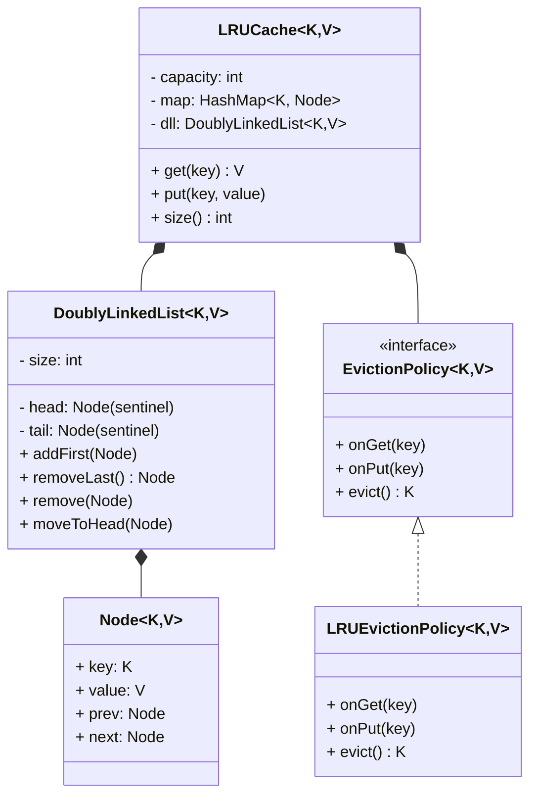

# LRU Cache — Low Level Design

## Problem Statement
Design and implement a **Least Recently Used (LRU) Cache** — a data structure that stores a limited number of key-value pairs. When the cache is full and a new entry needs to be added, the **least recently used** entry is evicted to make room.

This is one of the most frequently asked LLD questions (also appears as a LeetCode problem — #146). It tests your understanding of data structures, time complexity analysis, and clean OOP design.

---

## Requirements

### Functional Requirements
1.  **`get(key)`** — Return the value associated with the key. If the key exists, mark it as **most recently used**. If not, return `-1` / `null`.
2.  **`put(key, value)`** — Insert or update a key-value pair. If the cache is at capacity, **evict the least recently used** item before inserting.
3.  Both operations must run in **O(1)** time complexity.
4.  The cache has a **fixed capacity** set at creation time.

### Non-Functional Requirements
-   Thread-safe for concurrent access (bonus for interviews).
-   Extensible to support other eviction policies (LFU, FIFO) — Strategy pattern.

---

## Core Data Structure

The O(1) constraint for both `get` and `put` dictates the data structure choice:

| Operation | HashMap alone | LinkedList alone | HashMap + DoublyLinkedList |
|-----------|--------------|-----------------|---------------------------|
| `get(key)` lookup | O(1) ✅ | O(n) ❌ | O(1) ✅ |
| Move to front (mark as recent) | N/A | O(1) if you have the node ✅ | O(1) ✅ |
| Evict LRU (remove tail) | O(n) ❌ | O(1) ✅ | O(1) ✅ |
| `put(key, value)` | O(1) ✅ | O(n) ❌ | O(1) ✅ |

**Answer: HashMap + Doubly Linked List**

```
HashMap<Key, Node>  →  gives O(1) lookup by key
DoublyLinkedList    →  gives O(1) insertion/removal at both ends
                       and O(1) move-to-front (since we have the node reference)

Head ↔ [Most Recent] ↔ [Recent] ↔ ... ↔ [Least Recent] ↔ Tail
                                                            ↑
                                                    evict this one
```

---

## Class Diagram



---

## Design Patterns Used

| Pattern | Where Applied | Why |
|---------|---------------|-----|
| **Strategy** | `EvictionPolicy` | Swappable eviction algorithms (LRU, LFU, FIFO) |
| **Generics** | `LRUCache<K,V>` | Type-safe, reusable cache for any key-value types |

---

## Step-by-Step Walkthrough

### `put(key, value)` Flow
```
1. Key exists in map?
   YES → Update value, move node to head (most recent)
   NO  → Is cache full?
         YES → Remove tail node (LRU), delete from map
         NO  → (proceed)
         Create new node, add to head, add to map
```

### `get(key)` Flow
```
1. Key exists in map?
   YES → Move node to head (most recent), return value
   NO  → Return null / -1
```

---

## Real-world Use Cases
1.  **CPU Cache** — L1/L2/L3 caches use LRU (or approximations) to cache frequently accessed memory pages.
2.  **Database Query Cache** — MySQL's query cache, Redis, Memcached all implement LRU eviction.
3.  **Web Browser Cache** — Browsers cache recently visited pages/resources and evict old ones.
4.  **Operating System Page Replacement** — Virtual memory page replacement algorithms (LRU is one of several).
5.  **CDN Edge Caching** — CDNs like Cloudflare/Akamai use LRU to decide which content to keep at edge locations.
6.  **DNS Resolution Cache** — DNS resolvers cache recent lookups and evict stale/old entries.

---

## Key Interview Discussion Points

### 1. Why a Doubly Linked List (not Singly)?
With a singly linked list, removing a node requires finding its predecessor → O(n). With a doubly linked list, every node has a `prev` pointer, so removal is O(1): `node.prev.next = node.next`.

### 2. Why Sentinel Nodes (Dummy Head/Tail)?
Without sentinels, you need null checks everywhere:
```java
if (head == null) { ... }           // empty list
if (node == head) { ... }           // removing head
if (node == tail) { ... }           // removing tail
```
With sentinels, the head and tail are never null, and every real node always has a `prev` and `next` → eliminates all edge cases.

### 3. Thread Safety (Follow-up)
-   Simplest: `synchronized` on every method → coarse-grained locking.
-   Better: `ReentrantReadWriteLock` → multiple concurrent reads, exclusive writes.
-   Best: `ConcurrentHashMap` + segmented locks (like Guava's `CacheBuilder`).

### 4. How would you support TTL (Time-To-Live)?
Add an `expiryTime` field to each Node. On `get()`, check if the node has expired — if so, treat it as a cache miss and evict it. A background thread can periodically clean expired entries.

### 5. LRU vs LFU
| Feature | LRU | LFU |
|---------|-----|-----|
| Eviction Criterion | Least recently **used** | Least **frequently** used |
| Data Structure | HashMap + DLL | HashMap + Min-Heap / Frequency Map |
| Best for | Temporal locality | Frequency-based access patterns |
| Complexity | O(1) easily | O(1) possible but trickier |
