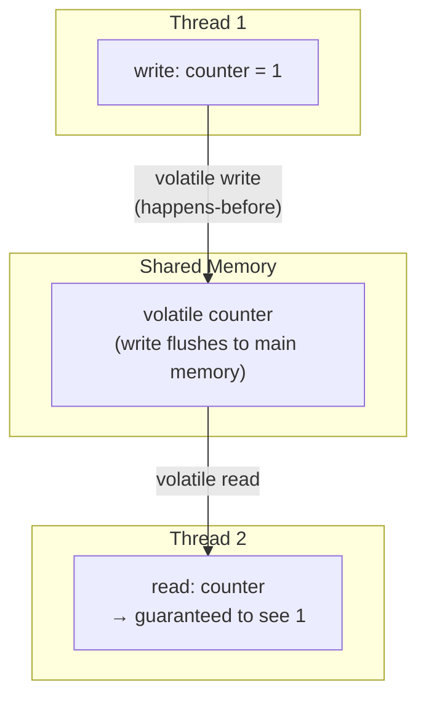
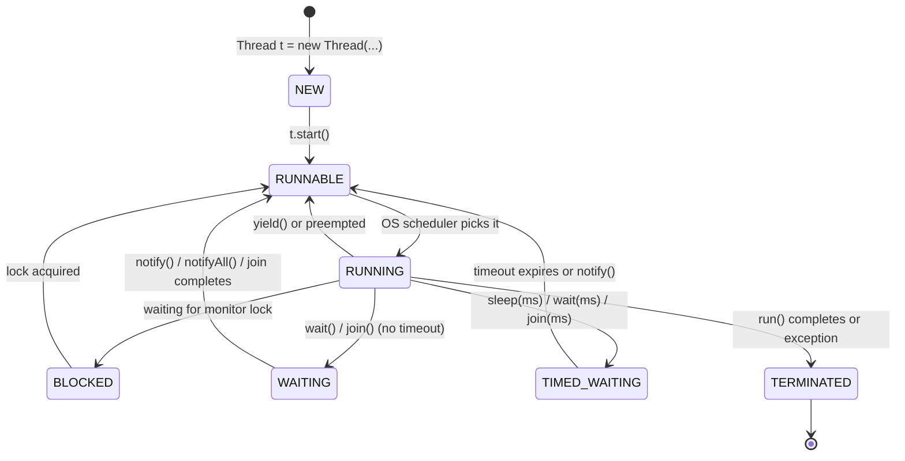
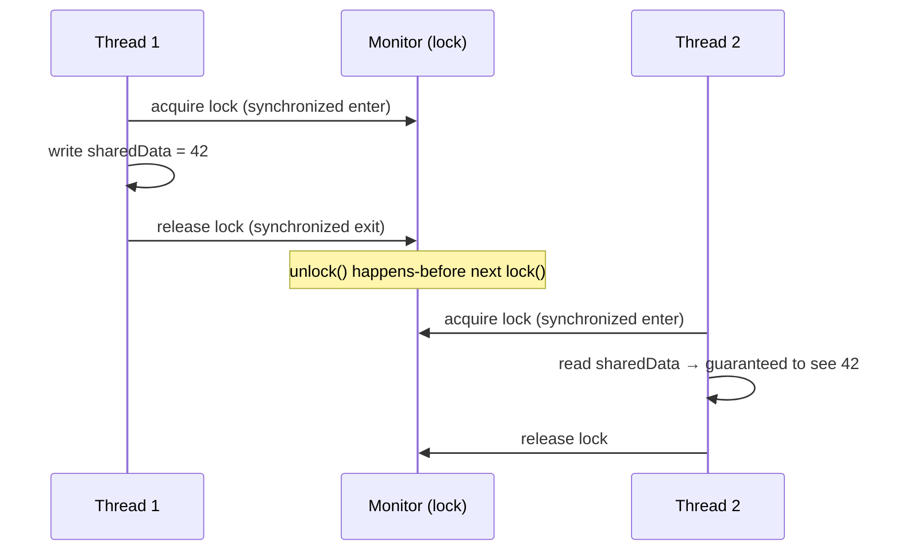
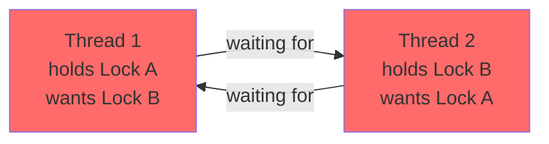
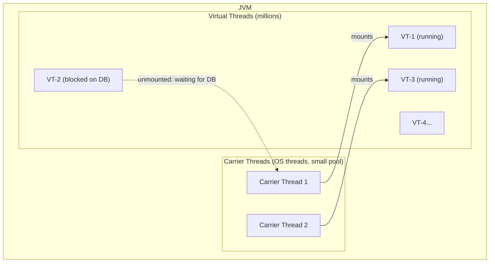

# Java Multithreading — Complete Interview Guide for Senior Software Engineers

---

## 1. Why Multithreading?

Modern hardware has multiple CPU cores. A single-threaded program uses **ONE core** — wasting the rest. Multithreading lets you:

| Goal | How Multithreading Helps |
|------|--------------------------|
| **Throughput** | Process multiple requests simultaneously (web servers) |
| **Responsiveness** | UI thread stays alive while background work runs |
| **Resource utilization** | Use all CPU cores; overlap I/O waits with computation |
| **Latency reduction** | Parallelize independent subtasks, then combine results |

**Core challenges:** Race conditions, deadlocks, visibility issues, starvation — all covered below.

---

## 2. JVM Memory Model (JMM) — Foundation of Everything

### 2.1 The Problem Without JMM Guarantees

```
CPU 1 Core                CPU 2 Core
┌─────────────────┐       ┌─────────────────┐
│  L1 Cache       │       │  L1 Cache       │
│  x = 1 (cached) │       │  x = 0 (stale!) │
└────────┬────────┘       └────────┬────────┘
         │ L2/L3 Cache             │
         └──────────┬──────────────┘
                    │ Main Memory
               ┌────┴────┐
               │  x = 1  │
               └─────────┘

Thread 1 writes x=1 → updates L1 cache, eventually flushes to main memory
Thread 2 reads x   → may read STALE 0 from its own L1 cache!
```

This is a **visibility problem** — a thread may not see writes made by another thread.

### 2.2 Java Memory Model (JSR-133) — The Rules

The JMM defines **happens-before** relationships. If action A **happens-before** action B, then:
- All writes by A are **visible** to B.
- A's actions appear to occur **before** B's.

**Key happens-before rules:**

| Rule | Guarantee |
|------|-----------|
| **Program order** | Each statement in a thread happens-before the next |
| **Monitor lock** | `unlock()` happens-before any subsequent `lock()` of the same monitor |
| **volatile write** | Write to volatile field happens-before any subsequent read of that field |
| **Thread start** | `thread.start()` happens-before any action in the started thread |
| **Thread join** | All actions in thread T happen-before `t.join()` returns |
| **Transitivity** | If A→B and B→C, then A→C |

### 2.3 Memory Model Diagram



---

## 3. Thread Lifecycle



### Key States Explained

| State | Cause | How to Exit |
|-------|-------|-------------|
| **NEW** | Thread object created, not started | Call `start()` |
| **RUNNABLE** | Ready to run or running | OS schedules it |
| **BLOCKED** | Waiting to acquire an intrinsic lock (`synchronized`) | Lock is released by holder |
| **WAITING** | `wait()`, `join()` with no timeout | `notify()`, `notifyAll()`, or join completes |
| **TIMED_WAITING** | `sleep(ms)`, `wait(ms)`, `join(ms)` | Timeout expires or interrupted |
| **TERMINATED** | `run()` returns or throws exception | N/A |

---

## 4. Creating Threads — 4 Ways

### 4.1 Extend Thread (avoid in practice)
```java
class MyThread extends Thread {
    @Override
    public void run() {
        System.out.println("Running in: " + Thread.currentThread().getName());
    }
}
new MyThread().start();
```
**Drawback:** Java allows only single inheritance. Extending Thread prevents extending other classes.

### 4.2 Implement Runnable (preferred for simple tasks)
```java
Runnable task = () -> System.out.println("Running: " + Thread.currentThread().getName());
Thread t = new Thread(task, "worker-1");
t.start();
```
**Separation of concerns:** Task logic is decoupled from thread management.

### 4.3 Implement Callable (returns a result, can throw checked exceptions)
```java
Callable<Integer> callable = () -> {
    Thread.sleep(100);
    return 42;
};
FutureTask<Integer> futureTask = new FutureTask<>(callable);
new Thread(futureTask).start();
Integer result = futureTask.get();  // blocks until done
```

### 4.4 ExecutorService (production standard — ALWAYS use this)
```java
ExecutorService executor = Executors.newFixedThreadPool(4);
Future<Integer> future = executor.submit(() -> heavyComputation());
executor.shutdown();                    // no new tasks
executor.awaitTermination(60, SECONDS); // wait for all tasks

// Preferred in Java 9+:
try (ExecutorService exec = Executors.newVirtualThreadPerTaskExecutor()) {
    exec.submit(() -> processOrder(orderId));
}
```
> **Interview Tip:** "In production we never create raw threads. We use executor services for thread lifecycle management, resource bounds, and graceful shutdown."

---

## 5. Synchronization — Controlling Access

### 5.1 The Race Condition Problem

```java
// BROKEN — two threads incrementing a shared counter
class Counter {
    private int count = 0;

    public void increment() {
        count++;  // NOT ATOMIC: read → increment → write (3 steps)
    }
}
// If Thread1 and Thread2 both read count=0 simultaneously,
// both write count=1 → we lost an increment!
```

**Race condition:** Outcome depends on non-deterministic thread scheduling.

### 5.2 synchronized (Intrinsic Lock / Monitor)

```java
class Counter {
    private int count = 0;
    private final Object lock = new Object();

    // Option 1: synchronized method (locks on 'this')
    public synchronized void increment() {
        count++;
    }

    // Option 2: synchronized block (finer-grained, preferred)
    public void decrement() {
        synchronized (lock) {   // lock on a specific object
            count--;
        }
    }

    // Option 3: synchronized static (locks on Class object)
    public static synchronized void staticMethod() { ... }
}
```

**How it works internally:**
```
Each Object has a "monitor" (intrinsic lock).
synchronized(obj) {
    1. Thread tries to acquire obj's monitor
    2. If acquired → enters critical section
    3. Other threads trying to acquire: → BLOCKED state
    4. When exiting synchronized block → monitor released
    5. One blocked thread gets the monitor (non-deterministic)
}
```

### 5.3 volatile — Visibility Without Mutual Exclusion

```java
class TaskRunner {
    private volatile boolean running = true;  // volatile!

    public void stop() {
        running = false;  // write is immediately visible to all threads
    }

    public void run() {
        while (running) {  // always reads from main memory, not cached value
            doWork();
        }
    }
}
```

**volatile guarantees:**
- ✅ **Visibility**: Writes are immediately flushed to main memory; reads bypass cache.
- ✅ **Ordering**: No reordering across a volatile read/write.
- ❌ **Atomicity**: `volatile int count; count++` is STILL NOT ATOMIC (3 ops).

**When to use volatile:**
- Boolean flags (stop/start/cancelled)
- Simple status fields read by many threads, written by one
- NOT for compound operations (check-then-act, read-modify-write)

### 5.4 Happens-Before with Synchronization



---

## 6. java.util.concurrent.locks — Advanced Locking

### 6.1 ReentrantLock — Flexible Locking

```java
class BankAccount {
    private double balance;
    private final ReentrantLock lock = new ReentrantLock();

    public void deposit(double amount) {
        lock.lock();          // explicit lock acquisition
        try {
            balance += amount;
        } finally {
            lock.unlock();    // ALWAYS in finally — prevents lock leak on exception
        }
    }

    // TryLock with timeout — avoids deadlock
    public boolean withdraw(double amount) throws InterruptedException {
        if (lock.tryLock(100, TimeUnit.MILLISECONDS)) {
            try {
                if (balance >= amount) {
                    balance -= amount;
                    return true;
                }
                return false;
            } finally {
                lock.unlock();
            }
        }
        return false; // couldn't acquire lock within 100ms → back off
    }

    // Non-blocking try
    public boolean tryWithdraw(double amount) {
        if (lock.tryLock()) {  // returns immediately if lock not available
            try {
                balance -= amount; return true;
            } finally { lock.unlock(); }
        }
        return false;
    }
}
```

**ReentrantLock vs synchronized:**

| Feature | `synchronized` | `ReentrantLock` |
|---------|---------------|-----------------|
| Fairness | No | Optional (`new ReentrantLock(true)`) |
| Interruptible | No | `lockInterruptibly()` |
| Timeout | No | `tryLock(timeout, unit)` |
| Try without block | No | `tryLock()` |
| Multiple conditions | 1 (wait/notify) | Many (`newCondition()`) |
| Reentrant | Yes | Yes |
| Performance | Good | Similar |

### 6.2 ReadWriteLock — Concurrent Reads, Exclusive Writes

```java
class Cache<K, V> {
    private final Map<K, V> map = new HashMap<>();
    private final ReadWriteLock rwLock = new ReentrantReadWriteLock();
    private final Lock readLock  = rwLock.readLock();
    private final Lock writeLock = rwLock.writeLock();

    public V get(K key) {
        readLock.lock();        // Multiple readers allowed simultaneously
        try {
            return map.get(key);
        } finally {
            readLock.unlock();
        }
    }

    public void put(K key, V value) {
        writeLock.lock();       // Exclusive — blocks all readers AND writers
        try {
            map.put(key, value);
        } finally {
            writeLock.unlock();
        }
    }
}
```

**When to use:** Read-heavy workloads (caches, configuration stores). Read lock allows N concurrent readers. Write lock is exclusive.

### 6.3 StampedLock — Optimistic Reads (Java 8+)

```java
class Point {
    private double x, y;
    private final StampedLock lock = new StampedLock();

    public double distanceFromOrigin() {
        // Optimistic read — doesn't block writers
        long stamp = lock.tryOptimisticRead();
        double cx = x, cy = y;

        if (!lock.validate(stamp)) {
            // Writer changed x or y while we were reading → fall back to read lock
            stamp = lock.readLock();
            try { cx = x; cy = y; }
            finally { lock.unlockRead(stamp); }
        }
        return Math.sqrt(cx * cx + cy * cy);
    }
}
```

> **Interview Tip:** "StampedLock's optimistic read has zero overhead when there's no contention — no lock acquisition at all. We use it for read-mostly point/vector/geometry data structures."

---

## 7. Atomic Classes — Lock-Free Thread Safety

### 7.1 How CAS (Compare-And-Swap) Works

Atomic classes use **CPU-level CAS instructions** (lock-free, non-blocking):

```
CAS(memory_location, expected_value, new_value):
  1. Read current value at memory_location
  2. If current == expected: write new_value, return true
  3. If current != expected: do nothing, return false (retry)

This is a SINGLE atomic CPU instruction (CMPXCHG on x86)
→ No lock, no blocking — much faster than synchronized
```

### 7.2 AtomicInteger / AtomicLong / AtomicReference

```java
// AtomicInteger — thread-safe counter
AtomicInteger counter = new AtomicInteger(0);

counter.incrementAndGet();          // atomic: count++, return new
counter.getAndIncrement();          // atomic: return old, count++
counter.addAndGet(5);               // atomic: count += 5, return new
counter.compareAndSet(10, 0);       // if count==10, set to 0. Return bool

// AtomicReference — thread-safe reference update
AtomicReference<String> ref = new AtomicReference<>("hello");
ref.compareAndSet("hello", "world"); // swap only if current=="hello"

// AtomicLong for counters (high contention):
// Better: use LongAdder (less contention via striped counters)
LongAdder adder = new LongAdder();
adder.increment();          // faster than AtomicLong under high contention
long total = adder.sum();
```

### 7.3 LongAdder vs AtomicLong

```
AtomicLong (one counter):
  Thread1 → CAS(0→1) → success
  Thread2 → CAS(0→1) → fail → retry: CAS(1→2) → success
  Thread3 → CAS(0→1) → fail → fail → retry...
  → Contention grows with number of threads

LongAdder (striped counters):
  [cell0] [cell1] [cell2] [cell3]
  Thread1 → updates cell0
  Thread2 → updates cell1  (different cell, no contention)
  Thread3 → updates cell2
  sum() = cell0 + cell1 + cell2 + cell3

LongAdder is ~5x faster under high thread contention.
Use AtomicLong when you need exact reads frequently.
Use LongAdder for high-throughput counters, metrics.
```

---

## 8. Inter-Thread Communication — wait/notify

### 8.1 Producer-Consumer with wait/notify

```java
class BoundedBuffer<T> {
    private final Queue<T> buffer = new LinkedList<>();
    private final int capacity;

    BoundedBuffer(int capacity) { this.capacity = capacity; }

    // Producer calls this
    public synchronized void put(T item) throws InterruptedException {
        while (buffer.size() == capacity) {      // WHILE not if (spurious wakeups!)
            wait();                              // releases lock, waits for notify
        }
        buffer.offer(item);
        notifyAll();                             // wake all waiting consumers
    }

    // Consumer calls this
    public synchronized T take() throws InterruptedException {
        while (buffer.isEmpty()) {               // WHILE not if
            wait();
        }
        T item = buffer.poll();
        notifyAll();                             // wake waiting producers
        return item;
    }
}
```

**CRITICAL: Always use `while` not `if` around `wait()`!**
```
WHY? Spurious wakeups:
  1. A thread can wake up from wait() WITHOUT being notified (JVM/OS quirk).
  2. Multiple consumers notified by notifyAll() → one gets the lock, takes the item.
     Others wake up: buffer is EMPTY again. Must re-check condition!

RULE: if (condition) wait()  → WRONG
      while (condition) wait() → CORRECT
```

### 8.2 notify vs notifyAll

| | `notify()` | `notifyAll()` |
|-|-----------|--------------|
| Wakes | ONE thread (arbitrary) | ALL waiting threads |
| Risk | Wrong thread woken → starvation | Safe but more contention |
| Use when | All waiters are identical (one type of waiter) | Multiple types of waiters |
| Preferred | Rarely | Almost always safer |

> **Interview Tip:** "We always use `notifyAll()` over `notify()` unless we can mathematically prove that only one type of thread waits on this monitor and one wakeup is always sufficient."

---

## 9. ExecutorService and Thread Pools

### 9.1 Why Thread Pools?

```
WITHOUT thread pools:
  For each request: new Thread(task).start()
  Problems:
  - Thread creation overhead: ~1ms per thread
  - Memory: each thread = 512KB–1MB stack
  - 10,000 requests → 10,000 threads → OOM / context switching overhead

WITH thread pool:
  N threads created once, reused for M >> N tasks
  - No creation overhead per task
  - Bounded memory (N threads controlled)
  - Queue overflow = reject policy (backpressure)
```

### 9.2 Thread Pool Types

```java
// Fixed Thread Pool — N threads always running
ExecutorService fixed = Executors.newFixedThreadPool(8);
// Use for: CPU-bound tasks. Threads = number of CPU cores.

// Cached Thread Pool — unlimited threads, idle threads recycled after 60s
ExecutorService cached = Executors.newCachedThreadPool();
// Use for: short-lived, bursty I/O tasks.
// Risk: can spawn thousands of threads under load → OOM

// Single Thread Executor — exactly 1 thread, tasks queued sequentially
ExecutorService single = Executors.newSingleThreadExecutor();
// Use for: sequential processing with isolation (event loop pattern)

// Scheduled Thread Pool — for delayed / periodic tasks
ScheduledExecutorService scheduler = Executors.newScheduledThreadPool(2);
scheduler.schedule(task, 5, SECONDS);                          // once, after delay
scheduler.scheduleAtFixedRate(task, 0, 10, SECONDS);           // every 10s
scheduler.scheduleWithFixedDelay(task, 0, 10, SECONDS);        // 10s after completion

// Virtual Thread Executor (Java 21+) — lightweight threads, millions possible
ExecutorService virtual = Executors.newVirtualThreadPerTaskExecutor();
// Use for: I/O-bound tasks (DB, HTTP). Replaces cached thread pool for I/O.
```

### 9.3 ThreadPoolExecutor — The Full Constructor

```java
ThreadPoolExecutor executor = new ThreadPoolExecutor(
    4,                              // corePoolSize: always-alive threads
    8,                              // maximumPoolSize: max threads under load
    60L, TimeUnit.SECONDS,          // keepAliveTime: idle thread timeout
    new LinkedBlockingQueue<>(100), // workQueue: task queue (bounded!)
    new ThreadFactory() {           // custom thread factory (name threads!)
        private int count = 0;
        public Thread newThread(Runnable r) {
            return new Thread(r, "order-processor-" + count++);
        }
    },
    new ThreadPoolExecutor.CallerRunsPolicy() // rejection policy
);

/*
 * REJECTION POLICIES (when queue is full AND maxPoolSize reached):
 *
 * AbortPolicy (default) : throw RejectedExecutionException
 * CallerRunsPolicy      : caller thread runs the task (natural back-pressure)
 * DiscardPolicy         : silently drop new tasks
 * DiscardOldestPolicy   : drop oldest queued task, retry submission
 */
```

### 9.4 Thread Pool Sizing Rules

```
CPU-BOUND TASKS (no I/O wait):
  threads = number of CPU cores (no idle waiting)
  int cores = Runtime.getRuntime().availableProcessors();
  int threads = cores;      // or cores + 1 for thread contention buffer

I/O-BOUND TASKS (DB, HTTP, file):
  threads = cores × (1 + wait_time / compute_time)
  Example: 4 cores, I/O takes 90% of time:
    threads = 4 × (1 + 0.9/0.1) = 4 × 10 = 40 I/O threads

LITTLE'S LAW:
  throughput (req/s) = thread_count / avg_latency_seconds
  If avg DB call = 50ms, target throughput = 1000 req/s:
    threads = 1000 × 0.05 = 50 thread minimum

VIRTUAL THREADS (Java 21):
  I/O-bound: use virtual threads → no sizing needed (millions creatable)
  CPU-bound: use platform threads = number of cores
```

---

## 10. Future and CompletableFuture

### 10.1 Future — Basic Async Result

```java
ExecutorService exec = Executors.newFixedThreadPool(4);

Future<Integer> future = exec.submit(() -> {
    Thread.sleep(1000);  // simulate I/O
    return 42;
});

// Do other work while computation runs...
System.out.println("Computing...");

// Block until result available
Integer result = future.get();                    // blocks indefinitely
Integer result2 = future.get(2, TimeUnit.SECONDS); // with timeout

future.cancel(true); // attempt to cancel (interrupts if running)
future.isDone();     // true if completed (success, cancel, or exception)
```

**Future limitations:**
- Cannot chain async tasks.
- Cannot combine multiple futures.
- No built-in non-blocking callbacks.
- Exception handling is clunky (`ExecutionException`).

### 10.2 CompletableFuture — Async Pipeline (Java 8+)

```java
// ── 1. Create a completed / async future ────────────────────────
CompletableFuture<String> cf1 = CompletableFuture.completedFuture("hello");
CompletableFuture<Integer> cf2 = CompletableFuture.supplyAsync(() -> fetchFromDB());

// ── 2. thenApply — transform result (like map) ──────────────────
CompletableFuture<Integer> length = cf1
    .thenApply(String::length);  // runs on ForkJoinPool (or provide executor)

// ── 3. thenCompose — chain async tasks (like flatMap) ───────────
CompletableFuture<Order> orderFuture = findUserId("alice")
    .thenCompose(userId -> fetchOrder(userId));  // avoids nested futures

// ── 4. thenCombine — merge two independent futures ──────────────
CompletableFuture<String> combined =
    CompletableFuture.supplyAsync(() -> "Hello")
        .thenCombine(
            CompletableFuture.supplyAsync(() -> " World"),
            (a, b) -> a + b
        );  // "Hello World"

// ── 5. allOf — wait for ALL futures ─────────────────────────────
CompletableFuture<Void> allDone = CompletableFuture.allOf(cf1, cf2);
allDone.join();  // wait for all

// ── 6. anyOf — return first completed future ─────────────────────
CompletableFuture<Object> first = CompletableFuture.anyOf(cf1, cf2);

// ── 7. Exception handling ─────────────────────────────────────────
CompletableFuture<Integer> safe = CompletableFuture
    .supplyAsync(() -> riskyOperation())
    .exceptionally(ex -> -1)                          // fallback on exception
    .handle((result, ex) -> ex != null ? -1 : result); // handle both cases

// ── 8. Full async pipeline example ────────────────────────────────
CompletableFuture.supplyAsync(() -> getUserId("alice"), executor)   // async DB
    .thenCompose(id -> CompletableFuture.supplyAsync(               // async HTTP
        () -> fetchProfile(id), executor))
    .thenApply(profile -> transform(profile))                       // sync transform
    .thenAccept(result -> sendResponse(result))                     // terminal
    .exceptionally(ex -> { logError(ex); return null; });
```

### 10.3 CompletableFuture Execution Thread Rules

```
thenApply / thenAccept / thenRun    → runs on completing thread (or current)
thenApplyAsync / thenAcceptAsync    → runs on ForkJoinPool.commonPool()
thenApplyAsync(fn, executor)        → runs on provided executor

IMPORTANT: Always provide an executor for production code!
CompletableFuture.supplyAsync(this::dbCall, myExecutor)
    .thenApplyAsync(this::transform, myExecutor)
```

---

## 11. Concurrent Collections

### 11.1 Overview

| Collection | Thread-Safe? | Notes |
|-----------|-------------|-------|
| `ArrayList`, `HashMap` | ❌ No | Use in single-threaded code only |
| `Vector`, `Hashtable` | ✅ Synchronized | Obsolete — full lock, poor performance |
| `Collections.synchronizedList(list)` | ✅ | Better than Vector, but still coarse lock |
| `CopyOnWriteArrayList` | ✅ | Snapshot on write. Read-heavy, rare writes |
| `ConcurrentHashMap` | ✅ | Segment/bucket-level locking. High concurrency |
| `LinkedBlockingQueue` | ✅ | Bounded/unbounded blocking queue |
| `ArrayBlockingQueue` | ✅ | Bounded FIFO blocking queue |
| `ConcurrentLinkedQueue` | ✅ | Non-blocking (CAS-based) unbounded queue |
| `PriorityBlockingQueue` | ✅ | Blocking priority queue (no capacity bound) |
| `ConcurrentSkipListMap` | ✅ | Sorted concurrent map (TreeMap alternative) |

### 11.2 ConcurrentHashMap Internals

```
HashMap (not thread-safe):
  [bucket0] → [entry] → [entry]
  [bucket1] → [entry]
  All operations lock the ENTIRE map

ConcurrentHashMap (Java 8+):
  Uses CAS + synchronized on individual BUCKETS
  [bucket0] → [entry] → [entry]  ← lock this bucket only
  [bucket1] → [entry]            ← different thread can lock this
  ...
  → Multiple threads can read/write different buckets SIMULTANEOUSLY
  → Only one thread locks a bucket at a time
  → Default: 16 "segments" of concurrency
```

```java
ConcurrentHashMap<String, Integer> map = new ConcurrentHashMap<>();

// Atomic compute operations:
map.putIfAbsent("key", 1);
map.computeIfAbsent("key", k -> expensiveCompute(k));
map.compute("key", (k, v) -> v == null ? 1 : v + 1);  // atomic increment
map.merge("key", 1, Integer::sum);                      // atomic merge

// Iterating is safe (weakly-consistent):
map.forEach((k, v) -> process(k, v));  // safe — won't throw ConcurrentModificationException
```

### 11.3 BlockingQueue — Foundation of Thread Pools

```java
BlockingQueue<Task> queue = new LinkedBlockingQueue<>(100);

// PRODUCER
queue.put(task);           // blocks if queue is full (backpressure)
queue.offer(task, 100, MILLISECONDS);  // wait 100ms, then give up

// CONSUMER
Task task = queue.take();  // blocks if queue is empty
Task task2 = queue.poll(100, MILLISECONDS); // wait 100ms, return null if empty

// NEVER use:
queue.add(task);           // throws IllegalStateException if full
queue.remove();            // throws NoSuchElementException if empty
```

---

## 12. Classic Concurrent Problems

### 12.1 Producer-Consumer (BlockingQueue version)

```java
class ProducerConsumer {
    private final BlockingQueue<String> queue = new LinkedBlockingQueue<>(10);

    class Producer implements Runnable {
        public void run() {
            for (int i = 0; i < 100; i++) {
                try {
                    String item = "item-" + i;
                    queue.put(item);    // blocks if queue full
                    System.out.println("Produced: " + item);
                } catch (InterruptedException e) {
                    Thread.currentThread().interrupt();
                    return;
                }
            }
        }
    }

    class Consumer implements Runnable {
        public void run() {
            while (!Thread.currentThread().isInterrupted()) {
                try {
                    String item = queue.poll(1, SECONDS);
                    if (item != null) {
                        System.out.println("Consumed: " + item);
                        process(item);
                    }
                } catch (InterruptedException e) {
                    Thread.currentThread().interrupt();
                    return;
                }
            }
        }
    }
}
```

### 12.2 Dining Philosophers — Deadlock Avoidance

```
5 philosophers, 5 forks.
Each needs 2 forks to eat.
Naive solution: each picks up left fork, then waits for right → DEADLOCK.

FIX 1 — Resource ordering (always acquire lower-numbered fork first):
```

```java
class Philosopher implements Runnable {
    private final int id;
    private final ReentrantLock leftFork, rightFork;

    Philosopher(int id, ReentrantLock[] forks) {
        this.id = id;
        // Always acquire lower index first → breaks circular wait
        int left = id, right = (id + 1) % forks.length;
        if (left < right) {
            this.leftFork  = forks[left];
            this.rightFork = forks[right];
        } else {
            this.leftFork  = forks[right];  // reversed for last philosopher
            this.rightFork = forks[left];
        }
    }

    public void run() {
        while (true) {
            think();
            leftFork.lock();
            try {
                rightFork.lock();
                try {
                    eat();
                } finally { rightFork.unlock(); }
            } finally { leftFork.unlock(); }
        }
    }
}
```

### 12.3 Read-Write Lock Pattern

```java
class ReadWriteCache {
    private final Map<String, String> cache = new HashMap<>();
    private final StampedLock lock = new StampedLock();

    public String get(String key) {
        long stamp = lock.tryOptimisticRead();      // optimistic: no blocking
        String value = cache.get(key);
        if (lock.validate(stamp)) return value;     // no write occurred → return

        stamp = lock.readLock();                    // fallback to read lock
        try { return cache.get(key); }
        finally { lock.unlockRead(stamp); }
    }

    public void put(String key, String value) {
        long stamp = lock.writeLock();
        try { cache.put(key, value); }
        finally { lock.unlockWrite(stamp); }
    }
}
```

---

## 13. Deadlock, Livelock, Starvation

### 13.1 Deadlock

**Deadlock** occurs when two or more threads are each waiting for a lock held by the other.



**4 Conditions for Deadlock (Coffman's Conditions):**
1. **Mutual exclusion** — resource held exclusively
2. **Hold and wait** — thread holds one resource while waiting for another
3. **No preemption** — locks can't be forcibly taken away
4. **Circular wait** — cycle of threads each waiting for the next

**Break any one condition to prevent deadlock:**
```java
// Break circular wait: always acquire locks in fixed order
// WRONG:
Thread1: lock(A) then lock(B)
Thread2: lock(B) then lock(A)  ← different order = potential deadlock

// RIGHT:
Thread1: lock(A) then lock(B)
Thread2: lock(A) then lock(B)  ← same order always
```

**Detect with thread dump:**
```bash
jstack <pid>          # dump all thread states
jcmd <pid> Thread.print
# Look for "BLOCKED" threads and "waiting to lock <0xXXXX>"
# Trace the cycle
```

### 13.2 Livelock

Threads are active but failing to make progress — keep responding to each other:
```
Two people in a hallway stepping aside for each other simultaneously,
forever. Both are moving (not blocked) but neither gets past.
```

**Example:** Two threads each detect a conflict and back off, but both back off and retry at the same time → forever.

**Fix:** Use randomized backoff (retry after random delay).

### 13.3 Starvation

A thread never gets CPU time because higher-priority threads always win.

**Fix:**
- Use fair locks: `new ReentrantLock(true)` (FIFO ordering — longer wait = higher priority).
- Use proper priority in thread pool.

---

## 14. Semaphore, CountDownLatch, CyclicBarrier, Phaser

### 14.1 Semaphore — Limit Concurrent Access

```java
// Allow at most 3 threads to access DB simultaneously
Semaphore dbSemaphore = new Semaphore(3, true); // fair=true

void queryDatabase(String sql) throws InterruptedException {
    dbSemaphore.acquire();  // decrement permit count; block if 0
    try {
        executeQuery(sql);
    } finally {
        dbSemaphore.release(); // increment permit count
    }
}
```

**Use case:** Connection pool limiting, rate limiting, resource guards.

### 14.2 CountDownLatch — One-time Barrier

```java
// Main thread waits for 3 worker threads to finish
CountDownLatch latch = new CountDownLatch(3);

for (int i = 0; i < 3; i++) {
    new Thread(() -> {
        doWork();
        latch.countDown();          // decrement count
    }).start();
}

latch.await();                       // block until count reaches 0
System.out.println("All done!");

// With timeout:
boolean completed = latch.await(10, SECONDS);
```

**Use case:** Integration tests, parallel task fan-out + join, startup barriers.
**Important:** Cannot be reset — single use only.

### 14.3 CyclicBarrier — Reusable Barrier (N threads meet)

```java
// 4 threads each compute a quarter of a matrix, then combine
CyclicBarrier barrier = new CyclicBarrier(4, () -> {
    // runs when all 4 threads arrive — before any continue
    combineResults();
});

class Worker implements Runnable {
    public void run() {
        computeMyPart();
        barrier.await();       // wait for all 4 threads
        // all threads continue here simultaneously
        useSharedResult();
        barrier.await();       // CyclicBarrier RESETS → can use again
    }
}
```

**vs CountDownLatch:**
- CountDownLatch: one-time, latch holder doesn't participate
- CyclicBarrier: reusable, all parties participate and continue together

### 14.4 Phaser — Advanced Flexible Barrier (Java 7+)

```java
Phaser phaser = new Phaser(3); // 3 parties

// Each thread calls arriveAndAwaitAdvance() to advance to next phase
new Thread(() -> {
    phase1Work();
    phaser.arriveAndAwaitAdvance(); // wait for all → phase 1 done
    phase2Work();
    phaser.arriveAndAwaitAdvance(); // wait for all → phase 2 done
    phaser.arriveAndDeregister();   // deregister from further phases
}).start();
```

**Phaser advantages over CyclicBarrier:**
- Dynamic party registration/deregistration.
- Multiple phases with different party counts.
- Tiered (hierarchical) phasers for scalability.

---

## 15. Virtual Threads (Java 21) — Project Loom

### 15.1 Problem with Platform Threads

```
Traditional (platform) thread = OS thread
  - Mapped 1:1 with OS thread
  - Stack: 1MB+ per thread
  - Thread creation: ~1ms, scheduling: slow context switch

For a web server handling 10,000 concurrent I/O requests:
  10,000 OS threads × 1MB = 10GB RAM just for stacks!
  Most threads are BLOCKED (waiting on DB/HTTP) → wasted OS resources
```

### 15.2 Virtual Threads

```
Virtual thread = JVM-managed lightweight thread
  - NOT backed by OS thread (mounted on carrier thread as needed)
  - Stack: starts at ~1KB, grows dynamically
  - Creation: nanoseconds
  - 1 million virtual threads ≈ feasible
  - When virtual thread blocks on I/O → unmounts from carrier thread
    → carrier thread picks up another virtual thread → no blocking!
```



### 15.3 Using Virtual Threads

```java
// Java 21 — virtual threads
Thread vt = Thread.ofVirtual().name("vt-1").start(() -> {
    // blocking DB call — carrier thread is freed while waiting!
    var result = db.query("SELECT ...");
    process(result);
});

// With ExecutorService — most natural usage
try (var executor = Executors.newVirtualThreadPerTaskExecutor()) {
    for (int i = 0; i < 100_000; i++) {
        executor.submit(() -> handleRequest(request));
    }
} // auto-shutdown

// Spring Boot 3.2+: enable virtual threads
// application.properties:
// spring.threads.virtual.enabled=true
```

**When to use virtual threads:**
- ✅ I/O-bound tasks (DB queries, HTTP calls, file reads)
- ✅ High concurrency (many simultaneous connections)
- ❌ CPU-bound tasks (use platform thread pool = # of cores)
- ❌ Code with ThreadLocal in expensive frameworks (may cause issues)

---

## 16. ForkJoinPool and Parallel Streams

### 16.1 ForkJoinPool — Work Stealing

```java
// ForkJoinPool: designed for divide-and-conquer (recursive) tasks
ForkJoinPool pool = ForkJoinPool.commonPool(); // shared pool

// RecursiveTask<T> — task that returns a value
class SumTask extends RecursiveTask<Long> {
    private final int[] array;
    private final int start, end;
    private static final int THRESHOLD = 1000;

    @Override
    protected Long compute() {
        if (end - start <= THRESHOLD) {
            // Base case: compute directly
            long sum = 0;
            for (int i = start; i < end; i++) sum += array[i];
            return sum;
        }
        // Fork: split into two halves
        int mid = (start + end) / 2;
        SumTask left  = new SumTask(array, start, mid);
        SumTask right = new SumTask(array, mid, end);
        left.fork();                    // submit left asynchronously
        long rightResult = right.compute(); // compute right on this thread
        long leftResult  = left.join(); // wait for left
        return leftResult + rightResult;
    }
}

long total = pool.invoke(new SumTask(array, 0, array.length));
```

**Work stealing:** Idle threads steal tasks from busy threads' queues → maximizes CPU utilization.

### 16.2 Parallel Streams

```java
// Uses ForkJoinPool.commonPool() internally
long count = list.parallelStream()
    .filter(x -> x > 0)
    .mapToLong(x -> heavyCompute(x))
    .sum();

// With custom pool (avoid blocking commonPool):
ForkJoinPool customPool = new ForkJoinPool(4);
long result = customPool.submit(() ->
    list.parallelStream().mapToLong(this::compute).sum()
).get();

// WARNING: Don't use parallel streams when:
// - Operations have side effects (shared mutable state)
// - Tasks are too small (overhead > benefit)
// - Sequential performance is already fast (overhead adds up)
// - Order matters (use sequential stream or ensure sorted)
```

---

## 17. ThreadLocal

```java
// ThreadLocal: each thread has its OWN isolated copy of the variable
private static final ThreadLocal<DateFormat> dateFormat =
    ThreadLocal.withInitial(() -> new SimpleDateFormat("yyyy-MM-dd"));

// Use case: per-thread database connections, user contexts, request IDs
class RequestContext {
    private static final ThreadLocal<String> requestId = new ThreadLocal<>();

    public static void set(String id) { requestId.set(id); }
    public static String get()        { return requestId.get(); }
    public static void clear()        { requestId.remove(); } // MUST call in finally!
}

// CRITICAL: Always call remove() when done (especially in thread pools)
// Thread pools REUSE threads → ThreadLocal value from previous task leaks into next!
try {
    RequestContext.set(UUID.randomUUID().toString());
    handleRequest();
} finally {
    RequestContext.clear();  // prevent leaks in thread-pool threads
}
```

**InheritableThreadLocal:** Child threads inherit parent thread's values.

---

## 18. Interview Questions & Answers

### Q1: "What is the difference between `sleep()` and `wait()`?"

> | | `Thread.sleep(ms)` | `object.wait()` |
> |-|--------------------|-----------------|
> | **Lock release** | ❌ Does NOT release lock | ✅ Releases the monitor lock |
> | **Wakeup** | After timeout expires | `notify()` / `notifyAll()` / timeout |
> | **Class context** | Static method on Thread | Must be called inside `synchronized` |
> | **Interrupted?** | Yes (throws InterruptedException) | Yes (throws InterruptedException) |
> | **Use case** | Pause execution for a fixed time | Wait for a condition (inter-thread signaling) |

---

### Q2: "What is a race condition? Give an example and fix it."

> **Race condition:** Program behavior depends on the relative timing of threads.
>
> ```java
> // Race: two threads both read count=0, both write count=1 → lost increment
> int count = 0;
> count++; // read(0) → add 1 → write(1) — NOT atomic!
>
> // Fix 1: synchronized
> synchronized(this) { count++; }
>
> // Fix 2: AtomicInteger (lock-free, faster)
> AtomicInteger count = new AtomicInteger(0);
> count.incrementAndGet();
> ```

---

### Q3: "Explain volatile. When is it NOT enough?"

> **volatile** guarantees:
> - Visibility: writes immediately visible to all threads (no CPU cache stale reads).
> - Prevents instruction reordering across the volatile access.
>
> **NOT enough for:**
> ```java
> volatile int count = 0;
> count++; // STILL a race condition: read → increment → write (3 ops, not atomic)
>
> // NOT enough for:
> if (count == 0) count = 1; // check-then-act: not atomic
> ```
> Use `AtomicInteger` or `synchronized` for compound operations.

---

### Q4: "What are the 4 conditions for deadlock?"

> 1. **Mutual exclusion** — at least one resource held in non-shareable mode.
> 2. **Hold and wait** — thread holds a resource and waits for another.
> 3. **No preemption** — resources can't be forcibly taken from a thread.
> 4. **Circular wait** — T1 waits for T2, T2 waits for T3, T3 waits for T1.
>
> **Prevention:** Break circular wait by always acquiring locks in a fixed global order.
>
> **Detection:** `jstack <pid>` → look for BLOCKED threads in a cycle.

---

### Q5: "When would you choose `ReentrantLock` over `synchronized`?"

> Use `ReentrantLock` when you need:
> - **Trylock with timeout**: avoid indefinite blocking (`tryLock(100, ms)`).
> - **Interruptible lock**: `lockInterruptibly()` for cancellable lock waits.
> - **Fair scheduling**: `new ReentrantLock(true)` prevents starvation.
> - **Multiple condition variables**: `lock.newCondition()` for complex wait/notify patterns.
> - **Non-block-scoped locking**: acquire in one method, release in another.
>
> Use `synchronized` for simple cases — it's cleaner syntax and uses JIT optimizations (biased locking, lock elision).

---

### Q6: "How does ConcurrentHashMap differ from Hashtable?"

> | | `Hashtable` | `ConcurrentHashMap` |
> |-|------------|---------------------|
> | Locking | Entire map locked (one mutex) | Individual bucket/segment level |
> | Null keys/values | ❌ Not allowed | ❌ Not allowed |
> | Reads | Blocked by any write | Non-blocking (CAS-based reads) |
> | Throughput | Low (serialized) | High (concurrent reads + writes to different buckets) |
> | `computeIfAbsent` | Not available (atomic compute) | Atomic, built-in |
> | Iterator | Fail-fast (throws ConcurrentModException) | Weakly consistent (no exception) |

---

### Q7: "Explain the happens-before relationship."

> The JMM defines *happens-before* to describe memory visibility guarantees between threads. If action A *happens-before* B, then:
> - All of A's writes are visible to B.
> - A appears to happen before B in program order.
>
> Key rules:
> - `synchronized` unlock **happens-before** subsequent lock on the same monitor.
> - `volatile` write **happens-before** subsequent volatile read of the same field.
> - `thread.start()` **happens-before** any action in the new thread.
> - `thread.join()` **happens-before** actions after the join returns.
>
> **Practical impact:** Without happens-before, you can't rely on updates made by one thread being visible to another, even if they appear to be "after" in time.

---

### Q8: "What is the Double-Checked Locking pattern? Is it safe?"

> Used for lazy initialization of singletons:
>
> ```java
> // BROKEN (Java 1.4 and below):
> class Singleton {
>     private static Singleton instance;
>     public static Singleton getInstance() {
>         if (instance == null) {           // first check
>             synchronized (Singleton.class) {
>                 if (instance == null) {   // second check
>                     instance = new Singleton(); // NOT atomic!
>                     // Object construction has 3 steps:
>                     // 1. allocate memory
>                     // 2. initialize fields
>                     // 3. assign to 'instance'
>                     // JVM can reorder 2 and 3 → another thread sees non-null
>                     // but partially-constructed object!
>                 }
>             }
>         }
>         return instance;
>     }
> }
>
> // FIXED: use volatile (prevents reordering of steps 2 and 3)
> class Singleton {
>     private static volatile Singleton instance;  // volatile!
>     public static Singleton getInstance() {
>         if (instance == null) {
>             synchronized (Singleton.class) {
>                 if (instance == null) {
>                     instance = new Singleton();  // safe with volatile
>                 }
>             }
>         }
>         return instance;
>     }
> }
>
> // BEST: Use initialization-on-demand holder (no volatile, no sync in hot path)
> class Singleton {
>     private Singleton() {}
>     private static class Holder {
>         static final Singleton INSTANCE = new Singleton();
>         // Class loading is thread-safe by JVM guarantee
>     }
>     public static Singleton getInstance() { return Holder.INSTANCE; }
> }
> ```

---

### Q9: "What is thread starvation and how do you prevent it?"

> **Starvation:** A thread is perpetually denied CPU time because other higher-priority threads always win.
>
> **Causes:**
> - Non-fair locks: threads have no guaranteed turn.
> - Thread priority abuse: low-priority threads starved by high-priority.
> - Long-running synchronized blocks: other threads wait indefinitely.
>
> **Prevention:**
> ```java
> // Fair ReentrantLock: threads acquire in FIFO order
> ReentrantLock fairLock = new ReentrantLock(true);  // fair=true
>
> // Fair Semaphore:
> Semaphore fairSemaphore = new Semaphore(permits, true);
>
> // Keep synchronized blocks SHORT — don't do I/O inside them
> ```

---

### Q10: "How would you implement a thread-safe singleton?"

> Three correct approaches:
>
> **Option 1: Eager initialization (simplest, if creation is cheap)**
> ```java
> public class Singleton {
>     private static final Singleton INSTANCE = new Singleton();  // created at class load
>     private Singleton() {}
>     public static Singleton getInstance() { return INSTANCE; }
> }
> ```
>
> **Option 2: Initialization-on-demand holder (lazy, no sync overhead)**
> ```java
> public class Singleton {
>     private Singleton() {}
>     private static class Holder {
>         static final Singleton INSTANCE = new Singleton();
>     }
>     public static Singleton getInstance() { return Holder.INSTANCE; }
> }
> ```
>
> **Option 3: Enum singleton (prevents reflection/serialization attacks)**
> ```java
> public enum Singleton {
>     INSTANCE;
>     public void doSomething() { ... }
> }
> Singleton.INSTANCE.doSomething();
> ```
>
> **Avoid:** Double-checked locking without `volatile` (Java < 5 was broken).

---

### Q11: "What happens when you call `interrupt()` on a sleeping thread?"

> ```java
> Thread t = new Thread(() -> {
>     try {
>         Thread.sleep(10_000);
>     } catch (InterruptedException e) {
>         // sleep() throws InterruptedException AND clears the interrupt flag
>         System.out.println("Interrupted! Flag is now: " + Thread.interrupted()); // false
>         Thread.currentThread().interrupt(); // re-set the flag (best practice)
>         return; // exit gracefully
>     }
> });
> t.start();
> t.interrupt(); // set interrupt flag → sleep() throws InterruptedException
> ```
>
> **Rules:**
> - `interrupt()` sets the thread's interrupt flag.
> - `sleep()`, `wait()`, `join()` detect the flag → throw `InterruptedException` and **clear** the flag.
> - For non-blocking code: check `Thread.currentThread().isInterrupted()` manually.
> - **Always re-interrupt after catching `InterruptedException`** (unless you're the top-level handler).

---

### Q12: "Explain CompletableFuture.thenCompose vs thenApply."

> ```java
> // thenApply: synchronous transform (like map) — result is the return value
> CompletableFuture<Integer> future = CompletableFuture.supplyAsync(() -> "hello")
>     .thenApply(s -> s.length()); // Integer — NOT a future

> // thenCompose: async transform (like flatMap) — result is another future
> CompletableFuture<Integer> future2 = CompletableFuture.supplyAsync(() -> userId)
>     .thenCompose(id -> fetchOrderAsync(id)); // avoids CompletableFuture<CompletableFuture<T>>
> ```
>
> **Rule:** When the function returns a `CompletableFuture<T>`, use `thenCompose` (flattens the nested future). When the function returns `T` directly, use `thenApply`.

---

### Q13: "What is ThreadLocal and what are the pitfalls?"

> `ThreadLocal` gives each thread its own isolated copy of a variable.
>
> **Common uses:**
> - Per-thread database connections
> - Request-scoped data (user ID, trace ID)
> - Non-thread-safe objects (DateFormat, SimpleDateFormat)
>
> **Pitfalls:**
> ```java
> // PITFALL 1: Thread pool thread reuse
> // Thread pool reuses threads → old ThreadLocal value from previous task leaks!
>
> // FIX: Always clear in finally
> try {
>     RequestContext.set(userId);
>     handleRequest();
> } finally {
>     RequestContext.remove();   // MANDATORY in thread pool threads
> }
>
> // PITFALL 2: Memory leaks
> // ThreadLocal entry stays in thread's map until cleared.
> // Long-lived thread pool threads + large ThreadLocal values = memory leak.
>
> // PITFALL 3: Virtual threads (Java 21)
> // Virtual threads are lightweight — ThreadLocal per virtual thread is expensive.
> // Java 21 introduces ScopedValue as the preferred alternative.
> ```

---

### Q14: "How do you detect and fix a deadlock in production?"

> **Detection:**
> ```bash
> # 1. Get Java process PID
> jps
>
> # 2. Thread dump — shows all thread states and lock ownership
> jstack <pid>
>
> # 3. Look for:
> #    "Found one Java-level deadlock:"
> #    Thread BLOCKED on lock held by another BLOCKED thread
>
> # 4. Use JConsole / VisualVM / JFR for live monitoring
> ```
>
> **Fix strategies:**
> 1. **Lock ordering** — always acquire locks in a fixed global order.
> 2. **Trylock with timeout** — `tryLock(100, ms)` → back off if timeout.
> 3. **Reduce lock scope** — hold locks for the shortest possible time.
> 4. **Use higher-level concurrency utilities** — `ConcurrentHashMap`, `BlockingQueue` instead of manual locking.
> 5. **Lock-free algorithms** — use `AtomicReference`, `AtomicInteger` (CAS) where possible.

---

### Q15: "When would you use a CyclicBarrier vs CountDownLatch?"

> | | `CountDownLatch` | `CyclicBarrier` |
> |-|-----------------|-----------------|
> | **Reusable** | ❌ One-time use | ✅ Resets automatically |
> | **Parties** | N counting down, waiting party separate | All N parties meet and continue |
> | **Barrier action** | N/A | Optional Runnable when all arrive |
> | **Arrived party exits** | Yes, immediately | Waits for all parties |
> | **Use case** | "Main waits for 3 workers to finish" | "4 threads all reach checkpoint together, repeat N phases" |
>
> **Practical examples:**
> - `CountDownLatch`: Service startup waiting for DB + cache + message broker to be ready.
> - `CyclicBarrier`: N worker threads each process a chunk, then combine results, then process next chunk.

---

*Last updated: Java 21 / LTS. Covers JMM, synchronization, concurrent collections, virtual threads.*
