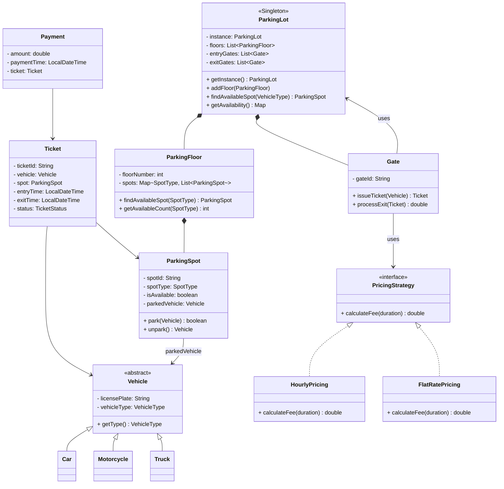

# Parking Lot — Low Level Design

## Problem Statement
Design an automated parking lot system that can manage vehicles entering and exiting the parking lot, assign parking spots based on vehicle type, calculate parking charges based on duration, and process payments.

This is one of the most commonly asked LLD interview questions. It tests your ability to apply OOP principles and design patterns to a real-world system.

---

## Requirements

### Functional Requirements
1.  The parking lot has **multiple floors**, each with a set of parking spots.
2.  Parking spots come in **3 sizes**: SMALL (for motorcycles), MEDIUM (for cars), LARGE (for trucks/buses).
3.  A vehicle can only park in a spot that fits its size (e.g., a car cannot park in a SMALL spot).
4.  When a vehicle enters, the system should:
    - Find the nearest available spot that fits the vehicle.
    - Issue a **parking ticket** with entry time.
5.  When a vehicle exits, the system should:
    - Calculate the **parking fee** based on duration.
    - Process the **payment**.
    - Free up the parking spot.
6.  The system should track **spot availability** per floor and per type in real-time.
7.  If the parking lot is full (for a given vehicle type), entry should be denied.
8.  Support for **multiple entry and exit points** (gates).

### Non-Functional Requirements
-   The system should be **thread-safe** (concurrent entry/exit at multiple gates).
-   Should handle **high throughput** (busy parking lots with rapid entry/exit).

---

## Design Patterns Used

| Pattern | Where Applied | Why |
|---------|---------------|-----|
| **Singleton** | `ParkingLot` | Only one parking lot instance should exist globally |
| **Strategy** | `PricingStrategy` | Different pricing algorithms (hourly, flat, minute-based) can be swapped |
| **Factory Method** | `ParkingSpotFactory` | Decouples spot creation from spot type selection |
| **Abstract concepts** | Vehicle/Spot hierarchies | Polymorphism for handling different vehicle/spot types cleanly |

---

## Class Diagram

---

## Key Interview Discussion Points

### 1. Why Singleton for ParkingLot?
There is only one physical parking lot. Using Singleton ensures all gates, floors, and operations reference the same shared state. Thread safety is critical since multiple gates operate concurrently.

### 2. Why Strategy for Pricing?
Different parking lots (or even the same lot at different times) may use different pricing models — hourly, flat rate, per-minute, weekend vs weekday. The Strategy pattern lets you swap pricing algorithms at runtime without modifying the billing logic.

### 3. Why Factory Method for ParkingSpot?
When creating spots during initialization, the factory encapsulates the logic of deciding which concrete `ParkingSpot` class to create based on `SpotType`. Adding a new spot type (e.g., HANDICAPPED, ELECTRIC) only requires a new class and a factory update — Open/Closed Principle.

### 4. Thread Safety Considerations
-   `ParkingSpot.park()` and `unpark()` must be `synchronized` — two vehicles should not be assigned the same spot.
-   `findAvailableSpot()` should be atomic — search + assign must happen together.
-   Use `AtomicInteger` for spot counters to avoid race conditions.

### 5. Scalability Extensions (Follow-up Questions)
-   **Electric vehicle charging spots** — add `ElectricSpot extends ParkingSpot`
-   **Reservation system** — add `Reservation` class with time slots
-   **Multi-rate pricing** — per vehicle type, per time-of-day (Strategy pattern handles this)
-   **Sensor integration** — Observer pattern for real-time spot status
-   **Notification service** — notify users when spot is available (Observer)

---

## Estimation (Common Follow-up)
| Item | Typical Value |
|------|---------------|
| Floors | 5 |
| Spots per floor | ~200 (50 small + 100 medium + 50 large) |
| Total spots | ~1000 |
| Entry gates | 4 |
| Exit gates | 4 |
| Peak entries/hour | ~500 |
