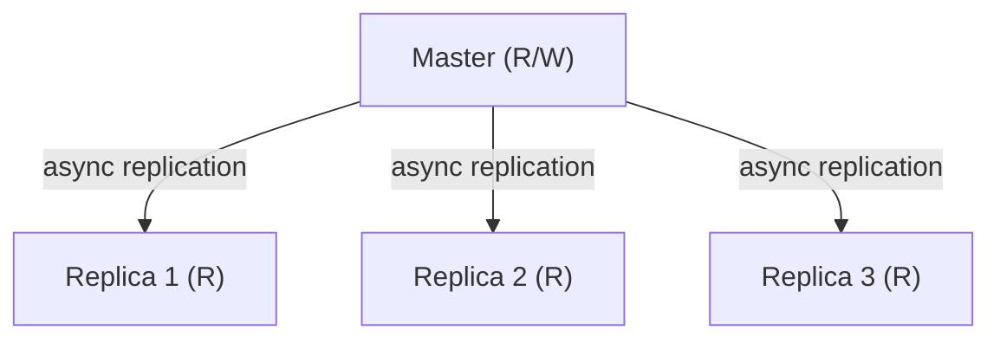
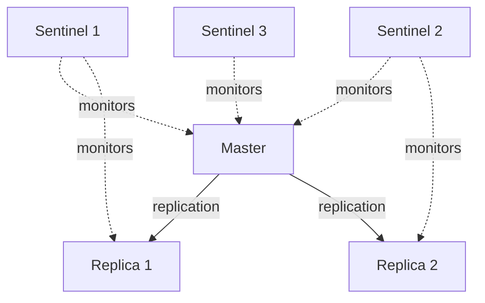
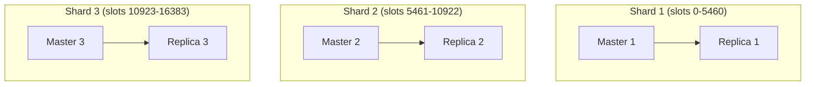

# Redis — Complete Interview Guide for Senior Software Engineers

---

## 1. What is Redis?

**Redis** (Remote Dictionary Server) is an open-source, **in-memory** data structure store used as a database, cache, message broker, and streaming engine.

| Property | Detail |
|----------|--------|
| **Storage** | In-memory (RAM), with optional disk persistence |
| **Data Model** | Key-value store with rich data structures |
| **Performance** | ~100,000+ ops/sec on a single instance |
| **Written in** | C |
| **License** | BSD (older versions), SSPL/RSALv2 (v7.4+) |
| **Single-threaded** | Event loop is single-threaded (I/O is multiplexed); I/O threads added in v6 for network read/write |

**Why is Redis fast?**
1. **In-memory** — no disk I/O for reads/writes.
2. **Single-threaded event loop** — no lock contention, no context switching.
3. **Efficient data structures** — purpose-built C implementations (SDS, ziplist, skiplist).
4. **I/O multiplexing** — `epoll`/`kqueue` handles thousands of connections with one thread.
5. **Non-blocking I/O** — never waits on a client.

---

## 2. Data Structures

Redis is NOT just a key-value store. It supports **rich data structures** as values:

### 2.1 Strings
The simplest type. Can store text, integers, floats, or binary data (up to 512 MB).

```redis
SET user:1:name "Alice"
GET user:1:name          → "Alice"
INCR page:views          → atomic increment (useful for counters)
SETEX session:abc 3600 "data"  → auto-expires in 3600 seconds
SETNX lock:order:42 "held"    → SET if Not eXists (distributed locking)
```

**Use cases:** Caching, counters, session tokens, rate limiters, distributed locks.

### 2.2 Lists
Ordered collection of strings (doubly linked list under the hood → **quicklist** since Redis 3.2).

```redis
LPUSH queue:emails "email1"    → push to head
RPUSH queue:emails "email2"    → push to tail
LPOP queue:emails              → pop from head
RPOP queue:emails              → pop from tail
BRPOP queue:emails 30          → blocking pop (waits up to 30 sec)
LRANGE queue:emails 0 -1       → get all elements
```

**Use cases:** Message queues, activity feeds, recent items lists.

### 2.3 Sets
Unordered collection of unique strings.

```redis
SADD tags:post:1 "redis" "cache" "database"
SMEMBERS tags:post:1           → {"redis", "cache", "database"}
SISMEMBER tags:post:1 "redis"  → 1 (true)
SINTER tags:post:1 tags:post:2 → intersection of two sets
SUNION tags:post:1 tags:post:2 → union
SDIFF tags:post:1 tags:post:2  → difference
```

**Use cases:** Tags, unique visitors, mutual friends, set operations.

### 2.4 Sorted Sets (ZSets)
Like Sets but each member has a **score** (float). Ordered by score. Implemented as a **skip list + hash table**.

```redis
ZADD leaderboard 100 "Alice" 200 "Bob" 150 "Charlie"
ZRANGE leaderboard 0 -1 WITHSCORES     → sorted ascending
ZREVRANGE leaderboard 0 2 WITHSCORES   → top 3 (descending)
ZRANK leaderboard "Alice"              → rank (0-indexed)
ZINCRBY leaderboard 50 "Alice"         → increment score
ZRANGEBYSCORE leaderboard 100 200      → range by score
```

**Use cases:** Leaderboards, priority queues, rate limiters (sliding window), time-series indexes.

### 2.5 Hashes
A map of field-value pairs (like a mini-object). Memory-efficient for small hashes (uses ziplist encoding).

```redis
HSET user:1 name "Alice" age 30 city "NYC"
HGET user:1 name               → "Alice"
HGETALL user:1                 → {name: Alice, age: 30, city: NYC}
HINCRBY user:1 age 1           → 31
HDEL user:1 city
```

**Use cases:** Object storage, user profiles, configuration, session data.

### 2.6 Streams (Redis 5.0+)
Append-only log data structure — Redis's answer to Kafka.

```redis
XADD mystream * sensor-id 1234 temperature 19.8
XREAD COUNT 10 STREAMS mystream 0
XRANGE mystream - +
XGROUP CREATE mystream mygroup 0   → consumer group
XREADGROUP GROUP mygroup consumer1 COUNT 1 STREAMS mystream >
XACK mystream mygroup <message-id>
```

**Use cases:** Event sourcing, activity logs, IoT data streams, lightweight message queues with consumer groups.

### 2.7 Other Types
| Type | Description | Use Case |
|------|-------------|----------|
| **Bitmaps** | Bit-level operations on Strings | Daily active users, feature flags |
| **HyperLogLog** | Probabilistic cardinality counting | Unique visitor counts (0.81% error) |
| **Geospatial** | Lat/long indexes (uses Sorted Sets) | Nearby restaurants, driver matching |

---

## 3. Persistence

Redis is in-memory, but offers two persistence mechanisms to survive restarts:

### 3.1 RDB (Redis Database Snapshots)
Point-in-time snapshots of the dataset saved to disk as a binary `.rdb` file.

```
# redis.conf
save 900 1      # snapshot if ≥1 key changed in 900 sec
save 300 10     # snapshot if ≥10 keys changed in 300 sec
save 60 10000   # snapshot if ≥10000 keys changed in 60 sec
```

| Pros | Cons |
|------|------|
| Compact binary format → fast restores | Data loss between snapshots (e.g., up to 5 min) |
| Minimal performance impact (fork + COW) | Fork can be slow on large datasets |
| Great for backups/disaster recovery | Not suitable if you need zero data loss |

**How it works:** Redis `fork()`s a child process. The child writes the snapshot to disk while the parent continues serving. Uses **Copy-on-Write (COW)** — memory pages are shared until modified.

### 3.2 AOF (Append-Only File)
Logs every write operation. On restart, replays the log to reconstruct state.

```
# redis.conf
appendonly yes
appendfsync everysec    # fsync every second (recommended)
# appendfsync always    # fsync on every write (safest, slowest)
# appendfsync no        # let OS decide (fastest, least safe)
```

| Pros | Cons |
|------|------|
| Much more durable (≤1 sec data loss with `everysec`) | Larger file size than RDB |
| Human-readable (it's a text log of commands) | Slower restarts (replays all ops) |
| Auto-rewrite to compact the log | Slightly slower writes (fsync overhead) |

### 3.3 Hybrid Persistence (Redis 4.0+, Recommended)
```
aof-use-rdb-preamble yes
```
AOF file starts with an RDB snapshot (fast load) followed by AOF entries (recent ops). **Best of both worlds:** fast restarts + minimal data loss.

### Interview Answer Framework
> "For a system that needs fast restarts and can tolerate a few seconds of data loss, I'd use **hybrid persistence** (RDB preamble + AOF with `appendfsync everysec`). For pure caching where data loss is acceptable, I'd disable persistence entirely for maximum performance."

---

## 4. Eviction Policies

When Redis reaches `maxmemory`, it must evict keys. Configurable via `maxmemory-policy`:

| Policy | Description |
|--------|-------------|
| `noeviction` | Return errors on write (no eviction) |
| `allkeys-lru` | Evict least recently used keys (any key) — **most common for caching** |
| `allkeys-lfu` | Evict least frequently used keys |
| `allkeys-random` | Evict random keys |
| `volatile-lru` | LRU eviction, but only keys with TTL set |
| `volatile-lfu` | LFU eviction, but only keys with TTL set |
| `volatile-random` | Random eviction, only keys with TTL |
| `volatile-ttl` | Evict keys with shortest remaining TTL |

**Interview Tip:** Redis LRU is an **approximation** — it samples N random keys (configurable, default 5) and evicts the least recently used among those. This is much more memory-efficient than true LRU (which would need a linked list tracking all keys).

---

## 5. Replication

Redis uses **asynchronous master-replica replication**.

```
# On the replica:
replicaof <master-ip> <master-port>
```

### How it works:
1. Replica connects to master and sends `PSYNC`.
2. Master starts a background `BGSAVE` (RDB snapshot).
3. Master sends the RDB to the replica (full sync).
4. From this point, master streams all write commands to the replica in real-time.
5. If the connection drops, **partial resync** using the replication backlog (offset-based).

### Key Properties:
- **Asynchronous** — master doesn't wait for replicas to acknowledge writes.
- **Read scaling** — replicas can serve read queries.
- **Not strong consistency** — a write acknowledged by master may not yet reach replicas.
- **Replica is read-only** by default.



---

## 6. High Availability — Redis Sentinel

Sentinel provides **automatic failover** when the master goes down.



### Failover Process:
1. Sentinels continuously `PING` the master.
2. If a sentinel doesn't receive a response → marks master as **subjectively down (SDOWN)**.
3. When a **quorum** of sentinels agree → master is **objectively down (ODOWN)**.
4. Sentinels elect a leader sentinel (Raft-like consensus).
5. Leader promotes the best replica to master.
6. Other replicas are reconfigured to replicate from the new master.
7. Clients are notified of the new master address.

**Minimum setup:** 3 Sentinel instances (for quorum voting). Never run just 2 — split-brain risk.

---

## 7. Redis Cluster (Horizontal Scaling)

Redis Cluster provides **automatic sharding** across multiple nodes.

### How Sharding Works:
Redis Cluster uses **hash slots** (not consistent hashing):
- There are exactly **16,384 hash slots**.
- Each key is mapped to a slot: `HASH_SLOT = CRC16(key) mod 16384`.
- Each master node is responsible for a subset of slots.

```
Master A: slots 0-5460
Master B: slots 5461-10922
Master C: slots 10923-16383
```

### Key Features:
| Feature | Detail |
|---------|--------|
| **Automatic sharding** | Data distributed across masters via hash slots |
| **High availability** | Each master has replicas; automatic failover |
| **Linear scalability** | Add nodes → redistribute slots → more capacity |
| **Multi-key limitations** | Multi-key ops only work if all keys are on the same slot (use `{hash_tag}`) |
| **No proxy needed** | Clients are "cluster-aware" — redirected via `MOVED`/`ASK` responses |

### Hash Tags (Forcing keys to same slot):
```redis
SET {user:1}.name "Alice"
SET {user:1}.email "alice@example.com"
# Both keys hash on "user:1" → guaranteed same slot and same node
```

### Cluster Topology:


---

## 8. Common Use Cases & Patterns

### 8.1 Caching Patterns

**Cache-Aside (Lazy Loading):**
```
GET from cache → HIT? Return.
MISS? → Read from DB → PUT in cache → Return.
```
- ✅ Only caches what's requested
- ❌ Cache miss penalty (extra DB call)
- ❌ Stale data if DB is updated without invalidating cache

**Write-Through:**
```
Write to cache AND DB simultaneously.
```
- ✅ Cache is always consistent
- ❌ Write latency (two writes)
- ❌ Caches data that may never be read

**Write-Behind (Write-Back):**
```
Write to cache → asynchronously flush to DB.
```
- ✅ Fast writes
- ❌ Risk of data loss if cache crashes before flush

### 8.2 Distributed Locking (Redlock)
```redis
SET lock:order:42 <unique-id> NX PX 30000
# NX = only if not exists
# PX = auto-expire in 30 seconds (prevents deadlocks)
```

**Unlock (Lua script for atomicity):**
```lua
if redis.call("GET", KEYS[1]) == ARGV[1] then
    return redis.call("DEL", KEYS[1])
else
    return 0
end
```
**Why Lua?** The check-and-delete must be atomic. Without Lua, another client could acquire the lock between your `GET` and `DEL`.

**Redlock Algorithm** (for Redis Cluster):
1. Acquire lock on N/2+1 (majority) of N independent Redis masters.
2. If majority acquired within timeout → lock is held.
3. If not → release all locks and retry.

> ⚠️ **Martin Kleppmann's critique:** Redlock has known issues with clock drift, GC pauses, and network delays. For truly critical locks, use ZooKeeper/etcd with consensus protocols.

### 8.3 Rate Limiting

**Fixed Window (simple):**
```redis
INCR rate:user:42:1714400000     # window = current minute
EXPIRE rate:user:42:1714400000 60
# If INCR result > limit → reject
```

**Sliding Window (Sorted Set):**
```redis
ZADD rate:user:42 <timestamp> <request-id>
ZREMRANGEBYSCORE rate:user:42 0 <now - window>
ZCARD rate:user:42
# If ZCARD > limit → reject
```

### 8.4 Session Storage
```redis
HSET session:abc user_id 42 role "admin" last_seen "2026-04-29"
EXPIRE session:abc 1800    # 30 min TTL
```
- Faster than DB sessions, shared across app servers, auto-expiry built-in.

### 8.5 Pub/Sub
```redis
SUBSCRIBE channel:notifications    # consumer listens
PUBLISH channel:notifications "New order received"  # producer sends
```
- Fire-and-forget — messages are NOT persisted.
- If no subscriber is listening, the message is lost.
- For durable messaging, use **Redis Streams** instead.

### 8.6 Leaderboard
```redis
ZINCRBY leaderboard 10 "player:42"      # add 10 points
ZREVRANGE leaderboard 0 9 WITHSCORES    # top 10
ZREVRANK leaderboard "player:42"        # player's rank
```

---

## 9. Transactions & Atomicity

### MULTI/EXEC (Transactions)
```redis
MULTI
SET balance:A 900
SET balance:B 1100
EXEC
```
- Commands are queued and executed **atomically** (all or nothing).
- **No rollback** — if one command fails, the others still execute.
- **Not isolated** — other clients can interleave commands between MULTI and EXEC.

### WATCH (Optimistic Locking)
```redis
WATCH balance:A
val = GET balance:A
# ... compute new value ...
MULTI
SET balance:A <new-val>
EXEC
# If balance:A was modified by another client after WATCH → EXEC returns nil (aborted)
```
- Implements **CAS (Compare-and-Swap)** semantics.
- If any watched key is modified → transaction is aborted.

### Lua Scripting (True Atomicity)
```redis
EVAL "redis.call('SET', KEYS[1], ARGV[1]); redis.call('EXPIRE', KEYS[1], ARGV[2])" 1 mykey myval 60
```
- Lua scripts execute **atomically** — the entire script runs without interruption.
- Better than MULTI/EXEC for complex atomic operations.
- **EVALSHA** caches the script for repeated execution.

---

## 10. Pipelining

Send multiple commands at once without waiting for individual responses:

```
Without pipelining:          With pipelining:
Client → SET a 1             Client → SET a 1
Client ← OK                           SET b 2
Client → SET b 2                      SET c 3
Client ← OK                  Client ← OK, OK, OK
Client → SET c 3
Client ← OK
```

- **Without pipelining:** 3 round trips.
- **With pipelining:** 1 round trip → orders of magnitude faster for bulk operations.
- **Not atomic** — commands can be interleaved with other clients' commands.

---

## 11. Memory Optimization

### Encoding Optimizations
Redis automatically uses compact encodings for small data:

| Type | Small Encoding | Threshold | Large Encoding |
|------|---------------|-----------|----------------|
| String | `int` (if numeric) | — | `raw` / `embstr` |
| List | `listpack` | <128 elements, <64 bytes/element | `quicklist` |
| Set | `listpack` | <128 elements, all integers? `intset` | `hashtable` |
| Hash | `listpack` | <128 fields, <64 bytes/value | `hashtable` |
| Sorted Set | `listpack` | <128 elements | `skiplist` + `hashtable` |

### Key Expiry
```redis
SET key value EX 3600          # expires in 3600 seconds
EXPIRE key 3600                # set expiry on existing key
TTL key                        # check remaining TTL
PERSIST key                    # remove expiry
```

**How Redis deletes expired keys:**
1. **Lazy expiration:** When a key is accessed, check if it's expired → delete.
2. **Active expiration:** Background task samples 20 random keys with TTL every 100ms, deletes expired ones. If >25% expired → repeat immediately.

### Memory Tips for Interviews
- Use **Hashes** for small objects (memory-efficient ziplist encoding).
- Use **short key names** in production (e.g., `u:1:n` vs `user:1:name`).
- Set **maxmemory** and an eviction policy.
- Use `OBJECT ENCODING <key>` to inspect the encoding of a key.
- Monitor with `INFO memory` and `MEMORY USAGE <key>`.

---

## 12. Performance & Troubleshooting

### Slow Commands to Avoid
| Command | Why It's Slow | Alternative |
|---------|---------------|-------------|
| `KEYS *` | O(n) — scans ALL keys, blocks event loop | `SCAN` (cursor-based, non-blocking) |
| `SMEMBERS` on big sets | O(n) | `SSCAN` |
| `HGETALL` on big hashes | O(n) | `HSCAN` or `HGET` specific fields |
| `LRANGE 0 -1` on big lists | O(n) | Paginate with `LRANGE start end` |
| `FLUSHALL` | Deletes everything | `FLUSHALL ASYNC` |
| `SAVE` | Synchronous RDB snapshot | `BGSAVE` |

### Debugging Commands
```redis
SLOWLOG GET 10               # show 10 slowest recent commands
INFO stats                    # hit rate, ops/sec, memory
INFO replication              # master-replica status
CLIENT LIST                   # connected clients
MONITOR                       # live stream of ALL commands (debug only!)
DEBUG OBJECT <key>            # encoding, refcount, LRU info
MEMORY USAGE <key>            # bytes used by a key
```

---

## 13. Redis vs Other Technologies

| Feature | Redis | Memcached | DynamoDB | Kafka |
|---------|-------|-----------|----------|-------|
| **Data structures** | Rich (Strings, Lists, Sets, Hashes, Streams, …) | Strings only | Key-value / Document | Log/Stream |
| **Persistence** | RDB + AOF | None | Fully persistent | Persistent log |
| **Replication** | Built-in master-replica | None (client-side) | Built-in multi-region | Built-in ISR |
| **Clustering** | Redis Cluster (hash slots) | Client-side consistent hashing | Managed by AWS | Partitions |
| **Pub/Sub** | Yes (+ Streams) | No | DynamoDB Streams | Core feature |
| **Scripting** | Lua | No | No | No |
| **Use case** | Caching, sessions, real-time | Simple caching | Serverless DB | Event streaming |

---

## 14. Common Interview Questions & Answers

### Q: "Redis is single-threaded. How does it handle 100K+ ops/sec?"
> Redis uses I/O multiplexing (`epoll`/`kqueue`) to handle many connections with a single thread. Since all operations are in-memory and most are O(1), there's no blocking I/O. The bottleneck is the network, not the CPU. Redis 6+ adds I/O threads for network read/write, but command execution remains single-threaded.

### Q: "How would you design a cache invalidation strategy?"
> Depends on the consistency requirements:
> - **TTL-based:** Set expiry on all keys. Simple, but stale data within TTL window.
> - **Event-driven:** Publish cache invalidation events on DB write. More consistent but complex.
> - **Cache-Aside + short TTL:** Application manages cache. On write, delete cache key. On read miss, reload from DB.

### Q: "How do you handle cache stampede / thundering herd?"
> When a popular key expires, many threads simultaneously hit the DB.
> Solutions:
> 1. **Locking:** First thread that misses acquires a lock, fetches from DB, populates cache. Others wait.
> 2. **Early refresh:** Refresh cache before TTL expires (background thread).
> 3. **Probabilistic expiration:** Each thread that reads the key has a small probability of refreshing it before TTL.

### Q: "Redis Cluster — what happens when you add/remove a node?"
> Redis uses **live resharding** — hash slots are migrated from existing nodes to the new node while the cluster stays online. During migration, if a client accesses a key that has been moved, it receives an `ASK` redirect to the new node. After migration is complete, the slot mapping is updated and clients receive `MOVED` redirects (which they cache).

### Q: "How would you implement a delayed job queue with Redis?"
> Use a **Sorted Set** with the score as the scheduled execution time:
> ```redis
> ZADD delayed_jobs <future_timestamp> <job_payload>
> ```
> A worker polls:
> ```redis
> ZRANGEBYSCORE delayed_jobs 0 <now> LIMIT 0 1
> ZREM delayed_jobs <job>   # atomically in Lua
> ```

### Q: "What are the differences between Pub/Sub and Streams?"
> | Feature | Pub/Sub | Streams |
> |---------|---------|---------|
> | Persistence | No (fire-and-forget) | Yes (append-only log) |
> | Consumer groups | No | Yes |
> | Message replay | No | Yes (read from any ID) |
> | Backpressure | No | Yes (pending entry list) |
> | Use case | Real-time notifications | Event sourcing, job queues |

---

## 15. Real-World Use Cases

### 15.1 Twitter — Timeline Caching
Twitter caches home timelines in Redis Lists. When you open Twitter, it fetches your pre-computed timeline from Redis instead of querying the social graph in real time.
```
LPUSH timeline:user:42 <tweet_json>
LTRIM timeline:user:42 0 799        # keep only last 800 tweets
LRANGE timeline:user:42 0 19        # fetch first page (20 tweets)
```
**Why Redis?** Sub-millisecond reads for millions of concurrent users. A DB query joining followers, tweets, and retweets would take seconds.

---

### 15.2 Uber / Ola — Geospatial Driver Matching
Ride-hailing apps use Redis Geospatial indexes to find nearby drivers in real time.
```redis
GEOADD drivers:city:bangalore 77.5946 12.9716 "driver:101"
GEOADD drivers:city:bangalore 77.6033 12.9762 "driver:102"
GEORADIUS drivers:city:bangalore 77.5900 12.9700 5 km ASC COUNT 10
# Returns the 10 nearest drivers within 5 km, sorted by distance
```
**Why Redis?** Geo queries must respond in <50ms for a smooth booking experience. Redis Geo uses Sorted Sets internally with geohash encoding → O(log n) queries.

---

### 15.3 Instagram — Counting (Likes, Views, Followers)
Instagram uses Redis Strings with `INCR`/`DECR` for real-time counters.
```redis
INCR post:12345:likes          # atomic increment on every like
GET post:12345:likes           # fetch count for display
INCRBY user:42:followers 1     # follow event
DECRBY user:42:followers 1     # unfollow event
```
**Why Redis?** Updating a counter in a relational DB under millions of concurrent writes causes lock contention. Redis `INCR` is atomic and single-threaded → no locks, no race conditions.

---

### 15.4 Spotify / Netflix — Session Management
Streaming services store user sessions in Redis Hashes with TTL.
```redis
HSET session:token:abc uid 42 plan "premium" device "iphone" region "IN"
EXPIRE session:token:abc 3600
HGET session:token:abc plan    # check if user is premium → authorize HD stream
```
**Why Redis?** Sessions must be shared across 100s of app servers. DB round-trips add latency to every API call. Redis gives <1ms access, and `EXPIRE` handles session cleanup automatically.

---

### 15.5 Amazon / Flipkart — Flash Sale Inventory
E-commerce platforms use Redis to manage inventory during flash sales, preventing overselling.
```redis
SET product:9999:stock 500
# On purchase (Lua script for atomicity):
EVAL "
  local stock = tonumber(redis.call('GET', KEYS[1]))
  if stock > 0 then
    redis.call('DECR', KEYS[1])
    return 1
  end
  return 0
" 1 product:9999:stock
```
**Why Redis?** During flash sales, thousands of concurrent buyers hit the same product. A DB `UPDATE stock = stock - 1 WHERE stock > 0` causes row-level lock contention. Redis Lua scripts execute atomically with zero lock overhead.

---

### 15.6 Slack / Discord — Real-time Presence (Online/Offline)
Messaging apps track user presence using Redis Strings with short TTLs.
```redis
SET presence:user:42 "online" EX 30    # user is online, heartbeat every 30s
# Client sends heartbeat every 20 seconds:
SET presence:user:42 "online" EX 30    # refreshes TTL
# If heartbeat stops → key expires → user appears offline
GET presence:user:42                   # null → offline
```
**Why Redis?** Polling a database for 10M+ users' presence status is impractical. Redis key expiry acts as a natural heartbeat timeout — no cleanup cron needed.

---

### 15.7 GitHub / GitLab — API Rate Limiting
Rate limiters protect APIs from abuse using Redis counters or Sorted Sets.
```redis
# Sliding window rate limiter (100 requests per minute):
ZADD ratelimit:user:42 <current_timestamp_ms> <unique_request_id>
ZREMRANGEBYSCORE ratelimit:user:42 0 <current_timestamp_ms - 60000>
ZCARD ratelimit:user:42
# If count > 100 → return HTTP 429 Too Many Requests
```
**Why Redis?** Rate limits must be checked on EVERY API request (<1ms budget). The check must be shared across all API servers (not local in-memory). Redis Sorted Sets give O(log n) operations with automatic cleanup.

---

### 15.8 Swiggy / DoorDash — Distributed Locking for Order Assignment
Food delivery platforms use Redis locks to prevent the same order from being assigned to two delivery partners.
```redis
# Delivery partner tries to accept order:
SET lock:order:7890 "partner:55" NX PX 10000
# NX → only if no one else has the lock
# PX → auto-release in 10s if partner crashes
# If SET returns OK → partner got the order
# If SET returns nil → someone else already accepted
```
**Why Redis?** The lock check + acquire must be atomic across distributed servers. Redis `SETNX` guarantees exactly-once assignment.

---

### 15.9 YouTube / Hotstar — Live View Counters
Streaming platforms display real-time viewer counts using Redis `PFADD` (HyperLogLog) for unique counts.
```redis
PFADD live:stream:cricket:viewers "user:42"
PFADD live:stream:cricket:viewers "user:43"
PFCOUNT live:stream:cricket:viewers    # approximate unique viewers
# HyperLogLog uses only 12 KB of memory regardless of cardinality!
```
**Why Redis?** Counting millions of unique viewers exactly requires storing all user IDs (huge memory). HyperLogLog gives ~0.81% error with constant 12 KB memory — perfect for "1.2M watching" displays.

---

### 15.10 LinkedIn — Feature Flags / A-B Testing
Feature flags control which users see new features, using Redis Bitmaps for space-efficient per-user flags.
```redis
SETBIT feature:dark_mode <user_id> 1     # enable dark mode for user
GETBIT feature:dark_mode <user_id>       # check if enabled
BITCOUNT feature:dark_mode               # how many users have it enabled
```
**Why Redis?** 1 million user flags = 125 KB in a bitmap (1 bit per user). Checking a flag is O(1). Perfect for real-time feature rollouts.

---

### 15.11 Airbnb — Search Result Caching
Airbnb caches search results in Redis with location-based keys.
```redis
SET search:bangalore:2guests:checkin20260501 "<json_results>" EX 300
# Expires in 5 min to balance freshness vs performance
```
**Why Redis?** Search queries involve complex DB joins (availability, pricing, reviews, location). Caching popular searches reduces DB load by 80%+ during peak traffic.

---

### 15.12 WhatsApp / Telegram — Unread Message Counters
Messaging apps maintain per-chat unread counts in Redis Hashes.
```redis
HINCRBY unread:user:42 "chat:100" 1     # new message in chat 100
HGET unread:user:42 "chat:100"          # show badge count
HSET unread:user:42 "chat:100" 0        # user opened the chat → reset
HGETALL unread:user:42                  # all unread counts for sidebar
```
**Why Redis?** Unread counters update on every message send/read across billions of daily messages. Redis Hash operations are O(1) and atomic.

---

### Summary Table

| Company | Use Case | Redis Feature | Why Not DB? |
|---------|----------|---------------|-------------|
| Twitter | Timeline cache | Lists | Millions of concurrent reads |
| Uber | Nearby drivers | Geospatial | <50ms geo queries |
| Instagram | Like/follower counts | INCR | Lock-free atomic counters |
| Netflix | Sessions | Hashes + TTL | Shared across servers, auto-expire |
| Amazon | Flash sale stock | Lua scripts | Atomic decrement without locks |
| Slack | Online presence | Strings + TTL | Key expiry = natural heartbeat |
| GitHub | Rate limiting | Sorted Sets | <1ms per-request check |
| Swiggy | Order locking | SETNX | Distributed atomic lock |
| YouTube | Live viewers | HyperLogLog | 12 KB for millions of uniques |
| LinkedIn | Feature flags | Bitmaps | 1 bit per user, O(1) check |
| Airbnb | Search caching | Strings + TTL | Avoid expensive DB joins |
| WhatsApp | Unread counts | Hashes | O(1) atomic increment per message |

---

## 16. Production Best Practices

1. **Always set `maxmemory`** — prevent Redis from consuming all RAM and being OOM-killed.
2. **Use `allkeys-lru`** eviction for caching workloads.
3. **Enable hybrid persistence** (`aof-use-rdb-preamble yes`) for durability.
4. **Monitor with `INFO`** — track hit rate (`keyspace_hits / (hits + misses)`), memory usage, connected clients.
5. **Use connection pooling** — creating a new connection per request is expensive.
6. **Avoid `KEYS *` in production** — use `SCAN` instead.
7. **Use Lua for atomic multi-step operations** — more reliable than MULTI/EXEC.
8. **Set TTL on all cache keys** — prevents stale data and memory leaks.
9. **Use Sentinel or Cluster** — never run a single Redis instance in production.
10. **Separate cache and persistent data** — use different Redis instances for caching (with eviction) and persistent data (with AOF).
