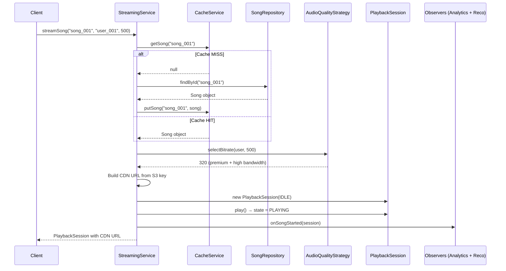
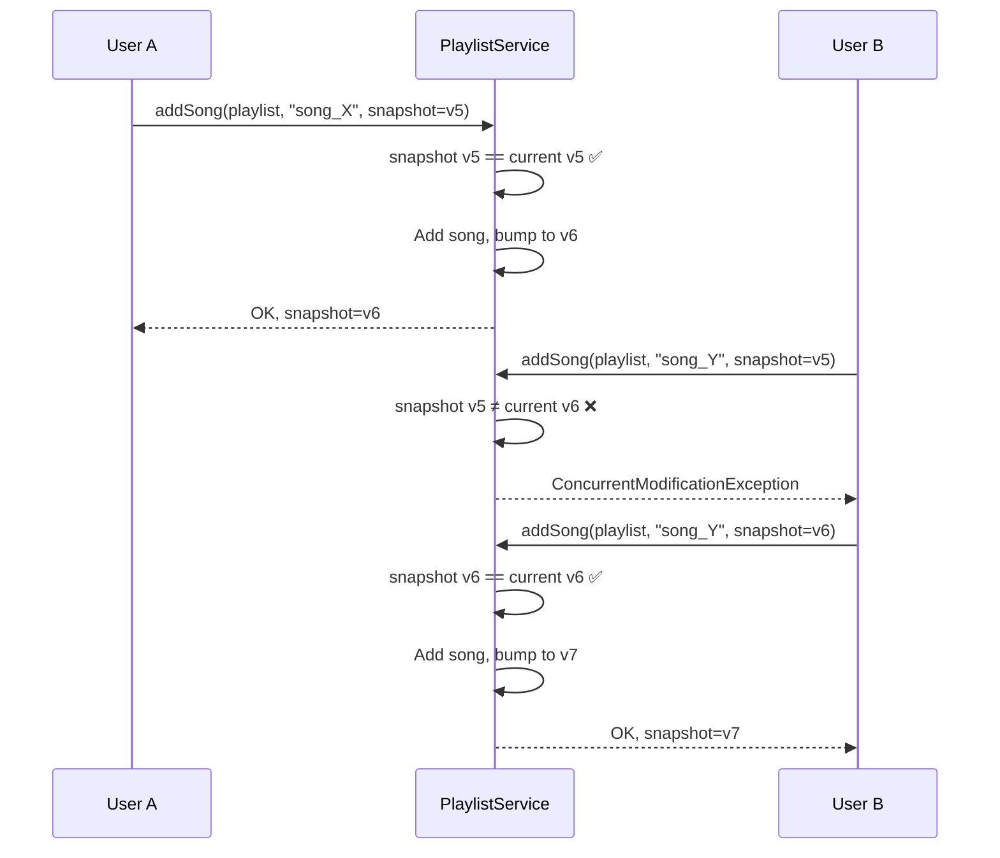
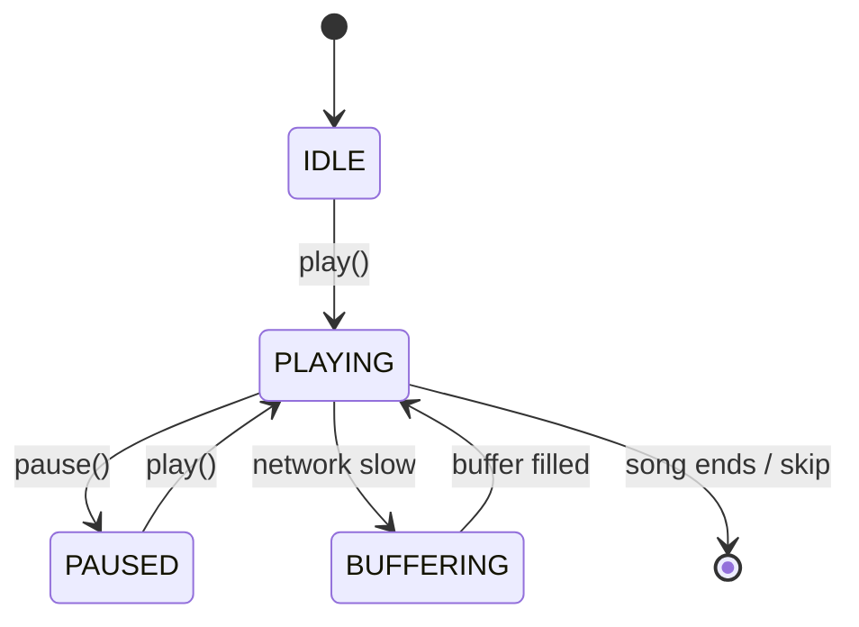

# Spotify — Low Level Design

## Problem Statement
Design the core components of a music streaming service like Spotify that supports streaming songs, managing playlists, searching the catalog, and providing personalized recommendations.

This is a frequently asked LLD interview question at senior level. It tests your ability to apply multiple design patterns (Strategy, Observer, State, Factory) together in a cohesive system, handle streaming media, and think about collaborative editing and caching.

---

## Requirements

### Functional Requirements
1.  **Music Streaming**: Stream songs on-demand with adaptive bitrate quality (96 / 160 / 320 kbps).
2.  **User Tiers**: Free users capped at 160kbps; Premium users can stream at 320kbps and download songs.
3.  **Search**: Full-text search across songs, artists, albums with autocomplete.
4.  **Playlists**: CRUD operations on playlists; support collaborative editing with conflict detection.
5.  **Recommendations**: Personalized recommendations based on listening history; cold-start fallback for new users.
6.  **Playback Controls**: Play, pause, skip, seek; track playback position and state.
7.  **Library**: Like/unlike songs, follow artists, maintain listening history.

### Non-Functional Requirements
-   **Low Latency**: Song playback must start in < 200ms.
-   **Scalability**: Support 100M concurrent streams via CDN.
-   **Consistency**: Playlist edits across devices must be consistent (OCC).
-   **Decoupled Analytics**: Play events must not block the streaming path.

---

## Design Patterns Used

| Pattern | Where Applied | Why |
|---------|---------------|-----|
| **Strategy** | `AudioQualityStrategy` (3 implementations) | Different bitrate selection algorithms (High, DataSaver, Adaptive) can be swapped at runtime without modifying the StreamingService |
| **Observer** | `PlaybackEventListener` (2 listeners) | Decouples streaming from analytics and recommendation updates; in production, this maps to Kafka consumers |
| **State** | `PlaybackSession.PlayerState` | Enforces valid player state transitions (IDLE → PLAYING → PAUSED → BUFFERING); prevents illegal operations |
| **Factory Method** | `Song.getS3KeyForBitrate()` | Encapsulates the logic of selecting the correct S3 audio file based on quality level |
| **Repository** | 3 repository classes | Separates data access from business logic; simulates PostgreSQL + Elasticsearch |
| **Optimistic Concurrency Control** | `Playlist.snapshotId` | Collaborative playlists use snapshot-based versioning to detect edit conflicts |

---

## Class Diagram

```mermaid
classDiagram
    class Song {
        - id: String
        - title: String
        - artistId: String
        - albumId: String
        - durationMs: int
        - genre: String
        - playCount: long
        - popularity: int
        - s3Key96: String
        - s3Key160: String
        - s3Key320: String
        + getS3KeyForBitrate(bitrate) String
        + incrementPlayCount()
        + getFormattedDuration() String
    }

    class Artist {
        - id: String
        - name: String
        - bio: String
        - followerCount: long
        - verified: boolean
    }

    class Album {
        - id: String
        - title: String
        - artistId: String
        - totalTracks: int
        - albumType: AlbumType
    }

    class User {
        - id: String
        - username: String
        - email: String
        - tier: Tier
        - likedSongIds: Set
        - followedArtistIds: Set
        - recentlyPlayed: List
        - genrePlayCounts: Map
        + likeSong(songId)
        + isPremium() boolean
        + getTopGenre() String
        + recordPlay(songId, genre)
    }

    class Playlist {
        - id: String
        - name: String
        - ownerId: String
        - isPublic: boolean
        - collaborative: boolean
        - snapshotId: String
        - tracks: List~PlaylistTrack~
        + addTrack(songId, addedBy) String
        + removeTrack(songId) String
        + shuffle()
    }

    class PlaylistTrack {
        <<record>>
        + songId: String
        + position: int
        + addedBy: String
        + addedAt: Instant
    }

    class PlaybackSession {
        - sessionId: String
        - userId: String
        - songId: String
        - state: PlayerState
        - positionMs: int
        - qualityBitrate: int
        - cdnUrl: String
        + play()
        + pause()
        + seek(positionMs)
        + countsAsPlay() boolean
    }

    class PlayerState {
        <<enumeration>>
        IDLE
        PLAYING
        PAUSED
        BUFFERING
    }

    class AudioQualityStrategy {
        <<interface>>
        + selectBitrate(user, bandwidth) int
        + getName() String
    }
    class HighQualityStrategy {
        + selectBitrate() int
    }
    class DataSaverStrategy {
        + selectBitrate() int
    }
    class AdaptiveQualityStrategy {
        + selectBitrate() int
    }

    class PlaybackEventListener {
        <<interface>>
        + onSongStarted(session)
        + onSongCompleted(session)
        + onSongSkipped(session)
    }
    class AnalyticsListener {
        + onSongStarted(session)
        + onSongCompleted(session)
        + onSongSkipped(session)
    }
    class RecommendationUpdateListener {
        + onSongStarted(session)
        + onSongCompleted(session)
        + onSongSkipped(session)
    }

    class StreamingService {
        - qualityStrategy: AudioQualityStrategy
        - listeners: List~PlaybackEventListener~
        - activeSessions: Map
        + streamSong(songId, userId, bandwidth) PlaybackSession
        + skipSong(userId)
        + completeSong(userId)
        + setQualityStrategy(strategy)
        + addListener(listener)
    }

    class SearchService {
        + search(query, limit) List~Song~
        + autocomplete(prefix, limit) List~String~
        + searchByGenre(genre, limit) List~Song~
    }

    class RecommendationService {
        + getRecommendations(userId, limit) List~Song~
        + generateDailyMix(userId, limit) List~Song~
    }

    class PlaylistService {
        + createPlaylist(name, ownerId, isPublic) Playlist
        + addSong(playlistId, songId, userId, snapshot) String
        + removeSong(playlistId, songId, userId) String
        + enableCollaboration(playlistId, ownerId)
    }

    class CacheService {
        - songCache: Map
        + putSong(songId, song)
        + getSong(songId) Song
        + getHitRatio() String
    }

    class SongRepository {
        + save(song)
        + findById(songId) Optional~Song~
        + search(query) List~Song~
        + findByGenre(genre) List~Song~
    }

    Song --> Artist : artistId
    Song --> Album : albumId
    Album --> Artist : artistId
    Playlist *-- PlaylistTrack
    PlaybackSession --> PlayerState

    AudioQualityStrategy <|.. HighQualityStrategy
    AudioQualityStrategy <|.. DataSaverStrategy
    AudioQualityStrategy <|.. AdaptiveQualityStrategy

    PlaybackEventListener <|.. AnalyticsListener
    PlaybackEventListener <|.. RecommendationUpdateListener

    StreamingService --> AudioQualityStrategy : strategy
    StreamingService --> PlaybackEventListener : observers
    StreamingService --> CacheService : cache
    StreamingService --> SongRepository : songRepo
    StreamingService ..> PlaybackSession : creates

    SearchService --> SongRepository
    RecommendationService --> SongRepository
    PlaylistService ..> Playlist : manages
```



---

## Component Interaction Flow

### "User Presses Play" — Full Flow



### Collaborative Playlist — OCC Conflict



---

## Design Pattern Deep Dives

### 1. Strategy Pattern — Audio Quality Selection

**Problem**: Bitrate selection depends on multiple factors (user tier, network bandwidth, user preference). Using if-else chains makes the code rigid and violates OCP.

**Solution**: Encapsulate each algorithm behind the `AudioQualityStrategy` interface. The `StreamingService` delegates to whatever strategy is injected.

```java
// The interface
public interface AudioQualityStrategy {
    int selectBitrate(User user, int networkBandwidth);
    String getName();
}

// Adaptive strategy — the most realistic
public class AdaptiveQualityStrategy implements AudioQualityStrategy {
    @Override
    public int selectBitrate(User user, int networkBandwidth) {
        int maxForTier = user.isPremium() ? 320 : 160;
        int selected;
        if (networkBandwidth < 150)      selected = 96;
        else if (networkBandwidth < 300) selected = 160;
        else                             selected = 320;
        return Math.min(selected, maxForTier); // enforce tier cap
    }
}

// Swap at runtime — e.g., user toggles Data Saver mode
streamingService.setQualityStrategy(new DataSaverStrategy());
```

**Why not just if-else?** Adding a new strategy (e.g., `LosslessStrategy` for Hi-Fi tier) requires only a new class — zero changes to `StreamingService`. Open/Closed Principle.

**In production**: The adaptive strategy runs on the **client side**, measuring bandwidth every 10 seconds and requesting the appropriate quality chunk.

---

### 2. Observer Pattern — Playback Event Decoupling

**Problem**: When a song is played, many subsystems must react (analytics, recommendations, ad injection, social feed). Having `StreamingService` call each one directly creates tight coupling.

**Solution**: `StreamingService` publishes events to a list of `PlaybackEventListener` observers. New consumers can be added without modifying the service.

```java
// Observer interface
public interface PlaybackEventListener {
    void onSongStarted(PlaybackSession session);
    void onSongCompleted(PlaybackSession session);
    void onSongSkipped(PlaybackSession session);
}

// StreamingService notifies all observers
for (PlaybackEventListener listener : listeners) {
    listener.onSongStarted(session);
}

// Register observers at setup
streaming.addListener(new AnalyticsListener(songRepo));
streaming.addListener(new RecommendationUpdateListener(userRepo, songRepo));
```

**In production**: This maps directly to **Kafka**. The `StreamingService` publishes a `play-event` to a Kafka topic, and multiple consumer groups subscribe independently:
- `analytics-consumer` → ClickHouse for dashboards
- `recommendation-consumer` → ML pipeline for model updates
- `royalty-consumer` → payment calculations for artists

---

### 3. State Pattern — Player State Machine

**Problem**: A music player has distinct states (IDLE, PLAYING, PAUSED, BUFFERING) with specific valid transitions. Without state management, invalid operations (e.g., pausing while already paused) cause bugs.

**Solution**: `PlaybackSession` tracks the current `PlayerState` and enforces valid transitions.

```java
public enum PlayerState { IDLE, PLAYING, PAUSED, BUFFERING }

// State transitions
public void play() {
    if (state == PlayerState.PLAYING) return; // no-op
    this.state = PlayerState.PLAYING;
}

public void pause() {
    if (state != PlayerState.PLAYING) return; // can only pause if playing
    this.state = PlayerState.PAUSED;
}
```

**State Transition Diagram**:


**30-Second Rule**: Spotify counts a song as "played" (for royalties) only if the user listens for ≥ 30 seconds:
```java
public boolean countsAsPlay() {
    return positionMs >= 30_000;
}
```

---

### 4. Factory Method — S3 Key Selection

**Problem**: Each song has 3 audio files on S3 (96/160/320 kbps). Selecting the right file based on quality level needs to be encapsulated.

**Solution**: `Song.getS3KeyForBitrate()` acts as a factory method, returning the correct S3 key:

```java
public String getS3KeyForBitrate(int bitrate) {
    return switch (bitrate) {
        case 96  -> s3Key96;   // "audio/song_001_96.ogg"
        case 160 -> s3Key160;  // "audio/song_001_160.ogg"
        case 320 -> s3Key320;  // "audio/song_001_320.ogg"
        default  -> s3Key160;  // fallback
    };
}
```

**In production**: The CDN URL is constructed from this S3 key:
```
https://cdn.spotify-edge.com/audio/song_001_320.ogg?token=ae4f12bc
```

---

### 5. Optimistic Concurrency Control — Playlist Snapshots

**Problem**: Collaborative playlists can be edited by multiple users simultaneously. Without concurrency control, one user's edit can silently overwrite another's.

**Solution**: Each playlist has a `snapshotId` (version). Clients must include their known snapshot when making edits. If stale → reject with conflict error.

```java
// OCC check in PlaylistService
if (!clientSnapshot.equals(playlist.getSnapshotId())) {
    throw new ConcurrentModificationException(
        "Playlist modified! Your snapshot=" + clientSnapshot +
        " but current=" + playlist.getSnapshotId());
}

// After successful edit, bump version
this.snapshotId = generateSnapshotId();
```

**Why OCC over pessimistic locking?** Playlist edits are infrequent (low contention). Locking would add latency for the common case (single editor). OCC is lock-free and only pays the retry cost when actual conflict occurs.

---

## Recommendation Approaches

| Approach | How It Works | When to Use |
|----------|-------------|-------------|
| **Content-Based** | Match songs by genre/audio features of songs user already liked | User has listening history |
| **Collaborative Filtering** | "Users who liked X also liked Y" — cosine similarity between users | Many users with overlapping tastes |
| **Popularity Fallback** | Return trending songs sorted by play count | New users (cold start problem) |
| **Hybrid** | Combine content-based + collaborative scores | Production recommendation engines |

```java
// Cold start check
if (topGenre != null && !user.getRecentlyPlayed().isEmpty()) {
    return getContentBasedRecommendations(user, topGenre, limit);
} else {
    return getPopularityBasedRecommendations(limit);  // cold start
}
```

---

## Key Interview Discussion Points

### 1. Why Strategy for Quality Selection?
Bitrate selection is not one-size-fits-all. Different contexts (Data Saver enabled, low bandwidth, premium vs free) require different algorithms. The Strategy pattern allows the client to swap algorithms at runtime (`setQualityStrategy()`) without touching the streaming logic. Adding a future `LosslessStrategy` requires zero changes to existing code.

### 2. Why Observer for Play Events?
In production, 5+ subsystems consume play events (analytics, recommendations, royalties, social, ads). Direct method calls from `StreamingService` would create a tangled dependency web. The Observer pattern (and its production equivalent, Kafka) provides **fire-and-forget decoupling** — streaming latency is unaffected by how many consumers exist.

### 3. Why OCC for Collaborative Playlists?
Playlist edits are low-contention (most playlists have 1 editor). Pessimistic locking (mutexes/DB row locks) adds overhead for the common case. OCC with snapshot versioning is lock-free and only forces a retry when genuine conflict occurs. This is the same approach used by Git (optimistic merge) and Google Docs (operational transform).

### 4. CDN is the System
The single most important architectural decision is **CDN**. At 200 GB/s peak bandwidth, serving audio from origin servers is physically impossible. CDN with 200+ PoPs and 90%+ cache hit ratio reduces origin load to ~20 GB/s. Mention this immediately in an interview.

### 5. Thread Safety Considerations
-   `ConcurrentHashMap` for all repositories and caches — thread-safe without explicit locks.
-   `AtomicInteger` for ID generation counters.
-   Playlist snapshot versioning provides lock-free concurrency control.
-   In production, Redis + Kafka handle distributed state and event ordering.

### 6. Scalability Extensions (Follow-up Questions)
-   **Offline downloads**: Encrypted audio + DRM license with 30-day expiry.
-   **Queue management**: Add a `PlayQueue` class with next/previous, shuffle, repeat modes.
-   **Social features**: Observer pattern easily extends to a `SocialListener` ("Friend is listening to X").
-   **Ad injection**: ADT `AdInjectionListener` that counts plays until next ad for free-tier users.
-   **Real-time lyrics**: Sync lyrics by `positionMs` from `PlaybackSession`.
-   **Multi-device sync**: Only 1 active session per account (already enforced in `StreamingService`).

---

## File Structure

```
src/main/java/com/lld/hld/spotify/
├── SpotifyMain.java                         ← Demo runner (10 scenarios)
├── model/
│   ├── Song.java                            ← 3 S3 keys, bitrate-based selection
│   ├── Artist.java
│   ├── Album.java
│   ├── Playlist.java                        ← Snapshot OCC, position-aware tracks
│   ├── User.java                            ← Free/Premium tier, genre tracking
│   └── PlaybackSession.java                 ← State machine (IDLE/PLAYING/PAUSED/BUFFERING)
├── repository/
│   ├── SongRepository.java                  ← Simulates PostgreSQL + Elasticsearch
│   ├── UserRepository.java
│   └── PlaylistRepository.java
└── service/
    ├── AudioQualityStrategy.java            ← Strategy interface
    ├── HighQualityStrategy.java             ← Premium → 320, Free → 160
    ├── DataSaverStrategy.java               ← Always 96kbps
    ├── AdaptiveQualityStrategy.java         ← Bandwidth + tier aware
    ├── PlaybackEventListener.java           ← Observer interface
    ├── AnalyticsListener.java               ← Counts plays, skips
    ├── RecommendationUpdateListener.java    ← Updates genre preferences
    ├── StreamingService.java                ← Core: Strategy + Observer + State
    ├── SearchService.java                   ← Full-text + autocomplete
    ├── RecommendationService.java           ← Content-based + cold-start
    ├── PlaylistService.java                 ← CRUD + OCC conflict detection
    └── CacheService.java                    ← Redis simulation with TTL
```

---

## Demo Scenarios (SpotifyMain.java)

| # | Scenario | Pattern Demonstrated |
|---|----------|---------------------|
| 1 | Premium user streams at 320kbps | Strategy (Adaptive) |
| 2 | Free user capped at 160kbps | Strategy (tier cap) |
| 3 | Switch to Data Saver → 96kbps | Strategy (runtime swap) |
| 4 | Low bandwidth → auto-downgrade | Strategy (Adaptive) |
| 5 | Cache HIT on second stream | Cache Layer |
| 6 | Song skip → negative signal | Observer (Analytics + Reco) |
| 7 | Search (full-text + autocomplete) | Search Service |
| 8 | Playlist CRUD | Playlist Service |
| 9 | Collaborative playlist OCC conflict | Optimistic Concurrency |
| 10 | Recommendations (content vs cold start) | Recommendation Engine |
