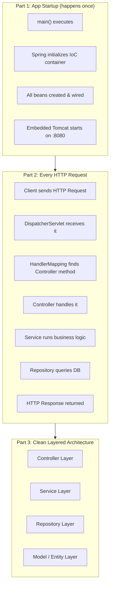
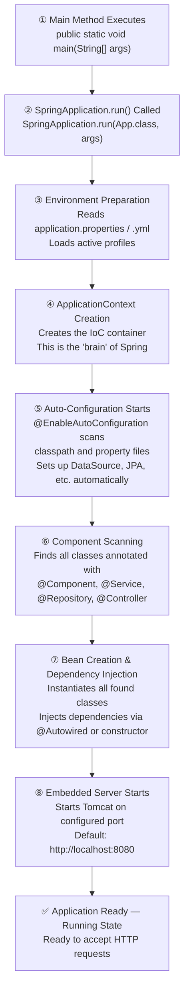
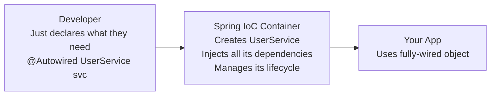
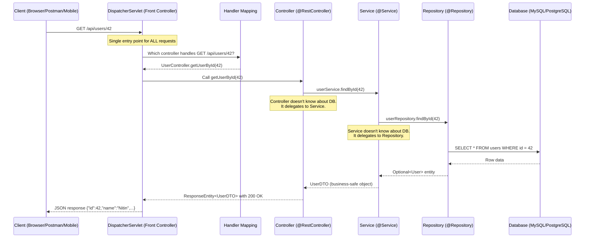
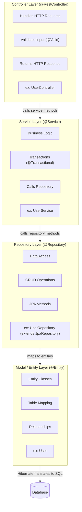

# 🌱 Spring Boot Application — Flow Architecture

> **What this covers**: Everything that happens from the moment you run `main()` to when a response reaches the client — explained step by step in plain English.

---

## Table of Contents

1. [Big Picture](#big-picture)
2. [Part 1 - Application Startup Flow](#part-1---application-startup-flow)
3. [Part 2 - Request Processing Flow](#part-2---request-processing-flow)
4. [Part 3 - Layered Architecture](#part-3---layered-architecture)
5. [Putting It All Together](#putting-it-all-together)
6. [Key Annotations Cheat Sheet](#key-annotations-cheat-sheet)

---

<a id="big-picture"></a>

## Big Picture



---

<a id="part-1---application-startup-flow"></a>

## Part 1 - Application Startup Flow

> **Layman analogy**: Think of this like opening a restaurant for the day. Before customers arrive, you set everything up — prep the kitchen, hire staff, assign roles. This is what Spring Boot does before handling any requests.

### Step-by-Step Startup



---

### Deep Dive: Each Startup Step

#### ① Main Method Executes

```java
@SpringBootApplication           // ← This single annotation does EVERYTHING below
public class MyApp {
    public static void main(String[] args) {
        SpringApplication.run(MyApp.class, args);   // Kicks off the entire startup
    }
}
```

`@SpringBootApplication` is shorthand for three annotations:
- `@Configuration` — this class defines beans
- `@EnableAutoConfiguration` — auto-configure based on classpath
- `@ComponentScan` — scan this package and sub-packages for components

---

#### ② SpringApplication.run() Called

This is the entry point into the entire Spring ecosystem. It:
- Creates a `SpringApplication` instance
- Determines the type of application (Web? Not web?)
- Loads `ApplicationListeners` (event listeners for startup hooks)

---

#### ③ Environment Preparation

Spring reads your configuration files **in priority order**:

```
Priority (highest to lowest):
  1. Command-line arguments:  java -jar app.jar --server.port=9090
  2. System environment vars: export SPRING_DATASOURCE_URL=jdbc:mysql://...
  3. application-{profile}.yml  (e.g., application-prod.yml)
  4. application.yml / application.properties
  5. Default Spring Boot values (lowest priority)
```

Example `application.yml`:
```yaml
server:
  port: 8080

spring:
  datasource:
    url: jdbc:mysql://localhost:3306/mydb
    username: root
    password: secret
  jpa:
    hibernate:
      ddl-auto: update
    show-sql: true
```

Active profile controls which config file is loaded:
```
java -jar app.jar --spring.profiles.active=prod
  → Loads application-prod.yml on top of application.yml
```

---

#### ④ ApplicationContext Creation

```
ApplicationContext = The Spring IoC Container

IoC = Inversion of Control
  Instead of you creating objects (UserService service = new UserService()),
  Spring creates and manages them for you.
  You just say "I need a UserService" and Spring gives it to you.

Bean = Any object managed by the Spring container
```



---

#### ⑤ Auto-Configuration

This is Spring Boot's **magic**. Without it, you'd have to manually configure:
- DataSource (DB connection pool)
- EntityManagerFactory (JPA)
- TransactionManager
- DispatcherServlet (web)
- Jackson (JSON serialization)
- ... and 100 more things

Auto-configuration reads your classpath:

```
If you added MySQL + JPA dependency → Spring auto-creates DataSource + JPA config
If you added Web starter → Spring auto-creates DispatcherServlet + Tomcat
If you added Redis starter → Spring auto-creates RedisTemplate
```

You can override any auto-configuration with your own `@Bean`.

---

#### ⑥ Component Scanning

Spring scans your package tree for these annotations:

| Annotation | What it marks | Example |
|---|---|---|
| `@Component` | Generic Spring-managed class | Utility class |
| `@Service` | Business logic class | `UserService` |
| `@Repository` | Data access class | `UserRepository` |
| `@Controller` / `@RestController` | HTTP request handler | `UserController` |
| `@Configuration` | Config / Bean factory | `SecurityConfig` |

```java
// Spring FINDS this automatically — no registration needed!
@Service               // ← "Hey Spring, manage this class as a bean"
public class UserService {
    // ...
}
```

---

#### ⑦ Bean Creation & Dependency Injection

Spring creates all discovered classes and **wires their dependencies**:

```java
@Service
public class OrderService {

    private final UserService userService;
    private final ProductService productService;

    // Constructor injection (preferred over @Autowired on field)
    public OrderService(UserService userService, ProductService productService) {
        this.userService = userService;           // Spring injects these!
        this.productService = productService;     // You don't call new!
    }
}
```

**Three ways to inject dependencies:**

```java
// 1. Constructor Injection (✅ Recommended — testable, immutable)
public class OrderService {
    private final UserService userService;
    public OrderService(UserService userService) { this.userService = userService; }
}

// 2. Field Injection (⚠️ Convenient but harder to test)
public class OrderService {
    @Autowired
    private UserService userService;
}

// 3. Setter Injection (❌ Rarely used)
public class OrderService {
    private UserService userService;
    @Autowired
    public void setUserService(UserService svc) { this.userService = svc; }
}
```

---

#### ⑧ Embedded Server Starts

Spring Boot ships with an **embedded Tomcat server** — no need to deploy a WAR to an external server.

```
Traditional Java EE (OLD way):
  1. Build a .war file
  2. Deploy to external Tomcat / JBoss / WebLogic
  3. Configure server separately
  4. Restart server to deploy new code

Spring Boot (NEW way):
  1. Build a .jar file
  2. java -jar myapp.jar  ← Done! Tomcat is INSIDE the jar
```

---

<a id="part-2---request-processing-flow"></a>

## Part 2 - Request Processing Flow (Runtime)

> **Layman analogy**: This is what happens every time a customer places an order at the restaurant. The waiter (Controller) takes the order, the kitchen (Service) prepares it, the pantry (Repository) fetches the ingredients, and the dish (Response) comes back.

### The Full Request Journey



---

### Deep Dive: Each Request Step

#### ① DispatcherServlet — The Front Controller

```
Every single HTTP request to your Spring Boot app hits ONE place first:
  DispatcherServlet

It's like the reception desk — it doesn't handle anything itself,
it just routes the request to the right handler.

URL pattern: "/" (matches ALL requests)
```

The DispatcherServlet's job:
1. Receive the request
2. Ask HandlerMapping → which controller method handles this URL?
3. Call that controller method
4. Take the return value and write it to the HTTP response

---

#### ② Handler Mapping

Spring builds a routing table at startup by scanning `@RequestMapping` annotations:

```java
@RestController
@RequestMapping("/api/users")    // ← Base path for this controller
public class UserController {

    @GetMapping("/{id}")         // GET /api/users/{id}
    public User getUser(@PathVariable Long id) { ... }

    @PostMapping                 // POST /api/users
    public User createUser(@RequestBody User user) { ... }

    @PutMapping("/{id}")         // PUT /api/users/{id}
    public User updateUser(@PathVariable Long id, @RequestBody User user) { ... }

    @DeleteMapping("/{id}")      // DELETE /api/users/{id}
    public void deleteUser(@PathVariable Long id) { ... }
}
```

HandlerMapping lookup table (built at startup):
```
GET  /api/users/{id}   → UserController.getUser()
POST /api/users        → UserController.createUser()
PUT  /api/users/{id}   → UserController.updateUser()
DELETE /api/users/{id} → UserController.deleteUser()
```

---

#### ③ Controller (@RestController)

```java
@RestController                    // = @Controller + @ResponseBody
@RequestMapping("/api/users")
public class UserController {

    private final UserService userService;   // Injected by Spring

    // Constructor injection
    public UserController(UserService userService) {
        this.userService = userService;
    }

    @GetMapping("/{id}")
    public ResponseEntity<UserDTO> getUserById(@PathVariable Long id) {

        // Controller responsibilities:
        // 1. Parse request (path vars, query params, request body)
        // 2. Basic validation (spring-boot-starter-validation)
        // 3. Call the service
        // 4. Return appropriate HTTP status + response body

        UserDTO user = userService.findById(id);   // Delegate to service
        return ResponseEntity.ok(user);            // 200 OK + JSON body
    }

    @PostMapping
    public ResponseEntity<UserDTO> createUser(@Valid @RequestBody CreateUserRequest req) {
        // @Valid triggers Bean Validation (javax.validation)
        UserDTO created = userService.createUser(req);
        return ResponseEntity.status(HttpStatus.CREATED).body(created);  // 201 Created
    }
}
```

**What `@RestController` does automatically:**
```
@Controller annotation → marks it as a web component
@ResponseBody annotation → return value is serialized to JSON (via Jackson)
  instead of looking for a view template (like Thymeleaf/JSP)
```

---

#### ④ Service Layer (@Service)

```java
@Service
@Transactional                         // All methods run in a DB transaction
public class UserService {

    private final UserRepository userRepository;

    public UserService(UserRepository userRepository) {
        this.userRepository = userRepository;
    }

    public UserDTO findById(Long id) {
        // Service responsibilities:
        // 1. Business logic (rules, calculations, validations)
        // 2. Transactions (@Transactional)
        // 3. Convert Entity → DTO (don't expose DB entities to controller)
        // 4. Orchestrate calls to multiple repositories

        User user = userRepository.findById(id)
            .orElseThrow(() -> new UserNotFoundException("User not found: " + id));

        // Business rule: don't return deleted users
        if (user.isDeleted()) {
            throw new UserNotFoundException("User not found: " + id);
        }

        return toDTO(user);   // Convert entity → DTO (Data Transfer Object)
    }

    @Transactional
    public UserDTO createUser(CreateUserRequest req) {
        // Business rule: check email uniqueness
        if (userRepository.existsByEmail(req.getEmail())) {
            throw new EmailAlreadyExistsException(req.getEmail());
        }

        User user = new User();
        user.setName(req.getName());
        user.setEmail(req.getEmail());
        user.setPasswordHash(hashPassword(req.getPassword()));

        User saved = userRepository.save(user);
        return toDTO(saved);
    }

    private UserDTO toDTO(User user) {
        return new UserDTO(user.getId(), user.getName(), user.getEmail());
        // Note: password hash is NOT included in DTO!
    }
}
```

---

#### ⑤ Repository Layer (@Repository)

```java
@Repository
public interface UserRepository extends JpaRepository<User, Long> {

    // JpaRepository gives you these for FREE — no code needed:
    //   save(entity)
    //   findById(id)
    //   findAll()
    //   deleteById(id)
    //   existsById(id)
    //   count()
    //   ... and 15 more

    // Custom query — Spring generates SQL from method name automatically!
    Optional<User> findByEmail(String email);           // SELECT * FROM users WHERE email = ?
    boolean existsByEmail(String email);                // SELECT COUNT(*) > 0 WHERE email = ?
    List<User> findByNameContaining(String name);       // SELECT * WHERE name LIKE %?%

    // Custom JPQL query when method name isn't enough
    @Query("SELECT u FROM User u WHERE u.createdAt > :date AND u.isActive = true")
    List<User> findActiveUsersCreatedAfter(@Param("date") LocalDateTime date);

    // Native SQL query (use sparingly — breaks portability)
    @Query(value = "SELECT * FROM users WHERE role = 'ADMIN' LIMIT 10", nativeQuery = true)
    List<User> findTopAdmins();
}
```

**Spring Data JPA Magic — Method Name to SQL:**
```
Repository method name → Generated SQL

findByEmail(email)                    → SELECT * FROM users WHERE email = ?
findByAgeGreaterThan(age)             → SELECT * FROM users WHERE age > ?
findByNameAndCity(name, city)         → SELECT * FROM users WHERE name = ? AND city = ?
findTop5ByOrderByCreatedAtDesc()      → SELECT * FROM users ORDER BY created_at DESC LIMIT 5
countByIsActiveTrue()                 → SELECT COUNT(*) FROM users WHERE is_active = 1
deleteByEmail(email)                  → DELETE FROM users WHERE email = ?
```

---

#### ⑥ Database

JPA (via Hibernate) translates your Java entity objects to SQL:

```java
@Entity                           // Marks this as a DB-mapped class
@Table(name = "users")            // Maps to "users" table
public class User {

    @Id                           // Primary key
    @GeneratedValue(strategy = GenerationType.IDENTITY)  // Auto-increment
    private Long id;

    @Column(name = "full_name", nullable = false, length = 100)
    private String name;

    @Column(unique = true, nullable = false)
    private String email;

    @Column(name = "password_hash")
    private String passwordHash;

    @Column(name = "created_at")
    private LocalDateTime createdAt;

    @Column(name = "is_active")
    private boolean isActive = true;

    @PrePersist
    public void prePersist() {
        this.createdAt = LocalDateTime.now();  // Auto-set before INSERT
    }

    // Getters and setters...
}
```

---

<a id="part-3---layered-architecture"></a>

## Part 3 - Layered Architecture (Clean Design)

> **Why layers?** Each layer has ONE job. Changes in one layer don't break others. Easy to test each layer independently.



### The Rules of Layering

```
✅ Controller → Service → Repository → DB    (downward only)
❌ Repository → Service                       (never call up)
❌ Controller → Repository directly           (skip no layers)
❌ Service → Controller                       (never call up)

Why?
  Breaking these rules means tight coupling.
  If Repository changes, it should NEVER break the Controller code.
  Each layer only knows about the layer DIRECTLY below it.
```

### What Each Layer Knows About

| Layer | Knows About | Does NOT Know About |
|---|---|---|
| **Controller** | HTTP (requests, responses, status codes), DTOs | Database, SQL, business rules |
| **Service** | Business rules, DTOs, Entities | HTTP (no HttpServletRequest), SQL |
| **Repository** | Database, SQL, Entities | HTTP, business rules |
| **Entity** | Table structure, relationships | Everything above |

---

<a id="putting-it-all-together"></a>

## Putting It All Together

Here's a **complete end-to-end example**: Creating a new user via `POST /api/users`

```
1. Client sends:
   POST /api/users
   Content-Type: application/json
   { "name": "Nitin Vidhani", "email": "nitin@example.com", "password": "secret123" }

2. DispatcherServlet receives it → routes to UserController.createUser()

3. Controller:
   - Jackson deserializes JSON → CreateUserRequest object
   - @Valid validates: name not blank, email format valid, password length >= 8
   - Calls userService.createUser(req)

4. Service:
   - Checks: is nitin@example.com already in DB? If yes → throw EmailAlreadyExistsException
   - Hashes the password with BCrypt
   - Creates User entity
   - Calls userRepository.save(user)

5. Repository (JPA):
   - Hibernate generates: INSERT INTO users (name, email, password_hash, created_at) VALUES (?, ?, ?, ?)
   - Executes against MySQL
   - Returns saved User with generated ID = 42

6. Back up the chain:
   - Repository returns User entity to Service
   - Service converts User entity → UserDTO (omits password hash!)
   - Service returns UserDTO to Controller
   - Controller wraps in ResponseEntity with 201 CREATED status

7. Client receives:
   HTTP/1.1 201 Created
   Content-Type: application/json
   { "id": 42, "name": "Nitin Vidhani", "email": "nitin@example.com" }
```

---

<a id="key-annotations-cheat-sheet"></a>

## Key Annotations Cheat Sheet

### Startup Annotations

| Annotation | Where | What It Does |
|---|---|---|
| `@SpringBootApplication` | Main class | Enables component scan + auto-config + configuration |
| `@Configuration` | Config class | Marks class as a source of `@Bean` definitions |
| `@Bean` | Method in `@Configuration` | Declares a Spring-managed bean |
| `@ComponentScan` | Main class | Tells Spring which packages to scan |
| `@EnableAutoConfiguration` | Main class | Turns on auto-configuration magic |

### Layer Annotations

| Annotation | Layer | What It Does |
|---|---|---|
| `@RestController` | Controller | HTTP request handler + auto JSON serialization |
| `@RequestMapping` | Controller | Base URL mapping |
| `@GetMapping` / `@PostMapping` / `@PutMapping` / `@DeleteMapping` | Controller | HTTP method-specific mappings |
| `@PathVariable` | Controller | Extracts `{id}` from URL path |
| `@RequestParam` | Controller | Extracts `?page=2` from query string |
| `@RequestBody` | Controller | Deserializes JSON body → Java object |
| `@Valid` | Controller | Triggers Bean Validation on the object |
| `@Service` | Service | Marks as service bean (business logic) |
| `@Transactional` | Service | Wraps method in a DB transaction |
| `@Repository` | Repository | Marks as data access bean + enables exception translation |
| `@Entity` | Model | Maps class to a DB table |
| `@Table` | Model | Specifies table name |
| `@Id` | Model | Marks primary key field |
| `@GeneratedValue` | Model | Auto-generate PK (IDENTITY = auto-increment) |
| `@Column` | Model | Maps field to a column with constraints |
| `@OneToMany` / `@ManyToOne` / `@ManyToMany` | Model | JPA relationships |

### Dependency Injection

| Annotation | What It Does |
|---|---|
| `@Autowired` | Inject dependency (use constructor injection instead) |
| `@Qualifier("name")` | When multiple beans of same type exist, specify which one |
| `@Primary` | Mark a bean as the default when multiple exist |
| `@Value("${property}")` | Inject value from application.properties |

---

## Quick Summary

```
STARTUP (one time):
  main() → SpringApplication.run() → Load config (yml) → Create IoC container
  → Auto-configure (DataSource, JPA, web) → Scan @Component/@Service/@Repository/@Controller
  → Create & wire all beans → Start embedded Tomcat → Ready!

EVERY REQUEST:
  HTTP Request → DispatcherServlet → HandlerMapping → Controller
  → Service (business logic) → Repository (DB access) → DB
  → Response bubbles back up as JSON

LAYERS (top to bottom):
  Controller  → handles HTTP, validates input, returns response
  Service     → business logic, transactions
  Repository  → DB queries via JPA/Hibernate
  Entity      → Java object ↔ DB table mapping

GOLDEN RULE: Each layer only talks to the layer below it. Never skip. Never go up.
```

---

*Related: See `docs/Kafka.md` for async messaging between services*
