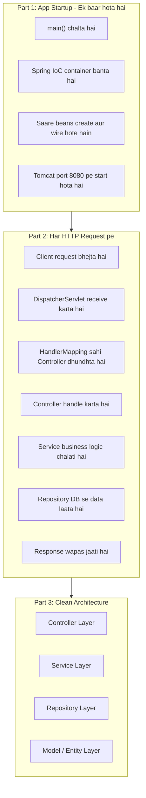
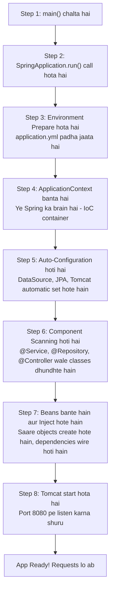
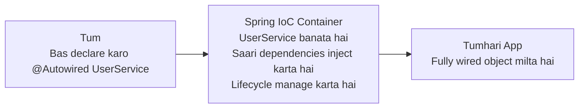
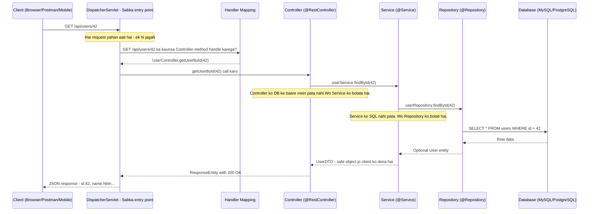
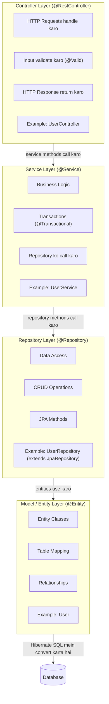

# Spring Boot Application - Flow Architecture (Hinglish Edition)

> **Matlab kya hai**: Jab tum `main()` run karte ho, tab se lekar browser ko response milne tak — kya kya hota hai, sab kuch step by step plain language mein.

---

## Table of Contents

1. [Bada Picture - Pehle Samjho](#bada-picture)
2. [Part 1 - App Start Kaise Hoti Hai](#part-1---app-start-kaise-hoti-hai)
3. [Part 2 - Request Kaise Handle Hoti Hai](#part-2---request-kaise-handle-hoti-hai)
4. [Part 3 - Layered Architecture - Clean Design](#part-3---layered-architecture)
5. [Sab Milake - Ek Real Example](#sab-milake)
6. [Important Annotations Ki List](#important-annotations)

---

<a id="bada-picture"></a>

## Bada Picture - Pehle Samjho

Spring Boot app ka kaam teen phases mein hota hai:



**Ek line mein samjho:**
- **Startup** = Restaurant subah kholna — sab cheez setup karo
- **Request** = Customer order karta hai — waiter, cook, store sab kaam karte hain
- **Layers** = Har banda apna kaam karta hai — waiter khana nahi banata, cook order note nahi karta

---

<a id="part-1---app-start-kaise-hoti-hai"></a>

## Part 1 - App Start Kaise Hoti Hai

> **Analogy**: Socho ek restaurant subah khul raha hai. Customers aane se pehle kitchen set karo, staff ko assign karo, menu ready karo. Yahi Spring Boot karta hai jab tum app run karte ho.

### Step-by-Step Startup



---

### Har Step Ko Detail Mein Samjho

#### Step 1 - main() Chalta Hai

```java
@SpringBootApplication   // Ye ek annotation teen kaam karta hai - neeche padho
public class MyApp {
    public static void main(String[] args) {
        SpringApplication.run(MyApp.class, args);  // Poori app yahan se shuru hoti hai
    }
}
```

`@SpringBootApplication` teen annotations ka shortcut hai:
- `@Configuration` — is class mein beans define hain
- `@EnableAutoConfiguration` — classpath dekhkar auto setup karo
- `@ComponentScan` — is package ke andar @Service, @Controller etc. dhundho

---

#### Step 2 - SpringApplication.run() Call Hota Hai

Yahan Spring decide karta hai:
- Kaunsi type ki app hai? (Web hai ya nahi?)
- Kaunse EventListeners sunenge startup events ko?

---

#### Step 3 - Environment Prepare Hota Hai

Spring config files padh-ta hai **priority order** mein:

```
Sabse zyaada priority pehle:

1. Command line argument:   java -jar app.jar --server.port=9090
2. System environment var:  export SPRING_DATASOURCE_URL=jdbc:mysql://...
3. application-prod.yml     (agar profile=prod hai)
4. application.yml
5. Spring ke default values (sabse kam priority)
```

Ek typical `application.yml`:
```yaml
server:
  port: 8080

spring:
  datasource:
    url: jdbc:mysql://localhost:3306/mydb
    username: root
    password: secret
  jpa:
    show-sql: true          # Har SQL query console pe dikhao
    hibernate:
      ddl-auto: update      # Table automatically update karo
```

---

#### Step 4 - ApplicationContext (IoC Container) Banta Hai

```
IoC = Inversion of Control

Pehle ka tarika (IoC ke bina):
  UserService service = new UserService();   // Tum khud object banate the
  service.setRepo(new UserRepository());     // Dependencies khud inject karte the

Spring IoC ke saath:
  @Autowired UserService service;  // Bas bolo "mujhe chahiye"
                                   // Spring khud banayega aur dega

Bean = Koi bhi object jo Spring manage karta hai
```



**Analogy**: Socho Spring ek HR department hai. Tum kehte ho "Mujhe ek developer chahiye". HR dhundh ke, train karke, laptop dekar bhejta hai. Tum directly hire nahi karte.

---

#### Step 5 - Auto-Configuration Hoti Hai

Ye Spring Boot ki **sabse badi superpower** hai.

Bina Auto-Configuration ke tumhe ye sab manually karna padta:
- DataSource (database connection pool) setup karo
- EntityManagerFactory (JPA ke liye) banao
- TransactionManager setup karo
- DispatcherServlet configure karo
- Jackson (JSON conversion) setup karo
- ... aur 100 cheezein aur

**Spring Boot automatically samajh leta hai:**

```
Agar MySQL + JPA dependency hai → DataSource + JPA config apne aap ban jaata hai
Agar Web starter hai → DispatcherServlet + Tomcat auto set hota hai
Agar Redis starter hai → RedisTemplate automatically configure hota hai
```

Tumhe override karna ho to apna `@Bean` likh do.

---

#### Step 6 - Component Scanning Hoti Hai

Spring tumhara poora package tree scan karta hai ye annotations dhundhne ke liye:

| Annotation | Matlab | Example |
|---|---|---|
| `@Component` | Generic Spring bean | Koi bhi utility class |
| `@Service` | Business logic wali class | `UserService` |
| `@Repository` | Database access wali class | `UserRepository` |
| `@Controller` / `@RestController` | HTTP request handle karne wali class | `UserController` |
| `@Configuration` | Config/Bean factory class | `SecurityConfig` |

```java
// Ye class Spring apne aap dhundh leta hai - tumhe register nahi karna!
@Service               // "Spring bhai, ise manage kar"
public class UserService {
    // ...
}
```

---

#### Step 7 - Beans Create Hote Hain aur Dependencies Inject Hoti Hain

Spring saari classes ko instantiate karta hai aur unki zaroorat ki cheezein inject karta hai:

```java
@Service
public class OrderService {

    private final UserService userService;
    private final ProductService productService;

    // Constructor Injection - Ye sabse accha tarika hai
    public OrderService(UserService userService, ProductService productService) {
        this.userService = userService;       // Spring ne inject kiya - tum new nahi kiye!
        this.productService = productService; // Spring ne inject kiya!
    }
}
```

**Teen tarike se inject kar sakte ho:**

```java
// 1. Constructor Injection (BEST - testable, immutable)
public class OrderService {
    private final UserService userService;
    public OrderService(UserService userService) { this.userService = userService; }
}

// 2. Field Injection (convenient lekin testing mein problem hoti hai)
public class OrderService {
    @Autowired
    private UserService userService;
}

// 3. Setter Injection (Rarely use hota hai)
public class OrderService {
    private UserService userService;
    @Autowired
    public void setUserService(UserService svc) { this.userService = svc; }
}
```

---

#### Step 8 - Embedded Tomcat Start Hota Hai

Spring Boot mein **Tomcat andar hi hota hai** — alag se deploy nahi karna padta.

```
Purana Java EE tarika:
  1. .war file banao
  2. Alag Tomcat install karo aur configure karo
  3. .war us Tomcat mein deploy karo
  4. Restart karo

Spring Boot ka naya tarika:
  1. .jar banao
  2. java -jar myapp.jar — Bas! Tomcat andar hai!
```

---

<a id="part-2---request-kaise-handle-hoti-hai"></a>

## Part 2 - Request Kaise Handle Hoti Hai

> **Analogy**: Restaurant mein customer order karta hai. Waiter (Controller) order leta hai, kitchen (Service) banati hai, store (Repository) ingredients deta hai, dish (Response) wapas aati hai. Har banda apna kaam karta hai.

### Poora Request Ka Safar



---

### Har Request Step Detail Mein

#### DispatcherServlet - Sabka Gatekeeper

```
Spring Boot ki poori app mein ek hi cheez sabse pehle request receive karti hai:
  DispatcherServlet

Ye ek receptionist ki tarah hai — khud kuch nahi karta,
bas sahi department mein bhejta hai.

Ye sab URLs handle karta hai: "/"  (yaani har cheez)
```

Iska kaam:
1. Request receive karo
2. HandlerMapping se pucho — kaunsa Controller method handle karega?
3. Us method ko call karo
4. Return value ko JSON mein convert karke response bhejo

---

#### Handler Mapping - URL Router

Spring startup pe ek routing table banata hai `@RequestMapping` annotations padh ke:

```java
@RestController
@RequestMapping("/api/users")    // Is controller ka base path
public class UserController {

    @GetMapping("/{id}")         // GET /api/users/{id}
    public User getUser(@PathVariable Long id) { ... }

    @PostMapping                 // POST /api/users
    public User createUser(@RequestBody User user) { ... }

    @PutMapping("/{id}")         // PUT /api/users/{id}
    public User updateUser(@PathVariable Long id, @RequestBody User user) { ... }

    @DeleteMapping("/{id}")      // DELETE /api/users/{id}
    public void deleteUser(@PathVariable Long id) { ... }
}
```

Routing table jo Spring banata hai:
```
GET     /api/users/{id}  → UserController.getUser()
POST    /api/users       → UserController.createUser()
PUT     /api/users/{id}  → UserController.updateUser()
DELETE  /api/users/{id}  → UserController.deleteUser()
```

---

#### Controller - Waiter

```java
@RestController                    // = @Controller + @ResponseBody
@RequestMapping("/api/users")
public class UserController {

    private final UserService userService;   // Spring ne inject kiya

    public UserController(UserService userService) {
        this.userService = userService;
    }

    @GetMapping("/{id}")
    public ResponseEntity<UserDTO> getUserById(@PathVariable Long id) {

        // Controller ka kaam:
        // 1. Request parse karo (path variables, query params, body)
        // 2. Basic validation (@Valid annotation se)
        // 3. Service ko kaam do
        // 4. Sahi HTTP status ke saath response bhejo

        UserDTO user = userService.findById(id);   // Service ko kaam diya
        return ResponseEntity.ok(user);            // 200 OK + JSON body
    }

    @PostMapping
    public ResponseEntity<UserDTO> createUser(@Valid @RequestBody CreateUserRequest req) {
        // @Valid → Bean Validation run hoti hai (naam empty nahi, email valid hai etc.)
        UserDTO created = userService.createUser(req);
        return ResponseEntity.status(HttpStatus.CREATED).body(created);  // 201 Created
    }
}
```

`@RestController` kya karta hai:
```
@Controller → ye ek web component hai
@ResponseBody → return value JSON mein serialized ho jaata hai (via Jackson)
               Matlab alag se view (HTML page) nahi dhundha jaata
```

---

#### Service - Kitchen (Business Logic)

```java
@Service
@Transactional                         // Saare methods DB transaction mein chalte hain
public class UserService {

    private final UserRepository userRepository;

    public UserService(UserRepository userRepository) {
        this.userRepository = userRepository;
    }

    public UserDTO findById(Long id) {
        // Service ka kaam:
        // 1. Business logic (rules, calculations)
        // 2. Transactions handle karna
        // 3. Entity ko DTO mein convert karna (DB entity directly expose mat karo)
        // 4. Multiple repositories ko coordinate karna

        User user = userRepository.findById(id)
            .orElseThrow(() -> new UserNotFoundException("User nahi mila: " + id));

        // Business rule: deleted user return mat karo
        if (user.isDeleted()) {
            throw new UserNotFoundException("User nahi mila: " + id);
        }

        return toDTO(user);   // Entity → DTO (Data Transfer Object)
    }

    @Transactional
    public UserDTO createUser(CreateUserRequest req) {
        // Business rule: email already toh nahi hai?
        if (userRepository.existsByEmail(req.getEmail())) {
            throw new EmailAlreadyExistsException(req.getEmail());
        }

        User user = new User();
        user.setName(req.getName());
        user.setEmail(req.getEmail());
        user.setPasswordHash(hashPassword(req.getPassword()));

        User saved = userRepository.save(user);
        return toDTO(saved);
    }

    private UserDTO toDTO(User user) {
        return new UserDTO(user.getId(), user.getName(), user.getEmail());
        // Password hash DTO mein nahi dalta — security rule!
    }
}
```

---

#### Repository - Pantry (Database Access)

```java
@Repository
public interface UserRepository extends JpaRepository<User, Long> {

    // JpaRepository ye sab FREE mein deta hai — koi code nahi likhna:
    //   save(entity)         → INSERT / UPDATE
    //   findById(id)         → SELECT WHERE id = ?
    //   findAll()            → SELECT * FROM table
    //   deleteById(id)       → DELETE WHERE id = ?
    //   existsById(id)       → SELECT COUNT(*) > 0
    //   count()              → SELECT COUNT(*)

    // Custom query — Spring method name se SQL generate karta hai KHUD!
    Optional<User> findByEmail(String email);       // SELECT * WHERE email = ?
    boolean existsByEmail(String email);            // SELECT COUNT(*) > 0 WHERE email = ?
    List<User> findByNameContaining(String name);   // SELECT * WHERE name LIKE %?%

    // Jab method name se kaam na chale — JPQL query likho
    @Query("SELECT u FROM User u WHERE u.createdAt > :date AND u.isActive = true")
    List<User> findActiveUsersCreatedAfter(@Param("date") LocalDateTime date);

    // Native SQL (Use sparingly — DB specific ho jaata hai)
    @Query(value = "SELECT * FROM users WHERE role = 'ADMIN' LIMIT 10", nativeQuery = true)
    List<User> findTopAdmins();
}
```

**Spring Data JPA Magic — Method Name se SQL:**
```
Method ka naam → Generate hone wala SQL

findByEmail(email)               → SELECT * FROM users WHERE email = ?
findByAgeGreaterThan(age)        → SELECT * FROM users WHERE age > ?
findByNameAndCity(name, city)    → SELECT * WHERE name = ? AND city = ?
findTop5ByOrderByCreatedAtDesc() → SELECT * ORDER BY created_at DESC LIMIT 5
countByIsActiveTrue()            → SELECT COUNT(*) WHERE is_active = 1
deleteByEmail(email)             → DELETE FROM users WHERE email = ?
```

---

#### Database - Actual Data

JPA (Hibernate ke through) Java objects ko SQL mein convert karta hai:

```java
@Entity                           // Ye class DB mein map hogi
@Table(name = "users")            // "users" table se
public class User {

    @Id                           // Primary key
    @GeneratedValue(strategy = GenerationType.IDENTITY)  // Auto-increment
    private Long id;

    @Column(name = "full_name", nullable = false, length = 100)
    private String name;

    @Column(unique = true, nullable = false)
    private String email;

    @Column(name = "password_hash")
    private String passwordHash;

    @Column(name = "created_at")
    private LocalDateTime createdAt;

    @PrePersist
    public void prePersist() {
        this.createdAt = LocalDateTime.now();  // INSERT se pehle automatically set hota hai
    }
}
```

---

<a id="part-3---layered-architecture"></a>

## Part 3 - Layered Architecture (Clean Design)

> **Kyun layers?** Har layer ka ek hi kaam hota hai. Ek layer mein change karo, doosri layer nahi tutegi. Testing bhi asaan hoti hai.



### Layering Ke Rules

```
Sahi tarika:
  Controller → Service → Repository → DB   (neeche ki taraf hi)

Galat tarika:
  Repository → Service                     (upar kabhi mat jao)
  Controller → Repository directly         (layer mat skip karo)
  Service → Controller                     (upar kabhi mat jao)

Kyun ye rules?
  Agar Repository change ho to Controller nahi tutna chahiye.
  Tight coupling nahi hona chahiye.
  Har layer sirf apne neeche wali layer ko jaanti hai.
```

### Kaunsi Layer Ko Kya Pata Hai

| Layer | Ye jaanti hai | Ye nahi jaanti |
|---|---|---|
| **Controller** | HTTP (request/response), DTO | Database, SQL, business rules |
| **Service** | Business rules, DTO, Entity | HTTP ka kuch nahi, SQL |
| **Repository** | Database, SQL, Entity | HTTP, business rules |
| **Entity** | Table structure, relationships | Upar ka sab kuch |

---

<a id="sab-milake"></a>

## Sab Milake - Ek Real Example

`POST /api/users` se naya user banane ka **poora safar**:

```
1. Client bhejta hai:
   POST /api/users
   Content-Type: application/json
   { "name": "Nitin Vidhani", "email": "nitin@example.com", "password": "secret123" }

2. DispatcherServlet receive karta hai → UserController.createUser() pe bhejta hai

3. Controller:
   - Jackson JSON ko CreateUserRequest object mein convert karta hai
   - @Valid check karta hai: name empty nahi, email valid format mein, password 8+ chars
   - userService.createUser(req) call karta hai

4. Service:
   - Check karta hai: kya nitin@example.com already DB mein hai?
     Agar hai → EmailAlreadyExistsException throw
   - Password BCrypt se hash karta hai
   - User entity banata hai
   - userRepository.save(user) call karta hai

5. Repository (JPA/Hibernate):
   - SQL generate karta hai:
     INSERT INTO users (name, email, password_hash, created_at) VALUES (?, ?, ?, ?)
   - MySQL mein execute karta hai
   - Saved User entity return karta hai jisme ID = 42 hai

6. Wapas upar aate hain:
   - Repository ne Service ko User entity di
   - Service ne User entity ko UserDTO mein convert kiya (password hash nahi diya!)
   - Service ne Controller ko UserDTO di
   - Controller ne 201 CREATED status ke saath ResponseEntity banaya

7. Client ko milta hai:
   HTTP/1.1 201 Created
   Content-Type: application/json
   { "id": 42, "name": "Nitin Vidhani", "email": "nitin@example.com" }
```

---

<a id="important-annotations"></a>

## Important Annotations Ki List

### Startup Annotations

| Annotation | Kahan | Kya Karta Hai |
|---|---|---|
| `@SpringBootApplication` | Main class | Component scan + auto-config + configuration teeno enable karta hai |
| `@Configuration` | Config class | Is class mein `@Bean` definitions hain — Spring padh-ta hai |
| `@Bean` | `@Configuration` ke method pe | Ye Spring-managed bean hai |
| `@ComponentScan` | Main class | Kaunsa package scan karna hai |
| `@EnableAutoConfiguration` | Main class | Auto-configuration ka magic on karta hai |

### Layer Annotations

| Annotation | Layer | Kya Karta Hai |
|---|---|---|
| `@RestController` | Controller | HTTP handler + auto JSON serialization |
| `@RequestMapping` | Controller | Base URL mapping |
| `@GetMapping` / `@PostMapping` / `@PutMapping` / `@DeleteMapping` | Controller | HTTP method specific mappings |
| `@PathVariable` | Controller | URL se `{id}` nikalta hai |
| `@RequestParam` | Controller | Query string se `?page=2` nikalta hai |
| `@RequestBody` | Controller | JSON body → Java object |
| `@Valid` | Controller | Bean Validation trigger karta hai |
| `@Service` | Service | Business logic bean |
| `@Transactional` | Service | DB transaction mein wrap karta hai |
| `@Repository` | Repository | Data access bean + exception translation |
| `@Entity` | Model | DB table se map karta hai |
| `@Table` | Model | Table ka naam specify karo |
| `@Id` | Model | Primary key field |
| `@GeneratedValue` | Model | Auto-generate PK (IDENTITY = auto-increment) |
| `@Column` | Model | Column mapping + constraints |
| `@OneToMany` / `@ManyToOne` | Model | JPA relationships |

### Dependency Injection

| Annotation | Kya Karta Hai |
|---|---|
| `@Autowired` | Dependency inject karo (constructor injection better hai) |
| `@Qualifier("naam")` | Jab same type ke multiple beans hon, kaunsa chahiye |
| `@Primary` | Default bean mark karo jab multiple hon |
| `@Value("${property}")` | application.properties se value inject karo |

---

## Quick Summary - Yaad Rakhne Wali Baatein

```
STARTUP (ek baar):
  main() → SpringApplication.run() → YAML/properties padho → IoC container banao
  → Auto-configure (DataSource, JPA, Tomcat) → @Component/@Service/@Repository dhundho
  → Saare beans banao aur wire karo → Tomcat start karo → Ready!

HAR REQUEST PE:
  HTTP Request → DispatcherServlet → HandlerMapping → Controller
  → Service (business logic) → Repository (DB access) → DB
  → Response upar upar aake JSON mein wapas jaata hai

LAYERS (upar se neeche):
  Controller  → HTTP handle karo, validate karo, response do
  Service     → business logic, transactions
  Repository  → JPA/Hibernate se DB queries
  Entity      → Java object se DB table ki mapping

GOLDEN RULE: Har layer sirf apne neeche wali layer se baat kare.
             Layer skip mat karo. Kabhi upar mat jao.
```

---

*English version: [SpringBoot_Architecture.md](./SpringBoot_Architecture.md)*
